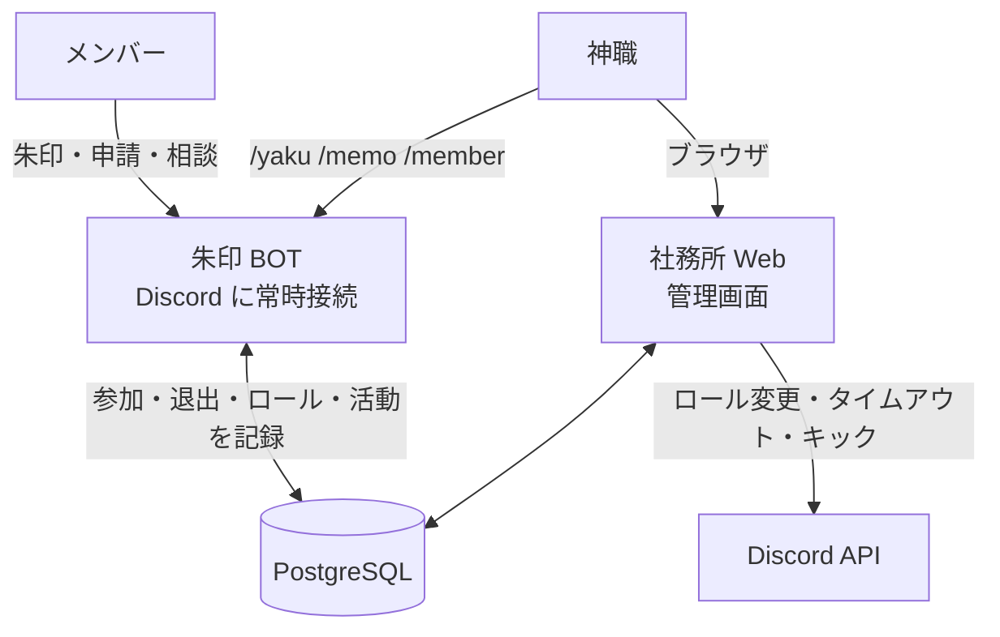
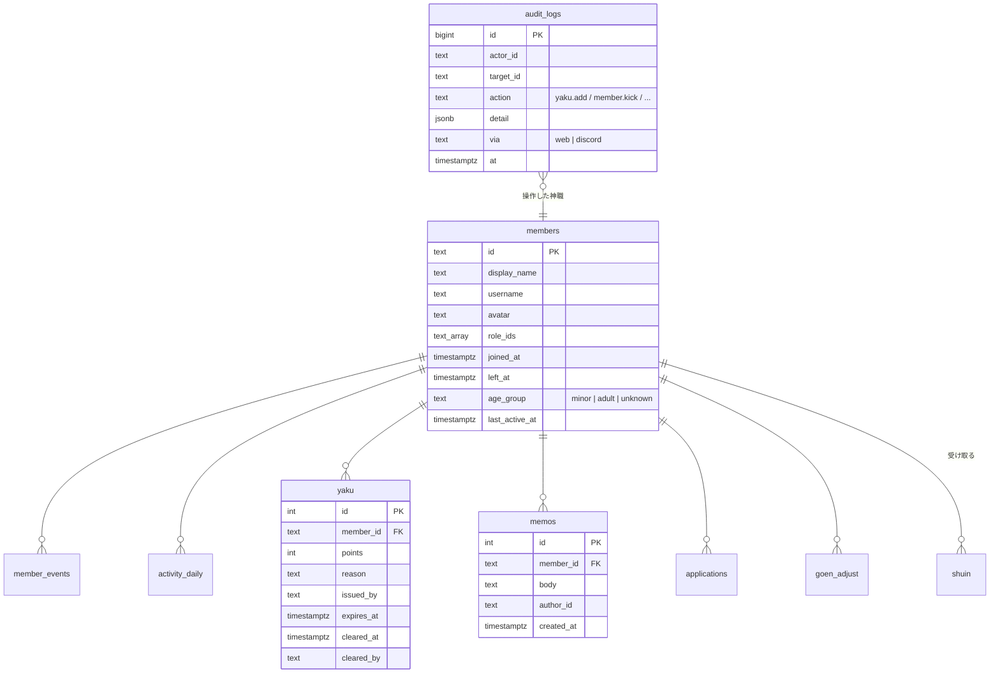

# 咲楽ノ宮 管理システム 設計書（社務所 Web）

> ステータス: 第1版ドラフト（2026-09-25）
> 朱印 BOT の設計は [design.md](design.md)、呼び名は [concept.md](concept.md)。

---

## 0. 概要

| 項目 | 内容 |
|---|---|
| 名前 | **社務所 Web**（しゃむしょウェブ） |
| 使う人 | **神職・宮司だけ**（Discord アカウントでログイン） |
| できること | メンバーの状況の確認・検索、警告（厄）、申し送りメモ、申請の承認、相談の対応、操作の記録 |
| Discord との関係 | よく使う操作（厄・メモ・メンバー情報）は Discord のコマンドでもできる。どちらで操作しても同じデータ |

---

## 1. 全体の構成



- **BOT** はこれまでどおり Discord に常時接続し、メンバーの参加・退出・ロール・活動を DB に記録する。
- **社務所 Web** は DB を読んで画面を出す。厄やキックなど Discord に反映が必要な操作は、BOT のトークンを使って Discord の API を直接呼ぶ（BOT 本体を経由しない）。
- BOT と Web は**同じリポジトリ・同じ DB・同じ処理（services）**を使う。どちらから操作しても結果は同じ。

---

## 2. 権限

| できること | 🎐 神職 | ⛩ 宮司 |
|---|---|---|
| 管理画面を開く・メンバーを見る | ✅ | ✅ |
| 厄を付ける・祓う、メモを書く | ✅ | ✅ |
| 申請の承認・却下 | ✅ | ✅ |
| 相談の対応 | ✅（送った人は見えない） | ✅（緊急時のみ送った人を確認できる・確認したことは記録に残る） |
| タイムアウト・キック | ✅ | ✅ |
| **BAN・ご縁の手動調整・年齢区分の変更** | — | ✅ |
| **設定（格・昇格ライン・期間）** | — | ✅ |
| 操作の記録を見る | ✅ | ✅ |

- ログインのたびに **Discord 上で今も神職・宮司ロールを持っているか**を確認する（外された人はすぐ入れなくなる）。
- すべての操作は「誰が・いつ・誰に・何を・理由」を**操作の記録**に残す。記録は消せない。

---

## 3. 画面

### 3.1 ログイン
「Discord でログイン」ボタン → Discord の認可画面 → 戻ってきたら神職・宮司ロールを確認して入室。

### 3.2 ホーム（今日の社務所）

```
┌ 今日の社務所 ───────────────────────────────┐
│ メンバー 1,284 人（今日 +12 / -3）  今日の朱印 186   │
│ 昇格 4 人                                          │
├──────────────────────────────────────┤
│ ⚠ 対応待ち                                          │
│   入鯖申請 7 件 ・ 宵参り申請 2 件 ・ 相談 1 件（未対応） │
│   お参り期間が終わった人 5 人                         │
├──────────────────────────────────────┤
│ 👹 厄年 3 人 ・ 厄あり 11 人                           │
│ 最近の操作: 〇〇（神職）が △△ に厄 +1 「DM での勧誘」…  │
└──────────────────────────────────────┘
```

### 3.3 メンバー一覧

| 機能 | 内容 |
|---|---|
| 検索 | 表示名・ユーザー名・ID |
| 絞り込み | 役職 / 年齢区分 / 宵参り / 厄あり・厄年 / お参り期間中 / **しばらく来ていない（N 日以上活動なし）** / 参加日の範囲 / 退出済み |
| 並べ替え | ご縁 / 参加日 / 最後の活動 / 厄 |
| 一覧の列 | アイコン・名前 / 役職 / ご縁 / 参加日 / 最後の活動 / 厄 / 印（🔞・メモあり） |
| 出力 | 絞り込んだ結果を CSV でダウンロード（宮司のみ） |

1 ページ 50 人。1000 人以上でもすぐ出るように、一覧は DB だけで作る（Discord に問い合わせない）。

### 3.4 メンバー詳細

```
┌ 🎋 世話役  さくら（@sakura_xx）  ID 1234… ─────────┐
│ 参加 2026/06/01（117 日） ・ 最後の活動 今日 23:41     │
│ 年齢区分 18 歳以上 ・ 🔞 宵参り ・ 厄 1（10/20 に祓われる）│
│ ご縁 142（総代まで 158） ・ 頂いた朱印 51 人 ・ 押した 63 人 │
├ タブ ──────────────────────────────────┤
│ [概要] [朱印] [活動] [厄] [メモ] [申請] [入退室] [記録]    │
├────────────────────────────────────────┤
│ 操作: [厄を付ける] [メモを書く] [タイムアウト] [キック]    │
│       [宵参りを外す] [BAN※] [ご縁調整※] [年齢区分※]  ※宮司 │
└────────────────────────────────────────┘
```

| タブ | 中身 |
|---|---|
| 概要 | 役職の履歴（いつ昇格したか）、ご縁の推移グラフ |
| 朱印 | 頂いた朱印・押した朱印の一覧（日時・格）、取り消し履歴 |
| 活動 | 日ごとの浮上（発言した日）・通話時間（発言の本文は保存しない） |
| 厄 | 付いた厄の一覧（理由・付けた神職・期限・祓われた日） |
| メモ | 神職どうしの申し送り（本人には見えない） |
| 申請 | 入鯖申請・宵参り申請の内容と結果 |
| 入退室 | 参加・退出・再参加の履歴 |
| 記録 | この人に対して行われた操作の記録 |

- 危ない操作（キック・BAN・宵参りを外す）は**理由の入力と確認画面**を必須にする。

### 3.5 厄（警告）

| 画面 | 内容 |
|---|---|
| 厄の一覧 | 有効な厄を持つ人を、厄の多い順・期限の近い順で |
| 厄を付ける | 相手・厄の数（1〜3）・理由（定型文から選ぶ＋自由記入）・本人に DM で知らせるか |
| お祓い | 期限前に解除する（理由必須） |

ルール（design.md の設定値）:
- 厄は **30 日で自然に祓われる**
- 有効な厄が **3 以上で 👹厄年**（朱印を押せない）、**5 以上で神職に「キック検討」の通知**（自動キックはしない）
- 厄を付けると、本人に DM で「理由」と「祓われる日」を知らせる（神職の名前は出さない）

定型の理由（例）: 誹謗中傷 / 迷惑行為（通話） / 大人の話題を全年齢の場所で / 18 歳未満への不適切な接触 / スパム・宣伝 / その他

### 3.6 申請（第 2 段階の BOT 機能と共通）
- 入鯖申請・宵参り申請の待ち行列。内容を見て **承認 / 却下 / 保留**。
- Discord の `#申請受付` のボタンと同じ処理。どちらで押しても片方に反映される。

### 3.7 相談
- `/soudan` で届いた匿名相談の一覧。状態（未対応 / 対応中 / 完了）と担当の神職を付けられる。
- 神職には送った人が表示されない。宮司が「送った人を確認」を押すと表示され、そのことが記録に残る。
- 返信は BOT から相談者へ匿名のまま DM で届ける。

### 3.8 操作の記録
- すべての操作（Web・Discord のコマンドどちらも）を時系列で。操作した人・相手・種類・期間で絞り込み。
- 記録は画面から消せない。

### 3.9 設定（宮司のみ）
- 役職ごとの格・昇格ライン、お参り期間の日数、厄の期限・しきい値。
- 変えた内容も記録に残る。

---

## 4. Discord のコマンド（管理用）

神職だけが使える。結果は本人だけに表示（エフェメラル）。

| コマンド | 内容 |
|---|---|
| `/member @相手` | 役職・ご縁・参加日・最後の活動・厄・最新のメモを表示。［管理画面で開く］ボタン付き |
| `/yaku add @相手 数 理由` | 厄を付ける |
| `/yaku harai @相手 理由` | お祓い（厄を解除） |
| `/yaku list [@相手]` | 厄の一覧 |
| `/memo @相手 内容` | 申し送りメモを書く |
| 右クリック →「アプリ」→「社務所で開く」 | その人の管理画面ページへのリンクを表示 |

---

## 5. 記録するデータ

朱印 BOT の `shuin` テーブルに加えて、以下を追加する。

| テーブル | 中身 | 書く人 |
|---|---|---|
| `members` | ID・表示名・アイコン・ロール・参加日・退出日・年齢区分・宵参り | BOT（参加・退出・ロール変更を同期、起動時に全員分を同期） |
| `member_events` | 参加・退出・再参加・昇格の履歴 | BOT |
| `activity_daily` | 日ごとの発言数・通話時間（本文は保存しない） | BOT |
| `yaku` | 厄（数・理由・付けた人・期限・祓った日・祓った人） | Web / BOT |
| `memos` | 申し送りメモ | Web / BOT |
| `goen_adjust` | ご縁の手動調整 | Web（宮司） |
| `applications` | 入鯖・宵参り申請 | BOT / Web |
| `soudan` | 相談（送った人は別テーブルに分けて保存し、宮司の確認時だけ読む） | BOT / Web |
| `audit_logs` | 操作の記録（追記のみ） | Web / BOT |
| `settings` | 格・昇格ライン・期間など（今は `config/guild.json`。設定画面を作るときに DB へ移す） | Web（宮司） |
| `admin_sessions` | 管理画面のログイン状態 | Web |



---

## 6. 技術構成

| 項目 | 選定 | 理由 |
|---|---|---|
| Web サーバー | **Hono**（TypeScript） | 軽い。BOT と同じ言語・同じコードを使い回せる |
| 画面 | サーバー側で HTML を作る（Hono の JSX）＋ **htmx** で検索・絞り込みを即時反映 | SPA より作りが単純で速い。JavaScript の依存が少ない |
| 見た目 | 自作の CSS（朱色・桜色のテーマ）、スマホでも見られる | |
| ログイン | Discord OAuth2（`identify` のみ） | メールなど余計な情報は取らない |
| Discord 操作 | `@discordjs/rest` で BOT のトークンを使って REST 呼び出し | Web から直接ロール変更・タイムアウト・キック |
| DB | 既存の PostgreSQL / Drizzle | BOT と共有 |
| 公開 | **Caddy**（HTTPS を自動で設定）を前に置く | 管理画面は必ず HTTPS |
| 起動 | docker compose に `web` と `caddy` を追加（BOT と同じイメージ・起動コマンドだけ違う） | |

### リポジトリの構成（追加分）

```
src/
├─ bot/            # いまの src/discord と index.ts を移す
├─ web/            # 社務所 Web
│  ├─ index.ts     # 起動
│  ├─ auth.ts      # Discord ログイン・セッション・権限チェック
│  ├─ routes/      # home, members, yaku, applications, soudan, audit, settings
│  ├─ views/       # 画面（JSX）
│  └─ public/      # CSS・htmx
├─ services/       # 朱印・厄・メモ・申請・相談・記録（BOT と Web で共通）
├─ domain/
└─ db/
```

### セキュリティ
- ログインは Discord OAuth2。`state` で偽のログインを防ぐ。
- セッションは `HttpOnly`・`Secure`・`SameSite=Lax` の Cookie。12 時間で切れる。
- 画面からの操作（POST）はすべて CSRF トークンを確認。
- **毎リクエストで権限を確認**（Discord のロールは 5 分キャッシュ。外されたら最長 5 分で入れなくなる）。
- BOT のトークン・セッションの鍵は `.env` だけに置く。
- 年齢は区分だけ、発言の本文は保存しない（BOT と同じ方針）。
- 管理画面の URL は外部に貼らない（ログインが必要なので見られはしないが、念のため）。

---

## 7. 必要なもの

| もの | 内容 | 費用の目安 |
|---|---|---|
| ドメイン | 例: `sakuranomiya.example`（管理画面は `shamusho.〜`） | 年 1,000〜2,000 円 |
| サーバー | BOT と同じ VPS（メモリ 2GB）でそのまま動く | 追加なし |
| Discord の設定 | Developer Portal の OAuth2 に「Redirect URL」（`https://shamusho.〜/auth/callback`）を追加 | 無料 |

---

## 8. 作る順番

| 段階 | 内容 | 目安 |
|---|---|---|
| A. 土台 | `members` の同期（BOT）/ Discord ログイン / 権限確認 / 操作の記録 / メンバー一覧・詳細（見るだけ） | 1〜2 週 |
| B. 厄とメモ | 厄の付与・お祓い・自然消滅・厄年ロール / メモ / Discord の `/yaku` `/memo` `/member` | 1 週 |
| C. 活動の記録 | 浮上・通話時間の記録と表示 / 「しばらく来ていない人」の絞り込み / ホームの数字 | 1 週 |
| D. 申請と相談 | 入鯖・宵参り申請（BOT 第 2 段階と一緒に）/ 相談 / タイムアウト・キック・BAN | 1〜2 週 |
| E. 設定 | 設定画面（格・昇格ライン）を DB へ移す / CSV 出力 | 1 週 |

---

## 9. 決めてほしいこと

1. **ドメイン**は用意できる？（まだなら取得方法も案内する）
2. **キック**は神職全員ができてよい？ それとも宮司だけ？（本案: キックは神職も可、BAN は宮司のみ）
3. **厄の数え方**はこの案（30 日で消える・3 で厄年・5 で通知）でよい？
4. 神職が**本人に DM で厄を知らせる**とき、神職の名前は伏せる方針でよい？
