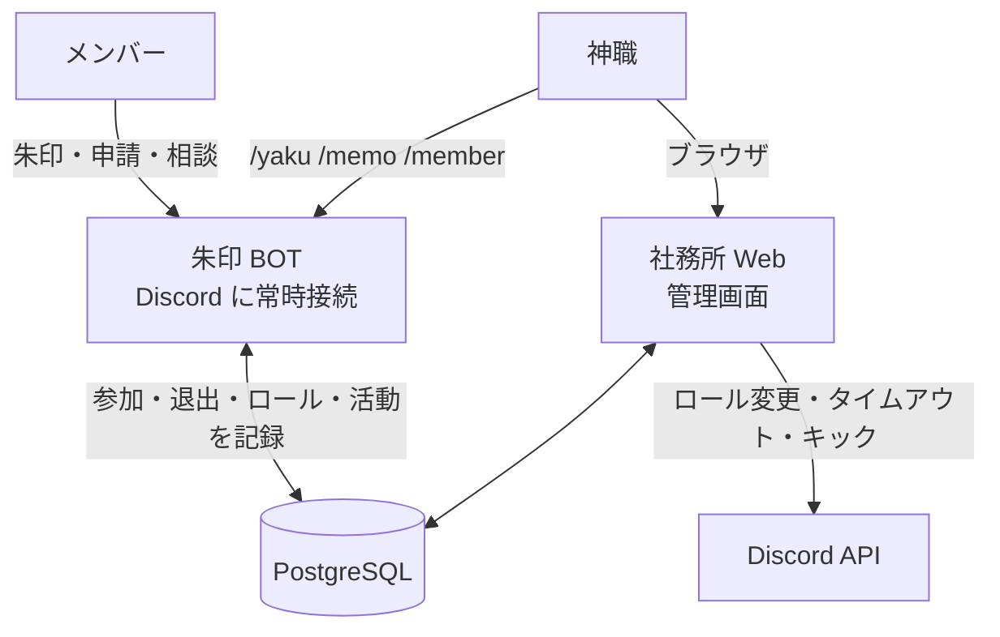
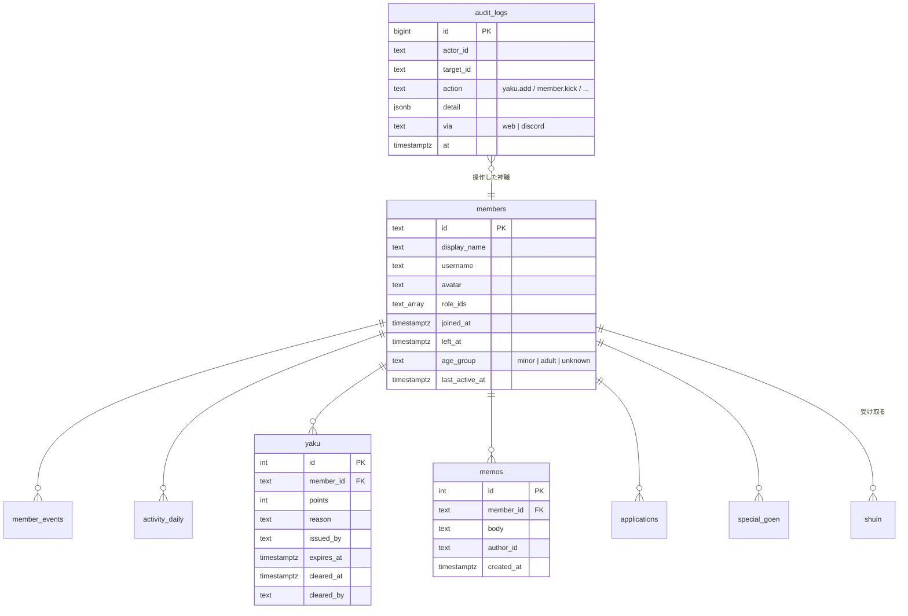

# 咲楽ノ宮 管理システム 設計書（社務所 Web）

> ステータス: 第4版（2026-09-25）・段階 A〜E すべて実装済み（ログイン・メンバー・厄・免罪符・銭・メモ・キック・申請・お参り期間・相談・設定）
> 朱印 BOT の設計は [design.md](design.md)、呼び名は [concept.md](concept.md)。

---

## 0. 概要

| 項目 | 内容 |
|---|---|
| 名前 | **社務所 Web**（しゃむしょウェブ） |
| 使う人 | **神職・宮司だけ**（Discord アカウントでログイン）。「設定」の「🔑 社務所Web に入れる人」で、ロール（例: 神代）か人ごとに入れる人と見られるページを選べる（→ 3.49） |
| できること | メンバーの状況の確認・検索、警告（厄）、申し送りメモ、申請の承認、相談の対応、操作の記録 |
| Discord との関係 | よく使う操作（厄・メモ・メンバー情報）は Discord のコマンドでもできる。どちらで操作しても同じデータ |

---

## 祈願所の御籤の入口

- 入口は、物御籤の写真 → 売り場・中身と排出率の2つのボタン → 勝負の御籤の写真 →「売り場へ入る」「中身と排出率」の2つのボタンを、1つの投稿に並べます。DiscordのComponents V2を使います。
- 勝負の御籤の売り場から1回・10連を引けます。「中身と排出率」は景品ごとの確率と所持状況を本人だけに表示し、引くボタンは置きません。カジノに入れるロールの制限は両方で確かめます。
- 写真に値段や確率は固定せず、設定と持ち物に合わせて画面を作ります。見ただけでは銭や券を使いません。
- 起動時、対象チャンネルの最近50件にあるBOT自身の入口を更新します。元の投稿を残し、古い添付を新しい2枚に入れ替えます。更新済みの入口は書き換えず、他人の投稿には触れません。50件より前の入口は、運営の「/パネル」で新しい入口を置いてください。

## 昇格後の朱印

- 前に押した朱印のご縁は、昇格してもそのまま残します。格が上がってから同じ相手にもう一度押すと、前の点数との差額だけ足します。参拝者の1点は残り、氏子で押し直すと追加1点で合計2点になります。自動で点数が増えるわけではありません。
- 通話の人の一覧を開き直すと、今の格より低い朱印は「✅」が外れ、「📕」に戻ります。プロフィールの「朱印を押す」から押し直せます。取り消す操作は不要です。
- 同じ格では再加算せず、格が下がっても前の点数を減らしません。銭のお礼は最初の1回だけです。手で朱印を取り消した場合は、今の点数を全部取り消します。

## 表示とメニュー

- 上の「表示モード」で、ライト・ダーク・端末に合わせる表示を選べます。初めは端末に合わせます。選択はそのブラウザで覚え、ログイン画面にも使います。保存できないブラウザでは、その画面だけ切り替わります。
- ホームの「今やること」から、申請・招待元不明・権限の点検などに進めます。権限を取得できないときは「未取得」と表示し、問題なしとは扱いません。見られるページだけ案内します。
- スマホでは下のメニューからホーム・メンバー・招待へ進み、「メニュー」でほかのページを開けます。
- 「招待・報酬」は絞り込み・並び替え・不明の一括登録をまとめ、スマホでは参加者ごとのカードにします。報酬の額や支払条件は変更しません。

## 1. 全体の構成


```mermaid
flowchart TB
    M[メンバー] -->|朱印・申請・相談| B
    S[神職] -->|/yaku /memo /member| B
    S -->|ブラウザ| W
    B[朱印 BOT<br/>Discord に常時接続] <-->|参加・退出・ロール・活動を記録| DB[(PostgreSQL)]
    W[社務所 Web<br/>管理画面] <--> DB
    W -->|ロール変更・タイムアウト・キック| D[Discord API]
```

- **BOT** はこれまでどおり Discord に常時接続し、メンバーの参加・退出・ロール・活動を DB に記録する。
- **社務所 Web** は DB を読んで画面を出す。厄やキックなど Discord に反映が必要な操作は、BOT のトークンを使って Discord の API を直接呼ぶ（BOT 本体を経由しない）。
- BOT と Web は**同じリポジトリ・同じ DB・同じ処理（services）**を使う。どちらから操作しても結果は同じ。

---

## 2. 権限

| できること | 🎐 神職 | ⛩ 宮司 |
|---|---|---|
| 管理画面を開く・メンバーを見る | ✅ | ✅ |
| 厄を付ける・祓う、メモを書く | ✅ | ✅ |
| 申請の承認・却下 | ✅ | ✅ |
| 相談の対応 | ✅（送った人は見えない） | ✅（緊急時のみ送った人を確認できる・確認したことは記録に残る） |
| タイムアウト・キック | ✅ | ✅ |
| **BAN・✨ 特別ご縁・年齢区分の変更** | — | ✅ |
| **設定（格・昇格ライン・期間）** | — | ✅ |
| **掲示（#鳥居・#しきたり の文面）** | — | ✅ |
| **チャンネル（説明・書き込める／読むだけ）** | — | ✅ |
| **銭を送る・減らす（1 人・全員）** | — | ✅ |
| 推移（グラフ）を見る | ✅ | ✅ |
| 操作の記録を見る | ✅ | ✅ |

- ログインのたびに **Discord 上で今も神職・宮司ロールを持っているか**を確認する（外された人はすぐ入れなくなる）。
- すべての操作は「誰が・いつ・誰に・何を・理由」を**操作の記録**に残す。記録は消せない。

---

## 3. 画面

### 3.1 ログイン
「Discord でログイン」ボタン → Discord の認可画面 → 戻ってきたら神職・宮司ロールを確認して入室。

### 3.2 ホーム（今日の社務所）

```
┌ 今日の社務所 ───────────────────────────────┐
│ メンバー 1,284 人（今日 +12 / -3）  今日の朱印 186   │
│ 昇格 4 人                                          │
├──────────────────────────────────────┤
│ ⚠ 対応待ち                                          │
│   入鯖申請 7 件 ・ 宵参り申請 2 件 ・ 相談 1 件（未対応） │
│   お参り期間が終わった人 5 人                         │
├──────────────────────────────────────┤
│ 👹 厄年 3 人 ・ 厄あり 11 人                           │
│ 最近の操作: 〇〇（神職）が △△ に厄 +1 「DM での勧誘」…  │
└──────────────────────────────────────┘
```

### 3.3 メンバー一覧

| 機能 | 内容 |
|---|---|
| 検索 | 表示名・ユーザー名・ID |
| 絞り込み | 役職 / 年齢区分 / 宵参り / 厄あり・厄年 / お参り期間中 / **しばらく来ていない（N 日以上活動なし）** / 参加日の範囲 / 退出済み |
| 並べ替え | ご縁 / 役職（格の高い順）/ 銭 / 朱印を押した人数 / 通話時間（30 日）/ 発言数（30 日）/ 参加日 / 最後の活動 / 名前。向き（多い順↓・少ない順↑）も選べる。一覧の見出しを押してもその列で並び、もう一度押すと向きが逆になる |
| 一覧の列 | アイコン・名前 / 役職 / ご縁 / 参加日 / 最後の活動 / 厄 / 印（🔞・メモあり） |
| 出力 | 絞り込んだ結果を CSV でダウンロード（宮司のみ） |

1 ページ 50 人。1000 人以上でもすぐ出るように、一覧は DB だけで作る（Discord に問い合わせない）。

### 3.4 メンバー詳細

```
┌ 🎋 世話役  さくら（@sakura_xx）  ID 1234… ─────────┐
│ 参加 2026/06/01（117 日） ・ 最後の活動 今日 23:41     │
│ 年齢区分 18 歳以上 ・ 🔞 宵参り ・ 厄 1（10/20 に祓われる）│
│ ご縁 142（総代まで 158） ・ 頂いた朱印 51 人 ・ 押した 63 人 │
├ タブ ──────────────────────────────────┤
│ [概要] [朱印] [活動] [厄] [メモ] [申請] [入退室] [記録]    │
├────────────────────────────────────────┤
│ 操作: [厄を付ける] [メモを書く] [タイムアウト] [キック]    │
│       [宵参りを外す] [BAN※] [特別ご縁※] [年齢区分※]  ※宮司 │
└────────────────────────────────────────┘
```

| タブ | 中身 |
|---|---|
| 概要 | 役職の履歴（いつ昇格したか）、ご縁の推移グラフ |
| 朱印 | 頂いた朱印・押した朱印の一覧（日時・格）、取り消し履歴 |
| 活動 | 日ごとの浮上（発言した日）・通話時間（発言の本文は保存しない） |
| 厄 | 付いた厄の一覧（理由・付けた神職・期限・祓われた日） |
| メモ | 神職どうしの申し送り（本人には見えない） |
| 申請 | 入鯖申請・宵参り申請の内容と結果 |
| 入退室 | 参加・退出・再参加の履歴 |
| 記録 | この人に対して行われた操作の記録 |

- 危ない操作（キック・BAN・宵参りを外す）は**理由の入力と確認画面**を必須にする。
- **✨ 特別ご縁**（メンバー詳細の「✨ 特別ご縁」の欄。振る・取り消すのは宮司だけ。記録は神職も見られる）: 運営から、朱印とは別にご縁を振る。
  - 量（1〜1000）と理由（必須）を入れて「振る」。二度押ししても 1 回だけ。本人に DM（「特別ご縁 +○ を頂きました」と理由・今のご縁）を送り、#記録 に「だれがだれに何点・理由」を残す（通知は飛ばさない）。記録は `goen.special_grant`。
  - ご縁の合計（役職の昇格・御朱印帳・メンバーの一覧と並べ替え）に足して数える。メンバー詳細のご縁には「うち ✨ 特別ご縁 +○」と出る。番付（朱印のランキング）には入れない。
  - 昇格は BOT が 1 分ごとに確かめる（社務所Web は Discord のロールを変えないので、振ってから 1 分くらいで上がる）。
  - 振った記録ごとに「取り消す」。ご縁は減るが、上がった役職は下げない（朱印の取り消しと同じ）。#記録 に残す。記録は `goen.special_revoke`。

### 3.5 厄（警告）

**ルール（オーナー決定・2026-09-25）**

| 状態 | 内容 |
|---|---|
| 厄 1 つ目 | **注意**。本人に DM で理由を知らせる（神職の名前は出さない）。👹厄年ロールが付く |
| 厄 2 つ目 | **BAN** |
| 解除 | **免罪符を購入すると厄が 1 つ祓われる**（自然には消えない） |
| 一発 BAN | 重大な違反は、厄を経ずに即 BAN |

一発 BAN にする違反（案）:
- 18 歳未満への恋愛・性的な目的での接触
- 個人情報の晒し（住所・電話番号・本名・顔写真など）
- 荒らし・レイド・スパムの大量投稿
- なりすまし・詐欺
- 違法な内容の投稿

| 画面 | 内容 |
|---|---|
| 厄の一覧 | 厄を持っている人（👹厄年）の一覧 |
| 厄を付ける | 相手・理由（定型文から選ぶ＋自由記入）。**2 つ目になる場合は「BAN になります」と確認画面を出してから実行** |
| 一発 BAN | 理由を上の一覧から選ぶ（＋自由記入）。確認画面を出してから実行 |
| お祓い | 免罪符による解除（自動）と、神職による取り消し（間違えて付けたときなど。理由必須） |

定型の理由（例）: 誹謗中傷 / 迷惑行為（通話） / 大人の話題を全年齢の場所で / スパム・宣伝 / その他

**免罪符（決定）**: 鯖内通貨「🪙銭」で購入。**1 人 1 回まで**。値段は考え中のため仮に 300（`config/guild.json` の `economy.menzaifuPrice` で変更）。本人が Discord で `/menzaifu` を使う。

### 3.5.1 銭（鯖内通貨）
- 通貨の名前は **銭**（🪙）。はじめは「花びら（🌸）」だった。更新のときの移行（`0030_currency_zeni`）で、設定の通貨の名前が花びらのままなら銭に、絵文字が 🌸 のままなら 🪙 にした（ほかの名前にしていれば変えない）。ショップの品の名前・説明の「花びら」も銭に、掲示の本文に直接書いた「花びら」は `{通貨}` にした。
- その後の最初の BOT の起動で、花びらで投稿済みの掲示を銭で出し直す（1 回だけ）。名前は「設定 → 通貨の名前」でいつでも変えられる（変えると投稿済みの掲示も書き換わる）。
- 掲示の差し込み `{おみくじの銭}`（前の名前 `{おみくじの花びら}` も使える）。
- **⛩ 「御神籤を引く」ボタン**: #おみくじ で `/パネル おみくじ`（神職）を打つと、そのチャンネルのいちばん下に「⛩ 御神籤を引く」ボタンだけを置く（説明のカードなし。下に小さく「1 日 1 回」と、通話だけのときはそれも）。押すと `/おみくじ` と同じに引ける（結果はみんなに見える・もう引いた人には本人にだけ知らせる）。だれかが引いたり書いたりしたら、3 秒落ち着いてから下に出し直して前のボタンを消す（10 分ごと・BOT が起きたときにも確かめる）。別のチャンネルでもう一度打つと、そちらに移る（前のボタンは消す）。やめるときはボタンの書き込みを消す（BOT が覚えるのをやめる）。`/おみくじ` もそのまま使える。置き場所は `settings` の `omikuji_panel`、記録は `omikuji.panel`・`omikuji.panel_off`。
- **🔊 おみくじは通話に入っているときだけ**（設定 → 銭と免罪符 の「おみくじは通話に入っているときだけ引ける」。はじめは ON）: どこかの通話に入っていないと `/おみくじ` を引けない（本人にだけ「通話に入ってから」と出る）。AFK の通話・数えない通話（設定ファイルの `excludedVoiceChannelIds`）は入っていないのと同じ。「もう 1 回」（授与品・券）も同じで、引けないときは銭・券を使わない。掲示の差し込み `{おみくじを引けるとき}`（「通話に入っているとき」／「いつでも」）。#おみくじ の標準の使い方にも入れた。
- **🎴 運営吉**（設定 → 🎴 運営吉（おみくじ））: `/おみくじ`（「もう 1 回」も）で、決めた確率でまれに運営の特別な運勢（例: 小林吉・ais吉）が出る。全部の枠を合わせた確率で出て、その中から同じ確率で 1 つ。出たら「光りだした…！？」→ 社務所Web で入れた絵を大きく → 絵と運営吉の特別な紙（その人の色・金の枠）を横に並べた 1 枚、の順に出す（文字のカードにせず、写真だけ。2 枚のまま添えると Discord が上下を切るので、BOT が高さをそろえて 1 枚にする。`sharp` を使うので絵は WebP でもよい）。#慶事 にも「○○ さまが、おみくじで ○○吉 を引きました！」と絵つきで出す（引いた人にだけ通知）。
  - 決めるもの: 出す／出さない（はじめは出さない）・確率（%・小数 OK）・銭の倍率（おみくじの基本の量に掛ける。大吉は 3）・枠ごとの名前（20 文字まで）・ひとこと（紙に出る。空なら決まった文）・その人の色・絵（PNG・JPEG・WebP・GIF・1 枚 4MB まで）。名前・設定・絵は 1 つの「保存する」でまとめて保存。
  - **出る確率の決め方**: 「出したい間隔で決める」（何日に 1 回くらい出したいか。全部の枠を合わせて）なら、BOT が最近 30 日のおみくじの回数（「もう 1 回」も入れる）から、確率 = 100 ÷（1 日の平均回数 × 日数）を毎回計算する（平均は 10 分ごとに数え直す）。鯖が大きくなって引く人が増えるほど、確率は自動で下がる。下限・上限（%）の中におさめ、まだ引かれていなければ上限。「決めた確率で出す」なら、決めた % のまま。設定のページに、いまの 1 日の平均回数と確率（約何回に 1 回・約何日に 1 回）が出る。
  - **🧪 Discord で試す**（名前の入った枠ごとのボタン）: 運営のチャンネル（呼び鈴の知らせ先か #記録）にだけ、本番と同じ流れ（ガラガラ → 光る → 絵 → 絵と紙）で出す。保存してある名前・ひとこと・色・絵・台紙で出すので、直したら先に「保存する」。「運営吉を出す」が OFF でも試せる。くじは引かない・銭は動かない・#慶事 には出さない（紙の銭・連続日数は見本の数字）。記録は `omikuji.trial`。
  - 枠は 4 つまで。絵は枠の番号で決まるので、名前は 1 枠目からつめて入れる（途中の枠を空にはできない）。使わない枠は後ろから空にする。
  - 絵は DB（AT 機の絵と同じ表、`omikuji-1`〜`4`）に入り、Discord には絵そのものを添えて送る（外から見られる URL は作らない）。
- **📜 おみくじの紙**（設定 → 📜 おみくじの文と紙）: `/おみくじ` の結果は、BOT が引くたびに作る **縦書きのおみくじの紙（画像）** で出る。紙には 神社の名前・運勢・一言・第〇番・日付（和暦）・項目・朱印と、いちばん下にもらった銭・連続日数（あと何日でおまけか）。Discordには紙の画像と「誰のおみくじか」の1行を出します（メンション通知なし）。元のメッセージが削除されても、結果の本人表示から確認できます。通常・特別な御神籤・「もう1回」のすべてで表示し、続けたおまけをもらえた日は「🎁 ○ 日続いたおまけ」も出します。紙を出さない設定でも本人表示を残します。
  - **一言**: 運勢ごとに 1 行 1 つ（はじめは 大吉 8・中吉 14・小吉 18・吉 24・末吉 14・凶 9・大凶 5 の 92 文）。同じ人には、その運勢の文をひととおり出し切るまで同じ文を出さない（引いた記録の `message` で数える）。第〇番は上からの順番。
  - **項目**: 願い事・待ち人・勝負事（毎日出す）と、恋愛・寝落ち（どちらか毎日 1 つ）、🍀 ラッキー場所。文は「いい日（大吉・中吉・運営吉）／ふつうの日（小吉・吉・末吉）／よくない日（凶・大凶）」ごとに 1 行 1 つ。項目は 8 つまで足せる（名前を空にすると消える）。
  - **台紙**: 運勢ごと（運営吉は枠ごと）に縦長 1:2 の PNG・JPEG を入れられる（4MB まで。WebP は読めない）。台紙を入れると、BOT は紙・枠・線を描かずに字（と朱印）だけ書く。字を書く場所は、台紙の真ん中から外へ向かって色が急に変わるところ（飾りのふち）を探して決める（うすいグラデーションは無地とみなす）。真ん中の無地が細いときは字を小さくし、朱印を運勢の横に動かす。ほぼ全面が無地なら、ふつうの紙と同じ場所。入れなければ BOT が描いた柄（いい日は桜と金・ふつうは桜・よくない日は雲。運営吉はその人の色に金の枠）。設定のページで紙の見本が見られる。
  - **ガラガラの演出**（はじめは ON）: 「🎋 御神籤を振っています…」→ 1.4 秒で結果。🎴 運営吉は「⚡ 御神籤が金色に光りだした…！？」→ 絵を大きく → 絵と紙、の順に出し、そのあと #慶事 に絵つきでお知らせ。「結果をおみくじの紙で出す」を外すと前のように文字だけ。
  - 「はじめの文に戻す」で、一言・項目・ラッキー場所をはじめの文に戻す（台紙・神社の名前はそのまま）。はじめの文は `src/omikujiTexts.ts`。
  - **🔄 今日のおみくじをリセット**（宮司だけ。同じ欄のいちばん下）: 荒らしなどで今日のおみくじが変になったときに使う。今日（日本時間）おみくじを引いた**全員**を、引く前に戻す。
    - 引いた記録（「もう 1 回」も）を消すので、今日もう一度引ける。前の日までの記録はそのまま（連続日数は消えない）。
    - 今日のおみくじ・「もう 1 回」・続けたおまけで入った銭を取り戻す。もう使っていたら、残っている分まで（マイナスにはしない）。銭の出入りには「運営が減らした（今日のおみくじのリセット）」と残る。
    - 続けたおまけの券も取り戻す（持っている分まで）。おまけの称号ロールはそのまま。
    - 押す前に、引いた人の数・記録の数・取り戻せる銭（取り戻せない分）が出る。「リセットしてよい」にチェックを入れてから押す。画面を開いたあとに日が変わっていたら止める。操作は記録（`omikuji.reset_day`）に残る。
    - リセットのあとに引き直した人を、もう一度リセットしても、前に取り戻した分を二重には数えない。
  - 字は Shippori Mincho B1（SIL Open Font License。`assets/fonts`、JIS 第 1・第 2 水準に絞ったもの。それ以外の字は出ない）。画像は `@resvg/resvg-js` で作る。
- **🔥 おみくじを続けたおまけ**（設定 → 銭と免罪符 のいちばん下）: `/おみくじ`（1 日 1 回のログボ）を毎日続けると、決めた日数の日におまけ（銭・券・称号ロール）を渡す。1 日空けると 1 日目から。「もう 1 回」の分は数えない。5 行まで、日数を空にした行は使わない。
  - 「くり返す」にすると、その日数ごと（7 日なら 7・14・21 日目…）に毎回。外すとその日数の日だけ 1 回。標準は「7 日ごとに 銭 50・物御籤の無料券 1 枚」「30 日ごとに 銭 300・無料券 3 枚」。
  - 称号ロールは、役目のない（役職・運営・年齢・色守りなどでない）・危ない権限のない・BOT より下のロールだけ選べる。先に「ロール」のページで作る。一度付いたら、続かなくなってもそのまま（外すときは「ロール」のページから）。
  - おみくじのカードに「🔥 連続 ○ 日目 ・ あと ○ 日で ○ 日のおまけ」と、もらえたおまけが出る。おまけの銭は記録の理由「おみくじの連続日数のおまけ」（経済のページでは配った分）。
  - 掲示の差し込み `{おみくじのおまけ}`（「7 日ごとに 🪙銭 50・🎁物御籤の無料券 ×1／30 日ごとに …」）。#おみくじ の標準の使い方にも入れた（手を加えていなければ「チャンネルの案内を入れる」で新しい文面になる）。

| 貯まり方 | 量（初期値・設定で変更可） |
|---|---|
| 通話（2 人以上いる通話。AFK・スピーカーミュート中は数えない） | 10 分ごとに 5、1 日 150 まで |
| 朱印を押す | 3（同じ相手とは最初の 1 回だけ） |
| 朱印を頂く | 5（同じ相手からは最初の 1 回だけ） |

| 使い道 | |
|---|---|
| 免罪符 | 厄を 1 つ祓う（1 人 1 回まで） |

- 残高は御朱印帳・`/menzaifu`・管理画面で見られる。出入りはすべて記録に残る。

### 3.6 申請（第 2 段階の BOT 機能と共通）
- 入鯖申請・宵参り申請の待ち行列。内容を見て **承認 / 却下 / 保留**。
- Discord の `#申請受付` のボタンと同じ処理。どちらで押しても片方に反映される。

### 3.7 相談
- `/soudan` で届いた匿名相談の一覧。状態（未対応 / 対応中 / 完了）と担当の神職を付けられる。
- 神職には送った人が表示されない。宮司が「送った人を確認」を押すと表示され、そのことが記録に残る。
- 返信は BOT から相談者へ匿名のまま DM で届ける。

### 3.8 操作の記録
- すべての操作（Web・Discord のコマンドどちらも）を時系列で。操作した人・相手・種類・期間で絞り込み。
- 記録は画面から消せない。

### 3.9 設定（宮司のみ）
- お参り期間の日数、厄の期限・しきい値など。役職は「⛩ 役職」のページで変える（→ 3.38）。
- 「すべてファイルの値に戻す」でも、役職のページで変えたものは残る。
- 変えた内容も記録に残る。

### 3.10 掲示（宮司のみ）
- `#鳥居`・`#しきたり` などに **BOT が投稿する文面** を管理画面で書く・直す。「反映」で Discord のメッセージを書き換える（未投稿なら投稿）。
- 本文の `{免罪符の値段}` `{氏子のご縁}` `{役職一覧}` などは今の設定の値に、`{#しきたり}` はチャンネルへのリンクに置き換わる。**設定を変えると、投稿済みの掲示の数字も自動で書き換わる**（本文を編集中で未反映のものはそのまま）。
- 「標準の文面を入れる」で、ようこそ・ルール・厄と BAN・朱印とご縁・銭と相談・用語集が入る（`src/services/noticeDefaults.ts`）。
- 並べ替えたり途中に足したりしたときは「投稿し直す」（そのチャンネルの掲示を全部消して順番どおりに投稿）。Discord 側で消されていたら、反映のときに新しく投稿する。
- 見せ方は「カード」（埋め込み・朱色の線で 1 つずつ区切られる。4096 文字まで）か「普通のメッセージ」（2000 文字まで）。標準はカード。追加・編集・反映・削除は記録に残る。
- 「📌 ピン留めする」を選んだ掲示は、投稿するとピン留めする（話が流れても 📌 から読める）。BOT のロールに「メッセージの管理」（または「メッセージをピン留め」）権限が要る。できなかったときは投稿だけして知らせ、「未反映」のまま残る。
- 「⬇ いちばん下に表示し続ける」を選んだ掲示は、そのチャンネルに誰かが書き込むと、3 秒ほどで BOT が消して下に出し直す（続けて書き込まれている間は待つ。投稿済みの本文で。ピン留めはしない）。#絵馬-男性・#絵馬-女性 のひな形は標準でこれ。
- 「チャンネルの案内を入れる」で、#絵馬・#境内・#手水舎・#写真館・#おみくじ・#縁日・#屋台・#宿帳・#宵宮・#御神酒処 に **使い方**（ピン留め）、#しきたり の最後に全チャンネルの一覧 **チャンネル案内** が入る。同じチャンネルに同じタイトルがあれば入れないので、何度押しても増えない。
- チャンネルは名前で探す。「🪧｜絵馬」のように見た目を変えた名前でも、飾りを除いて同じなら見つける（`{#絵馬}` も同じ）。
- **🔔 メンション**: 編集画面で「なし／@here（いまオンラインの人）／@everyone（全員）／⛩ すべての役職／ロール（5 つまで）」を選ぶ。「すべての役職」は、投稿するときの役職のロール全部（入鯖が承認された人みんな。役職を足すとそれも入る）を鳴らす。面談告知の通知と、🎁 全員にプレゼントのお知らせの通知でも選べる。メンションはメッセージのいちばん上に付く（カードならカードの上、普通のメッセージなら 1 行目）。**通知が鳴るのは、はじめて投稿したときだけ**。あとから書き換え・「投稿し直す」・いちばん下への出し直しでは鳴らさない（メンションの文字は残る）。本文に直接書いた @everyone などでは鳴らさない。@everyone・@here や「メンションを許可」していないロールを鳴らすには、BOT のロールに「@everyone、@here、全てのロールにメンション」の権限が要る。
- **文字の飾り**: 本文の上のボタンで、選んだ文字を **太字**・斜体・下線・取り消し線・伏せ字（ネタバレ）・`コード` に、行を 見出し（大・中・小）・小さい文字（`-# `）・箇条書き・番号・引用 に、コードの枠・リンク（`[文字](https://…)`）も入れられる（もう一度押すと外す）。Ctrl+B / Ctrl+I / Ctrl+U でも。「差し込める値」の名前を押すと、カーソルの所に入る。プレビューは Discord に近い見た目で出る（だいたい。細かい所は Discord で確認）。「書き方の一覧」に全部ある。
- **🖼 写真**: 編集画面で写真を 1 枚選べる（PNG・JPEG・GIF・WebP、8MB まで。中身で見分けるので、名前だけ .png にしたものは入らない）。「⬆ 本文の上」「⬇ 本文の下」を選ぶ。カードは、上なら写真だけのカードを本文のカードの上に、下なら本文のカードの中のいちばん下に出す。普通のメッセージは Discord の決まりで、写真はいつも本文の下。写真は社務所の DB にしまい、投稿・反映のたびに Discord に添付して送る（替える・外す・上下を変えると「未反映」になり、反映で書き換わる）。「写真を外す」で外せる。掲示を消すと写真も消える。

### 3.11b 経済（神職も見られる）
- 「経済」ページ: 鯖の中の銭の流れ。期間は 30 日・3 か月・1 年。銭は鯖の中だけのもので、本物のお金では買えない。
- **いま出回っている銭**（メンバーが持っている合計）・**配った**（通話・朱印・おみくじ・初期配布・招待・奉納・物御籤の当たりなど）・**鯖の収入**（授与品・物御籤・通話部屋・免罪符・市場の手数料。払い戻しは引く）・**増減**。
- 配った量のうち収入として戻った割合が 50% を下回ると、インフレ（銭が余って値打ちが下がる）の注意を出す。
- グラフ: 出回る量の推移、配った（上）と収入（下）。
- 内訳の表: 収入・配った・運営の調整（管理画面から送った・減らした）・メンバー間の行き来（贈り物・市場の売り上げ）。
- **持っている量のかたより**: 持っている人・平均・中央値・上位 10% が持つ割合・ジニ係数（0.6 以上で注意）・量ごとの人数・多く持っている人（退出した人・BOT は除く）。
- よく受けられた授与品、いまの値段・配る量（宮司は設定・授与品・物御籤へのリンク）、この期間の大きな出入り。
- **🎉 期間限定イベント**（宮司が作る）: 種類（🎙 通話ボーナス＝通話でもらえる量を 110〜1000%／🏮 授与品セール＝1〜90% 引き（免罪符・贈り物はのぞく、奉納割引と重なる）／🎁 物御籤セール＝1〜90% 引き／🎫 通話で券＝3.56）・名前・始まりと終わり（日本時間）・知らせるチャンネル。期間の間だけ BOT と管理画面の設定に入る（1 分以内）。同じ種類が重なったら大きいほう。始まり・終わりを選んだチャンネルに知らせる。「やめる」で途中でやめられる。/物御籤・授与所にはセール中の表示と値段が出る。通話ボーナスは 1 日の上限に数えない。
- **🎁 物御籤の収支**: 使われた銭（払い戻しを引く）− 当たりで出た銭・おすそ分け − 当たりで出た授与品の値段。ほかに出た券・ロールの数。
- **🎯 値段の目安**: 4 週で 1 枚以上もらった人の「1 週間にもらう量」の中央値（配った銭だけ。贈り物・市場・運営の調整は入れない）から、授与品・物御籤・部屋代が何日分かを出す（1 日分未満＝安い／1〜7 日＝ちょうどいい／1〜4 週＝高め／それ以上＝とても高い）。
- **🕵 サブアカウントの疑い**: 同じ相手への贈り物・市場の買い物で、受け取った人が入って 7 日以内・3 回以上・合計が贈り物の 1 日の上限の 3 倍以上、のどれかに当てはまる組。疑いがあるだけなので、決めつけずに確かめる。
- **📒 1 人ずつの収支**（名前を押す・メンバーのページの「収支のグラフ」）: もらった・使った量の日ごとのグラフ、理由ごとの表、よくやり取りした相手（贈り物・市場）。30 日・3 か月。
- **⚙ 見守りの設定**（宮司）: 知らせる先（なければ #記録）。
  - **📊 週ごとのお知らせ**: 決めた曜日・時（日本時間。はじめは月曜 9 時）に、直近 7 日の配った量・収入（先週と比べて）・物御籤の収支・かたより・開催中のイベント・注意（インフレ・かたより・疑いのある組）を出す。
  - **⚠ 警告**: 24 時間でもらった量・使った量が決めた量（はじめは 5,000・20,000）以上の人を 1 人 1 日 1 回知らせる（贈り物・市場の売り上げも入れる。運営の調整・お賽銭は入れない）。
  - **🪙 お賽銭**（はじめは止めてある）: 週ごとのお知らせのときに、持っている量が決めた量を超えた人から、超えた分の 1〜20% を納めてもらう（本人に DM・/残高 に「お賽銭（持ちすぎた分）」）。鯖の収入に入る。

### 3.12 推移（グラフ）
- 「推移」ページ: サーバーにいる人数（折れ線）、入った人・抜けた人（上下の棒）、朱印・通話時間・発言の数。30 日（1 日ごと）・3 か月（1 週ごと）・1 年（1 か月ごと）を切り替えられる。日付は日本時間。
- ページの上で **📈 全体／👫 男女／🌙 浮上・時間帯** を切り替える（期間のボタンはそのまま）。
- **📅 日付で選ぶ**: はじめの日・おわりの日を選んで「表示」（3 年まで。45 日までは 1 日ごと・200 日までは 1 週ごと・それより長いと 1 か月ごと。週は月曜はじまり、月は 1 日はじまりで、両端は期間で切る）。
- **前の期間とくらべる**: 数字の下に「前の期間より +12人」（▲▼ つき）。前の期間 = すぐ前の同じ長さ（30 日なら、その前の 30 日）。人数・男女の人数は「期間のはじめより」。
- **7 日の平均**: 1 日ごとのときは、入った人・朱印・通話・発言・浮上などの棒に、7 日の平均の点線を重ねる（はじめの 6 日は出さない）。
- **グラフの数字**: マウスを乗せる（スマホは押す）と、その区切りの数字をカードで出す（割合も）。推移・経済・カジノ・通話の記録・ホーム・メンバーのグラフで。
- **スマホ**: 数字のタイルは 2 列、グラフの文字を大きく（グラフは横にスクロール。はじめは新しい日が見える）。
- **👫 男女の割合**（「👫 男女」）: 性別は 男性・女性のロール → なければ入鯖申請の答え → どちらもなければ「不明」。抜けた人は抜けたときのロールで数える。
  - 今いる男性・女性・不明の人数と割合、男女比（男:女・性別の分かる人のうち）。
  - くらべる横棒: 今いる人・最近 7 日に来た人（発言・通話）・この期間に入った人・抜けた人の男女。
  - 入った人・抜けた人の男女（日・週・月ごとの積み上げ棒）、いる人数の男女の推移（折れ線）、女性の割合の推移（いる人・入った人。1 日ごとのときは、入った人はその日までの 7 日分で）。
  - 位ごと・年齢区分ごとの男女、定着（最近 30 日・90 日に入った人のうち、今もいる人の割合を男女で）、「男女の表で見る」。
- **🌙 浮上・時間帯**（「🌙 浮上・時間帯」）: 浮上 = その区切りに 1 回でも発言したか通話にいた人（AFK・BOT はのぞく）。
  - いちばん人が多い時間・静かな時間、通話の時間と発言の男女比。
  - 浮上した人（のべ）・通話の時間・発言の数の男女（横棒）、浮上した人・通話の時間の男女（日・週・月ごとの積み上げ棒）。
  - 時間帯ごとの浮上（1 日あたりの平均の人数）と、時間帯ごとに通話にいた人数（平均）、曜日 × 時間帯のヒートマップ。
  - 時間帯の記録は BOT が 1 分ごとに `activity_hourly`（人 × 日 × 時の発言数・通話の分）へ足す。記録を始める前の日の分はない（区切りごとの浮上・通話・発言の男女は前からの記録で出る）。
- 人数はメンバーの「入った日・抜けた日」から数え直す（BOT を除く。入り直した人は最後に入った日で数える）。棒にマウスを乗せると値が出る。「表で見る」で数字の一覧。
- グラフはサーバーで SVG を作る（JavaScript なし）。色は `style.css` の `--series-1`・`--series-2`（ライト・ダークとも色覚の多様性を確かめ済み）。

### 3.13 銭を送る・減らす（宮司のみ）
- メンバーのページの「銭を送る・減らす」: 枚数（1〜100,000）と理由（必須）。送るときは本人に DM で知らせられる（理由も載る）。減らすのは残高まで。
- 設定ページの「今いる人みんなに送る」: 役職のある今いる人（BOT・退出した人を除く）全員に同じ枚数。DM は送らない。
- 画面を開くたびに番号を作り、同じ番号では 1 回しか送らない（二度押し・再送信で 2 回送られない）。全員に送るときは 1 つのトランザクションで、途中で失敗したら誰にも送らない。
- 銭の出入りに「運営から」「運営が減らした」と理由が残り、操作の記録にも残る（`coins.grant` / `coins.take` / `coins.grant_all`）。

### 3.17 コアタイム
- 標準は金曜・土曜の 21:00〜23:00（日本時間）。この間の通話は、10 分ごとの銭が `coreTimePercent`%（標準 150% ＝ 5 枚 → 8 枚。端数は四捨五入）。増えた分は 1 日の上限に数えず、上限に届いていてももらえる。
- `#境内` に、前日の 21 時（`noticeDayBefore`）と、始まる 60 分前（`noticeMinutesBefore`）に予告。BOT が止まっていても 30 分までなら遅れて出す。同じ予告は 1 回だけ。
- 曜日（1 曜日に 1 つ）・時間・倍率・予告は「設定」で変える。掲示で `{コアタイム}` `{コアタイム倍率}` が使える。

### 3.18 宵宮と Discord の年齢制限
- 宵宮は、宵参り申請を運営が承認した人だけが見られる（ロール）。Discord の年齢制限（Discord の年齢確認）は付けない（2026-09 に変えた。セットアップも付けない）。
- **宵参り申請の自動判定**: 申請ボタンを押した人が、Discord の参加時の質問で付く **年齢のロール** を持っていれば自動で決める。
  - **17 歳以下のロール** → 自動で却下（申請は「却下」で記録、本人に DM）。13〜17 歳と記録されている人は、18 歳以上のロールがあっても却下。両方のロールを持っていれば 17 歳以下を優先。
  - **18 歳以上のロール** → 自動で承認（🔞 宵参りのロールを付ける。年齢区分も 18 歳以上にする。入鯖のときの申告がなくてもよい）。
  - どちらもなければ今までどおり（入鯖で 18 歳以上と申告した人だけ受け付けて、#申請受付 で神職が判定）。
  - ロールは設定（`roles.ageMinor` / `roles.ageAdult`）か、**名前に「17歳以下」「18歳以上」を含むロール**（「18才以上」・全角数字・空白も可。「18歳未満」「未成年」は 17 歳以下扱い）。ロールのページでは「年齢（…自動で却下／承認）」と出る。
- 前に付けたものは「チャンネル」ページの「🔞 Discord の年齢制限」で外す（テキスト・通話。「➕ 宵宮の部屋をひらく」を外すと、そこから作られる部屋も付かない）。
- 年齢制限を付けない部屋では、性的な画像・動画・露骨な話は出さない（Discord のルール）。出す部屋を作るなら、その部屋だけ年齢制限を付ける。

### 3.19 宿坊・宵宮の部屋の種類と値段
- 「➕ 宿坊をひらく」「➕ 宵宮の部屋をひらく」でできた部屋のチャットに、案内（値段）と「⚙ 部屋の設定」ボタンを出す（縁側・屋台などには出さない）。ボタンを押すと、**作った本人と運営（神職・宮司）にだけ**設定のパネルが出る（ほかの人が押すと断る）。
  - 運営として開くと「🛡 運営として開いています」と出て、部屋の種類が決まったあとでも変えられる（部屋代の差額は取らない。部屋のチャットに「運営が種類を変えた」と出る）。譲渡したときのこれからの部屋代は新しい部屋主が払う。
  - シークレット・招待限定・ツーショットの部屋は運営にも見えないので、**`/部屋の設定 部屋`**（神職・宮司）で、今ある部屋を名前か部屋主の名前で探して、どこからでも同じパネルを開ける。
  - パネル: 📝 チャンネル名（Discord の決まりで 10 分に 2 回まで）／💬 ステータス（通話の下に出る一言）／👥 人数制限（0〜99）／➕ 入室許可者を追加／🔒 部屋の種類を選ぶ／✖️ 閉じる。変えるとパネルに「✅ 〜にしました」。
  - **部屋の種類（公開・招待限定・シークレット・ツーショット）は 1 回だけ選べる**。選んだあとは切り替えられない（選ばなければ公開のまま）。
  - **👑 権限を譲渡**: 今その部屋にいる人（BOT・自分をのぞく）から選ぶ。前の部屋主は入室許可者に入る。値段のある部屋は「これからは相手が払う」（その時間以降の部屋主の分は新しい部屋主）か「部屋代は自分が持つ」（前の部屋主が、抜けたあとも部屋主の分を払う。銭の出入りの詳細に `for`）を選ぶ。部屋主以外の人は、今までどおり自分の分を払う。
- 「➕ 宿坊をひらく」（once: ひらくたびに 1 回）「➕ 宵宮の部屋をひらく」（hourly: 1 時間ごと）は銭がかかる。
- 種類: 🔓 公開 ／ 🔒 招待限定（ロールは見えるが入れない）／ 🤫 シークレット（ロールには見えない）／ 💞 ツーショット（2 人まで・招待は 1 人）。招待限定などには運営のロールも入れない（ただし Discord の「管理者」権限を持つロールは、Discord の決まりでどの部屋にも入れる）。
- 人数の上限（2〜20・上限なし）と、招待（最大 10 人ずつ。招待された人に部屋のチャットで通知）。
- 値段は「設定」の表（0 で無料。はじめは全部 0）。once（宿坊）: 作った人が、ひらくときに公開の値段、種類を変えたら差額。hourly（宵宮）: 入っている人それぞれが、入ったときに最初の 1 時間、以後 1 時間ごと（払ってある間は出入りしても払わない。足りなければ入れない。途中で払えなくなると注意して 5 分後に通話から抜けてもらう）。種類を変えると、作った人が今の 1 時間の差額、ほかの人は次の 1 時間から新しい値段。銭の出入りは「通話部屋」。
- 入口の払い方は設定ファイルの `tempVoice.hubs[].plan`（なければ名前から: 宿坊 → once、🍶・宵宮 → hourly、ほか → なし）。
- BOT に「チャンネルの管理」「ロールの管理」の権限が要る。

### 3.20 性別と、自己紹介を書いてから入る流れ
- 入鯖申請: 年齢区分 → 性別（男性・女性）→ フォーム。申請カード・管理画面に性別が出る。
- 承認すると、性別のロール（♂ 男性・♀ 女性）と 📝 絵馬待ち を付け、DM で自分の絵馬（女性は `#絵馬-女性`、男性は `#絵馬-男性`）のリンクを送る。絵馬待ちは自己紹介のチャンネルだけ見えて書ける。
- 自分の絵馬に 10 文字以上書くと、絵馬待ちを外して 🔰参拝者 にし、お参り期間を始め、初期配布を渡し、ようこその DM を送る（🌸 のリアクション）。ちがう絵馬に書いたら消して DM で案内、短すぎたらその場で案内（20 秒で消える）。
- **初期配布の知らせ**: 初期配布は 🔰参拝者 になったとき（自己紹介を書いた・承認・手動のロール付与）に自動で振り込む（1 人 1 回）。本人に「初期通貨を発行されました。」と金額・残高をDMで知らせ、運営の記録に「初期通貨発行完了」を出す。DMが届かないときも発行は完了し、運営の記録にDMが届かなかったことを添える。ロールの付け直しや承認処理との同時実行でも二重に配らない。BOTや別サーバーは対象外。運営のチャンネルには対象の人・金額・残高を出す（メンション通知は飛ばさない）。知らせ先は 設定 → 銭と免罪符 の「初期配布を知らせるチャンネル」（はじめは #記録）。「初期配布を配ったら、運営のチャンネルに知らせる」を外すと出さない。入り直しなどで 2 回目を配らなかったときは出さない。
- #絵馬-男性・#絵馬-女性 のいちばん下のひな形に **「🌸 朱印を押す」ボタン**。押すと、**そのチャンネルに投稿している人**（最近のメッセージ 500 件と自己紹介の記録。新しく投稿した順・25 人ずつページ送り。自分・BOT・退出した人は除く）から選ぶ欄が本人にだけ出て、選ぶとそのまま朱印を押す（決まりは右クリックの朱印と同じ）。
  - **置き方**: ① そのチャンネルで `/パネル 朱印`（いちばん下に表示し続ける掲示があればそれに付け、なければ文章なしのボタンだけの掲示を作って、すぐ出す）。② 社務所Web の「掲示」→「🌸 カテゴリの全部のチャンネルに『朱印を押す』ボタンを置く」でカテゴリ（絵馬殿など）を選ぶ（作る・付けるだけなので、そのあと「すべて反映」）。③ 掲示の編集画面の「🌸『朱印を押す』ボタンを付ける」。本文なしにできるのは、このボタンを付けた掲示だけ。
  - どれも掲示として覚えるので、書き込みがあると下に出し直す（BOT が 1 分以内に気づく）。書き込みがなくても、BOT の起動時と 10 分ごとに見回って、下にないもの（管理画面で書き換えたあとなど）は下に出し直す。外すときは掲示のページで編集か削除。
- 絵馬待ちのロールがない（セットアップ前）ときは、これまでどおり承認ですぐ参拝者（DM に自己紹介のリンクを添える）。
- 前からいる人: `/パネル 性別` のボタンで選ぶ（1 回だけ。変えるのは神職が Discord でロールを付け替える）。
- 設定ファイル: `roles.male`・`roles.female`・`roles.emaPending`（セットアップが書く）。

### 3.21 ロール（宮司のみ）
- 一覧: Discord のロール（上から順）・このサーバーでの役目（役職・お守り・色守り・性別 など。設定ファイルから）・持っている人数（今いる人・BOT を除く）・気をつける権限（管理者・BAN・キック・ロールの管理 など）。
- ロールを開くと: 権限をグループごとのチェックで確認・変更（管理画面にない権限はそのまま残す）、名前・色・メンバー一覧で分けて表示・誰でも @ で呼べる、持っている人の一覧。@everyone は権限だけ。
- 「管理者」を新しく付けるときは確認のチェックが要る。BOT のロール以上のロールと、BOT などの自動のロールは変えられない（🔒。Discord のサーバー設定から）。
- 変えたことは記録に残る（`role.update`。足した・外した権限の名前）。BOT に「ロールの管理」権限が要る。
- 一覧の上の「@ で呼べるようにする」で、すべてのロールの「誰でも @ で呼べる」をまとめて ON／OFF（🔒 と @everyone はのぞく。確認のチェックが要る。記録は `role.mentionable_all`）。セットアップが新しく作るロールは標準で ON。
- **ニックネームを自分で変えられないように**: 「ロール」の「🏷 ニックネームは自分で変えられないように」で、@everyone とロールから「ニックネームの変更」を外す（🔒 のロール・持ち主・管理者・ニックネームの管理を持つ人はのぞく。記録は `role.nickname_lock`）。変えるときは、メンバーのページの「ニックネームを変える」（空で元の名前。自分より上の運営は変えられない。記録は `member.nickname`）。BOT に「ニックネームの管理」が要る。
- **作る**: 一覧の下の「➕ ロールを作る」（名前・色・分けて表示・@ で呼べる・📋 権限のテンプレート）。テンプレートを選べばその権限で、選ばなければ権限なしで作る。いちばん下（@everyone のすぐ上）にできる。記録は `role.create`（テンプレートの名前も）。
- **📋 権限のテンプレート**: はじめからあるもの（🙂 ふつうのメンバー・👀 見るだけ・🎙 通話だけ・🎉 イベント係・🧹 見回り・🛡 モデレーター・⬜ 権限なし）と、自分で作ったもの（30 個まで）。ロールのページの「テンプレートから選ぶ」→「当てはめる」で権限のチェックがまとめて変わる（「保存」を押すまで Discord は変わらない）。「今の権限をテンプレートにする」で、そのロールの保存してある権限に名前をつけて残せる（同じ名前なら上書き。管理者の入った権限はテンプレートにできない）。一覧ページの「📋 権限のテンプレート」で、付く権限を見る・自分のものを消す。記録は `role.template_save` / `role.template_delete`。
- **人に付ける・外す**: ロールのページの「➕ 人に付ける」で名前・ユーザー名・ID を入れて探す（まだそのロールを持っていない今いる人・30 人まで）→ 選んで「付ける」。「このロールを持っている人」で選んで「選んだ人から外す」。1 回に 50 人まで。注意の権限（管理者・BAN・キック など）があるロールを付けるときは確認のチェックが要る。🔒 のロールと @everyone はできない。役職・厄年などの BOT が付け外しするロールは、BOT が決まりに合わせて戻すことがある（ページに出る）。付けた・外したことは、Discord からの知らせを待たずに一覧に出す。記録は `role.member_add` / `role.member_remove`（だれに）。
- **消す**: ロールのページの「🗑 ロールを消す」で名前を入力。役職・厄年・宵参り・性別・絵馬待ち・開業・DM とフレンド・お守り・色守り・称号・授与所の品物のロールと 🔒 のロールは消せない。記録は `role.delete`。
- チャンネルごとの権限（見える範囲・読むだけ）は「チャンネル」ページとセットアップで決める。

### 3.22 市場（開業権利）
- 本物のお金は扱わない。銭だけ。PayPay などの外での支払い・性的なものは、しきたりで禁止（出品のときにも表示）。
- 授与品「🏪 開業権利」（標準 3000 枚・ずっと。値段はショップで変える）を受けると 🏪 開業 ロールが付き、`#市場` の「出品する」から出品できる。
- 種類: 🎨 イラスト ／ 🎤 歌・音声 ／ 🛠 作成物 ／ 📞 通話（**18 歳以上どうしだけ**。💞 ツーショ・🌙 寝かしつけ・🫂 メンケア（話を聞く・励ますもので、専門家の相談ではない）・💬 相談・📦 その他）／ 📦 その他。題名 60 文字・説明 1000 文字・値段 1〜1,000,000 枚。
- 出品の流れ: 「出品する」→ 種類 →（通話の種類）→ 値段の決め方 → 入力（品名・説明・値段・受付の上限・画像 1 枚）。
  - **値段を決める**: その値段で「買う」。
  - **💬 値段の提案を受ける**: 値段は「○○枚から」（最低額）。買いたい人が「値段を提案する」で値段とひとことを出す（出し直すと前のは取り下げ。その分の銭がないと出せない）。出品した人に DM が届き、カードの「📬 届いた提案」（本人だけ）から「受ける」「断る」。受けたらその値段で銭を預かって取引に。そのとき銭が足りなければ取り消し。返事がないまま 3 日・受付を終えた出品への提案は取り下げ（DM）。
  - **⏳ 受付の上限**: 同時に進む取引（預かり中・問題あり）の数。いっぱいだと買えない・受けられない（カードに「受付: 2 / 3 件」）。空ならいくつでも。最大 20。
  - **画像**: 入力の画面から 1 枚（10MB まで）。BOT がカードに上げ直す。
- **📞 今すぐ通話 OK**: 通話の出品のカードの「🟢 待機中にする」（本人だけ）→ 30 分のあいだカードが緑になり、`#市場` のいちばん下に出し直す。パネルの「📞 今すぐ通話できる人」で一覧。時間が来たら自動で戻る（毎分見る）。
- **📝 依頼の募集**: パネルの「依頼を募集する」→ 種類 → 内容・くわしく・予算（目安）・参考の画像。だれでも出せる（募集中は 1 人 3 件まで。通話は 18 歳以上）。
  - 開業権利のある人が「✋ 引き受ける」で値段とひとこと（出し直しもできる）。依頼した人に DM。
  - 依頼した人が「👀 手を挙げた人」（安い順・評価つき）から「お願いする」→ その値段で銭を預かって取引に。ほかの人には見送りの DM。
  - 依頼した人・運営は「締め切る」。社務所Web の「市場」の「依頼の募集」からも締め切れる。
- 買う（提案を受ける・依頼でお願いする）と、買った人の銭を宮が預かり、`#市場` に買った人と売った人だけのスレッドを作る（売った人には DM）。
  - 買った人が「受け取った」→ 売った人に値段から手数料（「設定」の `feePercent`。標準 10%。切り捨て）を引いた分を渡す。手数料の分は誰にも渡さない。
  - 何も押さなければ `autoReleaseDays`（標準 7 日）で売った人に渡す（スレッドにも出す）。
  - 「問題あり」→ 期限で渡さなくなり、ログのチャンネルに通知。社務所Web の「市場」で運営が **返金**（買った人に全額）か **完了**（売った人へ）を決める。
  - 通話は「📅 予定を決める」（2 人とも。「10/5 21:00」か「21:00」・日本時間）。予定から 10 分たっても始まらなければ、買った人が「**🚫 来なかった**」→「問題あり」と同じく止めてログに通知（社務所Web では「🚫 来なかった」と出る）。予定がなければいつでも押せる。
  - **⭐ 評価**: 取引が終わると、買った人が「評価する」で ★1〜5 とひとこと（200 文字・1 回だけ）。売った人のカードに平均と件数が出る。社務所Web の取引の表にも出る。
- 出品した人と運営は、出品カードの「受付終了」で受付を終えられる（社務所Web の「取り下げ」も同じ。カードも受付終了にする）。
- 記録: `market.list` / `market.buy` / `market.offer_accept` / `market.request` / `market.bid_accept` / `market.request_close` / `market.release` / `market.refund` / `market.dispute` / `market.noshow` / `market.rate` / `market.close`。銭の出入りは「市場で買った」「市場で売れた」「市場の返金」。
- `/パネル 市場` で「出品する」「依頼を募集する」「今すぐ通話できる人」のボタンを置き直せる（置いてある古いパネルは BOT が起きたときに書き換わる）。設定ファイル: `channels.market`・`roles.merchant`・`shop.license`（セットアップが書く）。

### 3.23 セットアップとチャンネルの並び
- **2026-09〜 標準はチャンネルの形を固定**: セットアップは、今あるカテゴリ・チャンネルを（飾りを除いた名前・設定ファイルの ID で）探して ID を書くだけ。**作らない・移さない・名前を変えない・消さない**。ほかのカテゴリへ動かしたものも、同じ名前が 1 つだけなら使う。ロールは足りなければ作る。
- 配置にあってサーバーにないものは「作らなかったもの」として表示する。使いたいときは Discord で同じ名前のチャンネルを自分で作ってから、もう一度セットアップ（例: `お出迎え`）。
- 名前を変えて見つからなくなった通話部屋の入口・募集ボタンも、設定ファイルからは消さない。
- 配置どおりに作る・移す・片付ける・並べ直すときだけ `--change-channels` を付ける（`--tidy`・`--reorder` もこれと一緒のときだけ効く）。以下はそのときの動き:
- セットアップは、今のサーバーのチャンネル・カテゴリを読み取り、同じ名前（飾りを除いた名前）のものは作り直さない（重複しない）。
- **今の並び順は変えない**。新しく作るもの・移すものだけ、設計で 1 つ前にあるものの **すぐ後ろ** に入れる（例: `#市場` は `#おみくじ` の後ろ）。
- 設計どおりに全部並べ直したいときだけ `--reorder` を付ける（`docker compose run --rm setup --guild <ID> --change-channels --tidy --reorder`）。

### 3.24 DM・フレンド追加の OK／要相談／NG
- ロール 6 つ: 📩 DM OK ／ 💬 DM 要相談 ／ 🚫 DM NG ／ 🤝 フレンド OK ／ 💬 フレンド 要相談 ／ 🚫 フレンド NG（セットアップが作る。色なし）。名前を押すとプロフィールに出る。
- 入鯖申請: 年齢区分 → 性別 → DM → フレンド追加 → フォーム。申請カード・社務所Web に「DM: OK ・ フレンド追加: NG」のように出て、承認でロールを付ける。
- あとから: `#授与所` の「DM・フレンド追加」パネル（`/パネル dmとフレンド`）で押し直すと、同じ種類のほかのロールを外して付け替える。
- ロールがない（セットアップ前）ときは、申請でも聞かない。しきたりに「NG の人にはしない・要相談は一声かけてから」を足した。
- 設定ファイル: `roles.contact.dm.{ok,ask,ng}`・`roles.contact.friend.{ok,ask,ng}`（セットアップが書く）。

### 3.25 はじめて入った人向け
- **入ったときの案内 DM**: サーバーに入ると、BOT が「① しきたり ② 社務所で申請 ③ 承認を待つ ④ 絵馬に自己紹介」をリンク付きで DM（BOT・もう参拝者以上の人には送らない）。
- **申請中の「今どこ」**: 申請のボタンに「入鯖申請 ― ステップ 1/5：年齢」のように出す（DM・フレンドのロールがなければ 3 ステップ）。受け付けたあとに「次は」を案内。
- **#お出迎え**（🌳 境内。セットアップが作る。`channels.welcome`）: 🔰参拝者 になったら「🌸 ○○ さんが参拝しました！」と自己紹介のリンクを出す（通知は飛ばさない）。
- **はじめての参拝**（`/はじめて`）: おみくじを引く・だれかに朱印を押す・通話に合わせて 10 分。本人にだけ進み具合を見せる。
  - 全部できたら、お祝いの銭（「設定」の `onboardingReward`。標準 300 枚・1 人 1 回。銭の出入りは「はじめての参拝のお祝い」）。
  - `/はじめて` を打ったとき、または BOT が 10 分ごとに（入って 60 日以内の参拝者以上）確かめて渡し、DM で知らせる。
  - ようこその DM に `/はじめて` の案内を足した。

### 3.26 招待のお礼
- 入鯖申請の途中（フォームの前）で「招待してくれた人」をメンバーから 1 人選ぶ（いなければ「招待してくれた人はいない」）。自分・BOT は選べない。申請カード・社務所Web の申請とメンバー詳細に出る（メンバー詳細には「招待した人数」も）。
- 承認したときに招待元を記録します（招待された人1人につき1件。入り直しても変えません）。招待された人が 🔰参拝者 になると招待した人に150銭、🍃氏子になると追加350銭を渡します。各段階1人1回、合計500銭です。巫女などの任命制の役職（ご縁で自動ではない役職）になった人は、参拝者・氏子の両方に届いた扱いで、まだの段階のお礼を渡します。手動のロール付与・自動昇格でも確認し、付け直しや同時処理で二重払いしません。招待元が不明・招待した人が退出済み・BOTの場合は払いません。
- **未払いの再確認**: 起動時のメンバー同期後と10分ごとに、達成済みの未払いを確認します。支払い前にDiscordから現在の役職と、招待された人・招待した人の在籍を取り直します。昇格の通知を逃した過去の分も対象です。各段階1回だけで、通常の昇格処理と同時でも二重払いしません。取得・支払いが失敗した人はログに残し、他の人の確認は続け、次回やり直します。支払ったら招待者へDM・運営の記録へお知らせを出します。
- 金額は「設定 → 銭」の `inviteSanpaishaReward`（標準150）・`inviteUjikoReward`（標準350）で変えられます。旧 `inviteReward` は支払いに使いません。0銭の段階は到達日だけ記録し、後で金額を変えても同じ段階を重ねて払いません。
- 支払い時に招待した人へDMし、#記録に対象者・招待者・段階・金額を投稿します（メンション通知なし）。DMが届かなくても支払いは完了し、記録にその旨を添えます。
- 社務所「招待」の先頭に「参加者・報酬」を表示します。招待された人・招待した人・今の役職・参拝者の支払い・氏子の支払いを並べ、招待元不明／段階待ち・未払い／両段階完了で絞れます。「招待した人」は人数と支払いを集計し、「招待リンク」はコード・持ち主・作成者・回数・期限を確認できます。一覧と集計は新しい順の最大200人分です。リンクの作成者と実際に送った人が同じとは限りません。
- 移行前の支払額と日時は残します。旧制度で500銭以上を渡した人は両段階のお礼が完了した扱いで、氏子の追加報酬は払いません。旧支払いが500銭未満の場合、参拝者の分をやり直さず、氏子到達時の追加報酬を渡します。移行だけで過去の人への支払いは発生せず、対象ロールの更新・昇格・承認時に確認します。
- **浮上ボーナス**: 初期状態はOFFです。「設定」で日ごとの浮上ボーナスを使う（`inviteActiveEnabled`）をONにした場合だけ、昇格報酬とは別に渡します。招待された人が参拝者になってから `inviteActiveDays`（標準 30 日）の間、その人が浮上した日（発言 1 回以上か、通話 10 分以上）ごとに、招待した人へ `inviteActiveReward`（標準 20 枚）。1 日 1 回・10 分ごとに確かめる。DM は送らない（銭の出入りに「招待した人の浮上ボーナス」）。
- 0 にするとなし。サブ垢での稼ぎを防ぐため、申請は神職が確認してから承認してください。
- **招待リンクは BOT だけ**: `/招待リンク`（参拝者以上）で、その人専用のリンク（期限なし・#鳥居 に入る。`channels.entrance`、なければ名前で探す）を渡す。何度打っても同じリンク。
  - だれかが入ったら、#鳥居 の招待リンクの使われた回数を比べて、増えたのが 1 つだけならその持ち主の招待として記録する（同時に入ったなど分からないときは記録しない）。BOT が止まっていた間に入った人は分からない。
  - リンクで入った人には、申請の「招待してくれた人」を聞かない。申請カードに「（招待リンク）」、#お出迎え に「🤝 招待: ○○ さん」。
  - 社務所Web の「ロール」→「招待リンクを BOT だけにする」で、@everyone とロールから「招待を作成」を外す（🔒 のロール・持ち主・管理者はのぞく）。前に人が作ったリンクは、Discord のサーバー設定 →「招待」から消す。
- **社務所Web の「招待」**（神職・宮司）: Discord のサーバー設定 →「招待」では、BOT が作ったリンクの招待した人はすべて「BOT」と出る（Discord の決まり）。だれのリンクか・何回使われたか・だれがだれを招待したかはこのページで見る。
  - Discord の「招待」ボタンで人が作ったリンク（期限つきのもの。だれの招待かは記録されない）も一覧にして「消す」で消せる（読むには BOT に「サーバーの管理」が要る）。人が作れないようにするのは「ロール」→「招待リンクを BOT だけにする」。記録は `invite.delete`。
- **共通の招待リンク（SNS・宣伝用）**: `/共通招待リンク 作る`（神職・宮司）で、だれのものでもない期限なし・回数なしのリンク（#鳥居 に入る）を渡す。`名前` を付けると別のリンクになる（同じ名前なら同じリンク）。
  - `/共通招待リンク 一覧` で使われた回数、`/共通招待リンク 消す`（リンクか名前）で使えなくする。このリンクで入った人は、だれの招待にもならない（申請では「招待してくれた人」を聞く）。
  - BOT のロールに「招待を作成」と、#鳥居 での「チャンネルの管理」（リンクの使われた回数を見るため）が要る。

### 3.27 自動で増える通話（大きな縁側・小さな縁側など）
- 「設定 → 🔊 自動で増える通話」で、名前（番号の前。例: `大きな縁側`）・最低の数（標準 3）・最大の数（標準 20）を決める（10 個まで）。名前を空にすると止める。
- 「大きな縁側 1」「大きな縁側 2」…のように、名前の後ろに番号を付けた通話をまとめて見る（飾り・空白・全角数字も同じとみなす）。
- 全部に人がいたら、いちばん大きい番号のすぐ下に次の番号を作る（いちばん大きい番号の通話と同じ設定をコピー。全角の番号なら全角）。最低の数に足りないときも作る。
- 空きが 2 つ以上になったら、最低の数より大きい番号の空いている通話を、大きい番号から消す（空きは 1 つ残す）。BOT の数は数えない。
- 出入りのあと 1.5 秒待ってから確かめる（念のため 1 分ごとにも）。BOT に「チャンネルの管理」が要る。

### 3.28 プロフィール（御朱印帳）
- 右クリック（スマホは長押し）→「アプリ」→「プロフィール」だけ（前の「朱印を押す」「御朱印帳を見る」は登録しない）。`/御朱印帳` でも同じ。
- 出すもの: アイコン（右上）・Discord のバナー（あれば大きく）、役職・ご縁、性別・DM・フレンド（ロールから）、称号（授与品）、参拝した日（サーバーに入った日）、自己紹介（#絵馬-男性・#絵馬-女性 のいちばん新しい書き込み。本文のはじめとリンク）、頂いた・押した朱印。自分のを自分だけに見えるように開いたときだけ銭の残高。
- 「🌸 朱印を押す」ボタンで朱印を押す（自分のプロフィールには出さない）。
- 自己紹介は、BOT が書き込みを見たときに覚える（起動したときに、絵馬のチャンネルの最近 100 件も読む）。BOT が本文を読めない設定（Message Content がオフ）のときは、リンクだけ。

### 3.29 人がいなくなった通話のチャットを消す
- 通話チャンネルの中のチャットは、最後の人（BOT をのぞく）が抜けてから「設定 → 💬 通話のチャット」の分（標準 1 分）たっても、まだだれもいなければ消す。その間にだれか入れば消さない。ピン留めは残す。
- 14 日以内の書き込みはまとめて消す。それより古いものは 1 件ずつ（1 回に 50 件まで。残りは次に空になったときに）。
- BOT が起動したときも、だれもいない通話に書き込みがあれば片付ける。
- 「人がいなくなった通話のチャットを消す」のチェックを外すと止まる。BOT に「メッセージの管理」「メッセージ履歴を読む」の権限が要る。

### 3.30 通話の記録（浮上時間）
- BOT が 1 分ごとに、AFK 以外の通話にいる人（BOT をのぞく。1 人でも）を記録する: だれがどの通話に何分（日ごと）、だれとだれが同じ通話に何分（日ごと。1 つの通話で 25 人まで）、通話チャンネルの名前・カテゴリ（自分の通話部屋は作った人・入口・種類も。消えたあとも残す）。
- 社務所Web の「通話の記録」（運営）: 期間（7・30・90 日）ごとに
  - 日ごとの通話時間のグラフ（カテゴリを選ぶとその場所だけ）。
  - カテゴリ（エリア）ごとの、のべ時間と割合。横棒グラフでも。カテゴリを押すと「その場所が多い順」（その人の中の割合も。例: 宵宮に長くいる人）。
  - 人ごとの浮上時間（合計・多い場所）。
  - よくいっしょにいる 2 人。
  - 自分の通話部屋（宿坊・宵宮・縁側など）: ひらいた時刻・部屋・入口・作った人・種類・ひらいていた時間・人数・のべ時間・払われた部屋代。
- メンバーのページに「通話の記録（30 日）」: 合計、場所ごと、よくいた通話、よくいっしょにいる人。
- 通話の銭（10 分ごと）とコアタイム、宵宮の 1 時間ごとの部屋代は、今までどおり別に数えている（この記録は見るためのもの）。

### 3.31 呼び鈴（運営などを呼ぶ）
- 「設定 → 🔔 呼び鈴」で決める: 知らせ先のチャンネル（なければ #記録）・続けて鳴らせない分（標準 5 分）・呼んだロールに通知を飛ばすか・**呼べるロール**（なにも選ばなければ運営の役職）・**ボタンをいつもいちばん下に置くチャンネル**（例: 🌳 境内 のチャンネル）。
- 選んだチャンネルには、いちばん下に小さな「🔔 呼び鈴」ボタンを置く（話が 1 分落ち着いたら置き直し、前のものは消す。10 分ごとにも確かめる）。`/パネル 呼び鈴` で説明つきのパネルも置ける。`/呼び鈴` でも同じ。
- 押すと、呼ぶロールを選ぶ（1 つだけならすぐ）→ どうしたかを書く（任意）→ 知らせ先に、だれが・どこで（そのとき入っていた通話も）・だれを・内容のカード。選んだロールに @ で通知。
- 呼ばれたロールの人か神職・宮司が「🏃 対応する」を押すと、呼んだ人に DM。「✅ 対応済み」で閉じる（記録は `bell.take` / `bell.done`）。待っている呼び鈴があるときと、鳴らしてから決めた分は続けて鳴らせない。

### 3.32 物御籤（銭で引くくじ）
- **銭だけ**で引く（本物のお金は扱わない）。標準は 1 回 500 枚・10 連 5,000 枚。`/物御籤` か、`/パネル 物御籤` で置いたボタン（#おみくじ・#授与所 向け）から。押すと本人にだけ、値段・出る割合・中身・天井まであと何回・持っている券が出て、そこから「1 回引く」「10 連」。
- 運勢（🎊超大当たり・🌸大吉・🏮中吉・🎐小吉・🍡吉）を出やすさで決めて、その運勢の **中身** から重みで 1 つ出す。中身は運勢ごとにいくつでも足せる: **限定ロール**（物御籤だけの色守り・称号など）・**券**・**銭**・**ショップの品**（ロールの品: 色守り・称号・開業権利など。ショップで止めている品も出せる）。
- **🎊 超大当たり**: 大吉より上の運勢（標準 0.01%。出やすさは小数で決められる）。中身に **🎊 運営が渡す賞品**（Discord Nitro 1 か月分など。名前と残りの数を決める。空ならいくらでも・0 で出ない）を入れる。中身がない・残りが 0 なら超大当たりは出ない。当たると #おみくじ で大きくお祝いし、運営のチャンネル（呼び鈴の知らせ先か #記録）に知らせ、当たった人に DM。運営が渡したら「🎁 物御籤」ページの「🎊 運営が渡す賞品」で「渡した」を押す（記録は `gacha.claim_done`）。超大当たりは大吉ではないので天井の回数は数え続ける。
- **🎟 自由な券**: 名前を自由に決めた券（例: 🎤リクエスト曲券・📞運営と通話券）。「🎁 物御籤」ページの「🎟 自由な券」で作り（絵文字・名前・説明・ON/OFF）、中身の「🎟 自由な券」カードで物御籤に入れたり、メンバーのページから渡したりする。持っている人が /物御籤 の「🎟 券を使う」から使うと、運営のチャンネル（呼び鈴の知らせ先か #記録）に知らせ、「🎊 運営が対応するもの」に出る（対応したら「渡した」）。OFF にした券は物御籤に出ないが、持っている人は使える。
- **✨ 今の目玉**: /物御籤 と「物御籤売り場へ入る」の画面のいちばん上に、超大当たりの中身（大きな字で。それぞれの %・残り・期間）と期間限定の中身（いつまでか）をカードで出す。今出せるものだけ（残りのない賞品・期間の外のものは出さない）で、どちらもなければ出さない。その下は「運勢ごとの確率」「大吉までの道のり」「あなたの持ち物」に分け、割合は運勢ごとに 1 行で出す（中身は「📜 中身と排出率」で見る）。
- **🎉 はじめての 1 回は無料**: 物御籤（ものみくじ）をまだ引いたことのない人には、売り場に「はじめての 1 回（無料）」のボタンが出る。1 人 1 回だけ（出直しても・物御籤をリセットしても戻らない。前から引いていた人は使ったことになっている）。置いたボタンの名前は「物御籤売り場へ入る」で、BOT が起きたときに #おみくじ・#授与所 の古いボタンも書き換える。
- **📜 中身と排出率**: /物御籤 の画面と、`/パネル 物御籤` のボタンから、だれでも（自分にだけ）見られる。運勢ごとのカードに、商品名を太字で、その下に商品の確率・期限・残り・「持っていたら出ない」を並べる。カードの % はその運勢の確率、商品の % は1 回でその商品が出る確率（何も持っておらず、天井や運気アップがないとき）。「代わり」は、ほかの中身を全部持っているときに出るもの。中身が多いときは「前のページ」「次のページ」で最後まで見られる。
- **祈願所の入口**: 神社の画像と「物御籤売り場へ入る」「中身と排出率」の2つのボタンだけ。画像は `src/web/public/gacha/prayer-banner.png` を添付する（画像の説明つき）。価格や確率は画像に入れず、押した先で最新の値を表示する。古いパネルは起動時に、おみくじ・授与所・祈願所・ガチャ（半角も可）の最近50件にある BOT 自身のパネルを画像に更新する。価格・抽選・排出率はこれまでどおり。
- **🐉 十二支のお守り**: 中身の「🐉 十二支のお守り」カードで足す。出るたびにまだ持っていない十二支が 1 つ（`gacha_collection`）。12 そろうと決めたロール（称号「十二支守」など）を付け、#慶事 でお祝い。そろった人には出ない。/物御籤 に集めた十二支の並びが出る。
- **🎍 期間限定**: 中身を足すときに「期間限定にする」で日付を決めると、その間だけ出る（日本時間。最後の日はその日の終わりまで）。一覧に「🎍 10/1〜10/31」「（期間外）」と出る。
- **🍶 おすそ分け**: 大吉・超大当たりが出たとき、引いた人と同じ通話にいる人それぞれに銭（基本の設定の「おすそ分け」。標準 50。0 でなし）。通話のチャットにも出す（`gacha_share`）。
- **✨ おすすめの中身をまとめて足す**: 限定の色守り 4 色（金色・夜桜色・瑠璃色・紅蓮色）と称号（大吉の申し子・物御籤の主・十二支守）のロールを作り（同じ名前のロールがあればそれを使う）、超大当たり（Discord Nitro 1 か月分・残り 1）・大吉・中吉・小吉・吉のおすすめの中身を足す。同じ中身があれば足さない。作ったロールは、Discord でランク（役職）のロールより上に動かすと名前の色が出る。
- **🎐 番付**: #番付 に「今月物御籤をよく引いた人」「今月大吉を多く引いた人」（超大当たりもふくむ）も出す。
- 標準（最初に 1 回だけ作る中身）: 大吉 3%（限定ロール。全部持っていたら 🎫部屋代無料券 ×3）／ 中吉 12%（🎫部屋代無料券 ×1）／ 小吉 25%（🏪市場の手数料なし券 ×1）／ 吉 60%（📌絵馬のピン留め券 ×1）。
- 持っているロール（限定ロール・ずっと持つショップの品）は出ない。期限つきのショップの品（色守り 30 日など）は、持っていれば期限が延びる。同じ組の色は前の色を外す。
- 中身のない運勢と、出やすさ 0 の運勢は出ない。出せる中身が 1 つもなければ引けない（銭は減らない）。10 連の途中で出せる中身がなくなったら、残りの回数分は払い戻す（`gacha_refund`）。
- **天井**: 大吉が出ないまま 30 回目は必ず大吉（1 人ごとに数え、大吉が出たら数え直し）。
- 結果は本人にだけ。**大吉は #おみくじ でお祝い**（名前と授かったもの）。
- **券**は使う場面で自動で使う（プロフィールを自分で開くと「🎟 券」に枚数が出る）:
  - 🎫部屋代無料券: 宿坊はその部屋の部屋代（ひらくとき・種類を選ぶとき。1 枚でその部屋は全部無料）、宵宮は 1 時間分。どの種類の部屋でも使える。
  - **部屋の種類ごとの券**（🔓公開・🔒招待限定・🤫シークレット・💞ツーショット それぞれ）: 🎫無料券（1 回無料）・🎟半額券（1 回半額）・📅一日券（最初に払うときに使い始めて、24 時間その種類の部屋代が無料）。払うときは、使い始めた一日券 → その種類の無料券 → どの種類でも使える無料券 → その種類の一日券 → その種類の半額券 → 銭 の順に使う。半額でも銭が足りなければ券は使わない。
  - **使うと効く札**（`/物御籤` の「🎟 券を使う」から選んで使う）:
    - 🧧福の札: 24 時間、通話でもらえる銭が 2 倍（ふつうにもらえる分をもう 1 回。1 日の上限に数えない）。効いている間に使うと 24 時間のびる。
    - 🍀運気アップの札: 次の 10 回、物御籤の大吉が 2 倍出やすい（重ねて使うと回数を足す）。
    - 🎴おみくじもう 1 回券: その日のおみくじをもう 1 回（1 日 1 回まで。結果は #おみくじ）。
    - 🎁物御籤の無料券: 「🎫 無料券で引く」でタダで 1 回（引いた記録の値段は 0 なので、リセットで返す銭もない）。
    - 🌟金の10連券: 「🌟 金の10連券で引く」（/物御籤 の 2 行目。持っている人だけ出る）でタダで 10 連。10 回のうち大吉・超大当たりが 1 回も出なければ、最後の 1 回は大吉以上が確定（大吉と超大当たりは今の出やすさの比で決める。天井・運気アップの札はふつうどおり）。物御籤の中身には入れず、**運営が渡す**（メンバーのページ）か **🎁 全員にプレゼント** で配る。出せる中身が途中でなくなったら、足りない回数分の無料券を返す（1 回も引けなければ金の10連券を返す）。
    - 💝物御籤の贈り券: 選んだ人に「物御籤の無料券」を 1 枚（相手に DM）。
    - 🏷名前の飾り札: 7 日間、名前の前に絵文字を 1 つ（BOT がニックネームを変え、期限が来たら元に戻す。飾っている間に使うと絵文字を替えて 7 日のばす。BOT より上の役職の人・サーバーの持ち主には使えない）。
    - 🎰大勝負の札: 使った日（日本時間の 0 時まで）だけ、カジノの上限が上がる（下の「3.57.1」）。効いている日にもう 1 枚使おうとしても使わない（札は減らない）。`/持ち物` からも使える。
  - 🏷ショップ 10%・30%・50% 割引券: 授与所で品を選ぶと、持っている割引券ごとに「🏷 30%引きで ○ 枚」のボタンが出る（色守り・称号・開業権利・おみくじもう 1 回・絵馬の奉納。免罪符・贈り物・花吹雪には使えない）。払い戻すときは券も戻る。
  - 📌絵馬のピン留め券: 授与所の「絵馬の奉納」が無料（ピン留めに失敗したら券を戻す）。
  - 🏪市場の手数料なし券: 市場で売れて受け取るとき、手数料を引かない。
- **社務所Web の「🎁 物御籤」ページで変える（宮司）**:
  - 基本: **物御籤を止める／始める（ON/OFF）**・1 回の値段・天井（0 でなし）・運勢ごとの出やすさ（合計が 100 でなくてもよい）。
  - 中身: 運勢ごとの一覧に、全体で出る確率が出る。**枚数・重み**（同じ運勢の中での出やすさ）・**ほかが出せないときだけ**（ロールを全部持っている人向けの代わり）を変えて「保存」、**「OFF にする／ON にする」**、「削除」。
  - 中身を足す: 種類ごとのカード（🎀限定ロール／🎟券／🪙銭／🛍ショップの品）で、運勢（いまの割合つき）・ロールや券や品・枚数・重みを選ぶ。券はまとまりごと（部屋の種類ごと・授与所・市場・使う札）に並ぶ。
  - まとめて: 左のチェックで選んで「ON にする・OFF にする・削除」、または「全部 ON・全部 OFF」。
  - **出る確率（%）で決める**: 一覧の「出る確率」を書き換えて「「出る確率」を保存する」を押すと、運勢の出やすさ（その運勢の中身の % の合計）と重み（% に比例）をそれに合わせる。合計は 100% に（100 でなければ割合で出す）。0% にした中身は OFF。
  - 変えたことは「記録」に残る（`gacha.settings`・`gacha.prize_add` など）。「設定」ページの物御籤の欄は、このページへの案内だけ。
- 限定ロールは Discord のロールを先に作っておき（「ロール」ページで作れる。BOT のロールより下に置く）、中身に足す。持っている限定ロールはプロフィールの「称号」に出る。
- 同じページ（神職も見られる）: 引かれた回数・引いた人・使われた銭・運勢ごとの決めた割合と実際に出た割合・限定ロール・最近の大吉・よく引いている人（大吉の回数・天井まであと何回）・券を持っている人・最近の結果（100 件）。
- メンバーのページの「🎁 物御籤」: 引いた回数・天井まで・持っている券・最近の結果。**宮司は券を渡す・減らす**ことができる（1〜100 枚・理由が必須。減らすのは持っている分まで。渡したときは DM で知らせる。記録は `tickets.grant` / `tickets.take`）。
- **リセット**（宮司・「🎁 物御籤」ページのいちばん下の「🗑 物御籤をリセット」）: これまでに引かれた分を全部取り消す。払った銭をそれぞれに返し（`gacha_refund`）、出たものを取り上げる（中身の銭は残高の分まで `gacha_reset`・券は残っている分まで・限定ロールと物御籤で出たショップの品のロールは外す。銭で買った同じ品は残す）。引いた記録と天井の回数も消す。中身と設定はそのまま。「リセット」と入れないと実行しない。引いた人に DM で知らせることもできる。記録は `gacha.reset`。
- 記録: `gacha_prizes`（中身）、`gacha_draws`（引いた 1 回ずつ）、`gacha_state`（天井の回数）、`tickets`（券の枚数）。銭は `gacha`（払った）・`gacha_prize`（中身の銭）・`gacha_refund`（払い戻し）。

- **🎁 全員にプレゼント**（物御籤のページ・宮司だけ）: 銭・券（札・部屋代の券・割引券など）・自由な券を、役職のある今いる人（BOT・退出した人・まだ承認されていない人を除く）全員に同じ数だけ贈る。ロールを選ぶと、そのロールを持っている人だけ。理由は必須（記録に残る）。二度押し・再読み込みしても 1 回しか贈らない。チャンネルを選ぶとお知らせを出す（「@everyone に通知」にチェックで鳴らす。ロールで絞ったときはそのロールに通知）。DM は送らない。「これまでのプレゼント」に履歴が出る（記録は `gift.all`）。1 人ずつ取り消すときはメンバーのページで「減らす」（入った日のまちがいは下の「入った日を直す」）。
  - 左のメニューの「🎁 みんなに配る」からすぐ開ける。**授与品**（色守り・称号などロールの品物）も贈れる（1 人 1 つ。期間のある品は持っている人にはその分のばし、期間のない品は持っている人には贈らない。ロールは BOT が少しずつ付ける）。
  - **ロール**（🎀 ロール（記念・お詫びなど））も配れる。選べるのは、役目のない（役職・運営・年齢・色守りなどでない）・危ない権限のない・BOT より下のロールだけ。先に「ロール」のページで作っておく。もう持っている人には付けない。外すときは「ロール」のページから。
  - **入った日で絞る**（任意）: 日付を選ぶと、その日の終わり（日本時間）までに入った人だけに贈る。入った日がわからない人（BOT が記録する前からいる人）は前からいる人として入れる。お知らせにも「○月○日までに入ったみなさんへ」と出る。例: 9 月 29 日までにいた人へのお詫び → ロールで 1 回、券（無料券 2 枚）で 1 回、どちらも 2026-09-29 を選んで贈る。
  - **入った日を直す**（あとから取り消す）: 入った日をまちがえて贈ったときは、「これまでのプレゼント」の行で正しい日を選んで「入った日を直す…」。その日より後に入って受け取った人の一覧が出るので、確かめてから「取り消す」。銭・券は 1 人分ずつ取り戻す（もう使っていたら残っている分まで。銭はメンバーの出入りに「運営が減らした」と残る）。ロールは外し、授与品は前に持っていた品・期限に戻す。DM やお知らせは出さない（チャンネルのお知らせの文は Discord で直す）。同じ日でもう一度押しても何もしない。さらに前の日にも直せる。記録は `gift.narrow`。前に贈ったプレゼント（相手を覚える前のもの）は、銭なら出入りの記録から、券・ロールは「直した日より後で、贈った時までに入った、役職のある人」で探す
  - **Discord の `/配る もの 理由 [数] [ロール] [お知らせ]`**（宮司だけ）: 同じことを Discord から。「もの」は候補から選ぶ。打つとまず本人にだけ「○○ を ○ 人に贈ります」と出て、「🎁 配る」を押すと配る（10 分以内）。お知らせは打ったチャンネルに出す（通知は飛ばさない。省くときは「お知らせ: いいえ」）。

### 3.33 🧭 案内待ち（入ったばかりの人）
- サーバーに **入った瞬間に**、BOT が 🧭 案内待ち を付ける（参加時の質問を終えたかは問わない）。
- 入鯖申請が承認されて次の段階（📝 絵馬待ち・役職）に進んだら、BOT が自動で外す。もう役職がある人・BOT には付けない。
- BOT が止まっていた間の分も、起動したときに合わせる。
- ロールは セットアップで作る「🧭 案内待ち」（`roles.guidePending`）。設定ファイルになければ、名前に「案内待ち」を含むロールを使う（社務所Web の「ロール」で作ってもよい）。どちらもなければ何もしない。BOT のロールより下に置くこと。
- **#面談日程の片付け**: 案内待ちが外れた人（承認された・運営が外した）と、サーバーを抜けた人の #面談日程 の書き込みを BOT が消す。BOT が起きたときと 10 分ごとにも、取りこぼしを消す。ピン留め・BOT・運営の書き込みは残す（案内の文はピン留めしておく）。チャンネルは `channels.interviewSchedule`、なければ名前に「面談日程」を含むテキストチャンネル。BOT にそのチャンネルの「メッセージの管理」が要る。見るのは新しい 500 件まで。
- 目印だけのロールで、見える範囲は変えない（見える範囲を変えたいときは「チャンネル」で）。

### 3.34 🍵 面談告知
- 社務所Web の「面談告知」（神職も使える）。左で選ぶと、右のプレビューにその場で Discord での見た目（通知・いつ流すか・リマインド）が出る。
  1. **日にち**: 今日〜6 日後のボタン（ほかの日は日付欄）。**時刻**: 19:00〜23:00 のボタン（ほかの時刻は時刻欄）。前に選んだ時刻と場所を覚えておく（今日のその時刻が過ぎていれば明日を選んでおく）。
  2. **場所**: 通話チャンネルを選ぶと、告知に押せるリンク（🔊 #拝殿）が付く。選ばなければ手で書ける（空ならその行は消す）。
  3. **定型文**: いくつか持てる（「いつもの面談」「新人面談」など）。2 つ以上あると選ぶボタンが出る。
  4. **一言**（空ならその行は消す）。
  5. **流すタイミング**: 今すぐ／当日の朝 10:00／前日の 21:00／2 時間前／日時を決めて。予約は BOT が時間になったら流す（1 分以内）。もう過ぎた時刻なら今すぐ流す。面談より後は選べない。面談の時間を過ぎても流していない予約は流さない。
  6. **リマインド**: 1 時間前・10 分前（選べる）に、リマインドの文を流す。はじめは通知を鳴らさない（設定で鳴らせる）。BOT が止まっていて過ぎたものは流さない（10 分前を過ぎていたら 1 時間前は出さない）。
- **これからの面談**: 予約中・流した面談の一覧。「今すぐ流す」（予約中）・「変更する」（日時・流す日時・場所・一言・リマインド。流したあとなら Discord のメッセージを「🔁 日時が変わりました」付きで書き換え、先のリマインドはもう一度流す）・「中止する」（理由を書ける。流したあとなら「🙏 ○○の面談は中止になりました」に書き換える）。終わった面談は下にたたんである。
- **⚙ 定型文と流し先**: 流し先のチャンネル（選ばなければ、名前に「面談」を含むチャンネル。「告知」を含むものを先に）・告知の通知（なし・@here・@everyone・ロール）・定型文（名前と本文。いちばん下の空欄で足す。名前と本文を空にすると消える）・リマインドの文・リマインドでも通知を鳴らすか。「標準の定型文に戻す」もある。前の版の定型文 1 つは「いつもの面談」として残る。
- 定型文の差し込み: `{日時}`（10月3日（土） 21:00）・`{日付}`・`{時刻}`・`{あと}`（「あと 2 時間」のように各自の画面で出る）・`{場所}`・`{一言}`。
- 記録: `interview.create`・`interview.post`・`interview.update`・`interview.cancel`・`interview.settings`。

### 3.16 通話からプロフィール（通話のチャット）
- 通話のチャットのいちばん下に、いつも「📕 この通話の人のプロフィールを見る」を出す。通話に入った人がいたらすぐ、チャットに書き込みがあったら（BOT の書き込みも）15 秒に 1 回まで出し直す（すでにいちばん下なら出さない。前のものは消す。このカード自身の書き込みでは出し直さない）。AFK・「➕ ○○をひらく」・数えない通話には出さない。
- ボタンを押すと、今同じ通話にいる人（BOT と自分を除く・20 人まで）がボタンで並ぶ（本人にだけ見える）。押すとその人のプロフィールが出て、「🌸 朱印を押す」で朱印を押せる。朱印を押した人は ✅。

### 3.15 メンバー紹介（🪧 絵馬殿）
- カテゴリ「🪧 絵馬殿」: `#絵馬-男性`・`#絵馬-女性`（自己紹介。いちばん下にひな形）、`#運営紹介`（宮司・神職だけ書ける）、`#アイコン紹介`。自己紹介に御朱印帳ボタンは付けない（2026-09 にやめた）。
- 前の版の `#絵馬`（📜 掲示）は、セットアップで書き込みはそのまま絵馬殿へ移し、名前を `絵馬-男性` にする（「🪧｜絵馬」のような飾りは残す）。移したあとに自分で動かしたものは戻さない。
- 設定ファイルの `channels.ema`（男性）・`channels.emaFemale`・`channels.staffIntro`。授与品「絵馬の奉納」は、この 3 つのうちいちばん新しい自分の投稿をピン留めする。
- 片付け（--tidy）は、人の書き込みがあるチャンネルは消さない。

### 3.14 ブースト（奉納）のお礼と特典
- お金（銭）は渡さない（2026-09 にやめた）。
- チャンネルへのブースト通知は出しません。本人へのお礼 DM（特典の案内）は、ブースト 1 回ごとに送ります。Discord 自体が出すシステムメッセージは、Discord のサーバー設定で管理します。
  - 1 人が何回ブーストしているかは BOT に分からないので、Discord がシステムメッセージチャンネルに出す「ブーストしました」のメッセージ 1 件ごとに数える（同じメッセージでは 2 回出さない。BOT が止まっていた間の分は起動時に 1 日分読み直す）。
  - サーバー設定で「サーバーがブーストされた時にメッセージを送信する」が OFF だと、1 人が始めたときに 1 回。
- `#番付` に「🏮 奉納板」（今奉納してくれている人・いつから・ブーストの回数）を貼り、10 分ごとに書き換える。
- 社務所Web の設定 →「💝 ブースト（奉納）」にも、今ブーストしている人（名前・始めた日・回数）と合計、最近の「ブーストしました」（30 件まで）が出る。回数は上の数え方なので、サーバー全体の合計は Discord のサーバー設定 →「サーバーブースト」で確かめる。
- 特典（奉納している間。お金・銭は渡さない）:
  - 🏮 奉納限定の授与品: ショップの品物に「奉納限定」を付けられる（管理画面のショップ）。最初からあるのは色守り「金色」・称号「奉納者」（0 枚・奉納している間）。奉納をやめると、奉納限定のロールは BOT が外す（買って 15 分は外さない）。ほかの人には「奉納している方だけ」と見えて受けられない。
  - 授与品の割引（標準 20%。何回ブーストしても同じ。免罪符・贈り物はのぞく）。
  - 「絵馬の奉納」（自己紹介のピン留め）が無料。
  - 宿坊・宵宮の部屋代が割引（設定の「奉納している人の部屋代の割引」。標準 100% ＝ 無料）。
- 本人への DM は、お礼・奉納限定の授与品・授与品の割引・宿坊と宵宮の部屋代の特典を案内します。自己紹介のピン留めと奉納板の案内は載せません。DM の最初の文と割引は「設定」で変える。
- Discord が自動で付ける「Server Booster」ロールは、サーバー設定 → ロールで名前（例: 🏮 奉納者）と色を変えられる。

### 3.11 チャンネル（宮司のみ）
- **一覧**（`/channels`）: Discord と同じように、カテゴリごとにテキスト・通話を並べる。行ごとにアイコン（# テキスト・📣 お知らせ・🔊 通話）、名前、説明のはじめ、印（読むだけ・🔒 限定公開＝みんなには見えない・🔞 年齢制限・人数の上限・🤖 BOT が使用）。▲▼ でその場で並べ替え、「名前・説明で探す」で絞り込み。カテゴリの「＋ 作る」でそのカテゴリに作る。
- **編集ページ**（名前か「編集」を押す・`/channels/<ID>`）: 「基本」（名前・説明・書き込める／読むだけ・年齢制限、通話は人数の上限）、「場所と並び」（何番目か・▲ 上へ ▼ 下へ・ほかのカテゴリへ移す）、「消す」。「Discord で開く」でそのチャンネルを Discord で開ける。カテゴリのページには中のチャンネルが並ぶ。
- **作る**（`/channels/new`）: 種類・見える範囲を大きな選択肢で選ぶ。種類に合わない欄（テキストの説明・通話の人数など）と、プライベート以外のときのロール選びは隠れる。カテゴリを作るときの「カテゴリと同じ」は「参拝者以上」になる。作ったらそのチャンネルの編集ページへ。
- チャンネル・カテゴリ・通話の **名前**（BOT は ID で覚えているので動きは変わらない。掲示の `{#…}` は飾りを除いて同じ名前なら見つかる）。
- テキストチャンネルごとに、**説明（チャンネルの上に出るトピック）** と **書き込める／読むだけ** を変えられる。
- 読むだけ = みんな（@everyone）と一般の役職はメッセージ・スレッドを送れない。**リアクションは付けられる**。神職・宮司と BOT は書ける。見える範囲は変わらない。
- 変えたことは記録に残る（`channel.update`）。BOT のロールに「チャンネルの管理」「ロールの管理」権限が要る。
- 作るときに決めるもの: テキスト・通話・カテゴリ、名前、入れるカテゴリ、説明、読むだけ。**見える範囲**: カテゴリと同じ／みんな（申請前の人も）／参拝者以上／**プライベート（選んだロールだけ）**／運営だけ／🔞 宵参りの人だけ。どれでも神職・宮司と BOT は見られる。記録は `channel.create`。
- **並べ替え**: ▲▼ で同じ仲間（カテゴリどうし・同じカテゴリのテキスト・同じカテゴリの通話）の中で 1 つずつ入れ替える。チャンネル・通話は「移す」でほかのカテゴリ（またはカテゴリなし）のいちばん下へ。「移した先の権限に合わせる」にチェックすると、見える範囲も移した先のカテゴリと同じになる（しなければ今の権限のまま）。記録は `channel.move`。
- **通話の人数の上限**: 通話ごとに 0〜99（0 でなし）。作るときにも決められる。
- **消す**: 編集ページの「消す」で、確認のため名前をそのまま入力。中の書き込みも消えて戻せない。BOT が使っているもの（設定ファイルの ID・通話部屋の入口・募集ボタン）と、中にチャンネルがあるカテゴリは消せない。記録は `channel.delete`。

---

### 3.35 💰 /残高
- 残高・今日の浮上・通話報酬・効いている効果・持っている券・最近の出入りを見出しで分ける。浮上はAFKを除くVC参加時間（1人でも数える）、通常報酬の対象時間（2人以上・スピーカーミュートなし）は別に表示。時間は「1時間33分」の形。通常報酬が0の役職は「通常の通話報酬はありません」と案内する。券は1種類ずつ、12種類を超えると残りの種類数と/物御籤への案内を出す。
- だれでも `/残高` で、自分の銭（これまでにもらった合計も）・今日の通話でもらった銭（1 日の上限まで）・福の札や運気アップ・持っている券・最近の出入り（8 件）を見られる（自分にだけ表示）。
- 今日の通話の行の下に「あと ○ 分で +○ 枚（2 人以上の通話で、スピーカーミュートしていない時間だけ数えます）」が出る。通話の銭は、数えられた時間が 10 分たまるごとに入るので、それまでの残りの分と、次に入る量（役職の倍率込み・上限の手前は残りだけ）。上限に届いたら「今日の上限に届きました」。

### 3.36 📖 用語集
- 社務所Web の「用語集」（神職は見るだけ・宮司は編集）: 言葉をカテゴリ（役職・ロール／仕組み／銭と授与品／物御籤・券・札／場所／通話）ごとに、絵文字・言葉・読みがな・説明・別の呼び名で持つ。説明には掲示と同じ差し込み（`{通貨}` `{初期配布}` `{#市場}` など）が使える。
- 「標準の言葉を入れる」: 今までの #しきたり の用語集の言葉に、物御籤・金の10連券・札・天井・十二支・案内待ち・絵馬待ち・色守り・称号・呼び鈴・コアタイム・奉納などを足した約 70 語が入る（同じカテゴリに同じ言葉があれば入れない）。
- 直す・↑↓ で並べ替え・「出さない」（消さずに隠す）・消す。
- **/用語**（だれでも・自分にだけ表示）: `/用語 天井` のように言葉・読みがな・別名で探せる（カタカナ・ひらがな・全角半角は区別しない。入れながら候補が出る）。言葉なしで一覧。社務所Web で直すと 1 分以内に反映。
- **掲示に反映**: #しきたり の「用語集」をここの言葉で置きかえ（4000 文字に入りきらなければ、役職・仕組みだけにして `/用語` へ案内）、#用語集 にはカテゴリごとのカードを作る。作る・書き換えるだけなので、掲示のページで内容を見て「すべて反映」で Discord に出す。#しきたり の用語集を掲示のページで手で直していた分は消える。
- **出すチャンネル**: ルールのチャンネル（「用語集」をまとめて 1 枚）と #用語集（カテゴリごとのカード）を選べる。選ばないときは名前で探す（ルール側は「しきたり」「ルール」「rules」「規約」など、#用語集 は「用語集」。絵文字や「｜」の飾りは気にしない）。選んだチャンネルが消えていたら名前で探す。
- **#用語集 を作る**: #用語集 が見つからないとき、選んだカテゴリに「読むだけ」で作り、そのまま出すチャンネルにする（カテゴリは、ルールのチャンネルがあればそのカテゴリが最初から選ばれている）。
- 「掲示に反映」で「出すチャンネルが決まっていません」と出たら、名前で見つからなかったということなので、出すチャンネルを選んで保存してからもう一度押す。

### 3.37 📣 募集の荒らし対策
- #宿帳・#縁日・#手水舎・#御神酒処 のいちばん下の「○○を募集する」ボタンで募集すると、役職のロール全部に通知が届く（Discord は、そのチャンネルを見られる人にだけ知らせる。#御神酒処 なら宵参りの人だけ）。連投で通知が鳴り続けないよう、次の決まりがある（設定 → 📣 募集 で変えられる）。
  - **同じ人は 10 分に 1 回**・**同じチャンネルはだれが押しても 5 分に 1 回**（はじめの値。設定では秒で決められる。例: 15 秒）。待ち時間は DB に残すので、BOT を起動し直しても（自動更新のたびに起動し直す）忘れない。
  - **入鯖が承認された人（🔰参拝者 以上）だけ**・**👹厄年の人はだめ**・入ってから決めた日数（はじめは 0 = なし）はだめ。運営（神職・宮司）は入ってすぐでも募集できる。宵宮は宵参りの人だけ（前から）。
  - 待ち時間中に決めた回数（はじめは 3 回）押した人を #記録 に知らせる（1 回だけ）。
- BOT のロールに「@everyone、@here、全てのロールにメンション」の権限がないと、「@ で呼べる」にしていない役職のロールを BOT も鳴らせず、募集の通知が届かない。設定ページに注意が出るので、Discord のロールの設定で付ける。
- **🔔 通知 OK／🔕 通知 NG**（2026-10・設定 → 🔔 通知 OK／NG）: 「ロールを用意して、今いる人を全員 通知OK にする」を押すと、`🔔 通知OK`・`🔕 通知NG` のロールを作り（同じ名前があればそれを使う。@ で呼べないロール・権限なし）、役職のある今いる人のうちまだどちらもない人に 🔔 通知OK を少しずつ付ける（進み具合・人数はその項目に出る。記録は `notify.setup`）。
  - 用意すると、**募集のボタン**と、掲示・面談告知・🎁プレゼントのお知らせの **「⛩ すべての役職」** は 🔔通知OK のロールだけを鳴らす（🔕通知NG の人・どちらもない人には鳴らない）。@everyone・@here・選んだロールはそのまま。
  - 新しく承認した人も 🔔 通知OK から（入り直して 🔕 通知NG を持っていればそのまま）。本人は `/パネル 通知` か設定の「ボタンを置く」で置いたボタン（🔔通知OK／🔕通知NG）で切り替える。
  - 押し直すと、まだどちらもない人（付けられなかった人など）にだけ 🔔 通知OK を付ける。
  - 掲示の差し込み `{募集の通知先}`（用意していれば「🔔通知OK の人」、なければ「役職のある人みんな」）。#宿帳・#縁日・#手水舎・#御神酒処 の標準の使い方もこれにした（手を加えていなければ「チャンネルの案内を入れる」で新しい文面になる）。
- **🧧 お守り（募集の通知のロール）はなくした**（2026-09）: #授与所 のお守りのボタン・`/パネル お守り`・「はじめての参拝」のお守りの項目をなくした。BOT が起きたときに 1 回だけ、お守りのロール（🌙寝落ち・🎮ゲーム・🍵雑談・🔞宵宮のお守り）と、置いてあったお守りのボタンを消して #記録 に知らせる（消せなかったら、次に起きたときにもう一度）。
  - 掲示の文面（ようこそ・チャンネル案内・用語集・#宿帳 などの使い方）も直した。標準の文面のままの掲示は、社務所Web の「掲示」でチャンネルの案内・標準の文面を入れ直すと新しくなる。用語集の「お守り」は社務所Web の「用語集」で消す。

### 3.38 ⛩ 役職（宮司のみ）
- 設定の「役職」・ロールのページのリンクから開く（`/ranks`）。参拝者〜宮司など、`config/guild.json` の `ranks` に入っている役職を社務所Web で変えられる。
- 変えられるもの: **名前・絵文字・Discord のロール・朱印の格・昇格に必要なご縁**。いちばん下の自動の役職（参拝者）は「入鯖時」のまま。
  - **なり方（ご縁で自動 ⇔ 任命制）** も変えられる。任命制にするとご縁の欄は隠れる（要らない）。自動に戻すときは昇格に必要なご縁を入れる。宮司・神職と、入鯖時に付く役職（参拝者）のなり方は変えられない。
  - 任命制の役職は、運営が Discord でロールを付けた人がなる。運営として扱うので「読むだけ」のチャンネルにも書ける。
  - 名前・絵文字を変えても Discord のロールの名前は変わらない（ロールのページで変える）。
  - 名前を変えても、掲示の `{前の名前のご縁}` `{前の名前の格}` はそのまま使える。投稿済みの掲示の数字・名前は自動で書き換わる。
  - ロールを付け替えても、今持っている人のロールは付け替えない（新しいロールを持っている人がその役職になる）。
  - 宮司・神職のロールは、管理画面に入れる人を決めるので、ここでは変えずにファイルで変える。
  - **通話の銭（%）**: 役職ごとの、通話でもらえる銭の倍率（100% でふつう・150% で 1.5 倍・0% でもらえない。0〜1000%）。10 分ごとの量・コアタイムで増える分にかかる（福の札・期間限定の通話ボーナスは、増えたふつうの量にかかる）。いくつか役職を持っている人は、朱印の格がいちばん高い役職の倍率。役職のない人は 100%。銭の記録に `rankPercent` が残る（100% 以外のとき）。
  - **1 日の上限（%）**: 役職ごとの、通話でもらえる 1 日の上限の倍率。空なら「通話の銭」と同じ %（はじめは空）。例: 通話の銭 150%・1 日の上限 300% なら、10 分ごとは 1.5 倍で上限は 3 倍。表の下に、その役職の「10 分 ○ 枚」「1 日 ○ 枚まで」が出る。`/残高` の「今日の通話で ○ / ○ 枚」も、その人の上限で出る。
- **🔄 評価のリセット（一度だけ・宮司）**: 役職のページのいちばん下。確かめの欄に「リセット」と入れて押すと、①押されている朱印を全部「取り消し」にする（記録は残る・ご縁は全員 0 から・同じ相手にまた押せる・押し直しで銭は出ない）、②ご縁で上がる役職を全員いちばん下（入鯖時の役職）に戻す（任命制の役職・自動の役職を持っていない人・銭はそのまま）。役職の付け替えは Discord に 1 人ずつ頼むので、裏で少しずつ進み、同じ欄に進み具合が出る（社務所Web が再起動しても、ページを開けば続きから）。うまくいかなかった人（BOT より上のロールなど）は人数が出るので Discord で直す。一度したら押せない（記録は `settings` の `evaluation.reset`・`audit` の `evaluation.reset`）。まちがえたときは「朱印だけ元に戻す」で、リセットで取り消した朱印を戻せる（役職は戻らない）。
- **役職を足す**: 先にロールのページで Discord のロールを作り、名前・絵文字・ロール・なり方（ご縁で自動／任命制）・昇格に必要なご縁（自動のときだけ）・朱印の格を決めて足す。足した役職はなり方も変えられ、「消す」で消せる（Discord のロールは残る）。ファイルの役職は消せない。
- 昇格に必要なご縁が同じ自動の役職・同じロールの役職・名前が空は保存しない。
- 役職のロールを持っている人は「承認された人」として数える（🧭案内待ちが外れる・プレゼントの対象など）。
- 記録は `ranks.update` / `ranks.create` / `ranks.delete`（前と後の値）。

### 3.39 📰 更新速報
- 更新履歴（`src/changelog.ts`）の内容を、Discord の #更新速報 にカードで出す。カードは種類ごとに色分け（✨ 新しい機能＝朱色・🔧 使いやすくなりました＝緑・🩹 直しました＝黄）で、題・箇条書き・日付と変わった場所（Discord・社務所Web）。1 通目の上に「📰 更新速報　○月○日のアップデート（N 件）」。
- 社務所Web の「更新履歴」のいちばん上（宮司だけ）で決める:
  - **アップデートが入ったら自動で出す**: 自動更新で BOT が起動し直したときに、前に出したものより新しい更新を出す。はじめて自動にしたときは、それまでの更新は出さない（次のアップデートから）。
  - **出すチャンネル**: 選ばなければ、名前に「更新速報」を含むチャンネル（絵文字や「｜」の飾りは気にしない）。
  - **出す更新**: 「Discord の変更だけ（メンバー向け）」か「すべて（社務所Web・サーバーの裏側も）」。
  - 「いちばん新しい日の更新を今出す」、更新ごとの「📰 出す」で手でも出せる。「Discord での見た目」で見本が見られる。
- BOT にそのチャンネルへの「メッセージを送信」「埋め込みリンク」の権限がいる。記録は `updates.news` / `updates.news_settings`。

### 3.40 🎨 画面の並び
- 上のバーの ☰ でメニューを開け閉めする。パソコンはメニューが左に出ていて、☰ で閉じるとページが広くなる（閉じたかどうかはそのブラウザで覚える）。スマホは ☰ でメニューが左から出て、外を押すか Esc で閉じる。メニューは左。「見る（ホーム・推移・通話の記録・記録）」「メンバー対応（メンバー・申請・厄・相談・面談告知）」「お金と品物（経済・物御籤・市場・ショップ）」「Discord の設定（掲示・チャンネル・ロール・役職・用語集・設定）」と更新履歴。宮司だけのページは神職には出ない。
- メニューの仲間の見出し（見る・メンバー対応 など）を押すと、その仲間を折りたためる（▸ で閉じている）。閉じたかはそのブラウザで覚え、今いるページの仲間はいつも開いて出る。
- 長いページ（設定・物御籤）は目次付き。目次の項目を押すとその項目だけが出て、「すべて表示」で全部に戻る。保存したあとは保存した項目に戻る。経済のページは上のボタンで各項目へ飛ぶ。
- 一覧（チャンネル・掲示・ロール・ショップ）は 1 行ずつ。印（読むだけ・未反映・奉納限定 など）が名前の横に出る。ショップは行を押すとその場で直せる。まとめて変える操作は「🧰」を開く。

### 3.41 ⌨ コマンドのまとめ
- 社務所Web の「コマンド」（見るのは神職も）: BOT が Discord に登録しているコマンドを、「だれでも使える」「運営（神職・宮司）だけ」に分けて一覧にする。日本語の名前・説明・入れる項目（赤は必須）・サブコマンド（/パネル 朱印 など）。コマンドの定義（`src/discord/commands.ts`）から作るので、コマンドを足すと自動で増える。
- Discord の `/コマンド`: その人のロールに合うコマンドだけを自分にだけ出す。入鯖が承認される前は `/はじめて`・`/相談`・`/用語`・`/呼び鈴`・`/御朱印帳`・`/コマンド` とプロフィールだけ、承認されたら（役職あり）`/残高`・`/物御籤` なども、`/免罪符` は厄年のときだけ、神職・宮司には運営のコマンドも。いちばん上に今の役職が出る。「公開: はい」でチャンネルのみんなに出す（承認された人向けのものだけ）。だれに出すかはコマンドのページの印で分かる（`src/services/commandList.ts` の AUDIENCE で決める）。
- Discord で `/` を打ったときの候補は、Discord の決まりで権限でしか分けられない（運営のコマンドは「メンバーをタイムアウト」の権限がある人にだけ出る）。ロールごとにもっと細かく分けたいときは、Discord のサーバー設定 →「連携サービス」→ BOT →「コマンド」で、コマンドごとに使えるロールを決められる。
- 掲示の差し込み `{コマンド一覧}`: だれでも使えるコマンドの箇条書き。コマンドが増えると、投稿済みの掲示もアップデートのあとに書き換わる。
- 「メンバー向けのまとめを Discord に出す」（宮司）: チャンネルを選ぶと「⌨ コマンドのまとめ」の掲示を作り、編集ページが開く。文面を直して「保存して Discord に反映」で出す。

### 3.42 📓 議事録
- 社務所Web の「議事録」（神職・宮司。消すのは宮司だけ）: 運営の会議を記録する。題・日時・場所（通話）・参加した人・議題・話したこと（Discord の書き方で飾れる）・決まったこと（1 行に 1 つ）・やること（内容・担当・期限・済）。
- 「🔊 いま通話にいる人を入れる」: BOT が 1 分ごとに残している「いま通話にいる人」から、場所と参加した人を入れる（書き始める前に押す）。参加した人・担当に選べるのは運営のロールを持つ人と、通話にいた人。
- やること: 一覧の「📌 まだのやること」（期限の近い順・過ぎたものは赤）と、ホームの「対応待ち」に出る。「☐ まだ」「✅ 済」を押して切り替える。
- 「📣 Discord にまとめを出す」: 日時・場所・参加した人・決まったこと・やること（済は打ち消し線）と社務所Web へのリンクをカードで出す。最初から選ばれるのは、前に出したチャンネルか、名前に「議事録」「会議」「運営」を含むチャンネル。同じチャンネルにもう一度出すと書き換える。
- **Discord から書く `/議事録`**（神職・宮司）: 開いている議事録は 1 つ。
  - `/議事録 始める 題 [通話]`: 議事録を作って開く。場所は入っている通話（か選んだ通話）、参加した人はその通話にいる人。チャンネルに「始めました」と出る。
  - `/議事録 決定 内容`: 決まったことに 1 つ足す（チャンネルに ✅ で出る）。`/議事録 やること 内容 [担当] [期限]`: やることを足す（担当に通知が届く。期限は 10/5・2026-10-05・明日・3日後 など）。`/議事録 メモ 内容`: 話したことに 1 行足す（自分にだけ「メモしました」）。書いた人は参加した人に入る。
  - `/議事録 今の`: 開いている議事録のまとめを自分にだけ出す。`/議事録 終わる`: 閉じて、まとめをそのチャンネルに出す（「まとめを出す: いいえ」で出さない）。社務所Web でそのまま直せる。
- 記録は `meeting.create` / `meeting.update` / `meeting.delete` / `meeting.post`。通話の録音・文字起こしはしない。


### 3.42.1 💡 アイデア・共有
- 社務所Web の「アイデア・共有」（`/ideas`。神職・宮司。見られるページの「アイデア・共有」）: 運営どうしで、足したい機能・共有したいこと・不具合・メモを書いておく場所。
- 種類: 💡 足したい機能・📢 共有・🐞 不具合・📝 メモ。題（100 文字まで）と中身（Discord と同じ書き方で飾れる。4,000 文字まで）。
- 状態: 💭 アイデア → 🔍 検討中 → ✅ やる → 🛠 作業中 → 🎉 できた／⏸ 見送り（だれでも変えられる）。一覧は種類・状態（「まだ終わっていない」もある）・言葉で絞り込める。
- 👍（1 人 1 回。もう一度押すと外れる）・コメント・📌 いちばん上に留める。コメントが付くと一覧の上に来る。
- 直す・消すのは書いた人と宮司（コメントも同じ）。書く・直す・状態・消すは「記録」に残る（`idea.create` など）。
- **📎 写真・ファイル**: 書く・直す・コメントのときに付けられる（1 回 10 個まで・1 つ 10MB まで。スクショは Ctrl+V で貼り付けても入る。写真だけのコメントも OK）。写真（PNG・JPEG・GIF・WebP。中身で見分ける）は小さく並べて、押すと大きく・「⬇ ダウンロード」で保存。写真のほかは pdf・zip・txt・md・csv・json・mp4・mov・mp3・m4a・wav・psd・clip だけで、いつもダウンロード（ブラウザでは開かない）。2 つ以上あると「まとめてダウンロード（zip）」。一覧には 📎 の数と、本文の 1 枚目の写真が出る。
  - 消せるのは付けた人・宮司（本文のものは書いた人も）。アイデアやコメントを消すと、付いていた写真・ファイルも消える。中身は DB（`idea_files`）に入るので、バックアップも大きくなる。
### 3.43 ⏳ 一時的なロール・権限
- ロールやチャンネルの権限を期限つきで付ける。期限（10 分〜30 日）が来たら BOT が 1 分以内に外す。付けた・のばした・外れたは #記録 に出て、付けたときは本人に DM が届く。記録は `temp.grant` / `temp.extend` / `temp.revoke` / `temp.expire`。
- **ロール**: `/一時ロール 付ける 相手 ロール 期間 理由`・`/一時ロール 外す`・`/一時ロール 一覧`。もう一時的に付いていれば期限を付け直す。前から持っているロール・BOT より上のロール・自動のロールは付けない。危ない権限（BAN・管理者など）を持つロールと運営のロールを付けられるのは宮司だけ。
- **ふつうのロール（期限なし）**: `/ロール 付ける 相手 ロール [理由]`・`/ロール 外す 相手 ロール [理由]`。決まりは一時ロールと同じ（BOT より上・自動のロールは付けない、危ないロール・運営のロールは宮司だけ）で、ご縁で上がる役職のロールは BOT に任せるので変えられない。一時的に付いていたロールを「付ける」と、外さずに期限なしに変わる。#記録 に出る（DM は送らない）。記録は `role.give` / `role.remove`。
- **チャンネルの権限**: `/一時権限 付ける 相手 権限 期間 チャンネル 理由`（チャンネルを省くとそのチャンネル）・`外す`・`一覧`。権限は ✍ 書き込める（読むだけのチャンネルでも）／👀 見られる／🎙 通話で話せる／🧹 メッセージの管理／🔇 書き込み禁止（そのチャンネルだけ）。その人だけの上書きで付け、外すときは付ける前の上書きに戻す（なければ消す）。同じチャンネルに違う権限を付けると、前のを戻してから付け直す。
- **社務所Web の「一時的な権限」**（神職・宮司）: いま付いているもの（残り時間・付けた人・理由）を一覧にして、「のばす」（＋1 時間・＋1 日・＋7 日）・「今すぐ外す」ができる。下のフォームから付けることもでき（相手は名前か ID）、これまでの履歴も出る。
- Discord に反映できなかったとき（BOT の権限が足りないなど）は外さずに残し、次の 1 分でもう一度試す。ロール・チャンネル・人が消えていたら外れたことにする。

### 3.44 🛍 Discord の授与所（ショップ）の見た目
- 「授与品を見る」を押すと、いちばん上のカードに今の銭と受けているもの（色守り・称号の期限）、下に種類ごとのカード（🎨 色守り・🏷 称号・🎁 贈る・🎐 おみくじ・絵馬・🧾 厄払い）が出る。品物は横に並ぶ小さな枠で、値段・期間・説明、受けているものは ✅、足りなければ「あと ○ 枚」。
- 選ぶメニューも種類ごと（5 種類まで。多ければ 1 つにまとめる）。選ぶと、値段・期間・いまの銭・受けたあとの銭が並ぶ確認が出る。
- 品物が多いときは、Discord の決まり（カードは合わせて 6000 文字まで）に入るよう、説明を省いたり数を減らしたりする。
- #授与所 のボタンの案内も、何があるかが分かる文にした（前に出したパネルは `/パネル 授与品` で出し直すと新しくなる）。

## 4. Discord のコマンド（管理用）

神職だけが使える。結果は本人だけに表示（エフェメラル）。

| コマンド | 内容 |
|---|---|
| `/member @相手` | 役職・ご縁・参加日・最後の活動・厄・最新のメモを表示。［管理画面で開く］ボタン付き |
| `/yaku add @相手 数 理由` | 厄を付ける |
| `/yaku harai @相手 理由` | お祓い（厄を解除） |
| `/yaku list [@相手]` | 厄の一覧 |
| `/memo @相手 内容` | 申し送りメモを書く |
| 右クリック →「アプリ」→「社務所で開く」 | その人の管理画面ページへのリンクを表示 |

---

## 5. 記録するデータ

朱印 BOT の `shuin` テーブルに加えて、以下を追加する。

| テーブル | 中身 | 書く人 |
|---|---|---|
| `members` | ID・表示名・アイコン・ロール・参加日・退出日・年齢区分・宵参り | BOT（参加・退出・ロール変更を同期、起動時に全員分を同期） |
| `member_events` | 参加・退出・再参加・昇格の履歴 | BOT |
| `activity_daily` | 日ごとの発言数・通話時間（本文は保存しない） | BOT |
| `yaku` | 厄（数・理由・付けた人・期限・祓った日・祓った人） | Web / BOT |
| `memos` | 申し送りメモ | Web / BOT |
| `special_goen` | ✨ 特別ご縁（運営から振ったご縁。量・理由・振った人・取り消し） | Web（宮司） |
| `applications` | 入鯖・宵参り申請 | BOT / Web |
| `soudan` | 相談（送った人は別テーブルに分けて保存し、宮司の確認時だけ読む） | BOT / Web |
| `audit_logs` | 操作の記録（追記のみ） | Web / BOT |
| `settings` | 格・昇格ライン・期間など（今は `config/guild.json`。設定画面を作るときに DB へ移す） | Web（宮司） |
| `admin_sessions` | 管理画面のログイン状態 | Web |


```mermaid
erDiagram
    members ||--o{ member_events : ""
    members ||--o{ activity_daily : ""
    members ||--o{ yaku : ""
    members ||--o{ memos : ""
    members ||--o{ applications : ""
    members ||--o{ special_goen : ""
    members ||--o{ shuin : "受け取る"
    audit_logs }o--|| members : "操作した神職"
    members {
      text id PK
      text display_name
      text username
      text avatar
      text_array role_ids
      timestamptz joined_at
      timestamptz left_at
      text age_group "minor | adult | unknown"
      timestamptz last_active_at
    }
    yaku {
      int id PK
      text member_id FK
      int points
      text reason
      text issued_by
      timestamptz expires_at
      timestamptz cleared_at
      text cleared_by
    }
    memos {
      int id PK
      text member_id FK
      text body
      text author_id
      timestamptz created_at
    }
    audit_logs {
      bigint id PK
      text actor_id
      text target_id
      text action "yaku.add / member.kick / ..."
      jsonb detail
      text via "web | discord"
      timestamptz at
    }
```

---

## 6. 技術構成

| 項目 | 選定 | 理由 |
|---|---|---|
| Web サーバー | **Hono**（TypeScript） | 軽い。BOT と同じ言語・同じコードを使い回せる |
| 画面 | サーバー側で HTML を作る（Hono の JSX）＋ **htmx** で検索・絞り込みを即時反映 | SPA より作りが単純で速い。JavaScript の依存が少ない |
| 見た目 | 自作の CSS（朱色・桜色のテーマ）、スマホでも見られる | |
| ログイン | Discord OAuth2（`identify` のみ） | メールなど余計な情報は取らない |
| Discord 操作 | `@discordjs/rest` で BOT のトークンを使って REST 呼び出し | Web から直接ロール変更・タイムアウト・キック |
| DB | 既存の PostgreSQL / Drizzle | BOT と共有 |
| 公開 | **Caddy**（HTTPS を自動で設定）を前に置く | 管理画面は必ず HTTPS |
| 起動 | docker compose に `web` と `caddy` を追加（BOT と同じイメージ・起動コマンドだけ違う） | |

### 3.45 🧧 お年玉袋・🎨 自分だけの色（授与品）
- 起動したときに授与所へ自動で並ぶ（社務所Web の「ショップ」で値段・説明・日数・販売のオン／オフを変えられる。消さずに「販売する」を外すと止まる）。
- **🧧 お年玉袋**: 買った人がチャンネルを選び（「📍 #境内 に置く」でもよい）、入れる銭（100〜10,000 枚）・人数（2〜20 人）・一言を入れると、そのチャンネルに袋が出る。先着の人が「🧧 もらう」を押すと 1 人分を受け取る（1 人ずつの量は置いたときに運で決まり、合わせると入れた量ちょうど）。
  - 受け取れるのは 1 人 1 回・入鯖が承認された人（役職のある人）だけ。置いた人は受け取れない。空になると「いちばん多かった人」が出る。24 時間で締め切り、残りは置いた人に戻る（袋のメッセージも書き換わる）。
  - 置けるのは氏子以上（運営も使える）。参拝者は置けないが、入鯖が承認済みなら受け取れる。入力画面を開いた後に役職が変わった場合も、支払い前に条件を確かめる。受け取りは経済の見守りの「やり取りが多い組」に贈り物と同じく数える。ショップの値段は手数料（袋の量とは別に払う。0 でなし）。銭の出入りは「お年玉袋を置いた・受け取った・残りが戻った」。
- **🎨 自分だけの色**（標準 5,000 枚・30 日）: 18 色の和の色の見本から選ぶか、色コード（#ff88aa など）で決める。確認のカードの線がその色になる。BOT が「🎨 名前」の色ロールを作って付け、その人の色つきのロールより上（BOT のロールより下）に置くので、色守りより上に出る。
  - 持っている間にもう一度受けると、色を変えて期間が延びる。期限が来たらロールごと消す。ロールを作れなかったら払った分を戻す。BOT に「ロールの管理」が要る。

### 3.46 💎 極（遊郭の VIP）
- 社務所Web の「ショップ」の「💎 極（遊郭の VIP）」で、値段（標準 10,000 銭）と日数（標準 30 日）を決めて「💎 極の VIP を作る」を押すと、まとめて作る:
  - Discord のロール「💎 極 VIP」
  - 宵宮の部屋の入口と同じカテゴリ（なければ名前に「遊郭」「宵宮」が入ったカテゴリ）に、VIP のロールの人だけが見える・入れる入口「➕ 💎 極の部屋をひらく」（ほかのロール・@everyone は見えない。運営のロールはカテゴリのまま。宵宮の入口が年齢制限なら同じにする）
  - 授与所の「💎 極の VIP」（授与所では「💎 極」の仲間に並ぶ）
- VIP を受けられるのは宵参り（18 歳以上）の人だけ（設定の roles.yoimairi）。物御籤の中身・全員へのプレゼント・/配る では渡さない。期限が来るとロールが外れ、もう一度受けると期間が延びる。
- 入口に入ると「💎 ○○の極の部屋」ができる。見える範囲は入口と同じ（VIP だけ）で、**部屋代はなし**。部屋の種類（公開・招待限定・シークレット・ツーショット）は宿坊・宵宮と同じく「⚙ 部屋の設定」で 1 回選べる。招待した人は VIP でなくても入れる。
- 「極をやめる」で設定から外す（授与品は販売しないにする。ロールと入口の通話は Discord に残るので、いらなければ Discord で消す）。記録は `rooms.vip_create` / `rooms.vip_off`。

### 3.47 📌 掲示板（仕事・手伝い・仲間の募集）
- 社務所Web の「📌 掲示板」で置くチャンネルを選ぶと、そこに「📝 募集を書く」を出す（募集が出るたびにいちばん下に出し直す）。メンバーは直接書けない・スレッドには書けるチャンネルにすると見やすい。
- **書く**: 入鯖が承認された人（役職のある人）ならだれでも。種類（💼 仕事・依頼／🤝 手伝い／👥 仲間／🎉 イベント／📌 その他）・題名・内容・人数（1〜20）・報酬・締め切り（1〜30 日）。募集ごとにカードとスレッドができる。
- **報酬（銭）**: 付けるなら 1 人あたりの量。報酬 × 人数を宮が預かる。付けられるのは 2 段目の役職（氏子）以上か運営（サブ垢対策。付けなければ 1 段目でも書ける）。
- **応募・採用**: 募集ごとに、みんなの質問のスレッド（公開）と、募集した人（と運営）だけに見える「📋 応募」のスレッド（非公開）ができる。「🙋 応募する」を押すと、応募は非公開のスレッドに届く（募集した人に DM）。募集した人がそこで「採用する」を押すと、募集した人と採用された人（と運営）だけの「🤝」スレッドができ、完了・問題ありはそこで押す。だれが応募・採用されたかはほかの人には見えない（カードには人数だけ）。採用された人には、2 人のスレッドでの呼び出しと DM が届く。人数がいっぱいになる・締め切る・取り下げると、「📋 応募」のスレッドを消し、採用しなかった人に「今回は見送り」の DM を送り、みんなの質問のスレッドは閉じる（採用した人とのスレッドは残る）。BOT に「プライベートスレッドの作成」が要る。
- **完了**: 報酬つきは、募集した人が「完了（報酬を渡す）」を押すと、採用された人に報酬から市場と同じ手数料（`market.feePercent`）を引いて渡す。押されなくても、採用から `market.autoReleaseDays` 日で渡す。困ったら、募集した人か採用された人が「問題あり」→ 期限で渡さなくなり、#記録 に知らせる。社務所Web の「掲示板」で運営が「採用された人に渡す」か「募集した人に戻す」を決める。
- **締め切り**: 本人の「締め切る」・期限・運営の「取り下げ」で、採用しなかった人数分の報酬を募集した人に戻す（採用中の人の分は残して、完了を待つ）。
- 銭の出入りは「掲示板の報酬を預けた・もらった・戻った」。経済のページでは手数料の分を「掲示板の手数料」、報酬のやり取りを「やり取りが多い組」に数える。記録は `board.*`。

- **カードが消されたら**: 募集中（か報酬を預かっている）募集のカードが消されると、BOT が同じチャンネルに出し直す（10 分ごとと起動したときにも確かめる）。#記録 に知らせ、Discord の監査ログで分かれば消した人も書く（記録は `board.card_restored`）。募集をやめさせたいときは、カードを消さずに社務所Web の「取り下げ」を使う。掲示板のチャンネルを変えても、前のチャンネルのカードはそのまま残る。
- **「📝 募集を書く」が消されたら・上に流れたら**: 消されたらすぐ出し直して #記録 に知らせる（監査ログで分かれば消した人も。記録は `board.panel_restored`）。10 分ごとと起動したときにも、いちばん下にあるか確かめ、ほかの書き込みで上に流れていたらいちばん下に出し直す。出し直すときは、新しいものを出してから前のものを消す。
### 3.48 🎀 キャスト（通話を銭で指名する）
- **準備**（社務所Web の「🎀 キャスト」）: メニューを出すチャンネル（#キャスト一覧）・2 人だけの部屋のカテゴリ（遊郭など）・公開の部屋のカテゴリ・キャストのロール（「ロールを作る」でも）・値段の上限（下限はいつも 1 銭）・手数料（標準 10%）を決めて保存。作ったメニューの画像を上げ、「メニューを出す」。
- **写真**: 社務所Webのキャスト一覧で名前・Discord IDを確認し、各人の「写真を保存」から紹介写真を登録する（PNG・JPEG・GIF・WebP、8MBまで）。切りぬかずに全体を残し（長い辺1600pxまで）、写真の位置情報などは残さない。キャストを選んだときの紹介（カードではなく文と写真の全体）と、本人の受付画像（まん中を正方形に切りぬいたアイコン）に使う。「写真を外す」で削除できる。名前はDiscordの名前を使う。全体のメニュー画像も8MBまで。
- **メニュー**: 上げた画像の下に「🎀 指名するキャストを選ぶ」（🟢 待機中・📞 通話中・💤 お休み と値段）と「今月のランキング」「⚙ キャストの方」（指名は予約だけなので「今すぐ話せる人」はない）。キャストの状態が変わると、メニューも書き換わる。
- **キャストの登録**: キャストは運営が社務所Web の「➕ キャストを登録」で登録する（人を名前で選び、紹介・得意なこと・はじめのメニュー・18 歳未満の雑談を受けるかを入れる）。登録できるのは 18 歳以上（宵参りのロールか、年齢区分が大人）の人だけ。登録するとすぐ承認ずみになり、ロールが付き、メニューに並び、本人に DM が届く。写真はそのあと一覧から保存する。Discord から本人が申し込むボタンはない（前のメニューに残ったボタンは「運営が登録します」と答える）。記録は `cast.register`。キャストは「⚙ キャストの方」で待機（2 時間・4 時間）・お休み・紹介と得意なことの変更・18 歳未満の雑談を受けるか・ブロック。
- **➕ オプション**（キャストごと）: 一覧の「🎀 メニュー」の下で、名前（30 文字まで）と値段（1〜上限）を入れて「オプションを足す」（1 人 8 こまで）。「外す」で外せる（もう入っている指名はそのまま）。お客がメニューを選ぶと、確かめの画面に「➕ オプションを付ける」の選ぶ欄が出て、いくつでも選べる（選ぶと合計の値段が変わる）。指名するとメニューとオプションの合計を預かり、部屋のメッセージにも「メニュー＋オプション」と出る。30 分のばす値段はオプションを除いて数える。予約と相談のメニューでは選べない。紹介にもオプションが出る。記録は `cast.option_add`・`cast.option_remove`。
- **📋 メニューのテンプレ**: キャストのページの「📋 メニューのテンプレ」で、テンプレの中身を足す・書きかえる・外す（はじめは ツーショット 30 分 200・1 時間 350／寝かしつけ 30 分 300／メンケア 30 分 250・1 時間 450／おねがい 内容により相談）。登録のときの「テンプレのメニューで登録する」（はじめから選んである）か、一覧の「テンプレのメニューを入れる」（今のメニューと入れかえ）でキャストに入れる。入れたあとはキャストごとに書きかえられ、テンプレを変えても入れたメニューは変わらない。メニューは 1 つずつ「書きかえる」で内容・説明・時間・値段を変えられる（寝落ち・相談の種類は変わらない。もう入っている指名はそのまま）。記録は `cast.template`・`cast.menu_template`・`cast.menu_edit`。
- **男性・女性を分ける**: 「⚙ 設定」で「👨 男性キャストのメニューを出すチャンネル」と「👩 女性キャストのメニューを出すチャンネル」を選ぶ。両方選ぶと、それぞれにメニューを出す（「メニューを出す」で両方出し直す）。女性を「分けない」にすると、今までどおり男性のチャンネルに全員を出す。キャストごとに一覧の「男性・女性」で選んで保存（登録のときも選べる）。まだ決めていない人は両方に出る。メニューの画像も男性・女性で別々に上げられる（女性がなければ男性と同じ画像）。「今すぐ話せる人」「今月のランキング」はそのチャンネルの人だけ。相談・予約のスレッドは、そのキャストのチャンネルの中にできる。記録は `cast.gender`。
- **紹介パネル**（キャストごと）: 社務所Web のキャストの一覧で、チャンネルを選んで（空なら #キャスト一覧）「🎀 紹介パネルを出す」。名前・得意なこと・紹介の下に写真の全体、その下にサービスごとの料金（同じ内容の30分・1時間などをまとめて銭で表示）・今月の回数と評価・「メニュー・時間を選ぶ」の選ぶ欄・「📅 日時を指定して予約」をみんなに見える形で出す。名前と選ぶ欄にリボンは付けない。写真なしでも料金と操作を表示する。押すと、押した人にだけ確かめの画面が出る（パネルは書き換えない）。写真・メニュー・オプションを保存すると、登録済みの紹介投稿を同じメッセージのまま自動更新する（再投稿は不要）。写真を外した場合も添付を外す。更新失敗は保存内容を残して毎分再試行し、管理画面に更新待ちを表示する。お休み・登録解除では紹介の操作ボタンを外す。同じチャンネルで「紹介パネルを出す・更新」を押した場合も投稿済みなら更新する。従来の紹介はBOTがキャスト用チャンネルの最新100件から見つけて引き継ぐ（自分のBOTの投稿で、キャストを選ぶ欄があるものだけ）。それより古い投稿や任意の別チャンネルの過去の投稿は、一度出し直して登録する。変更がない投稿は毎分書き換えない。削除された投稿は自動で再投稿しない。人ごとの紹介の前後に大きな余白の区切り線を入れ、カードの枠は付けない。お休み中・外したキャストは出せない。記録は `cast.intro`。
- **メニュー**（キャストごと）: 社務所Web のキャストの一覧の「🎀 メニュー」で、内容（30 文字まで）・説明（100 文字まで）・時間（10〜720 分）・値段（設定の下限〜上限）を入れて「メニューを足す」（1 人 20 こまで）。「🌙 寝落ち」にすると朝 7 時までで、時間は入れない。「外す」で外せる（もう入っている指名・予約はそのまま）。今までの 30 分・1 時間・寝落ちの値段は、同じ中身のメニューとして引きつぐ。指名・予約はメニューの選ぶ欄から。18 歳未満の人は寝落ちでない 60 分までのメニューだけ。30 分のばす値段は、そのメニューと同じ 1 分あたりの割合（例: 90 分 900 枚なら 300 枚）。記録は `cast.menu_add`・`cast.menu_remove`。
  - **⏳ 時間フリー**: 時間を 0 にすると「時間フリー」（時間を決めない）。値段は 1 回分で、どちらかが「終える」まで続く（念のため 12 時間で自動で終わる）。「30 分のばす」はなく、キャストが途中で終えても全額（手数料を引いて）キャストに渡す。18 歳未満の人は選べない。
  - 時間と値段の組は 3 つまで一度に入れられる（同じ内容の 30 分と 1 時間など。使わない組は空）。Discord では組ごとに別のメニューとして選べる。
  - **💬 内容により相談**: チェックすると時間と値段は入れない。お客（18 歳以上だけ）が選ぶとお願いを書く欄が出て、#キャスト一覧 の中に 2 人だけのスレッドができる。キャストが「値段を出す」で時間（10〜720 分）と値段（設定の下限〜上限）を出すと、お客に「この値段で指名する」が出る。押すと、その時間と値段でいつもの指名（銭を預かる・部屋ができる）になる。まだ指名していない間は銭は動かない。予約には使えない。
  - **本人の受付画像**: 「⚙ キャストの方」を押すと、本人だけに見える1枚の画像を表示する。登録した紹介写真（なければDiscordのアイコン）・名前・得意なこと・待機状況・今日の予約・現在の指名と残り時間・今月の受取額と指名回数・料金をまとめる。アイコンが取れなければ名前の文字で表示する。
  - 画像の下の「2時間待機」「4時間待機」「受付停止」で切り替えると、その画像も更新する。「更新」でも最新の状態に描き直す。画像は表示時点の情報で、開いたまま自動では変わらない。通話中・返事待ちの部屋があると「部屋へ入る」が出る。運営の確認待ち・休止中は待機ボタンを使えない。
  - 今日の予約は日本時間で数え、画像に4件まで載せる。「予約一覧」では本人の予約を10件ずつ見られ、「受付に戻る」で画像に戻る。受取額は手数料を引いて精算済みの銭、指名回数も精算済みの分だけ。社務所Webの全キャスト管理とは別の、本人向けの画面。
- **指名**: キャストを選んで時間を選ぶと、銭を社務所が預かり、利用ごとに「🌸 キャスト名の間」という専用VCができる（キャストに通知・DM）。お客は「部屋へ入る」ボタンから開ける。部屋や受付の投稿を作れなければ、取り消して全額戻す。キャストが 10 分以内に「受ける」と通話が始まる。断る・返事がない・お客が取り消すと全額戻す。
  - 通話中: 「30 分のばす」（30 分の値段。同じボタンの連打・重複処理では1回だけ課金し、もう一度のばすときは更新されたボタンを使う。次の予約と重なる延長は課金せず断る）・「終える」・「🚨 通報」。終わりの 5 分前に知らせ、時間が来たら手数料を引いてキャストに渡す。お客が早く終えたときは全額、キャストが早く終えたときは話した分だけ渡して残りをお客に戻す。終わったら ⭐ 評価（1〜5）。部屋は少しあとに消える。
  - 🚨 通報: 銭を止め、#記録 に知らせる。社務所Web で「キャストに渡す」か「お客に戻す」を決める。
  - **予約だけ**: 指名はすべて予約。メニューを選ぶと「📅 日時を決めて予約する」になる（前のメニューに残った「今すぐ」のボタンも予約の画面を出す）。相談の「この値段で指名する」も「予約する（お客）」で日時を入れる。
  - **1 人で何件も**: お客は返事待ち・受けた予約を 5 件まで持てる。ただし自分のほかの予約と時間が重なるものはだめ（ほかのキャストでも）。
  - **📨 返事は社務所からの DM**: 予約が入ると、社務所 BOT がキャストに DM を送る（日時・メニュー・お客・値段と「✅ 受ける」「🗓 別の日時を提案」「断る」）。押すと DM が書き換わり、スレッドにお客向けの結果が出る。スレッドに出るのはお客のボタン（取り消す・提案の「この日時にする」）だけ。キャストが DM を受け取らない設定のときだけ、スレッドにキャストのボタンも出す。
  - **🗓 別の日時を提案**: キャストは「受ける」「断る」のほかに「別の日時を提案」を押せる（日時と一言）。スレッドにお客だけが押せる「この日時にする」が出て、押すとその時刻で受けた予約になり、キャストに DM が届く。
  - **📦 納品（シチュエーションボイスなど）**: 社務所Web のメニューで「📦 納品」にすると、通話しないメニューになる（時間は入れない・値段は 1 つめ・18 歳以上だけ・オプションや予約の日時は付けない）。お客が選ぶとお願いの内容を書き、銭を社務所が預かって 2 人だけのスレッドができる。キャストには DM が届き、24 時間以内にスレッドに出して「📦 納品した」を押す（「断る」もできる）。期限までに納品がなければ全額戻す。お客が「✅ 受け取った」を押すと、手数料を引いてキャストに渡す（押さないままなら納品から 72 時間で自動で渡す）。困ったときは「🚨 通報」で銭を止め、運営が決める。お客からは取り消せない。納品待ちは 1 人 5 件まで（通話の予約とは別に数える）。
  - **🎰 ガチャ**: 納品のメニューに「ガチャの中身」（1 行に 1 つ・20 こまで）を入れると、注文したときに中身のどれか 1 つが同じ確率で出る（お客にすぐ見せ、スレッドにも出る）。キャストは出たものを納品する。
  - **🚪 当日に部屋を立てる**: 受けた予約は、予約の日（日本時間）ならキャストかお客が「部屋を立てる（当日）」で先に 2 人だけの部屋を作れる（相手に DM）。時間とお金は予約の時刻から数え、時刻になるとその部屋で始まる。取り消すと部屋は消える。
  - 予約: 「📅 予約する」で日時（21:00・10/5 21:00）を入れると、#キャスト一覧 の中に 2 人だけのスレッドができ、キャストが受ける。時刻になり、専用VCを作れたことを確かめてから始まる。予約スレッドに「部屋へ入る」ボタン、本人のDMに入室リンクが届く。部屋を作れない・始まる時刻までに受けない・BOTが止まって終了時刻を過ぎた場合は全額戻す。予約の終了は予定の時刻を守る。同じキャストの予約・即時指名・延長が重なる申し込みは受け付けない（終わりと次の始まりが同じ時刻ならよい。即時指名は返事待ちの時間も含めて確かめる）。
- **年齢の決まり**: 2 人だけの部屋・寝落ちは 18 歳以上どうしだけ（18 歳未満の人も予約はできるが、公開の部屋になり、スレッドも公開）（2 人だけの部屋は、見守りのため運営のロールにも見える）。18 歳未満の人と年齢の分からない人は、公開の部屋（カテゴリのまま見える・2 人まで）での 30 分・1 時間の雑談だけで、6 時〜22 時に終わる時間・延長も合わせて 60 分まで。キャストが「18 歳未満の雑談を受けない」にしていれば指名できない。
- 銭の出入りは「キャストを指名した・キャストの売り上げ・キャストの指名の払い戻し」。経済のページでは手数料の分を「キャストの手数料」、売り上げを「やり取りが多い組」に数える。記録は `cast.*`。

### 3.48.1 🎫 チケット（お問い合わせ・相談・役職の希望・個人スタンプ依頼）
- **準備**（社務所Web の「🎫 チケット」・宮司）: 「⚙ 設定」でパネルを出すチャンネル・チャンネルを作るカテゴリ・記録を出すチャンネル（なければ #記録）・返事の時間を決めて保存し、「パネルを出す」。
- **種類**: はじめは 📮 お問い合わせ・🍵 相談・🎐 役職の希望（面接）・🎨 個人スタンプ依頼。種類ごとに、名前・絵文字・説明・種類（ふつう／役職の希望／依頼）・見えるロール（係の運営。神職・宮司はいつも見える）・カテゴリ・最初のあいさつ・質問（5 つまで。長い答え・必須）を決める。足す・書きかえる・外すができる（外しても開いているチケットはそのまま）。最大 20 種類。
- **開く**: パネルの欄から種類を選ぶ（役職の希望は、次に希望する役職を選ぶ）→ 質問に答える → 開いた人と見えるロールの人・神職・宮司だけが見えるチャンネル（例: 🍵相談-0012）ができ、あいさつ・答え・ボタンが出る。係のロールに通知する。同じ種類は 1 人 1 つまで（もう開いていれば、そのチャンネルを案内する）。
- **中の操作**: 「🙋 担当する」（運営。押した人が担当。引きつぎもできる）・「➕ 人を足す」（開いた人か運営。5 人まで選べる）・「🔒 閉じる」（開いた人か運営）。
- **閉じる**: チャンネルのやりとり（1,000 件まで）を文字にして、記録のチャンネルに .txt で出し、社務所Web の「閉じたチケット」の「記録」で読める。少しあとにチャンネルを消す。開いた人に DM で評価（⭐1〜5・1 回だけ）を聞く。
- **返事の時間**: 開いた人が話してから運営の返事がないまま「知らせる時間」（はじめ 24 時間）たつと、記録のチャンネルに 1 回知らせる。運営が話してから開いた人の返事がないまま「自動で閉じる時間」（はじめ 72 時間。0 で閉じない）たつと案内し、さらに 24 時間で自動で閉じる（話せば取り消し）。依頼で銭を預かっている間は自動で閉じない。
- **🎐 役職の希望**: 種類で「選べる役職」を決める。面接はチャンネルの中で。運営が「✅ 採用する」を押すと、希望した役職のロールを付ける（BOT のロールの位置に注意）。閉じたチケットに「✅ 採用」と出る。
- **🎨 依頼（個人スタンプなど）**: 運営が「💰 値段と期限を出す」→ 開いた人が「払う」と銭を社務所が預かる（見積もりが変わったら古いボタンでは払えない。払ったあとは値段を変えられない）→ できたら運営が「📦 納品した」で担当（いなければ値段を出した人）に渡す。渡す前に閉じたら全額戻す。銭の出入りは「チケットの依頼の代金を預けた／受け取った／が戻った」。
- 社務所Web では、開いているチケット（種類・開いた人・担当・開いてからの時間・返事待ち・預かり）と、閉じたチケット（評価の平均・採用・納品・記録）を見られる。記録は `ticket.*`。
- 匿名の `/soudan`（相談）は、名前を出さない別の仕組みとして残している（チケットの相談は名前が出る）。

### 3.49 🔑 社務所Web に入れる人・見られるページ
- 「設定」の「🔑 社務所Web に入れる人」で、**ロール**か**人**（ID・ユーザー名・表示名）を選び、見られるページにチェックして「足す」。足した行は、ページを変えて「保存する」・「外す」ができる。
- 選べるページ: ホーム・推移・通話の記録・記録・コマンド・メンバー・申請・お参り期間・厄・相談・一時的な権限・招待・面談告知・議事録・経済・物御籤・市場・掲示板・キャスト・用語集。「全部」はこれから増えるページも含む。宮司だけのページ（掲示・チャンネル・ロール・役職・ショップ・設定・みんなに配る）は選べず、宮司だけのまま。更新履歴はだれでも見られる。
- 決まり方: 宮司はいつも全部。人の行があれば、その人は（神職でも）その行のページだけで、ページが 1 つもなければ入れない。神職は全部。そのほかの人は、当たったロールの行のページを合わせたもの（神職と同じことができる）。どれにも当たらなければ入れない。
- 見られないページはメニューに出ず、開くと「見つかりません」。ホームを選んでいない人は、ログインすると最初に見られるページへ行く。
- 変えると、ログイン中の人も次に開いたときから反映される。前の「ロールを選ぶだけ」で選んだロールは、「全部」の行として残る。Discord の運営コマンドは今のまま（神職・宮司のロールで決まる）。記録は `settings.web_access`。

### 3.50 💝 /贈る（個人から個人へ）
- だれでも（役職のある人）`/贈る 相手 もの [数] [ひとこと]` で、自分が持っている券・自由な券を、ほかの人に贈れる。「もの」は自分が持っているものだけが候補に出る（持っている枚数つき）。数は 1〜100。
- 持ち物の贈与は、券・自由な券とも1個の基準価格を100銭とし、送り手が1個につき20銭の手数料を払う。確定前に合計手数料を表示し、残高不足や券不足なら券も銭も動かない。
- 押すと、本人にだけ「〇〇さんに △△ ×N を贈りますか？」と出て、「💝 贈る」で確定（10 分以内。取り消しはできない）。相手には DM で知らせ、ひとことも添える。
- 贈れるのは役職（🔰参拝者から）のある人か運営。相手は役職のある人だけ（BOT・自分には贈れない）。
- 銭は /贈る では贈れない（銭は `/送金` か #授与所 の「🎁 贈り物」で 1 人に送れる。1 日の上限つき。みんなに配るのは 🧧 お年玉袋）。記録は `present.send`（社務所Web の「記録」で、だれがだれに何を贈ったか見られる）。

### 3.50.1 💸 /送金（銭を 1 人に送る）
- だれでも（役職のある人）`/送金` で、自分にだけ見えるパネルが開く。`/送金 相手 枚数 [ひとこと]` と入れておくと、はじめから入った状態で開く。
- パネル: 「送る相手を選ぶ」で相手、枚数はボタン（10・50・100・500・1,000。1 回の範囲の中だけ）か「✏ 枚数を入れる」（全角・カンマも読む）、「💬 ひとことを添える」で相手への DM に添える文（200 字まで）。いまの残高と、今日あと何枚送れるかも出る。持っている量・今日の残りより多い枚数のボタンは押せない。
- 相手と枚数が決まると「💸 〇〇さんに N 枚送る」が押せる（足りない・上限をこえるときは押せず、わけが出る）。押すとすぐ送る（取り消しはできない）。ボタンは 1 回しか効かない（二度押し・同時押しでも 1 回だけ送る）。送れなかったときはパネルに戻ってわけが出る。送ったあとは「💸 続けて送る」で新しいパネル。「やめる」かさわらずに 10 分たつと終わる（BOT が起き直したときも開き直す）。相手には DM で知らせ、ひとことも添える。
- 決まりは #授与所 の「🎁 贈り物」と同じ: 送れるのは役職（🔰参拝者から）のある人か運営。1 回に送れる枚数（はじめは 10〜1,000 枚）と、1 日に送れる合計（はじめは 1,000 枚。日本時間の 0 時に戻る）がある。1 日の合計は「🎁 贈り物」と合わせて数える。送り手が20%の手数料を追加で払う（端数は1銭単位で切り上げ）。100銭送ると支払いは120銭、相手は100銭受け取る。1日の上限は元本だけを数える。
- 相手は鯖にいる人だけ（BOT・自分には送れない）。
- 銭の出入りは「贈り物を贈った」「贈り物をもらった」「送金・贈り物の手数料」（授与所の贈り物と同じ）。経済の見守り（サブアカウントの疑い・やり取りが多い組・警告）にも、贈り物と同じく数える。記録は `coins.send`。

- 送金・銭の贈り物・持ち物の贈与の手数料は、社務所Webの経済で「鯖の収入」として集計する。

### 3.51 🎒 /持ち物（見る・使う・贈る）
- だれでも（役職のある人）`/持ち物` で、持っている券・自由な券と枚数を見られる（自分にだけ表示）。下の選ぶ欄から 1 つ選ぶと、説明と「✨ 使う」「💝 贈る」が出る。
- **使う**: 物御籤の「🎟 券を使う」と同じ（福の札・運気アップ・おみくじもう 1 回・名前の飾り・自由な券など）。部屋代・授与所の割引券など、使う場面で自動で使う券は「贈る」だけ。
- **贈る**: 相手を選ぶ欄から選び（ID を打たなくてよい）、2 枚以上あれば枚数（1・2・3・5・10・全部）を選び、確かめて贈る。決まりは /贈る と同じ（参拝者から・相手は役職のある人・DM で知らせる）。

### 3.52 🎁 授与品のプレゼント
- #授与所 で色守り・称号などロールの授与品を選ぶと、「受ける」の下に「🎁 プレゼントにする」が出る。相手を選んで確かめると、自分が払って相手が受ける（相手に DM）。
- 相手が期間つきの品をもう持っていれば期間が延びる。ずっと持てる品をもう持っていれば贈れない（銭は減らない）。色守りは、相手のほかの色が外れる。
- 贈れるのは役職（参拝者から）のある人か運営、相手は役職のある人。💎 極（VIP）と、奉納している人だけの品はプレゼントにできない。割引券は使えない。
- 購入プレゼントは、割引後の品物の価格に20%の手数料（1銭単位で切り上げ）を足して送り手が払う。無料の品は手数料も0。確定画面に品物の価格・手数料・合計を表示する。手数料はショップの収入に含めて記録する。
- 払い戻し（ロールを付けられなかったときなど）は手数料も含めて買った人へ戻す（`shop_purchases.gift_from`）。銭の出入りは「授与所」（中身に贈った相手）。

### 3.53 🪪 ID とパスワード・秘密の入口（2026-09-30〜）
- 社務所Web は、宮司が発行した **ID とパスワード** で入る。Discord でのログインは標準で止めている（`.env` の `WEB_DISCORD_LOGIN=on` で戻せる）。切り替えたときに、ログイン中の人は全員ログアウトになった。
- **秘密の入口**: `.env` の `WEB_ENTRY_KEY` に決めた文字を入れると、`https://ドメイン/enter/その文字` を開いた人（のブラウザ）にだけログイン画面が出る。ほかの URL は、ログインしていなければ全部「Not Found」になる（入口は 30 日覚える）。入口を変えたいときは `WEB_ENTRY_KEY` を変えて `docker compose up -d web`。
- **最初の宮司**（VPS）: `docker compose run --rm web node dist/scripts/web-account.js add <ID> --guji --name 名前` を打つと、パスワードが 1 回だけ出る。`reset <ID>`（作り直す）・`enable <ID>`（止めたのを戻す・ロックを外す）・`list` もある。
- **発行**（宮司）: 「設定」→「🪪 社務所Web のアカウント」で、ID・名前・権限（宮司／神職）・神職のとき見られるページ・結びつける Discord の人（なくてもよい。記録に名前が出る）を入れて「発行する」。パスワードはその画面だけに出る。あとから、保存・パスワードを作り直す・止める・消すができる（止める・消す・作り直すと、ログイン中の人もすぐ入れない）。使える宮司が 1 人もいなくなる操作はできない。
- **間違えたとき**: 同じアカウントで 5 回続けて間違えると 15 分ログインできない。同じところ（IP）から 20 回間違えても 15 分止まる。記録は `auth.login`・`auth.denied`・`account.*`。

### 3.54 🚪 抜けた人
- だれかがサーバーを抜けると、BOT が #記録（`channels.log`）に「🚪 ○○（@ユーザー名）さんが抜けました・在籍 N 日・役職」と出す（BOT はのぞく。通知は飛ばさない）。
- 社務所Web のホームに「🚪 最近抜けた人」（新しい順に 15 人）。開いている間は 30 秒ごとに自動で読み直す。メンバーのページを見られる人だけに出る。全部は「メンバー」の「退出済み」で。
- **👥 人数の差**（`/members/diff`）: ある時点（今日の 0 時・24 時間前・7 日前・30 日前・好きな日時）の人数と今の人数、その間に抜けた人・入った人・入ってすぐ抜けた人を出す（参加・退出の記録から。BOT はのぞく）。ホームの「今日の参加」「今日の退出」を押すと、今日の分がポップアップで出る。

### 3.55 🔐 チャンネルの見られるロール・人（宮司）
- 「チャンネル」で各チャンネル・カテゴリを開くと「🔐 見られる人・ロール」が出る。いちばん上に **今見られる** ロール（@everyone とそのロールだけを持っている人が見られるか。管理者の権限があるロールも入る）、下に Discord の「権限の上書き」をロール・人ごとに表で出す。
- 列はテキスト: 👀 見る・✍ 書く／通話: 👀 見る・🔊 入る・🎙 話す／カテゴリ: 👀 見る・✍ 書く・🔊 入る。それぞれ ✅ 許可・⛔ 拒否・／ 決めない を選ぶ。ここで扱わない権限のビットはそのまま残す。全部「決めない」にした行と「外す」にチェックした行は消す。
- いちばん下の行で、ロールを選ぶか人（ID・ユーザー名・表示名）を入れて足せる。BOT 自身と連携のロールの行は変えない（BOT が動かなくならないように）。
- カテゴリと同期しているチャンネルは、ここで変えると同期が外れる。カテゴリを変えるときは「同期している中のチャンネルにも同じ変更をする」にチェックすると、中のチャンネルも同じに変える。記録は `channel.perms`。

### 3.55.1 🧮 チャンネル権限のマトリクス・テンプレート（宮司）
- 「チャンネル」の右上「🧮 権限マトリクス・テンプレート」（`/channels/perms`）。
- **📊 権限マトリクス一覧**: 対象ロール（@everyone・ふつうのロール。連携のロールは出ない）を選ぶと、行 = カテゴリ・チャンネル、列 = 権限（31 項目に番号）の表が出る。マスはそのロールの権限の上書きで ✓ 許可・✕ 拒否・- 中立（カテゴリ・ほかのロールに従う）・/ そのチャンネルにない権限（ボイスの権限はテキストのチャンネルにない）。
  - 列の見出しに番号と短い名前（閲覧・送信・添付…）を縦書きで出す。マウスを乗せると正式な名前と説明。
  - **✏ まとめて変える**: 押すと、チャンネル名の横と列の見出しに ✓ ✕ - が出る。チャンネルの横は「そのチャンネルの、表に出ている権限を全部」、見出しは「その権限を、表に出ているチャンネル全部で」許可・拒否・中立にする（確かめてから、すぐ反映）。たたんだカテゴリの中・出していない列・そのチャンネルにない権限は変えない。記録は「channel.perm_bulk」。
- **👥 ロールを並べて見る**: チャンネルを 1 つ選ぶと、行 = ロール・列 = 権限の表。「このチャンネルで、どのロールに何を許可・拒否しているか」が一目で分かる。はじめは上書きのあるロールだけ（「上書きのないロールも出す」で全部）。マスを押すと、そのロールの上書きが変わる。ロール名を押すと、そのロールのマトリクスへ。
  - **マスを押すと 中立 → 許可 → 拒否 → 中立** と変わり、すぐ Discord に反映される（ほかの権限のビット・ほかのロールはそのまま。全部中立になったら上書きを消す）。記録は `channel.perm_cell`。BOT が持っていない権限は許可できない（Discord に断られたらその旨が出る）。
  - **🖱 ホイールで変える**（ボタンで ON/OFF。そのブラウザに覚える。はじめは OFF）: ON のとき、マスの上でマウスホイールを回すと 中立 → 許可 → 拒否 と変わる（下に回すと次、上に回すと前）。止めて 0.7 秒たったら、最後の値を 1 回だけ Discord に送る。まだ送っていないマスは点線で囲む。テンプレートの「変えない・許可・拒否・中立に戻す」の欄も、ON のときはホイールで変えられる（こちらは「保存」を押すまで保存しない）。OFF のときは、ホイールはふつうにページを動かす。
  - すばやく何回か押したときは、少し待って最後の値だけを送る。変えたものは 1 つずつ順番に送る（サーバーでも、権限の書きかえは 1 つずつ順番に行う）。前は、同じチャンネルの別のマスをすばやく続けて変えると、あとの書きこみが前の変更を消すことがあった（画面では両方変わったように見えて、読み直すと片方が戻っている）。送り終わる前にページを閉じようとすると、ブラウザが確かめる。
  - 「すべて・テキスト・ボイス」で行を絞る。カテゴリの ▼ でたたむ・「📁 すべて折りたたみ」。
  - **⚙ 表示項目の選択**: 出す列を選ぶ（クイック選択: すべて 31・主要 14 項目・テキストのみ・ボイスのみ・全解除）。選んだものはそのブラウザに覚える（はじめは主要 14 項目）。下に番号の凡例。
  - カテゴリのマスを変えても、中のチャンネルには広がらない（Discord の API はカテゴリの同期を広げないため）。
- **⚡ テンプレート一括適用**: 権限テンプレートを作って（名前・当てるチャンネルの種類（すべて／テキスト／ボイス）・メモ・31 項目それぞれ「変えない・許可・拒否・中立に戻す」）、選んだロール × 選んだチャンネルに一度に当てる。
  - 当てると、「変えない」以外の権限だけを変える（ほかの権限・ほかのロールはそのまま）。種類の合わないチャンネル（テキスト用をボイスに など）は飛ばす。カテゴリにチェックすると中のチャンネルもまとめて選べる。「選んだチャンネルに当てる」のチェックが要る。記録は `channel.perm_apply`（テンプレートの保存は `channel.perm_template`）。
  - テンプレートは DB の settings（`channel.permTemplates`）に保存（50 個まで）。直す・消すは一覧から。

### 3.56 🎫 通話で券（期間限定イベントの種類）
- 「経済」→「🎉 期間限定イベント」で種類を **🎫 通話で券** にして作る。値＝分数（1〜600）、配る券（標準は 🎁物御籤の無料券）と枚数（1〜10）、始まり・終わり（日本時間）。配る日の 0:00〜23:59 にすると、その日だけ。
- 期間中、BOT が 1 分ごとに、その日（日本時間）の通話の合計が分数に届いた人へ券を配り、DM で知らせる。1 人・1 イベント・1 日 1 回（何日も続くイベントは日ごと）。記録は `event_ticket_grants`。
- 数えるのは「通話の記録」の時間（AFK と除外した通話はのぞく。1 人でいた分も入る。始まる前のその日の分も入る）。位のロールを持っていて、サーバーにいる人だけ（BOT はのぞく）。
- 始まり・終わりの知らせ・「やめる」はほかのイベントと同じ。ほかの設定（通話ボーナス・セール）には入らない。

### 3.57 🎰 カジノ（メンバーが社務所Web で遊ぶ）
- 入口は `/casino`（秘密の入口は要らない）。メンバーは **Discord でログイン**して入る。運営のログインとは別の Cookie・別の表（`member_sessions`）で、カジノから運営の画面には入れない。入れる人は宮司が選ぶ: 「決めたロールがある人だけ」（`casino.accessRoleId`。「🎰 カジノ ロールを用意する」で作れる・同じ名前のロールがあればそれを使う）／「位のロールがある人」（はじめ）／「サーバーにいる人ならだれでも」。10 分ごとに Discord に確かめ直し、抜けた・ロールが外れた人はログアウト。
- Discord の Developer Portal → OAuth2 → Redirects に `https://（ドメイン）/casino/auth/callback` を足す必要がある。
- 入ると、まず入口（`/casino`）で「🎰 カジノに入る」（ロビー `/casino/hall`）か「🀄 咲楽ノ宮雀荘に入る」（`/casino/jansou`）を選ぶ。座っている卓があれば入口に「戻る」が出る。どちらかを「遊べるゲーム」から外すと、その扉は「お休み」になる。
- **ログインなしで入る**: Discord の `/カジノ` を打つと、本人にだけ見える返事に「🎰 カジノに入る」ボタンが付く（`/casino/link/…`）。開くと「◯◯ さんとして入ります」の画面が出て、「入る」を押すとそのまま入れる（Discord のログイン画面を通らない）。リンクは 1 回きり・10 分（表 `member_login_links` には印のハッシュだけ）。入るときにもサーバーにいるか・入れるロールがあるかを確かめる。押すまで入らないのは、リンクの下見（プレビュー）で使われてしまわないように。ほかのサイトから送らせて入らせることはできない（Origin を確かめる）。
- ゲーム（どれも銭を賭ける。乱数は node:crypto。山札など見せない分は DB だけに置く）:
  - 🃏 ブラックジャック: 6 組・ディーラーは 17 以上で止まる。ブラックジャック 2.5 倍・勝ち 2 倍・引き分けは戻る。最初の 2 枚でダブルダウン（スプリットはなし）。カードは山札から 1 枚ずつ配られてめくれ、ディーラーの伏せ札は最後にめくって 1 枚ずつ引く。結果と残高はめくり終わってから出る
  - 🔼 ハイ＆ロー: 次が上か下か。当てるたびに倍率が「0.95 ÷ 当たる確率」倍、好きなときに降りて受け取る（12 回・×100 まで）
  - 🎴 バカラ: プレイヤー 2 倍・バンカー 1.95 倍・タイ 9 倍（タイならプレイヤー・バンカーは戻る）。P・B・P・B の順に配ってめくり、3 枚目はゆっくり絞るようにめくる
  - 🎰 スロット（ジャグラー風）: 3 リール × 21 コマ、ラインは **5 本**（上段・中段・下段・右下がり・右上がり）。どれかのラインにそろえば当たり（チェリーは左リールのどの段でも）。レバー（賭ける）で役が決まる: BIG（7・7・7）1/240 ×80・REG（7・7・BAR）1/400 ×30・ぶどう 1/7 ×2.5・リプレイ 1/7.3 ×1（賭けた分が戻る）・チェリー 1/50 ×2・ベル・ピエロ 各 1/993 ×5・×4。払い戻し率 約 95%（ライン数で払いは変わらない。決まった役を 1 本のラインだけに見せ、ほかの役はどのラインにも見せない）。STOP（キー 1・2・3／スペース）で左から止める（9 秒で自動で止まる）。止まったら筐体のレバー（スペース）で、前と同じ量を賭けてすぐ回せる
  - リールの速さは左が速く、右に行くほどゆっくり（左 15・中 12・右 9.5 コマ／秒。端末の「視差効果を減らす」設定ならその半分）。7 は回っているあいだも赤く光って少し大きく見え、7 を狙うあいだはリールのぼかしをなくす
  - BIG・REG を引くと GOGO ランプが光る（1/3 はレバーで光る先ペカ、それ以外は 3 本止めたら光る後ペカ）。そこから自分で 7 を狙う（目押し）: STOP を押した所から最大 4 コマすべり、それまでのリールとどれかのラインでつながる所に 7（REG の右は BAR）が届けばそろう。押した所はサーバーに送り、同じ計算で確かめる。はずしても当たりは持ち越し（ゲームは「途中」のまま残り、あとで開いても続きから狙える）、狙う回は賭けない。「おまかせでそろえる」でいつでもそろう。払うのはそろったとき（賭けた量 × 倍率）
  - 🎰 台と設定: スロットは「1 番台・2 番台…」の島（標準 8 台・1〜20 台）。台ごとに設定 1〜6 か「おまかせ（日替わり）」を `/economy/casino` で選ぶ。設定で BIG・REG・ぶどうの出やすさが変わる（設定 1: BIG 1/240・REG 1/400・戻り率 約 95.2% … 設定 6: BIG 1/206・REG 1/234・約 106.9%。4 以上は 100% を超える）。おまかせはその日（日本時間）に最初に回されたときに引いて覚える（1: 35%・2: 25%・3: 18%・4: 12%・5: 6%・6: 4%。記録は `settings` の `casino.slotDay`）。設定はメンバーには見えない。回した台と設定は 1 回ごとに残る
  - データカウンター: 台の上に、その台の今日の BIG・REG・回転数（前の当たりから）・総回転・合成確率。開くと差枚のグラフ・当たり履歴（何 G で当たったか）・前日。島の画面でも全部の台のデータと小さなグラフが出る（みんな同じ台のデータを見る）。回したばかりでまだ止めていない回は、当たり・差枚に入れない
  - 絵（リールの絵柄 7 種・上のパネル・下のパネル・ランプ）は `src/web/public/slots/` の画像。名前は `seven`・`bar`・`grape`・`cherry`・`bell`・`clown`・`replay`・`top`・`bottom`・`lamp`。同じ名前なら webp → png → jpg → svg の順に使う（今は絵柄 7 種と上のパネルが Gemini で作った webp、下のパネルがなければ配当表を出す・ランプはなし（文字）。svg は予備の仮の絵。画像を置いてビルドし直せば入れ替わる）
  - 🎡 ルーレット: ヨーロピアン（0〜36）。数字 36 倍・赤黒など 2 倍・ダズン・列 3 倍。本物と同じ並びの盤で、チップ（10〜100,000。1 か所の最高まで出る）を選んでマスを押すと置ける（10 か所まで・1 か所は「ルーレットの 1 か所に賭けられる最高」まで。社務所の「🎰 カジノ」で決める。0 ならふつうの 1 回の最高と同じ。大きくしたら「1 日に賭けられる合計」も上げる）。ルーレット卓も同じ。1 つ戻す・クリア・×2・前回と同じ。PC は横長、スマホは縦長の盤。結果は当たったマスが光り、置いた所ごとに出る。盤は数字入りで、玉が逆に回って跳ねてポケットに落ち、止まるまで（約 5 秒）出た数字・結果・残高は見せない（動きを減らす設定ならすぐ出す）。ルーレット卓は座っている全員が「賭けて回す」を押すか、時間で回る
  - 🎲 ちんちろりん（CPU の親と勝負）: サイコロ 3 つを 3 回まで振る（役か目が出たらそこまで）。役はピンゾロ（1・1・1）5 倍・ゾロ目 3 倍・シゴロ（4・5・6）2 倍・目（2 つそろった残りの数。6 が強い）1 倍・目なし 1 倍負け・ヒフミ（1・2・3）2 倍負け。親が先に振り、親が目以外なら子は振らずに決まる。倍率は本物と同じで、子の期待値は約 -1%。負けは最大 5 倍なので、賭けの 5 倍の銭（1 日の上限も 5 倍で見る）がないと遊べない。記録は「引いた銭（負けた分。勝ち・引き分けは賭けた分）」と「戻した銭」
  - ⚫ オセロ（CPU）: やさしい ×1.2・ふつう ×1.6・つよい ×2.2（勝ったとき。引き分けは戻る・投了は 0）。途中でやめても続きから打てる
  - ⚔ メンバー対戦（オセロ）: 部屋を作った人が黒。両方から同じだけ預かり、勝った人が 2 人分をもらう（引き分けは返す・0 銭も可）。1 手 2 分を過ぎたら置く番の人の負け、相手が 30 分来なければ閉じて返す。盤は 2 秒ごとに読み直す
- 演出: カードは配ってめくる・結果と残高はめくり終わってから。音（配る・めくる・リール・ルーレット・当たり・はずれ・自分の番）はブラウザの中で作る音で、右上の 🔊 で消せる（ブラウザの決まりで、最初にどこかを押してから鳴る）。ボタンを押してもページを読み直さず中だけ入れ替えるので、音が途切れない。動きを減らす設定の端末ではすぐ出す。
- 賭けは始めたときに引き（`casino_bet`）、終わったときに 1 回だけ戻す（`casino_win`・対戦の返金は `casino_refund`）。2 回押し・同時押しは version で 1 回だけにする。
- 社務所Web「🎰 カジノ」（`/economy/casino`）: グラフ（30 日の胴元の収支・賭けた合計・遊んだ人・ゲームごとの賭けた額。表でも見られる）、スロットの台ごとの今日の設定（おまかせなら今日の設定）とデータ、設定ごとの実際の確率・戻り率と理論値。ゲームごとの回数・賭けた・戻した・胴元の収支・戻り率（1 日・7 日・30 日）、対戦の記録。宮司は 開ける／お休み・位のロールが要るか・1 回の最低と最高（標準 10〜1000）・1 日に賭けられる合計（標準 20000・0 で上限なし）・遊べるゲームを変えられる（記録は `casino.settings`）。遊べるゲームを保存したあとに足されたゲーム（ちんちろなど）は、はじめから遊べる（保存したときのゲームを `knownGames` に覚えておく）。

### 3.57.1 🎰 大勝負の札（カジノの上限を、その日だけ上げる）
- 札を使った日（日本時間の 0 時まで）だけ、その人のカジノの上限が上がる: **1 回の最高**・**ルーレットの 1 か所の最高**・**1 日の合計**が、倍率（はじめは 5 倍）の分だけ大きくなる（はじめの値なら 1 回 1,000 → 5,000・1 日 20,000 → 100,000）。1 日の合計が 0（上限なし）ならそのまま。
- 手に入れ方: #授与所 の「🎰 大勝負の札」（はじめは 1,000 枚・割引券が使える。買うと持ち物に 1 枚入る）・物御籤の中身（社務所Web の物御籤の中身で「券」から選ぶ）・`/贈る` で人からもらう・運営の「全員にプレゼント」。
- 使い方: `/持ち物` で選んで「✨ 使う」（`/物御籤` の「🎟 券を使う」からも）。上がったあとの上限を本人に知らせる。効いている日にもう 1 枚使うことはできない（札は減らない。同時に押しても 1 枚だけ使う）。`/残高`・`/物御籤` に「🎰 大勝負の札: ○時 まで」、カジノのロビーに「🎰 大勝負の札が効いています」と出る。
- 上がるのは**自分の賭け**だけ: 1 人で遊ぶゲーム（ブラックジャックのダブルダウン・ルーレット・ちんちろりんも）・ディーラーの卓・ちんちろりんの卓・みんなでダービーの賭け。🦊 AT 機は 1 ゲームの賭けが決まっているので、1 日の合計だけ上がる。
- 上がらないもの: **みんなが同じだけ払う卓の参加費・ブラインド**（大富豪・ババ抜き・麻雀の参加費、ポーカーのブラインド）。札のない人も同じだけ払うことになるので、ふだんの上限のまま。⚔ 対戦（1 対 1）は、立てた人も入る人も、それぞれの上限で確かめる（札のない人は、ふだんより大きい対戦には入れない）。
- 卓の 1 日の合計は人ごとに数える（同じ卓でも、札の効いている人だけ上がる）。
- 倍率は社務所Web の「🎰 カジノ」の設定「🎰 大勝負の札の倍率」（2〜20 倍。`casino.boostMult`）。札が効いている間は `member_buffs`（`kind = casino`）に終わる時が入る。
- **くわしい設定**（同じ画面の「🎰 大勝負の札（くわしく）」）:
  - 効く長さ（`boostHours`）: 0 なら使った日の日本時間の 0 時まで（はじめ）。1〜168 なら、使ったときから ○ 時間。
  - 上がる上限を別々に（`boostMaxBetMult`・`boostRouletteMult`・`boostDailyMult`）: 1 回の最高・ルーレットの 1 か所の最高・1 日の合計を、それぞれ何倍にするか。0 なら上の倍率（はじめ）、1 なら上げない。
  - 1 日に使える枚数（`boostPerDay`）: はじめは 1（効いている間にもう 1 枚は使えない）。2 以上なら、効いている間に重ねて使うと倍率が足される（5 倍 → 10 倍 → 15 倍）。重ねても効く長さは延びない。日本時間の 1 日で数えるので、切れたあとも、その日に使える枚数を使い切っていたら次の日まで使えない（札は減らない）。重ねた枚数は `member_buffs.remaining`、その日に使った枚数は `day`・`uses`。
- 値段・名前・説明・販売は、社務所Web の「ショップ」の「大勝負の札」で変える。

### 3.57.2 💰 カジノの収益の分け前（宮司へ）
- 日が変わったら（日本時間の 0 時。BOT が 1 分ごとに確かめる）、**前の日の胴元の収支**（メンバーが賭けた合計 − 戻した合計。社務所Web の「日ごとの胴元の収支」と同じ数え方）が黒字なら、**宮司のロールの人それぞれ**にその 25% を渡す（銭の出入りは「💰 カジノの収益の分け前（宮司）」・経済の数字では「配った」）。宮司が 2 人なら 25% ずつで、合わせて 50%。
- 赤字の日（メンバーが勝ち越した日）は 0。次の日に持ちこさない。
- 受け取るのは、いる人（抜けていない・BOT でない）で宮司のロールがある人（`admin.gujiRoleIds`、なければ役職キー `guji`）。いなければ渡さない。合計が収支を超えるとき（宮司が 5 人以上のとき）は山分け。端数は切り捨て。
- 1 日に 1 回だけ（`casino_profit_shares` の行で決める。同時に動いても・BOT が止まっていても、2 回は渡さない。止まっていた間は、起きたときに前の日の分だけ渡す）。入れた日（2026-10-07）より前の日は渡さない（はじめて動いた日の前の日に「始めた日」の印を付ける）。
- 受け取った人に DM（「10/7 のカジノの収益（胴元の収支 +3,200 枚）の 25%、800 枚が入りました」）。#記録 に「胴元の収支と、だれにいくら」を残す（赤字の日・宮司がいない日もそう残す）。
- 社務所Web の「🎰 カジノ」に「💰 収益の分け前（日ごと）」の表（30 日。日・胴元の収支・宮司に渡した・受け取った人）。% は設定の「💰 収益の分け前（%）」（0〜50。0 で止める。`casino.profitSharePercent`）。

### 3.57.3 📊 カジノの記録（メンバーが見る）
- カジノの入口とロビーの「📊 記録を見る」から（`/casino/stats`）。ログインが要る。
- **あなたの成績（30 日）**: 勝ち負けの合計・今日・賭けた合計、日ごとの勝ち負けの棒グラフ（上が勝ち・下が負け。棒に指を置くと数字）と表、ゲームごとの勝ち負け（回数・賭けた量）、いちばんの当たり（5 つ）。
- **🏆 勝ち額ランキング**: 今日・今週（月曜から）・今月で切り替え。勝ち越した人の上位 10 人と、自分の順位（「○ 人中 ○ 位」）。同じ額は同じ順位。
- **🔥 今日の人気**: 今日遊ばれたゲーム（遊んだ人の多い順・回数）。
- **🎉 大当たり（7 日）**: 戻った銭が賭けの 5 倍以上の当たりの大きい順。**💥 高い倍率の当たり（30 日）**: 10 倍以上の当たりの倍率の高い順。
- 勝ち負けは、銭の出入り（賭けた・戻った・返金・卓への持ち込みと持ち帰り）で数えるので、どのゲームも同じ数え方（胴元の BOT の記録は入れない）。日付は日本時間。
- ロビーの「🏆 最近の大当たり」に、胴元の BOT の記録が「だれか」として出ることがあったので、出ないようにした。

### 3.58 👥 カジノの「みんなで遊ぶ」卓
- ロビーの「👥 みんなで遊ぶ」から卓を立てる・座る（1 人 1 卓まで）。卓の画面は 1.5 秒ごとに変わったか確かめて、変わった分だけ差し替える（残り秒も動く）。だれも見ていなくても、BOT が 1 分ごとに時間の来た卓を進める。
- **🤖 BOT**（ポーカー・大富豪・ババ抜き）: 人数が足りないときに BOT を入れて遊べる。大富豪・ババ抜きは部屋を作った人が相手待ちのあいだに「🤖 BOT を入れる」（外すこともできる）。ポーカーは座っている人ならだれでも、空いている席に入れられる。
  - **銭は胴元（鯖）が出す**: BOT の参加費・持ち込み（ポーカーは 100bb。チップが 20bb より減ったら 100bb まで足す）は人から引かず、BOT が勝った分は鯖に戻る。BOT に勝てば銭が増え、負ければ鯖に入る。「🎰 カジノ」の収支に `bot` の行で入る（賭けた = 鯖に戻った分・戻した = 鯖が出した分。遊んだ人には数えない）。
  - BOT は 1.5 秒ほど考えてから動く。人がだれもいなくなると、ポーカーの BOT は手が終わったら立ち（チップは鯖に戻る）、大富豪・ババ抜きは相手待ちなら閉じて返す（遊んでいる途中ならそのまま最後まで進む）。
  - ポーカーの BOT は強め: プリフロップは 6 人卓・100bb のソルバー（GTO Wizard の 6max キャッシュ）のレンジを参考にしたポジションごとのオープン（UTG 約 17%〜BTN 約 43%）・3bet・コール・4bet・オールインへのコールを、混ぜる割合つきで打つ。フロップからは、相手の手を「ここまで残っていそうな手」から 300 回引いて勝率を出し、ポットオッズと比べて、バリューベット・レイズ・コール・フォールド（ドローは時々セミブラフ、リバーは時々ブラフ。サイズは 1/3〜3/4 ポット）。
  - 大富豪の BOT は、もう出た・捨てられたカードを数えて（相手の手札はのぞかない）、「まだ見えていないカードでは返せない組（いまの最強の 2・ジョーカーなど）」と「場を流せる組（8 切り・砂嵐）」を切り札として数える。手札を数字ごとの組に分け、「組の数 − 切り札」がいちばん減る手を選ぶ（弱い組は親のときに出し、切り札で親を取り返す）。ジョーカーはむやみに使わず、組は崩さず、上がれるなら上がる（反則上がりはしない）。場があるときは、出す・パスの手札の重さをくらべる。残り 1〜2 枚の人がいたら、返せない枚数で出す・パスせずに止めにいく。7 渡しは強い札をあげず、10 捨ては手が軽くなる札を捨てる。ババ抜きは引くだけなので運まかせ。
  - 強さの目安（前の BOT と 200 回ずつ対戦）: 4 人・はじめのルールで 1 位 60%（同じ強さなら 25%）、全部のルールで 67%、3 人で 79%、5 人で 56%。前の BOT は `dBotSimple` としてコードに残している（くらべる用）。
- **🤖 AI との勝負の記録**（社務所Web → カジノ の「🤖 AI との勝負」）: 人と AI（BOT・CPU）が同じ卓にいた勝負を、1 勝負 1 行で `ai_matches` に残す（人だけ・AI だけの卓は残さない）。大富豪・ババ抜き・麻雀（三麻も）は 1 局ごと、ポーカーは 1 手ごと（勝った人が 1 位・増減はチップ）。席ごとに 人か AI か・順位・増減（銭）・途中で抜けたか。オセロ（CPU）は前からある遊んだ記録を、強さごとにまとめる。
  - まとめ: 勝負の数・人と AI の 1 位の割合・順位（0 = いつも 1 位・100 = いつも最下位にそろえた平均）・人の増減。人の順位が AI より 12 以上悪ければ「🔥 AI が強め」、良ければ「🧊 AI が弱め」、人の席が 20 より少ないうちは「まだ少ない」。オセロは人の勝率（引き分けは半分）と、損も得もしない勝率（1 / 倍率）をくらべる。
  - 「ルール・AI の版ごとに見る」で、大富豪のローカルルールの組み合わせ・麻雀の人数と長さ・AI の版ごとに分けて見られる。AI の考え方を変えたら、その版（大富豪は `aiVersion`。今は 2 = カードを数える BOT）を上げると、前の版とくらべられる。「AI とよく遊んでいる人」も出る。期間は収支と同じ（上のタブ）。
- 🃏 ブラックジャック卓（5 人）・🎴 バカラ卓（8 人）・🎡 ルーレット卓（8 人）: みんなで同じディーラーと勝負（胴元あり・配当は 1 人のときと同じで、収支は「🎰 カジノ」に入る）。だれかが賭けてから 15 秒（ルーレットは 25 秒）で始まり、全員が賭けたら（ルーレットは賭けた人がみんな「回す」を押したら）すぐ。ブラックジャックは 1 人 20 秒ずつ（過ぎたらスタンド）。賭けずに 10 分いる人は立たせる。
- ♠ ポーカー（テキサスホールデム・2〜6 人）: 卓を立てる人がブラインドを選び、座るときにビッグブラインドの 20〜100 倍を持ち込む（`casino_buyin`）。立つとチップが銭に戻る（`casino_cashout`）。持ち時間 30 秒（過ぎたらチェック、できなければフォールド。2 回続くと「休み」）。サイドポットあり。手の合間に 30 分動かない人は立たせて返す。胴元の取り分はない。
- 👑 大富豪（3〜5 人）・🃟 ババ抜き（2〜5 人）: 作った人が参加費（0〜1 回の最高）を決め、そろったら作った人が始める。大富豪は同じ数字 1〜4 枚を出す。上がった順に 3 人 7:3、4 人 6:3:1、5 人 5:3:2 で配る。ババ抜きは最後にババを持っていた人の参加費をほかの人で分ける。持ち時間は大富豪 40 秒・ババ抜き 25 秒（過ぎたら自動）。途中で抜けた人の番は自動で進める。相手待ちのまま 30 分で閉じて返す。
- 🎲 ちんちろ卓（1〜6 人）: みんなで同じ親（胴元）に挑む。だれかが賭けてから 15 秒（全員賭けたらすぐ）で親が振る。親が目なら子が 1 人ずつ「振る」（持ち時間 20 秒・過ぎたら自動）。賭けるときに 5 倍を預かる（賭け分は `casino_bet`、残りの 4 倍は `casino_hold`）。終わったら勝ち分（`casino_win`）と、預かりの使わなかった分（`casino_refund`）を返す。賭けの時間に立てば全部返す。
- 📜 大富豪のルール: 卓を立てる人がローカルルールを選ぶ（はじめは革命・8 切り・ジョーカーがオン）。⚡ 革命（同じ数字 4 枚・階段は 4 枚以上）／✂ 8 切り（場が流れて同じ人から）／🃏 ジョーカー（1 枚入れる。代わりのカード・1 枚出しで最強）／♠3 返し（ジョーカー 1 枚に ♠3 で勝って場が流れる）／↩ 11 バック（J で場が流れるまで強さが逆）／🔒 しばり（同じマークが続くと場が流れるまでそのマークだけ）／🪜 階段（同じマークの 3 枚以上の連番。ジョーカーで 1 か所埋められる）／⏭ 5 飛ばし（5 の枚数だけ次の人を飛ばす）／🚫 反則上がり（ジョーカー・2〈革命中は 3〉・8 切りの 8・♠3 返しの ♠3 で上がると最下位）／🎁 7 渡し（7 の枚数だけ好きなカードを次の人に渡す。何を渡したかは 2 人だけが知る）／🗑 10 捨て（10 の枚数だけ好きなカードを捨てる）／🔄 9 リバース（9 で順番が逆回り）／🌪 砂嵐（3 を 3 枚で、3 枚出しの場なら何にでも勝って場が流れる）。7 渡し・10 捨ては、出した人がカードを選ぶまで番が止まる（時間切れなら弱いカードから）。ルールは卓に残り（`rules`）、一覧と卓の画面に出る。前に立てた卓は革命・8 切り・ジョーカーのまま。
- ⏱ 持ち時間: 卓を立てる人が「ふつう」「ゆっくり（2 倍）」「のんびり（4 倍）」から選ぶ（ポーカー 30 秒→1 分→2 分、ブラックジャック卓 20 秒→、大富豪 40 秒→、ババ抜き 25 秒→、バカラ・ルーレット卓は賭ける時間）。オセロ対戦は 1 手 2 分・5 分・10 分から選ぶ。一覧に卓ごとの持ち時間が出る。
- ポーカーの画面: PC は楕円の卓（自分が下の真ん中）、スマホは相手を上に並べて、自分の手札・今の役・操作を下に貼りつける。「📖 役の一覧」タブで役を例のカードつきで見られ、今の自分の役に印が付く。「今の役」はいつも出す（配られたばかりなら手札の強さ）。「💡 ヒント」（はじめは ON・ブラウザが覚える）では、おすすめの動き・フラッシュ／ストレートまであと 1 枚か・当たるおおよその確率（2 と 4 の法則）・コールに必要な確率を出す（自分の手札と場のカードだけから計算。相手の手札は使わない）。レイズは「最小・½ ポット・ポット」をワンタップ、好きな額は ✏ から。
- 記録は `casino_tables`（state に全部。画面には見せてよい分だけ）。卓を動かすときは行をロックし、時間の分・操作・銭の出し入れを 1 つのトランザクションで行う。
- 前に「遊べるゲーム」を保存していた場合、新しい卓は入っていないので、「🎰 カジノ」の設定でチェックを入れる。

### 3.59 🀄 咲楽ノ宮雀荘（麻雀）
- 入口の「咲楽ノ宮雀荘に入る」（`/casino/jansou`）から。4 人打ち・3 人打ち（サンマ）のリーチ麻雀。卓を立てる人が **人数（4 人打ち／3 人打ち）**・**東風戦／半荘戦**・**賭けない（点数だけ）／参加費を賭ける**（1 回の最低〜最高）・持ち時間（1 打 15 秒・鳴き 8 秒。ゆっくり 2 倍・のんびり 4 倍）を選ぶ。
- 「始める」を押すと、空いた席は 🤖 BOT で埋めて始まる（1 人でも遊べる）。席はくじで決め、最初の人が起家。BOT の参加費は胴元が出す（ほかの卓と同じく `bot` の行で収支に入る）。相手待ちのまま 30 分で閉じて返す。
- ルール: 25,000 点持ち・赤ドラ 3 枚（各色の 5 を 1 枚）・喰いタンあり・後付けあり・喰い替えなし・頭ハネ（ロンが重なったら出した人から近い 1 人）・ダブロンなし・槓ドラはすぐめくる・裏ドラあり。流局はテンパイ料 3,000 点（親がテンパイなら連荘）。途中流局は九種九牌だけ。0 点を下回った人が出たら終わり。オーラスで親が和了・テンパイしてトップなら終わり（和了りやめ）。西入なし。本場は 1 本 300 点、供託は次に和了った人（最後に残ればトップ）へ。
- 役: 一般的な役（立直・一発・門前ツモ・平和・断么九・一盃口・役牌・海底・河底・嶺上・槍槓・ダブル立直・七対子・三色・一通・チャンタ・対々・三暗刻・三色同刻・三槓子・混老頭・小三元・混一色・純チャン・二盃口・清一色）と役満（国士・四暗刻・大三元・小四喜・大四喜・字一色・清老頭・緑一色・九蓮・四槓子・天和・地和。ダブル役満はなし・重なれば足す）。符は切り上げ、13 翻以上は数え役満。役がないと和了れない（ドラだけはだめ）。フリテン（自分の捨て牌・見逃し・リーチ後の見逃し）はロンできない。
- 卓（じゃんたま風）: 真ん中の方角盤の四辺に、それぞれの風・点数・リーチ棒（動く番の人が光る）、まんなかに局・残り枚数・ドラ。そのまわりに 4 人の河を、それぞれの人の向きで並べる（向かいは逆さ・左右は横向き）。向かいの人の伏せた手は上、左右の人は横に縦並び。結果・終局は卓の上に重ねて出す。
- 小さい牌（河・鳴き・向かいの手など）は、絵の牌の角に数字の札（萬子は赤・筒子は青・索子は緑）を出して見分けやすくする。
- 演出: 切った牌は河に落ちる動きと「カッ」という音。ポン・チー・カン・リーチ・ロン・ツモ・流局は、その人の側に大きな文字と音（音はカジノの 🔊 で消せる・動きを減らす設定なら動かさない）。卓の状態に通し番号つきで最近 8 件の出来事（`fx`）を持ち、画面は前に見た番号より新しいものだけを出す。
- 📊 戦績: 終局すると、人ごとに 1 行（`mahjong_results`。BOT は入れない・途中で抜けた人も）: 順位・点数・局の数・和了・ツモ・放銃・リーチの回数・いちばん高い和了。雀荘の入口に「あなたの戦績（通算）」（対局・平均順位・トップ率・ラス回避・和了率・放銃率・リーチ率・最高の和了・順位の回数）と「🏆 今月のランキング」（日本時間の今月・3 戦以上・平均順位の低い順、同じなら対局の多い順・20 位まで）。
- 誤タップ防止: スマホ・タブレットは 1 回目のタップで牌が浮き、もう一度タップで切る（パソコンは 1 回で切る）。「2 回タップで切る」ボタンで切り替え（ブラウザに覚える）。
- 便利ボタン（じゃんたま風・いつでも切り替え・席ごとに覚える）: 「自動和了」和了れるときは自動でツモ・ロン／「鳴きなし」ポン・チー・カンを聞かない（ロンは聞く）／「ツモ切り」ツモった牌をすぐ切る。どれも時間切れには数えない。
- 待ちの残り枚数: テンパイなら「待ち 三萬 残り2・六萬 残り3」。切るとテンパイの牌は、押す前（パソコンは乗せたとき・スマホは 1 回目のタップ）に「○○を切ると 待ち … （あと n 枚）」が出る。残り枚数は自分から見えている牌（手・河・鳴き・ドラ表示）を引いた数。
- 画面: 自分の手牌を押すと切る。切るとテンパイになる牌に点が付き、テンパイなら待ちとフリテンかが出る。リーチは「リーチする」に印を付けて光っている牌を押す（門前・1,000 点以上・山が 4 枚以上）。リーチ中はツモ切りが自動。ロン・ポン・チー・カンができるときだけボタンが出る（その人を待つ）。結果は役・符・翻・点の動き。「次へ」を全員が押すか 20 秒で次の局。
- 時間切れ: 和了れるなら和了る、ほかはツモ切り（鳴きはスキップ・ロンはする）。2 回続けて時間切れになると「おまかせ」（BOT が代わりに打つ）。自分で牌を押すか「おまかせをやめる」で戻る。途中で席を立つと残りは BOT が打つ（参加費は戻らず、順位の分はもらえる）。
- BOT: 牌効率（向聴数と受け入れ枚数）で切り、テンパイしたら門前ならリーチ。リーチの相手がいて手が遠いときは現物・字牌・筋から降りる。役牌は鳴き、役（役牌・タンヤオ）があるときは前に進む鳴きをする。
- 賭ける卓は、終わったら順位で参加費をまとめて配る（1 位 50%・2 位 30%・3 位 20%・4 位 0）。同じ点なら起家に近い人が上。賭けない卓は銭を動かさない。
- 🖼 牌の絵: `src/web/public/mahjong/` に `m1`〜`m9`・`p1`〜`p9`・`s1`〜`s9`・`ton`・`nan`・`sha`・`pei`・`haku`・`hatsu`・`chun`・`m5r`・`p5r`・`s5r`・`back` の画像（webp・png・jpg・svg。縦 3:4）を置くと、その絵になる。ない牌は字で描く（赤 5 の絵がなければ、ふつうの 5 に赤い印）。
- 🀄 3 人打ち（サンマ）: 二萬〜八萬を抜いた 108 枚（萬子は一萬・九萬だけ・赤ドラは 5 筒と 5 索の 2 枚）。35,000 点持ち・チーなし・席は東南西の 3 つ（東風戦は 3 局〜・半荘戦は 6 局〜）。ドラ表示が一萬なら九萬、九萬なら一萬がドラ。
  - 北抜き: 自分の番に「北抜き」を押すと、北を横に抜いて山の最後から 1 枚引く（嶺上開花あり）。抜いた北は 1 枚 1 翻の抜きドラ（役にはならない・ドラ表示が西なら北もドラ）。抜いた北でほかの人がロンできる（槍槓はつかない）。リーチ中はツモった北だけ抜ける。BOT・時間切れ・ツモ切りのときは、ツモった北を自動で抜く。
  - ツモ損: ツモ和了は 2 人だけが払う（いない北家の分はもらえない）。本場は 1 本 300 点（ツモは 150 点ずつ）。流局のノーテン罰符は 2,000 点。
  - 賭ける卓は 1 位 60%・2 位 40%・3 位 0。戦績とランキングは 4 人打ちと分けて数え（`mahjong_results.players`）、3 人打ちを打った人には入口に「三人打ち」の戦績・ランキングも出る。
- 社務所Web「🎰 カジノ」の「🀄 咲楽ノ宮雀荘の賭け」で **賭けなし** にすると、どの卓も賭けなしになる（`casino.mahjongBets`。もう賭けて始まっている卓はそのまま）。

### 3.60 🏇 みんなでダービー（競馬）
- カジノの「みんなで遊ぶ」にある。だれかが「レースを開く」と受付が始まる（受付の時間は開いた人が 1・2・3・5 分から選ぶ。レース名と距離も決められる。距離はおまかせなら毎回変わる）。締め切ると全員が同じレースを同じ時刻に見る。結果を出して 25 秒たつと、座っている人がいるあいだは次のレースの受付が自動で始まる。開いた人は「締め切って発走」で早めに走らせられる。座っていない人も見られる（馬券を買うには参加する）。賭けずに 15 分いた人は席を立たせる。
- 馬券の買い方: ①賭け方 → ②馬を押して選ぶ（何頭でも。単勝・複勝は 1 頭ずつ 1 点、ほかは 2 頭・3 頭以上選ぶと組み合わせを全部買うボックス。馬単・3連単のボックスは順番ちがいも全部。馬単・3連単は「着順どおり」にすると、押した順が 1 着 → 2 着 → 3 着の 1 点。ボタンに「1着」「2着」「3着」が付く）→ ③1 点あたりの量 → 「○点 買う」。買う前に「○点 × 量 = 合計」「当たると 約 ○〜○」が出る（自分が賭けた分でオッズが下がるのも見込んだ額）。馬のボタンには、先に選んだ馬とその馬の組のオッズが出る。「🎲 おまかせ」「⭐ 1 番人気」でも選べる。出馬表の行を押しても選べる。
- 演出: 締め切り 10 秒前から「⏰ 締め切り間近！」（5 秒前からカウントの音）。だれかが賭けてオッズが動くと、上がった（赤）・下がった（青）で光る。単勝の欄の棒は、その馬にどれだけ賭けられているか。レース中は自分の馬券の馬に金の輪と ▼ が付き、上に「あなたの ③ 4 番手」と出る（3 着以内だと光る）。ほとんど並んでゴールしたら「📸 写真判定」。結果では「🎉 的中！ 払い戻し ○○」か「はずれ…」が出る。100 倍以上の払い戻しは「万馬券！」。
- 1 レース 8 頭。賭け方は 単勝（1 着）・複勝（3 着まで）・馬連（1・2 着の 2 頭）・ワイド（3 着までの 2 頭）・馬単（1・2 着を順番どおり）・3連複（1〜3 着の 3 頭）・3連単（1〜3 着を順番どおり）。1 枚 最低〜最高の賭け（カジノの設定）、1 レースに 30 枚まで（3連単の 4 頭ボックス 24 点が入る）。受付中は「全部取り消す」で戻せる。受付中に席を立つと馬券は銭に戻る。発走してからは戻らない（当たれば席を立っていても払う）。
- オッズはパリミュチュエル（賭けられた銭をまとめて、胴元の取り分 10% を引いた残りを当たった人で分ける。払い戻し率 90%）。発走まで動く。複勝・ワイドは「いちばん低い〜高い」の幅で出る。人が少なくても極端にならないよう、BOT のお客さんが馬の見込みに合わせて賭け方ごとに 2,000 ずつ置いておく（見せ金。当たっても銭は動かない）。馬単・3連複・3連単は組が多いので、1 着の見込みからハービルの式（残った馬の中で 1 着になる見込みで順に決まる）で割り振る。どの馬券も 1.0 倍（元返し）より下にはならない。
- レース: 1 周 2000m の左回り。距離でスタートの位置が変わる（2400m はスタンド前、2000m はゴール板の前、1600m は 2 コーナーの奥、1200m は向こう正面）。芝・ダート、天気と馬場（良・稍重・重）。馬ごとに脚質（逃げ・先行・差し・追込）・得意な距離・得意な馬場・スタミナ・その日の調子があり、内外の位置取り・前が詰まる・カーブで外を回る損・出遅れもある。結果は発走のときに決まる（その前にはだれにも分からない）。
- 画面: テレビ中継のように横から映す（カメラが先頭集団を追う。ハロン棒・ゴール板・スタンド。右上に小さなコース全体の図、左に今の順位、下に実況）。結果には着順・タイム・着差・上がり 3F・通過順・ラップ・払い戻し。出馬表には毛色・脚質・得意・調子・成績（○戦○勝 [1着-2着-3着-着外]）・近走・予想の印（見込みの高い順に ◎○▲△）。
- レース当日の流れ: 受付中はパドック（1 頭ずつ歩く姿と、馬体重・増減・気配・馬主）。締め切ると 15 秒の発走前（本馬場入場 → ファンファーレ（G1 は長いファンファーレ）→ ゲート入り（奇数番から））のあと発走。ゴールのあと、到達順位 → 6 秒で「確定」ランプ → 払戻金（100 銭につき）の電光掲示板。当たった・はずれたの発表は確定のあと。結果は 30 秒出して次のレースの受付へ。
- クラスと重賞: 新馬（まだ走っていない馬）→ 未勝利 → 1 勝クラス → 2 勝 → 3 勝 → オープン（4 勝から）。オープンの馬は重賞（G3・G2・G1）に出る。レースを開くときにクラスを選べる（おまかせなら出られる馬の多いクラス。オープンの馬が多いとときどき重賞）。そのクラスの馬が足りなければ近いクラスから足す。下のクラスのレース名はクラス名、オープンと重賞は名前つき（重賞は「（G1）」が付く）。出馬表には 性齢・馬体重（増減）・クラス・獲得賞金・馬主。馬は 10 走ごとに 1 つ年をとる。
- 🐴 馬主（カジノ → みんなでダービー → 「🐴 馬主の部屋」）: メンバーが銭で馬を買える（値段と 1 人の頭数は「🎰 カジノ」の設定。標準 3,000・3 頭。払った銭は胴元へ）。名前は買った人がつける（デビュー前なら変えられる）。強さは生まれつきで、走るまで分からない。卓に座っている馬主の馬は優先して出走する。1〜5 着に入ると、そのレースでメンバーが賭けた合計の 新馬・未勝利 4%・1〜3 勝 5%・オープン 6%・G3 7%・G2 8%・G1 9% を 50・20・13・10・7 で馬主に払う（胴元の取り分 10% の中から。銭の出入りは「🏇 馬主の賞金」）。馬主は自分の馬を引退させられる（戻せない）。運営は名簿から名前の変更・引退ができる。
- 🐴 馬主のうれしいこと（馬主の部屋）:
  - 🎽 勝負服: 服の色・柄の色・柄（無地・縦縞・襷・輪・山形・星）を選ぶと、その人の馬はみんなその服で走る（帽子は枠の色）。
  - 💪 調教（6 時間に 1 回・値段は「🎰 カジノ」の設定。標準 300）: 次のレースの調子が 1 つ上がり、速さが少し伸びる（上限あり）。疲れが 15 たまる。
  - 🌿 疲れ: 1 走で 25 たまり、1 時間に 10 抜ける。50 から調子 −1、80 からは出走しない。放牧すると 1 時間走らない代わりに疲れが 0 になる（BOT の馬も疲れる）。
  - 出走手当: 馬主の馬は着外でも、そのレースでメンバーが賭けた合計の 0.25% が入る（賞金の割合は 新馬・未勝利 3%・1〜3 勝 4%・オープン 5%・G3 6%・G2 7%・G1 8% に下げ、手当と合わせて胴元の取り分 10% を超えない）。
  - **🎁 馬主への還元**（社務所Web「🎰 カジノ」の「🏇 みんなでダービーの馬主」で変えられる）:
    - 賞金・出走手当の倍率（標準 150%）: 上の「賭けた合計の数 %」にかける。100 で元のまま（100 をこえると、馬主の馬が多いレースは胴元の持ち出しになる）。
    - 最低保証の 1 着賞金（クラスごと。標準 新馬・未勝利 300・1 勝 400・2 勝 500・3 勝 700・オープン 1,000・G3 2,000・G2 3,000・G1 5,000）: 賭けが少なくても、1 着はこの額、2〜5 着はその 20・13・10・7 / 50。賭けが多ければ多いほうが出る。馬主の馬にだけ払う（胴元が出す）。**2 人以上が賭けたレースだけ**（ひとりで何度も走らせて集められないように）。最低保証で足した分は、1 人 1 日（日本時間）に受け取れる上限がある（標準 20,000・0 で上限なし）。
    - 応援金（標準 3%）: その馬の単勝・複勝に馬主でない人が賭けた額の何 % を、着順に関係なく馬主へ（馬主が自分の馬に賭けた分は数えない）。
    - 血統ロイヤリティ（標準 10%）: 産駒が稼いだ賞金（手当・応援金も）の何 % を、親（繁殖馬）の今の馬主へ（胴元が出す）。
    - 功労金（標準 1 勝 300）: 馬主が引退させるとき（繁殖入りも）、1 勝につき。重賞の勝ちは 3 倍。社務所の名簿から引退させたときは出ない。
    - どれも銭の出入りは「🏇 馬主の賞金・出走手当」。0 にするとその還元はなくなる。
  - 💱 売り買い: 値段（100〜10,000,000）をつけて売りに出せる。買われると手数料 5% を引いた分が売った人へ。買った人の勝負服になる。
  - 🌸 繁殖と産駒: 1 勝以上した馬は「引退して繁殖入り」できる。繁殖馬から、馬を買う値段の半額で産駒を 3 頭まで迎えられる（速さ・スタミナを 6 割受け継ぎ、脚質・得意・毛色も似やすい。出馬表に「父 ○○」）。
  - 👑 リーディングオーナー: 今月の馬主ランキング（獲得賞金 → 勝ち数）を、みんなでダービーの入口と馬主の部屋に出す。
  - 🏆 口取り式: 結果の 12 秒目から、勝った馬を囲む記念の画面（馬主の名前つき）。
  - Discord: 馬主の馬が勝つと、「🎰 カジノ」の設定で選んだチャンネルにお祝いを流す（馬主にだけ通知。重賞は「🏆 ○○ を制しました！」）。🐴 馬主ロール（走れる馬を持っている人。いなくなったら外す）と 🏆 G1 馬主ロール（G1 を勝ったことがある人。外さない）を選んでおくと、BOT が 1 分ごとに付ける。
- 🏇 馬の名簿（社務所Web → 🎰 カジノのいちばん下）: レースの 8 頭はここから選ばれ、走るたびに成績がたまる。「馬を入れる」で名前を決めて入れる（1〜18 文字。走っている馬と同じ名前は不可）。名前はいつでも変えられる（次のレースから）。「引退」で走らせない（「戻す」で戻る）。走れる馬が 16 頭より少ないと BOT がおまかせの名前で足す。強さ（速さ・スタミナ）は入れたときに決まり、画面には出ない。記録は `keiba.horse_add`・`keiba.horse_rename`・`keiba.horse_retire`。
- 収支は「カジノ」の画面に「みんなでダービー（競馬）」として入る。止めるときはカジノの設定の「遊べるゲーム」で外す。

- 📊 成績: 入口の「📊 成績」から。
  - 🎫 あなたの馬券成績（`/casino/keiba/mine`）: レース数・馬券の枚数・的中率・回収率・賭けた・戻った・収支・いちばんの的中、賭け方ごとの数字、大きく当たった馬券 5 枚、最近の馬券 40 枚。結果が出たとき 1 枚ずつ残す（`keiba_bets`）。卓の「あなたの馬券」からも行ける。
  - 📖 馬名鑑（`/casino/keiba/horses`）: 走っている馬（獲得賞金の多い順）。馬名を押すと馬の成績ページ（`/casino/keiba/horse/:id`）: 通算成績・勝率・連対率・複勝率・獲得賞金・平均人気・平均着順・持ちタイム、距離・馬場ごとの成績、1 走ずつの記録（日時・レース・距離・頭数・馬番・人気・単勝・着順・タイム・着差・上がり・通過・賞金）、父と産駒。名簿の馬は馬主がいなくても 1 走ずつ残す（`keiba_entries`）。出馬表・馬主の部屋の馬名からも行ける。
  - 1 走ずつの記録と馬券は、この機能を入れてからのレースだけ（前の分は通算の数字と近走 5 走だけ）。

### 3.61 ⏰ 対応待ちのお知らせ・週報・鯖の外のバックアップ
- 設定（宮司）→「⏰ 対応待ちのお知らせ・週報」。知らせ先（なければ #記録）・神職と宮司のロールへの通知・それぞれの時間・夜に止める時間・週報の曜日と時を決める（`opsWatch`）。
- **対応待ちのお知らせ**（10 分ごとに見る）: 入鯖・宵参り申請（12 時間）・相談の未対応（24 時間。だれからかは出さない）・お参り期間が終わった人の判定（24 時間）・呼び鈴でだれも「対応する」を押していないもの（30 分）が、そのままになっていたら知らせる（0 にした種類は知らせない）。種類ごとに件数と、いちばん古いものがどのくらい前か・だれか。同じものは 1 回だけ、まだそのままなら 1 日ごと（呼び鈴は 3 時間ごと）にもう一度。新しくそのままになったものがあるときだけ流し、ほかの種類は「…まだそのままです」とまとめて出す。夜（日本時間 1〜8 時）は流さず、朝になってから。知らせた印は `ops_notices`（30 日で消す）。
- **週報**（月曜 9 時）: 「🗓 今週の咲楽ノ宮」。いまの人数と 1 週間の出入り（入った・戻ってきた・抜けた・昇格）、にぎわい（来た人・発言・通話。先週との比べ）、よく来た人（通話の長い順に 5 人）、静かになった人（先週は来ていて、この 1 週間は来ていない人。先週よく来ていた順に 10 人。声をかけるきっかけに）、対応（申請の対応数と待ち・相談・呼び鈴の回数と対応までの平均・議事録のやることの残りと期限切れ）。銭の流れは今までの「今週の銭の流れ」。
- ホームの「対応待ち」に「呼び鈴（だれも対応していない）」も出す。
- **鯖の外のバックアップ**: 毎日 4 時のバックアップ（`scripts/backup.sh`）のあと、`.env` に `BACKUP_WEBHOOK_URL`（宮司だけが見られるチャンネルの Webhook）と `BACKUP_PASSPHRASE`（あいことば）があれば、暗号にして（AES-256・あいことばがないと開けない）その Webhook に送る（`scripts/offsite-backup.sh`）。9MB ごとに分けて送る。1 日 1 回だけ（更新の前のバックアップでは送らない。すぐ送るなら `FORCE=1 ./scripts/offsite-backup.sh backups/（ファイル名）`）。送れなかったら同じ Webhook に「⚠ 送れませんでした」。戻すときは、Discord から全部の分をダウンロードして `./scripts/decrypt-backup.sh （ファイル）…` → `./scripts/restore.sh backups/（できたファイル）`。手順は `docs/deploy-vps.md` の 7。

### 3.62 🦊 AT 機「鬼斬り白狐」（スロットの別の島）
- **はじめは準備中**: 社務所Web「🎰 カジノ」の「🦊 AT 機（鬼斬り白狐）の島」で「公開する」に印を付けるまで、メンバーは遊べない（ホールにも出ない・`/casino/atslot` に入れない。`casino.atOpen`）。同じ所で、1 ゲームの賭け（`casino.atBet`・標準 30）と台の数・台ごとの設定（1〜6・おまかせ。`casino.atMachines`）を決める。遊べるゲームの「AT 機」を外しても止まる。
- 公開すると、スロットの島の上に「🌸 SAKURA 777 の島」「🦊 鬼斬り白狐の島」の切り替えが出る。島では台ごとに、いまの回転数（AT 中なら「AT中」）・今日の AT の回数・総回転・最大獲得・差枚のグラフ・遊んでいる人が見られる。
- **台の状態は台に残る**（`slot_at_machines`）: 通常時の回転数・前兆・AT の残り・継続率。人が替わっても続く（ハマり台・AT を捨てた台を打てる）。座っている人だけが回せ、3 分回さないか「台を移る」で空く。
- **1 ゲームの賭けは島で決まっている**（AT のときだけ多く賭けられないように）。カジノの最低〜最高とは別。1 日の上限・残高は確かめる。ただし **AT 中（AT が決まった前兆中も）は、自分が座っている台なら 1 日の上限を見ない**（上限で AT が打ち切られないように。AT が終わったら、また上限を見る）。残高は確かめる。
- **🔥 チャンスゾーン「鬼退治チャンス」**（10 G）: 通常時のレア役で入る（設定 1 で 弱チェリー 8%・スイカ 10%・強チェリー 40%・チャンス目 40%。設定が高いほど入りやすい）。液晶に「残り ○ G」が大きく出る。入ったときに成功（AT）かを決め（33%）、CZ 中のレア役で引き直す（弱チェリー 25%・スイカ 35%・強チェリー 70%・チャンス目 70%・白狐目は確定）。最後のゲームで白狐と鬼の一騎打ち → 成功なら AT「白狐ラッシュ」へ、失敗なら通常へ（CZ のゲームも天井の回転数に数える）。強チェリー・チャンス目は 5% で AT 直撃（前兆のあと）。
- **通常時**: 白狐目は AT 確定。AT が決まると前兆（2〜8 G。液晶に「…鬼の気配がする」「白狐が鳴いた！」「鬼が現れた…！」の演出。当たっていなくてもたまに出る）のあと「白狐ラッシュ突入！」。天井 700 G で AT（継続率 66% 以上）。AT のあと 20% で天国モード（100 G 以内に当たる）。通常時の押し順ベルは押し順が分からないので、そろうのは 6 回に 1 回。
- **ラインは 5 本**（SAKURA 777 と同じ: 上段・中段・下段・右下がり・右上がり）。ベル・リプレイ・スイカ・チャンス目（BAR・リプレイ・BAR）・白狐目（白狐 7 そろい）は、どれか 1 本のラインだけにそろって見える（ほかの役はどのラインにも見せない）。チェリーは左リール（中段なら強チェリー・上段か下段なら弱チェリー）。そろったラインは、リールの横のランプと光る線で分かる。払い戻し・当たりやすさはライン数では変わらない。
- **AT「白狐ラッシュ」**: 1 セット 28 G。押し順ベル（約 40%）はナビ（①②③）の順に STOP を押すと ×3（ちがう順はこぼし）。押し終わると押した順を送り、サーバーが決める（ナビどおりに止める「おまかせ」もある）。弱チェリー +5 G・強チェリー +10 G・スイカ（30%）+10 G・白狐目 +100 G の上乗せ。チャンス目で特化ゾーン「白狐乱舞」（2 G、毎ゲーム 5〜20 G 上乗せ）。セットの終わりに鬼との継続バトル（継続率 50%・66%・80%・90% のどれか。AT に入ったときに決まる）。液晶に SET・残りゲーム・継続率・AT 獲得（AT 中に払い戻した銭の合計）。
- 払い戻し率の目安（AT 中にナビどおりに押したとき・シミュレーション）: 設定 1 約 95%・2 約 96%・3 約 97%・4 約 99%・5 約 100%・6 約 102%。AT はおよそ 350 G に 1 回（設定 1）。おまかせの設定の出やすさはスロットと同じ（低い設定が多い）。
- 記録: 1 ゲーム = `casino_games` の 1 行（`game = 'atslot'`。役・ナビ・押した順・演出・そのあとの台の状態）。経済・カジノの収支には「AT 機」として入る。
- 絵柄の画像: `src/web/public/slots/` に `at-w7`（白狐7）・`at-r7`（鬼7）・`at-bar`・`at-bell`・`at-replay`・`at-cherry`・`at-suika` を置くとその絵になる（なければ絵文字と「BAR」の札）。社務所Web で入れた絵（下）があれば、そちらが先。
- **液晶の演出**（`src/web/public/atslot.js`。AT 機の画面を開いたときだけ読む）: 見せ方だけで、当たり・払い戻しは変えない（演出はサーバーが決めて `casino_games.state.show` に残す: `src/services/casino/slotAtShow.ts`）。
  - レバーの予告: キュイン・白い光・台が揺れる・暗転（鬼の目）・虹（AT 確定）。**フリーズ**（台が暗くなりリールが回らない → 虹 → 白狐の目）は白狐目と、AT が決まったときの一部。
  - 最後の STOP の色（青 < 赤 < 金 < 虹。虹は当たりのときだけ）と、最後のリールの前の**溜め**（1.4 秒止められない）。止め終わりの**確定音**（AT が決まった）。
  - 液晶の舞台: 白狐の社（通常）・鬼の森（前兆。鬼が遠く → 近く → 目の前。はずれでもたまに）・白狐ラッシュ（AT）・白狐乱舞（特化）。
  - AT 突入（暗転 → 白狐のカットイン → ロゴ → 継続率）・上乗せ（白狐が斬って「+10G」が残りゲームへ飛び、数が増える。白狐目の +100 G は特別）・特化ゾーン突入・**継続バトル**（白狐と鬼が 3〜5 手攻め合い、勝てば鬼が倒れて「継続！！」、負ければ白狐が倒れる）・AT 終了（獲得を数える）。画面をたたく・スペースで飛ばせる。
  - 音: AT 中・特化・バトル・前兆は BGM（ページが替わっても続く）。キュイン・斬る音・太鼓・心臓の音・ナビの音。🔊 で消せる。
- **AT 機の絵**（社務所Web「🎰 カジノ」のいちばん下「🦊 AT 機「鬼斬り白狐」の絵」。宮司だけ）: 欄ごとに「絵を選ぶ」で選ぶと、その場で絵が見える。何枚でも選んでから、下の「選んだ絵を保存」で 1 回で入る（全部で 100MB まで。絵でないもの・4MB をこえるものは入らず、その欄は前のまま）。入れた絵はすぐ液晶・リール・台に出る（入れていないものはコードで描いた仮の絵）。PNG・WebP・JPEG・GIF、1 枚 4MB まで。キャラ・ロゴ・絵柄は背景が透明な PNG か WebP。データベース（`slot_art`）に入るので、台を作り直しても残る。

  | 名前 | 何の絵 | おすすめの大きさ |
  |---|---|---|
  | `bg-normal` | 通常時の背景（白狐の社・夜） | 960×540 |
  | `bg-zenchou` | 前兆の背景（鬼の森） | 960×540 |
  | `bg-cz` | チャンスゾーン「鬼退治チャンス」の背景（なければ前兆の背景） | 960×540 |
  | `bg-at` | AT「白狐ラッシュ」の背景 | 960×540 |
  | `bg-tokka` | 特化ゾーン「白狐乱舞」の背景 | 960×540 |
  | `bg-battle` | 継続バトルの背景 | 960×540 |
  | `byakko` | 白狐（ふつう。立ち姿） | 600×800・透明 |
  | `byakko-attack` | 白狐（斬りかかる） | 800×600・透明 |
  | `byakko-win` | 白狐（勝った・決めポーズ） | 600×800・透明 |
  | `byakko-down` | 白狐（負けた） | 600×800・透明 |
  | `byakko-cutin` | 白狐のカットイン（顔のアップ・横長） | 1200×400・透明 |
  | `oni` | 鬼（ふつう） | 600×800・透明 |
  | `oni-attack` | 鬼（襲いかかる） | 800×600・透明 |
  | `oni-down` | 鬼（斬られた） | 600×800・透明 |
  | `logo-cz` | 「鬼退治チャンス」のロゴ | 900×300・透明 |
  | `logo-rush` | 「白狐ラッシュ」のロゴ | 900×300・透明 |
  | `logo-ranbu` | 「白狐乱舞」のロゴ | 900×300・透明 |
  | `logo-battle` | 「決戦」のロゴ | 900×300・透明 |
  | `logo-title` | 台の名前「鬼斬り白狐」（筐体のいちばん上） | 900×240・透明 |
  | `cab-gimmick` | 役物（台の上の白狐の面。大きな当たりで液晶に降りてきて光る） | 500×500・透明 |
  | `cab-panel` | 腰パネル（STOP ボタンの下の飾りの絵） | 900×360 |
  | `sym-w7` 〜 `sym-suika` | リールの絵柄（白狐7・鬼7・BAR・ベル・リプレイ・チェリー・スイカ） | 200×200・透明 |

  **📁 フォルダに置いても入る**: GitHub の `src/web/public/at/` に、上の名前どおりのファイル名（例: `bg-normal.png`・`byakko.webp`）で置くと、自動更新のあと台に出る（起動のときに読む。同じ名前なら webp → png → jpg → gif の順）。GitHub のサイトでフォルダを開き「Add file」→「Upload files」でまとめて入れられる。フォルダの README に名前の一覧がある。社務所で入れた絵があればそちらが先（社務所の絵を消すとフォルダの絵に戻る）。絵の欄には、どちらの絵が出ているか（🖼 社務所・📁 フォルダ）が出る。
  キャラは右を向いた絵にする（鬼は画面の右に左右反転して出る）。ポーズの絵がなければ、ふつうの絵を傾けて使う。キャラ・ロゴのまわりの透明な余白は、画面で自動で切る（ChatGPT の絵は余白が大きいため）。
- **実機っぽさ（SAKURA 777 と AT 機で同じ。`casino.js` の Real）**: ① ウェイト: 前のゲームのリールが回り始めてから 4.1 秒たつまで、次のリールは回らない（レバーは下がったまま）。② MAX BET ボタンと BET ランプ（1・2・3）。レバーでも自動で点く（押さなくてよい）。③ CREDIT（残高）と PAYOUT（払い戻し）の数字。払い出しのときにメダルの音（チャリチャリ）で数え上げ、下皿にメダルが落ちる。④ リールは少しずつ速くなって回り始める。STOP は押せるときに光り、押すと消える。当たるとリールのバックライトが点滅し、AT 機の暗転・フリーズでは消える。⑤ ガラスの映り込み・筐体の厚み・ネジ。AT 機は液晶を大きく、リールを少し小さく。
- **台（筐体）**: 上の電飾とランプ（AT 中は回る）、横の光（ふだんは青・AT 中は虹で流れる・予告や当たりで赤・金・虹に光る・暗転やフリーズで消える）、金のリール枠、BET・GAME・PAYOUT の数字（PAYOUT は止め終わってから）、腰パネル、役物（白狐の面。AT 突入・虹・フリーズ・白狐目・特化・バトルの勝ちで液晶に降りてくる）。AT 中の光り方は止め終わってから変わる（回している間に当たりが分からないように）。
- **準備中の確かめ**: 公開する前でも、運営（宮司・神職のロールの人）はカジノで `/casino/atslot` に入って打てる（銭は本当に動く。メンバーにはホールにも出ない）。**🎬 演出を見る**（`/casino/atslot/demo`。絵の欄の「カジノで演出を見る」から）は、ボタンで予告・フリーズ・AT 突入・上乗せ・特化・継続バトル・AT 終了を出せる（銭は動かない）。公開したあとはメンバーも開ける。

### リポジトリの構成（追加分）

```
src/
├─ index.ts        # 朱印 BOT の起動（メンバーの同期もここ）
├─ discord/        # BOT のコマンド・ボタン・表示
├─ web/            # 社務所 Web
│  ├─ index.ts     # 起動
│  ├─ app.tsx      # 画面の振り分け・ログイン・権限チェック
│  ├─ sessions.ts  # ログイン状態
│  ├─ discordApi.ts
│  ├─ views/       # 画面（JSX）
│  └─ public/      # CSS
├─ services/       # 朱印・メンバー・操作の記録（BOT と Web で共通）
├─ domain/
└─ db/
```

### セキュリティ
- ログインは Discord OAuth2。`state` で偽のログインを防ぐ。
- セッションは `HttpOnly`・`Secure`・`SameSite=Lax` の Cookie。12 時間で切れる。
- 画面からの操作（POST）はすべて CSRF トークンを確認。
- **毎リクエストで権限を確認**（Discord のロールは 5 分キャッシュ。外されたら最長 5 分で入れなくなる）。
- BOT のトークン・セッションの鍵は `.env` だけに置く。
- 年齢は区分だけ、発言の本文は保存しない（BOT と同じ方針）。
- 管理画面の URL は外部に貼らない（ログインが必要なので見られはしないが、念のため）。

---

## 7. 必要なもの

| もの | 内容 | 費用の目安 |
|---|---|---|
| ドメイン | 例: `sakuranomiya.example`（管理画面は `shamusho.〜`） | 年 1,000〜2,000 円 |
| サーバー | BOT と同じ VPS（メモリ 2GB）でそのまま動く | 追加なし |
| Discord の設定 | Developer Portal の OAuth2 に「Redirect URL」（`https://shamusho.〜/auth/callback` と `https://shamusho.〜/casino/auth/callback`）を追加 | 無料 |

---

## 8. 作る順番

| 段階 | 内容 | 目安 |
|---|---|---|
| **A. 土台（実装済み）** | `members` の同期（BOT）/ Discord ログイン / 権限確認 / 操作の記録 / メンバー一覧・詳細（見るだけ） | — |
| **B. 厄とメモ（実装済み）** | 厄の付与・2 つ目で BAN・一発 BAN・厄年ロール / 銭 / 免罪符での解除 / メモ / キック / Discord の `/yaku` `/ban` `/kick` `/memo` `/member` `/menzaifu` | — |
| **C. 活動の記録（実装済み）** | 日ごとの発言数・通話時間の記録と表示・「しばらく来ていない人」の絞り込み | — |
| **D. 申請と相談（実装済み）** | 入鯖・宵参り申請（半自動承認つき）/ お参り期間の自動延長と判定 / 匿名相談（返信・完了・宮司による送り主の確認）/ 年齢区分の変更・宵参りを外す（タイムアウトは未実装） | — |
| **E. 設定（実装済み）** | 設定画面（銭・免罪符・格・昇格ライン・お参り期間・半自動承認）。保存すると BOT にも 1 分以内に反映（CSV 出力は未実装） | — |
| **F. 掲示（実装済み）** | `#鳥居`・`#しきたり` などの文面を管理画面で編集し、BOT が投稿・書き換え。設定の数字・チャンネルリンクを差し込み、設定を変えると自動で書き換え | — |

---

## 9. 決まったこと

- ドメインは用意できる
- キックは **宮司と神職のみ**
- 厄を本人に知らせるとき、**神職の名前は伏せる**
- 厄は **1 つ目で注意（厄年）、2 つ目で BAN**。重大な違反は**一発 BAN**
- 免罪符は**鯖内通貨（通話や朱印で貯まる）**で購入、**1 人 1 回まで**。値段は考え中（仮に 300）
- 以下は提案のまま進めた（変える場合は言ってください）
  - 厄年の間は朱印を押せない
  - 2 つ目の厄による BAN・一発 BAN は神職も実行できる（それ以外の BAN は作っていない）
  - 呼び名は「免罪符」のまま
  - 通貨の名前は仮に「🪙銭」（`economy.currencyName` で変更可）


### 🪭 カジノの着せ替え・勝負の御籤

**見た目の確認**：背景5種類は、夜桜・星空・金の屏風・青い白狐の社・提灯と花火の風景です。「着せ替え」で背景の小さな見本と、選んだ背景の大きな見本を表示します。見本を見るだけでは保存しません。「装備する」で保存し、「装備中」の案内とボタンに反映します。ロビーの看板・着せ替えの見本にも、装備した背景が出ます。ゲーム中は文字を読めるように背景を暗くします。背景・未所持・お試し券・期限の扱いは変わりません。

**抽選の結果**：Discordの勝負の御籤は、同じ売り場の「1回」「10連」を続けて押せます。押した回ごとに抽選し、処理が同じIDで再送されたときだけ、同じ景品を返して追加の支払いを防ぎます。「引きました」と今回の景品を本人だけに表示し、同じ券が複数当たったときは枚数をまとめます。景品は自動で受け取り、背景などは「着せ替え」で装備します。

**スロットの席**：通常機・AT機の台の一覧と遊技画面に、利用者のアイコン・名前を表示します。アイコンがない・読めない人には名前の頭文字を出します。一覧の着席状況は約15秒ごとに更新します。レバーを押して賭けが成功すると着席し、遊技中の台はほかの人が回せません。同時に押しても1人だけが回せて、拒否された人の銭は減りません。回さず3分が過ぎると空きます。

自分の席には「離席（5分）」「戻る」「退席」があります。離席ボタンを押した時から5分だけ確保し、連打しても期限を延ばしません。「戻る」で離席を終え、「退席」で台をすぐ空けます。期限が過ぎたら元の人にも席を戻す権利はなくなります。ほかの人の席を操作できず、未完了の回があるときはその回を終えてから離席・退席します。通常機で別の台を回したら前の席は空きます。画面が古くてもサーバー側で席を確かめ、離席中・遊技中の台への賭けを拒否します。離席・戻る・退席の記録は `casino.slot_seat` です。

カジノWebの上の帯に「着せ替え」「勝負の御籤」があります。Webの「勝負の御籤」は景品の紹介です。引く操作はDiscordの祈願所だけに置きます。祈願所の入口は画像と3つのボタン（物御籤売り場へ入る・中身と排出率・勝負の御籤）です。既存のパネルは起動時に更新します。カジノに入れる人だけ引けます。

最初は**お休み中**です。社務所Webの「銭 → カジノ」の設定で「勝負の御籤」を開き、値段・天井・割合を保存してください。初期値は1回500銭、見た目の品70％・お試し券20％・大勝負の札10％、30回以内に未所持の見た目の品を保証します。物御籤の券・セール・天井とは別です。払った銭の出入りは「🎰 勝負の御籤（カジノの景品）」で、経済の収入の表でも物御籤とは別の行に出ます（`casino_gacha`）。

**🎴 勝負の御籤のタブ**（社務所Web の「カジノ」の上のタブ「🎴 勝負の御籤」・`/economy/casino/gacha`。変えるのは宮司だけ）:
- 値段・**10 連の値段**（0 なら 1 回 × 10。決めると 10 連だけ安くできる）・天井・見た目の品と大勝負の札の割合。
- **品ごと**: 「出す」を外すと、その品は御籤から出ない（もう持っている人はそのまま使える）。「出やすさ」は重み（1 が標準・2 で 2 倍・0.5 で半分・0 で出さない）。見た目の品の割合を、その人がまだ持っていない「出す」品の中で、重みに合わせて分ける。天井の回も重みに合わせて選ぶ。大勝負の札を外すと、その分はお試し券になる。お試し券は「残り」なので外せない。
- **名前・絵文字・説明**を変えられる（空にするとはじめの名前に戻る）。Discord の祈願所・カジノWeb の着せ替え・景品の紹介に、1 分以内に出る。
- 「今の割合」は、何も持っていない人が引いたときの割合。「30 日で出た数」も品ごとに出る。
- **回数と売上**（24 時間・7 日・30 日。押した回数・引いた数・売上・引いた人）と、**最近の引いた記録**（50 件。だれが・何回・いくら・何が出たか）。
- 「カジノ」の設定の欄（開く・値段・天井・割合）から保存しても、品ごとの調整と 10 連の値段は消えない。記録は `casino.gacha_settings`。

**🛍 授与所で売る**: 社務所Web の「ショップ」の「＋ 🎴 勝負の御籤の品を授与所に並べる」で、見た目の品（背景・卓のふち・称号など）や見た目のお試し券を、決めた値段で授与所に並べられる（同じ品は 1 つだけ）。見た目の品は 1 人 1 つで、もう持っている人は受けられない（銭は減らない）。お試し券は何枚でも。並べた品は一覧から値段・名前・販売のオン／オフを変えたり、消したりできる（受けた人の品はそのまま）。🎰 大勝負の札は、前から一覧にある「大勝負の札」で売る。

**🎁 運営が渡す**: メンバーのページの「🎴 勝負の御籤の品」で、宮司が見た目の品・お試し券を渡す・取り上げる（理由は必須。渡したら本人に DM を選べる）。見た目の品はもう持っていれば渡さない。取り上げると、付けていた見た目は外れる。品の欄で「🎁 見た目の品を全部」を選ぶと、持っていない見た目の品を全部まとめて渡す（お試し券はのぞく・DM は送らない）。大勝負の札は「券を渡す」から。記録は `casino_style.give` / `casino_style.give_all` / `casino_style.take`。

景品は18種類です。

| 種類 | 景品 | 見える人 |
|---|---|---|
| 背景 | 夜桜の間・星降る遊技場・黄金の社・白狐の隠れ家・縁日の夜 | 自分 |
| 卓のふち | 桜吹雪の卓・龍の卓飾り | 同じ卓のみんな（席の飾り欄） |
| 席の飾り | 白狐の置物・勝負扇 | 同じ卓のみんな（席の飾り欄） |
| チップ・カード | 宝石チップ・花札の裏模様 | 自分 |
| 勝利の動き・音 | 祝いの桜吹雪・勝利の鈴音 | 自分。音を消す設定を尊重し、動きを減らす設定では桜吹雪を出しません |
| 称号 | 一世一代・勝負師・幸運の持ち主 | 自分と同じ卓のみんな。Discordのロールは増やしません |
| 券 | 見た目のお試し券・大勝負の札 | 自分の持ち物 |

見た目の品16種類は期限なしで、所持済みの品は出ません。見た目の品の割合を、未所持の品の数で均等に割ります（初期は各4.375％）。天井の回は未所持の品の中で均等です。全部そろった後は見た目の品の分がお試し券になり、天井は止まります。1回ずつ所持を更新するので10連の中でも重複しません。Discordの同じメッセージのボタンを押し直しても追加で支払わず、同じ結果を返します。古いWebの抽選フォームは410を返し、銭と景品は動かしません。

「見本を見る」は保存せずに見た目を確認します。「装備する」「はずす」は保存します。お試し券1枚で未所持の背景または卓のふち1つを24時間使えます。お試し中は次の券を使えません。期限が来たら元の装備に戻ります（開いたままの画面も戻ります）。はずす・同じ欄の所持品を装備すると、お試しは終わります。大勝負の札は従来どおり `/持ち物` から使います。

見た目は勝つ割合・配当・賭ける額を変えません。装備と抽選は記録に残ります。抽選の支払い・所持・景品・結果は同じトランザクションに入れています。


### 🌸 カジノの新しいロビー

`/casino/hall` は夜桜のロビーです。ログインとカジノの入室条件は同じです。PCでは左にゲームの案内、中央に絵つきのゲームカード、右に装備中の着せ替えと御籤の紹介を並べます。スマホではゲームを1列に並べ、着せ替え・御籤の紹介はその下に出します。

「続きから遊ぶ」には、実際に進行中のひとり遊びと自分の卓を出します。ポーカーなど手番を確かめられる卓では「あなたの番」を出します。手札・山札はロビーに出しません。「参加できる卓」は公開中のゲームの空いている卓だけです。麻雀・大富豪・ババ抜きは始まってから途中参加できないため、受付中だけを出します。「卓を見る」は卓の確認画面に進むだけで、参加費をすぐには払わず、既存の参加操作で確認してから参加します。すでに座っている人には「ほかの卓」として出します。

カードの最初の並びはブラックジャック・スロット・ルーレット・ポーカー・麻雀・競馬（開いているものだけ）です。ほかのゲームも「ほかのゲームを見る」に残します。「ひとりで遊ぶ」「みんなで遊ぶ」で人数ごとに絞り込めます。休止中のゲームと公開前のAT機は出しません。最近の勝負・大当たり、今日の賭けた分・上限・大勝負の札の案内も見られます。

「勝負の御籤」の「中身を見る」は景品と出る割合を表示し、「祈願所へ」はDiscordを新しいタブで開きます。祈願所のチャンネルIDは社務所Webの「銭 → カジノ → 勝負の御籤」で変えられます。初期値は共有されたチャンネル一覧の祈願所です。景品は自動で装備せず、「着せ替える」から選びます。


### 確認用PRの自動作成

`codex/` で始まるブランチをpushすると、GitHub ActionsのCIで型チェック・全テスト・ビルドを確認します。全部成功した場合、本番ブランチ向けの下書きPRを作ります。同じブランチのPRが開いていれば重複作成や説明の上書きはしません。未確認の新しいpushがある場合や、合流済みで差分がない場合は作りません。Claudeが確認・競合の調整・全テストを行って合流します。承認と合流は自動化しません。

GitHubの Settings → Actions → General → Workflow permissions で「Read and write permissions」と「Allow GitHub Actions to create and approve pull requests」を有効にします。個人のトークンや追加の秘密設定は不要です。PR作成の権限は専用ジョブだけに付けています。GITHUB_TOKENで作成したPRでは新しいpull_requestイベントのCIが起動しないため、成功済みのpush側CIを確認してください。設定や組織の制限で作成が拒否された場合は、ActionsのCI → open-pull-requestのログを確認します。

この仕組みを本番へ合流した後は、新しくpushされたCodexのブランチで動きます。すでにpush済みで仕組みを含まないブランチは、Claudeが本番の変更を取り込んでからpushしてください。


### 役職ごとの1日の送金上限

参拝者は1日合計125銭、氏子は150銭まで送れます。`/送金` と授与所の銭の「贈り物」を合算し、日本時間の午前0時にリセットします。送金画面の「今日あと」もこの上限で表示します。同時に送っても上限を超えません。氏子と参拝者の両方のロールがある人は、上位の氏子の上限です。ほかの自動役職と運営は現行の共通上限を使います。

社務所の「設定 → 銭」の参拝者・氏子の1日上限（`giftSanpaishaDailyLimit`・`giftUjikoDailyLimit`）で変更できます。共通上限（`giftDailyLimit`）がそれより低い場合は共通上限を優先します。すでに当日の上限以上を送っていた人は、その日の残り枠が0になります。役職が変わってもその日の送金合計は引き継ぎます。


### チャンネル権限の点検・見える範囲（宮司）

チャンネル一覧の「🔎 権限の点検・見える範囲」（`/channels/check`）で、Discordの現在のチャンネルとロールを読み直して点検します。一覧を開いたときにも、注意と要確認の件数が出ます。Discordへ通知せず、権限の自動変更もしません。

- ロールを複数選ぶと、その全部と@everyoneを持つ人の権限を計算します。未選択は@everyoneだけ。見られる場所・書き込み・過去ログ・通話の接続と発言、詳しい権限を確認できます。チャンネル名・未同期だけ・見られる場所だけ・使える権限で絞れます。
- 上書きは@everyone、選んだロールの合算の順で計算します。同じ権限が別のロールで許可と拒否になっていれば許可が優先し、ロールの並び順では決めません。管理者はチャンネルの拒否設定を越えます。未同期の子にはカテゴリの権限を足しません。
- 未同期の子は、どのロール・個人指定のどの権限がカテゴリと違うか表示します。知らない権限ビットも差分から落としません。未同期は個別の部屋など意図した設定の場合もあり、即異常とは決めません。
- カテゴリより公開範囲が広い、一般ロールに強い権限がある、消えたロールの上書きが残る、許可と拒否が重なる、BOTが使うチャンネル・役職の設定先が見つからない場合に、理由と確認したいことを表示します。点検項目は絞り込みと関係なく鯖全体を対象にします。
- 個人への上書き・鯖の所有者・タイムアウト・Discordの年齢確認・非公開スレッドの参加状態は、このロール計算には含めません。個人指定があるチャンネルは注記します。実際のメンバーは、その人が持つ全ロールと個人設定も確かめてください。
- Discordの取得に失敗したり、権限の情報が不完全なときは「点検できません」と表示し、空の結果を「問題なし」としません。画面を開くか読み直した時点の確認で、閉じている間の通知は行いません。

### どのリンクで入ったか（全部のリンクで調べる）

だれかが入ると、BOT はサーバーにある招待リンクを**全部**読み直し、使われた回数が増えたリンクを探します（BOT に「サーバーの管理」が要ります。なければ前のように #鳥居 のリンクだけ）。
- `/招待リンク` で作ったリンク → その人の招待（前と同じ）。
- **メンバーが Discord で自分で作ったリンク**（#鳥居 以外も）→ そのリンクを作った人の招待として記録します（招待のお礼も前と同じに出る）。
- **共通リンク**（`/共通招待リンク` で作った SNS・宣伝用のリンク、DISBOARD などの BOT が作ったリンク）→ だれの招待にもせず、「🔗 共通リンク: リンクの名前（BOT のリンクは BOT の名前。例: DISBOARD）」として**まとめて**記録します。招待のお礼は出ません。「招待・報酬」の一覧で「招待元不明」とは分けて出し、共通リンクごとの人数も出ます。
- 同じときに 2 つ以上のリンクが使われた・バニティ URL・BOT が止まっていた間に入った、ときは分からないので「不明」のままです。この仕組みより前に入った人も「不明」のままなので、「招待した人を登録」で埋めてください。

### 招待元不明の人を一覧から登録（宮司）

「招待 → 参加者・報酬」の不明な行で「招待した人を登録」を開き、在籍メンバーから選びます。本人・BOT・退出した人は登録できません。確認欄にチェックして「登録して報酬を確認」を押すと、招待元と運営の操作記録を保存します。

今の役職で達成した未払いの招待報酬も確認します。参拝者なら150銭、氏子なら追加350銭（設定による）を招待した人へ支払い、通常と同じDM・運営の記録を出します。各段階1回だけで、同時に登録しても二重払いしません。登録済みの招待元をこの画面から変更することはできません。表示元は「運営が登録した」です。

参加者・報酬には現在在籍している人だけを表示します。「招待した人」の集計一覧も退出した人を非表示にします。招待・支払いの記録は消さないので、再入鯖でも支払済みの段階を重ねて払いません。在籍者の招待元として退出した人が記録されている場合は、その紐付けは残します。

招待一覧の「今の役職」で役職がない人は「案内待ち」と表示します。

### 招待の参加者・報酬一覧を並び替える

一覧上部の「並び替え」で、参加日・招待された人の名前・招待した人の名前・今の役職・支払額（合計）を選び、昇順か降順で「並び替える」を押します。「招待元不明」「段階待ち・未払い」などの絞り込みと組み合わせられ、絞り込みのタブを変えても並び順を保ちます。役職はご縁の条件が低い順／高い順、支払額は参拝者と氏子の実際の支払額の合計です。

在籍者の新しい記録から最大200人を表示対象にし、その中で並び替えます。参加日はメンバーの参加記録を使い、運営が招待元を登録した日とは別に表示します。不明な参加日・役職・招待元は、昇順・降順とも最後です。同じ値の人はID順に並べます。

### 運営の「招待なし」

宮司が運営の招待元を登録するときは、「招待なし（運営）」を選べます。登録には確認欄へのチェックが必要です。宮司・禰宜・神職など設定上の運営ロールを持つ、在籍中の人だけが対象です。一般メンバーの行にはこの選択肢は出ません。

一覧には「招待なし（運営）」、報酬欄には「対象外・招待なし」と表示します。「招待元不明」の件数と絞り込みには含めず、招待者の集計にも含めません。登録後に昇格・ロールの付け直し・再入鯖があっても招待報酬は払いません。運営ロールが後からなくなっても記録はそのままです。登録済みの招待者や支払済みの記録は上書きできません。

### 招待元を「不明」のまま登録する（宮司）

社務所Webの「招待 → 参加者・報酬」で、招待元が分からない行の「招待した人を登録」を開き、「不明」を選んで確認欄にチェックして登録できます。「不明（確認済み）」と表示し、招待報酬は保留します。「招待元不明」の件数・絞り込みには引き続き含まれます。

後から招待者が分かったら、同じ行で個人を選んで登録できます。現在の役職で達成済みの未払い報酬を、各段階1回だけ支払います。不明として登録した記録は操作履歴に残ります。「招待なし（運営）」とは別の扱いです。個人の招待者が登録済みの場合や、支払済みの記録は上書きしません。参拝申請の画面は変更しません。

複数人を不明として登録する場合は、宮司が各行の「不明にする」にチェックを入れ、まとめて登録できます。「表示中の対象者をすべて選ぶ」と「チェックを外す」も使えます。表示中の未登録の在籍者だけが選択対象で、登録済みの個人・不明（確認済み）・招待なし（運営）は選べません。最大200人、確認欄へのチェックが必要です。処理中に別の運営が招待者を登録した人や退出した人は変更せず、登録した人数と対象外の人数を表示します。選んだ人への登録と操作記録は同じトランザクションです。並び替えと絞り込みは維持します。


### 7時間の浮上ボーナス

日本時間の1日にVCへ合計7時間参加すると、通常の通話報酬に追加して300銭を受け取ります。1人につき1日1回、月曜0時から日曜24時の週に2回まで。途中でVCを移動しても合算し、1人の通話も数えます。AFK・BOTは対象外です。「通話の記録」の参加時間を使い、通常の通話報酬の対象外チャンネルやスピーカーミュート中もAFK以外なら数えます。BOTが停止していた時間は数えられません。

社務所Webの「設定 → 銭」で「7時間の浮上ボーナス」の金額と通知先を変更できます。初期値は300銭、通知先は慶事（`channels.keiji`）。0銭で停止します。通常報酬の日額上限・役職の倍率・福の札・期間限定イベントによる倍率はこのボーナスにはかかりません。金額を変えても支払済みの記録と週の回数は残ります。

毎分の参加記録後に今日の達成者を確認します。過去の日の参加時間へのさかのぼり支給はしません。支払いは銭の記録に「7時間の浮上ボーナス」と残り、受取人・金額・対象日・今週の回数を通知します。通知が失敗した場合は次の確認で通知だけをやり直します。


### 案内・給与
- 「案内を開始する」の下段に「ロールを付与する」がある。案内中の担当者だけが同じVCの案内待ちの人へ参拝者ロールを付けられる。ロールは既存の最初の自動昇格（参拝者）を使う。Discordから現在の担当者・利用者のロールを取り直し、参拝者が付いたことを確認してから案内待ちを外す。BOTには「ロールの管理」が必要で、BOTのロールを参拝者・案内待ちより上に置く。
- 成功すると付与済みの案内を表示してボタンを止め、記録と監査記録（`guide.role_grant`）に担当者・利用者を残す。案内待ちの解除だけ失敗した場合は同じボタンでやり直せる。初期通貨は既存の1回限りの発行処理を使い、通常のロール変更通知との重複も防ぐ。案内人の給与はロール付与時には払わず、「案内完了」で払う。再起動後は対応中の既存の投稿も新しいボタンに更新する。
- 初期設定・案内リンク・案内人・対応履歴・給与の見出しへ上のメニューから移動できる。監視するVCはカテゴリごとに表示され、部屋名・カテゴリ名・IDで検索してチェックする（最大20部屋）。保存後は選んだ部屋だけを固定表示し、「変更する」で選択欄を開く。「変更を取り消す」はVCの選択だけを保存時の状態へ戻す。確定には「設定を保存」を押す。
- 案内リンクは「いまの案内文をまとめて貼る」に、絵文字とDiscordチャンネルリンクを1行ずつ貼って一括設定できる。ここが空欄なら一覧の欄を使い、入力があるなら一覧全体を置き換える。不正な入力では保存せず、前の設定を残す。
- 社務所Webの「案内・給与」で、宮司が監視する案内VCを複数選ぶ。通知先は空なら設定済みの「記録」。案内人ロールは空なら名前に「案内人」を含むロールが1つだけのときに使う。初期給与は完了1件150銭。0で支払い停止、最大100万銭。リンクは提供された6つの絵文字・7つのチャンネルを初期値にし、上から順に、絵文字とチャンネルのリンクまたはIDを貼り付けて変更できる（10行、1行3チャンネルまで）。
- 既存の社務所BOTが入室を検知する。音声への接続や録音は不要。BOTに監視VCと通知先の「チャンネルを見る」「メッセージを送る」、通知する案内人ロールのメンション権限、承認時の「ロールの管理」が必要。案内人ロールはBOTのロールより下に置く。
- 「案内待ち」ロールを持つ入室者だけを受付し、本人へのメンション・リンク案内・「案内を開始する」「案内完了」をVC内チャットへ投稿する。案内待ちは設定の `roles.guidePending` を使い、省略時は名前に「案内待ち」を含むロールを探す（空白は除く）。見つからない場合は受付しない。記録で案内人ロールを呼び、待機中の承認済み案内人にDMする。DMを受け取れない人がいても受付や給与は止めない。チャンネル通知に失敗した受付は毎分再試行する。再起動後の在室者も確認する。通常のメンバー・案内人・BOT自身の入室では受付を作らない。開始前に案内待ちロールが外れた受付は退出扱いにして、未対応の通知を止める。開始後に案内待ちが外れても担当者が完了できる。「案内完了」を押すと、そのメッセージを消す（消せなければ「案内完了」の表示に書きかえる）。
- 宮司が「受付パネルを出す」で案内人用チャンネルに登録・待機・停止・給与確認のボタンを置く。本人の登録申請後、宮司が一覧から承認するとロールが付く。案内人ロールがなければ担当できない。休止操作ではロールを外して待機も停止する。給与確認は本人だけに表示し、日本時間の今月の支払済み額と有給件数を示す。パネルは、そのチャンネルでいつもいちばん下にある（だれかが書きこむと、3 秒落ち着いてから下に出し直して前のパネルを消す）。前に出したパネルも、ボタンが 1 回押されると、そのチャンネルを覚えて下に置き直すようになる。置き場所は `settings` の `guide_panel_channels`。
- 案内人ロールを持つ人と案内待ちの利用者が同じ案内VCにいるときに「案内を開始する」を押す。BOTは押した人のロールをDiscordから取得して確認し、担当者名を履歴と記録に残す（監査記録 `guide.start`）。すでに案内人ロールがある人は、Webからの承認操作がまだでも開始時に在籍の登録を合わせる。待機は自動でONにしない。担当は1人だけで、開始の連打で記録・通知・給与を増やさない。開始時には給与を払わず、完了できるのは担当者だけで、利用者と同じVCにいることを確かめる。退出すると「退出済み」にし、給与は出さない。完了済みの在室者に再び受付を出さない。再入室の通知は前の受付から10分あける。
- 「最近の案内」では、宮司が行ごとに「担当にする」（案内人に登録されている人から選ぶ）と「消す」（記録を消す。給与の記録はそのまま）ができる。「✅ 案内を完了にする（給与も払う）」を付けると（Discord で案内完了できなかったときの代わり）、完了にして給与を払い、本人に DM し、VC のチャットの案内メッセージを消す（案内完了と同じく 1 件 1 回・同じ利用者は日本時間で 1 日 1 件まで。もう払っていれば払わない）。付けなければ担当だけを直す。記録は `guide.reception_assign`・`guide.reception_pay`・`guide.reception_delete`。
- 給与は完了時点の金額で、完了・給与台帳・銭の発行を同じDB取引で保存する。同じ受付の連打は1回だけ。同じ利用者は日本時間で1日1件まで、担当者が変わっても追加の給与は出さない。自己案内では支払わない。完了と給与額を記録と本人DMへ知らせる。金額変更や給与停止後も支払済み明細は変わらない。
- 管理画面は最近の受付と給与明細を各100件表示し、未通知の受付も確認できる。休止・承認・設定変更・完了は監査記録に残す。従業員給与の台帳は仕事と受付番号を分けて保存する。今回の支払い対象は案内のみで、キャストの精算は従来どおり。

## カジノのゲーム一覧の画像

ハイ＆ロー・バカラ・AT機・ちんちろりん・オセロ（CPU）・メンバー対戦・大富豪・ババ抜きにも、桜と提灯の和風ゲーム画像を表示します。バカラ卓とちんちろ卓は各ゲームの画像を共通で使います。追加画像は `src/web/public/casino-lobby-more.webp`（2列×3段）と `src/web/public/casino-lobby-cards.webp`（2列×1段）で、設定せずに表示されます。ルールや配当は変わりません。

## 舞倉（Minecraft）の参加ボタン

運営が置きたいチャンネルで **`/パネル 舞倉`** を実行します。「舞倉に参加したい方はこちらへ」のPOPの下に「舞倉に参加する」ボタンが出ます。本人が押すと「舞倉」ロールが付き、付与を本人にだけ知らせます。何度押してもロールは外れません。

「舞倉」ロールがなければ、権限なしの参加用ロールを自動で用意します。BOTに「ロールの管理」を許可し、BOTのロールを「舞倉」より上に置いてください。同名ロールが複数ある場合や、運営の権限・ほかの機能を持つロールの場合は設置・付与を止めます。ロールにMinecraft用チャンネルの閲覧権限を付ける操作は、Discordのチャンネル設定で行ってください。設置と付与は操作記録に残ります。

## 作り込んだカジノの着せ替え

「夜桜の間」「白狐の隠れ家」「黄金の社」「星降る遊技場」の背景は、細かな風景画像と部屋に合う卓の色・枠・ボタンで表示します。背景の所持・装備・24時間のお試しはこれまでと同じです。背景を選ぶと自分の画面の卓も部屋に合う色になり、桜・龍の卓は別に選べます。桜は緑の漆細工、龍は赤いフェルトと金の龍の卓になり、ほかの背景とも組み合わせられます。

白狐の置物・勝負扇は透過画像で、見本・ロビー・同じ卓の席に出ます。背景・卓のふち・飾りを別々に装備でき、ほかの人の席にはその人のふちと飾りが表示されます。見本を見るだけでは装備を保存しません。背景や置物に操作ボタンを焼き込まず、カードとボタンは実際のゲームのものを表示します。

新しい背景画像は `src/web/public/casino-scenes/*.webp`、空の卓は `src/web/public/casino-tables/*.webp`、置物は `src/web/public/casino-ornaments/*.webp`、桜と龍の模様は `src/web/public/casino-trim-*.svg` に置きます。見本・ロビー・ゲームは同じ画像を使います。「縁日の夜」は既存の背景です。景品の種類・所持データ・価格・排出率はそのままです。
