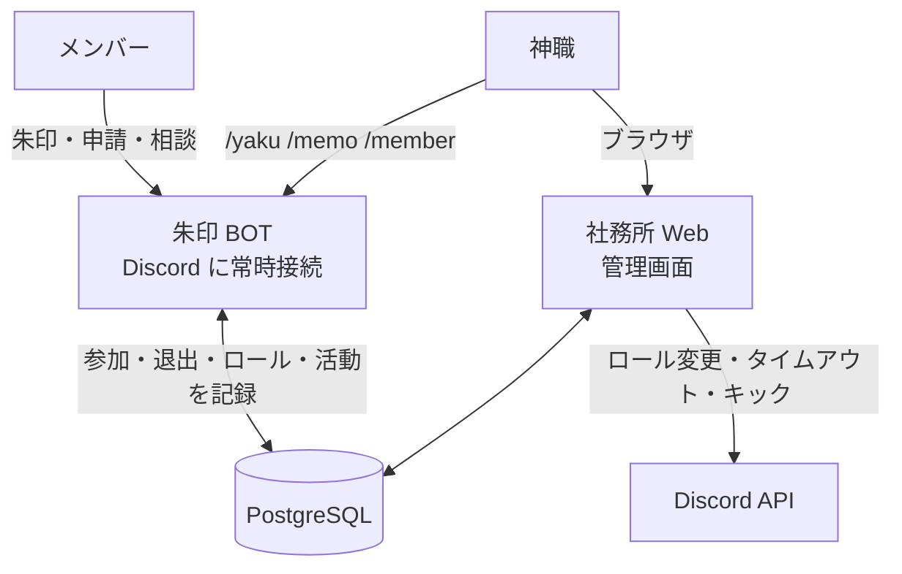
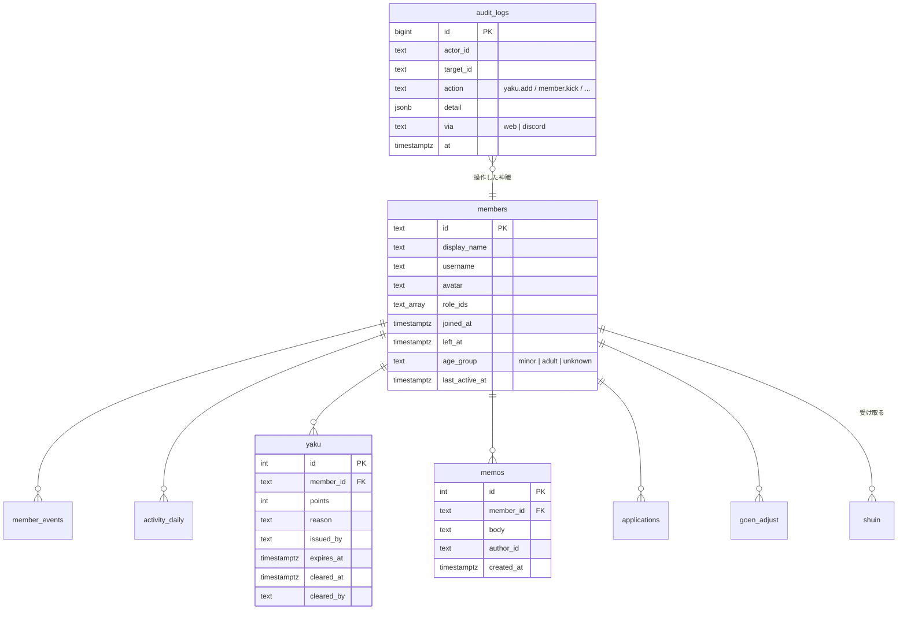

# 咲楽ノ宮 管理システム 設計書（社務所 Web）

> ステータス: 第4版（2026-09-25）・段階 A〜E すべて実装済み（ログイン・メンバー・厄・免罪符・銭・メモ・キック・申請・お参り期間・相談・設定）
> 朱印 BOT の設計は [design.md](design.md)、呼び名は [concept.md](concept.md)。

---

## 0. 概要

| 項目 | 内容 |
|---|---|
| 名前 | **社務所 Web**（しゃむしょウェブ） |
| 使う人 | **神職・宮司だけ**（Discord アカウントでログイン）。「設定」の「🔑 社務所Web に入れる人」で、ロール（例: 神代）か人ごとに入れる人と見られるページを選べる（→ 3.49） |
| できること | メンバーの状況の確認・検索、警告（厄）、申し送りメモ、申請の承認、相談の対応、操作の記録 |
| Discord との関係 | よく使う操作（厄・メモ・メンバー情報）は Discord のコマンドでもできる。どちらで操作しても同じデータ |

---

## 1. 全体の構成


```mermaid
flowchart TB
    M[メンバー] -->|朱印・申請・相談| B
    S[神職] -->|/yaku /memo /member| B
    S -->|ブラウザ| W
    B[朱印 BOT<br/>Discord に常時接続] <-->|参加・退出・ロール・活動を記録| DB[(PostgreSQL)]
    W[社務所 Web<br/>管理画面] <--> DB
    W -->|ロール変更・タイムアウト・キック| D[Discord API]
```

- **BOT** はこれまでどおり Discord に常時接続し、メンバーの参加・退出・ロール・活動を DB に記録する。
- **社務所 Web** は DB を読んで画面を出す。厄やキックなど Discord に反映が必要な操作は、BOT のトークンを使って Discord の API を直接呼ぶ（BOT 本体を経由しない）。
- BOT と Web は**同じリポジトリ・同じ DB・同じ処理（services）**を使う。どちらから操作しても結果は同じ。

---

## 2. 権限

| できること | 🎐 神職 | ⛩ 宮司 |
|---|---|---|
| 管理画面を開く・メンバーを見る | ✅ | ✅ |
| 厄を付ける・祓う、メモを書く | ✅ | ✅ |
| 申請の承認・却下 | ✅ | ✅ |
| 相談の対応 | ✅（送った人は見えない） | ✅（緊急時のみ送った人を確認できる・確認したことは記録に残る） |
| タイムアウト・キック | ✅ | ✅ |
| **BAN・ご縁の手動調整・年齢区分の変更** | — | ✅ |
| **設定（格・昇格ライン・期間）** | — | ✅ |
| **掲示（#鳥居・#しきたり の文面）** | — | ✅ |
| **チャンネル（説明・書き込める／読むだけ）** | — | ✅ |
| **銭を送る・減らす（1 人・全員）** | — | ✅ |
| 推移（グラフ）を見る | ✅ | ✅ |
| 操作の記録を見る | ✅ | ✅ |

- ログインのたびに **Discord 上で今も神職・宮司ロールを持っているか**を確認する（外された人はすぐ入れなくなる）。
- すべての操作は「誰が・いつ・誰に・何を・理由」を**操作の記録**に残す。記録は消せない。

---

## 3. 画面

### 3.1 ログイン
「Discord でログイン」ボタン → Discord の認可画面 → 戻ってきたら神職・宮司ロールを確認して入室。

### 3.2 ホーム（今日の社務所）

```
┌ 今日の社務所 ───────────────────────────────┐
│ メンバー 1,284 人（今日 +12 / -3）  今日の朱印 186   │
│ 昇格 4 人                                          │
├──────────────────────────────────────┤
│ ⚠ 対応待ち                                          │
│   入鯖申請 7 件 ・ 宵参り申請 2 件 ・ 相談 1 件（未対応） │
│   お参り期間が終わった人 5 人                         │
├──────────────────────────────────────┤
│ 👹 厄年 3 人 ・ 厄あり 11 人                           │
│ 最近の操作: 〇〇（神職）が △△ に厄 +1 「DM での勧誘」…  │
└──────────────────────────────────────┘
```

### 3.3 メンバー一覧

| 機能 | 内容 |
|---|---|
| 検索 | 表示名・ユーザー名・ID |
| 絞り込み | 役職 / 年齢区分 / 宵参り / 厄あり・厄年 / お参り期間中 / **しばらく来ていない（N 日以上活動なし）** / 参加日の範囲 / 退出済み |
| 並べ替え | ご縁 / 役職（格の高い順）/ 銭 / 朱印を押した人数 / 通話時間（30 日）/ 発言数（30 日）/ 参加日 / 最後の活動 / 名前。向き（多い順↓・少ない順↑）も選べる。一覧の見出しを押してもその列で並び、もう一度押すと向きが逆になる |
| 一覧の列 | アイコン・名前 / 役職 / ご縁 / 参加日 / 最後の活動 / 厄 / 印（🔞・メモあり） |
| 出力 | 絞り込んだ結果を CSV でダウンロード（宮司のみ） |

1 ページ 50 人。1000 人以上でもすぐ出るように、一覧は DB だけで作る（Discord に問い合わせない）。

### 3.4 メンバー詳細

```
┌ 🎋 世話役  さくら（@sakura_xx）  ID 1234… ─────────┐
│ 参加 2026/06/01（117 日） ・ 最後の活動 今日 23:41     │
│ 年齢区分 18 歳以上 ・ 🔞 宵参り ・ 厄 1（10/20 に祓われる）│
│ ご縁 142（総代まで 158） ・ 頂いた朱印 51 人 ・ 押した 63 人 │
├ タブ ──────────────────────────────────┤
│ [概要] [朱印] [活動] [厄] [メモ] [申請] [入退室] [記録]    │
├────────────────────────────────────────┤
│ 操作: [厄を付ける] [メモを書く] [タイムアウト] [キック]    │
│       [宵参りを外す] [BAN※] [ご縁調整※] [年齢区分※]  ※宮司 │
└────────────────────────────────────────┘
```

| タブ | 中身 |
|---|---|
| 概要 | 役職の履歴（いつ昇格したか）、ご縁の推移グラフ |
| 朱印 | 頂いた朱印・押した朱印の一覧（日時・格）、取り消し履歴 |
| 活動 | 日ごとの浮上（発言した日）・通話時間（発言の本文は保存しない） |
| 厄 | 付いた厄の一覧（理由・付けた神職・期限・祓われた日） |
| メモ | 神職どうしの申し送り（本人には見えない） |
| 申請 | 入鯖申請・宵参り申請の内容と結果 |
| 入退室 | 参加・退出・再参加の履歴 |
| 記録 | この人に対して行われた操作の記録 |

- 危ない操作（キック・BAN・宵参りを外す）は**理由の入力と確認画面**を必須にする。

### 3.5 厄（警告）

**ルール（オーナー決定・2026-09-25）**

| 状態 | 内容 |
|---|---|
| 厄 1 つ目 | **注意**。本人に DM で理由を知らせる（神職の名前は出さない）。👹厄年ロールが付く |
| 厄 2 つ目 | **BAN** |
| 解除 | **免罪符を購入すると厄が 1 つ祓われる**（自然には消えない） |
| 一発 BAN | 重大な違反は、厄を経ずに即 BAN |

一発 BAN にする違反（案）:
- 18 歳未満への恋愛・性的な目的での接触
- 個人情報の晒し（住所・電話番号・本名・顔写真など）
- 荒らし・レイド・スパムの大量投稿
- なりすまし・詐欺
- 違法な内容の投稿

| 画面 | 内容 |
|---|---|
| 厄の一覧 | 厄を持っている人（👹厄年）の一覧 |
| 厄を付ける | 相手・理由（定型文から選ぶ＋自由記入）。**2 つ目になる場合は「BAN になります」と確認画面を出してから実行** |
| 一発 BAN | 理由を上の一覧から選ぶ（＋自由記入）。確認画面を出してから実行 |
| お祓い | 免罪符による解除（自動）と、神職による取り消し（間違えて付けたときなど。理由必須） |

定型の理由（例）: 誹謗中傷 / 迷惑行為（通話） / 大人の話題を全年齢の場所で / スパム・宣伝 / その他

**免罪符（決定）**: 鯖内通貨「🪙銭」で購入。**1 人 1 回まで**。値段は考え中のため仮に 300（`config/guild.json` の `economy.menzaifuPrice` で変更）。本人が Discord で `/menzaifu` を使う。

### 3.5.1 銭（鯖内通貨）
- 通貨の名前は **銭**（🪙）。はじめは「花びら（🌸）」だった。更新のときの移行（`0030_currency_zeni`）で、設定の通貨の名前が花びらのままなら銭に、絵文字が 🌸 のままなら 🪙 にした（ほかの名前にしていれば変えない）。ショップの品の名前・説明の「花びら」も銭に、掲示の本文に直接書いた「花びら」は `{通貨}` にした。
- その後の最初の BOT の起動で、花びらで投稿済みの掲示を銭で出し直す（1 回だけ）。名前は「設定 → 通貨の名前」でいつでも変えられる（変えると投稿済みの掲示も書き換わる）。
- 掲示の差し込み `{おみくじの銭}`（前の名前 `{おみくじの花びら}` も使える）。
- **🔊 おみくじは通話に入っているときだけ**（設定 → 銭と免罪符 の「おみくじは通話に入っているときだけ引ける」。はじめは ON）: どこかの通話に入っていないと `/おみくじ` を引けない（本人にだけ「通話に入ってから」と出る）。AFK の通話・数えない通話（設定ファイルの `excludedVoiceChannelIds`）は入っていないのと同じ。「もう 1 回」（授与品・券）も同じで、引けないときは銭・券を使わない。掲示の差し込み `{おみくじを引けるとき}`（「通話に入っているとき」／「いつでも」）。#おみくじ の標準の使い方にも入れた。
- **🔥 おみくじを続けたおまけ**（設定 → 銭と免罪符 のいちばん下）: `/おみくじ`（1 日 1 回のログボ）を毎日続けると、決めた日数の日におまけ（銭・券・称号ロール）を渡す。1 日空けると 1 日目から。「もう 1 回」の分は数えない。5 行まで、日数を空にした行は使わない。
  - 「くり返す」にすると、その日数ごと（7 日なら 7・14・21 日目…）に毎回。外すとその日数の日だけ 1 回。標準は「7 日ごとに 銭 50・物御籤の無料券 1 枚」「30 日ごとに 銭 300・無料券 3 枚」。
  - 称号ロールは、役目のない（役職・運営・年齢・色守りなどでない）・危ない権限のない・BOT より下のロールだけ選べる。先に「ロール」のページで作る。一度付いたら、続かなくなってもそのまま（外すときは「ロール」のページから）。
  - おみくじのカードに「🔥 連続 ○ 日目 ・ あと ○ 日で ○ 日のおまけ」と、もらえたおまけが出る。おまけの銭は記録の理由「おみくじの連続日数のおまけ」（経済のページでは配った分）。
  - 掲示の差し込み `{おみくじのおまけ}`（「7 日ごとに 🪙銭 50・🎁物御籤の無料券 ×1／30 日ごとに …」）。#おみくじ の標準の使い方にも入れた（手を加えていなければ「チャンネルの案内を入れる」で新しい文面になる）。

| 貯まり方 | 量（初期値・設定で変更可） |
|---|---|
| 通話（2 人以上いる通話。AFK・スピーカーミュート中は数えない） | 10 分ごとに 5、1 日 150 まで |
| 朱印を押す | 3（同じ相手とは最初の 1 回だけ） |
| 朱印を頂く | 5（同じ相手からは最初の 1 回だけ） |

| 使い道 | |
|---|---|
| 免罪符 | 厄を 1 つ祓う（1 人 1 回まで） |

- 残高は御朱印帳・`/menzaifu`・管理画面で見られる。出入りはすべて記録に残る。

### 3.6 申請（第 2 段階の BOT 機能と共通）
- 入鯖申請・宵参り申請の待ち行列。内容を見て **承認 / 却下 / 保留**。
- Discord の `#申請受付` のボタンと同じ処理。どちらで押しても片方に反映される。

### 3.7 相談
- `/soudan` で届いた匿名相談の一覧。状態（未対応 / 対応中 / 完了）と担当の神職を付けられる。
- 神職には送った人が表示されない。宮司が「送った人を確認」を押すと表示され、そのことが記録に残る。
- 返信は BOT から相談者へ匿名のまま DM で届ける。

### 3.8 操作の記録
- すべての操作（Web・Discord のコマンドどちらも）を時系列で。操作した人・相手・種類・期間で絞り込み。
- 記録は画面から消せない。

### 3.9 設定（宮司のみ）
- お参り期間の日数、厄の期限・しきい値など。役職は「⛩ 役職」のページで変える（→ 3.38）。
- 「すべてファイルの値に戻す」でも、役職のページで変えたものは残る。
- 変えた内容も記録に残る。

### 3.10 掲示（宮司のみ）
- `#鳥居`・`#しきたり` などに **BOT が投稿する文面** を管理画面で書く・直す。「反映」で Discord のメッセージを書き換える（未投稿なら投稿）。
- 本文の `{免罪符の値段}` `{氏子のご縁}` `{役職一覧}` などは今の設定の値に、`{#しきたり}` はチャンネルへのリンクに置き換わる。**設定を変えると、投稿済みの掲示の数字も自動で書き換わる**（本文を編集中で未反映のものはそのまま）。
- 「標準の文面を入れる」で、ようこそ・ルール・厄と BAN・朱印とご縁・銭と相談・用語集が入る（`src/services/noticeDefaults.ts`）。
- 並べ替えたり途中に足したりしたときは「投稿し直す」（そのチャンネルの掲示を全部消して順番どおりに投稿）。Discord 側で消されていたら、反映のときに新しく投稿する。
- 見せ方は「カード」（埋め込み・朱色の線で 1 つずつ区切られる。4096 文字まで）か「普通のメッセージ」（2000 文字まで）。標準はカード。追加・編集・反映・削除は記録に残る。
- 「📌 ピン留めする」を選んだ掲示は、投稿するとピン留めする（話が流れても 📌 から読める）。BOT のロールに「メッセージの管理」（または「メッセージをピン留め」）権限が要る。できなかったときは投稿だけして知らせ、「未反映」のまま残る。
- 「⬇ いちばん下に表示し続ける」を選んだ掲示は、そのチャンネルに誰かが書き込むと、3 秒ほどで BOT が消して下に出し直す（続けて書き込まれている間は待つ。投稿済みの本文で。ピン留めはしない）。#絵馬-男性・#絵馬-女性 のひな形は標準でこれ。
- 「チャンネルの案内を入れる」で、#絵馬・#境内・#手水舎・#写真館・#おみくじ・#縁日・#屋台・#宿帳・#宵宮・#御神酒処 に **使い方**（ピン留め）、#しきたり の最後に全チャンネルの一覧 **チャンネル案内** が入る。同じチャンネルに同じタイトルがあれば入れないので、何度押しても増えない。
- チャンネルは名前で探す。「🪧｜絵馬」のように見た目を変えた名前でも、飾りを除いて同じなら見つける（`{#絵馬}` も同じ）。
- **🔔 メンション**: 編集画面で「なし／@here（いまオンラインの人）／@everyone（全員）／⛩ すべての役職／ロール（5 つまで）」を選ぶ。「すべての役職」は、投稿するときの役職のロール全部（入鯖が承認された人みんな。役職を足すとそれも入る）を鳴らす。面談告知の通知と、🎁 全員にプレゼントのお知らせの通知でも選べる。メンションはメッセージのいちばん上に付く（カードならカードの上、普通のメッセージなら 1 行目）。**通知が鳴るのは、はじめて投稿したときだけ**。あとから書き換え・「投稿し直す」・いちばん下への出し直しでは鳴らさない（メンションの文字は残る）。本文に直接書いた @everyone などでは鳴らさない。@everyone・@here や「メンションを許可」していないロールを鳴らすには、BOT のロールに「@everyone、@here、全てのロールにメンション」の権限が要る。
- **文字の飾り**: 本文の上のボタンで、選んだ文字を **太字**・斜体・下線・取り消し線・伏せ字（ネタバレ）・`コード` に、行を 見出し（大・中・小）・小さい文字（`-# `）・箇条書き・番号・引用 に、コードの枠・リンク（`[文字](https://…)`）も入れられる（もう一度押すと外す）。Ctrl+B / Ctrl+I / Ctrl+U でも。「差し込める値」の名前を押すと、カーソルの所に入る。プレビューは Discord に近い見た目で出る（だいたい。細かい所は Discord で確認）。「書き方の一覧」に全部ある。
- **🖼 写真**: 編集画面で写真を 1 枚選べる（PNG・JPEG・GIF・WebP、8MB まで。中身で見分けるので、名前だけ .png にしたものは入らない）。「⬆ 本文の上」「⬇ 本文の下」を選ぶ。カードは、上なら写真だけのカードを本文のカードの上に、下なら本文のカードの中のいちばん下に出す。普通のメッセージは Discord の決まりで、写真はいつも本文の下。写真は社務所の DB にしまい、投稿・反映のたびに Discord に添付して送る（替える・外す・上下を変えると「未反映」になり、反映で書き換わる）。「写真を外す」で外せる。掲示を消すと写真も消える。

### 3.11b 経済（神職も見られる）
- 「経済」ページ: 鯖の中の銭の流れ。期間は 30 日・3 か月・1 年。銭は鯖の中だけのもので、本物のお金では買えない。
- **いま出回っている銭**（メンバーが持っている合計）・**配った**（通話・朱印・おみくじ・初期配布・招待・奉納・物御籤の当たりなど）・**鯖の収入**（授与品・物御籤・通話部屋・免罪符・市場の手数料。払い戻しは引く）・**増減**。
- 配った量のうち収入として戻った割合が 50% を下回ると、インフレ（銭が余って値打ちが下がる）の注意を出す。
- グラフ: 出回る量の推移、配った（上）と収入（下）。
- 内訳の表: 収入・配った・運営の調整（管理画面から送った・減らした）・メンバー間の行き来（贈り物・市場の売り上げ）。
- **持っている量のかたより**: 持っている人・平均・中央値・上位 10% が持つ割合・ジニ係数（0.6 以上で注意）・量ごとの人数・多く持っている人（退出した人・BOT は除く）。
- よく受けられた授与品、いまの値段・配る量（宮司は設定・授与品・物御籤へのリンク）、この期間の大きな出入り。
- **🎉 期間限定イベント**（宮司が作る）: 種類（🎙 通話ボーナス＝通話でもらえる量を 110〜1000%／🏮 授与品セール＝1〜90% 引き（免罪符・贈り物はのぞく、奉納割引と重なる）／🎁 物御籤セール＝1〜90% 引き／🎫 通話で券＝3.56）・名前・始まりと終わり（日本時間）・知らせるチャンネル。期間の間だけ BOT と管理画面の設定に入る（1 分以内）。同じ種類が重なったら大きいほう。始まり・終わりを選んだチャンネルに知らせる。「やめる」で途中でやめられる。/物御籤・授与所にはセール中の表示と値段が出る。通話ボーナスは 1 日の上限に数えない。
- **🎁 物御籤の収支**: 使われた銭（払い戻しを引く）− 当たりで出た銭・おすそ分け − 当たりで出た授与品の値段。ほかに出た券・ロールの数。
- **🎯 値段の目安**: 4 週で 1 枚以上もらった人の「1 週間にもらう量」の中央値（配った銭だけ。贈り物・市場・運営の調整は入れない）から、授与品・物御籤・部屋代が何日分かを出す（1 日分未満＝安い／1〜7 日＝ちょうどいい／1〜4 週＝高め／それ以上＝とても高い）。
- **🕵 サブアカウントの疑い**: 同じ相手への贈り物・市場の買い物で、受け取った人が入って 7 日以内・3 回以上・合計が贈り物の 1 日の上限の 3 倍以上、のどれかに当てはまる組。疑いがあるだけなので、決めつけずに確かめる。
- **📒 1 人ずつの収支**（名前を押す・メンバーのページの「収支のグラフ」）: もらった・使った量の日ごとのグラフ、理由ごとの表、よくやり取りした相手（贈り物・市場）。30 日・3 か月。
- **⚙ 見守りの設定**（宮司）: 知らせる先（なければ #記録）。
  - **📊 週ごとのお知らせ**: 決めた曜日・時（日本時間。はじめは月曜 9 時）に、直近 7 日の配った量・収入（先週と比べて）・物御籤の収支・かたより・開催中のイベント・注意（インフレ・かたより・疑いのある組）を出す。
  - **⚠ 警告**: 24 時間でもらった量・使った量が決めた量（はじめは 5,000・20,000）以上の人を 1 人 1 日 1 回知らせる（贈り物・市場の売り上げも入れる。運営の調整・お賽銭は入れない）。
  - **🪙 お賽銭**（はじめは止めてある）: 週ごとのお知らせのときに、持っている量が決めた量を超えた人から、超えた分の 1〜20% を納めてもらう（本人に DM・/残高 に「お賽銭（持ちすぎた分）」）。鯖の収入に入る。

### 3.12 推移（グラフ）
- 「推移」ページ: サーバーにいる人数（折れ線）、入った人・抜けた人（上下の棒）、朱印・通話時間・発言の数。30 日（1 日ごと）・3 か月（1 週ごと）・1 年（1 か月ごと）を切り替えられる。日付は日本時間。
- 人数はメンバーの「入った日・抜けた日」から数え直す（BOT を除く。入り直した人は最後に入った日で数える）。棒にマウスを乗せると値が出る。「表で見る」で数字の一覧。
- グラフはサーバーで SVG を作る（JavaScript なし）。色は `style.css` の `--series-1`・`--series-2`（ライト・ダークとも色覚の多様性を確かめ済み）。

### 3.13 銭を送る・減らす（宮司のみ）
- メンバーのページの「銭を送る・減らす」: 枚数（1〜100,000）と理由（必須）。送るときは本人に DM で知らせられる（理由も載る）。減らすのは残高まで。
- 設定ページの「今いる人みんなに送る」: 役職のある今いる人（BOT・退出した人を除く）全員に同じ枚数。DM は送らない。
- 画面を開くたびに番号を作り、同じ番号では 1 回しか送らない（二度押し・再送信で 2 回送られない）。全員に送るときは 1 つのトランザクションで、途中で失敗したら誰にも送らない。
- 銭の出入りに「運営から」「運営が減らした」と理由が残り、操作の記録にも残る（`coins.grant` / `coins.take` / `coins.grant_all`）。

### 3.17 コアタイム
- 標準は金曜・土曜の 21:00〜23:00（日本時間）。この間の通話は、10 分ごとの銭が `coreTimePercent`%（標準 150% ＝ 5 枚 → 8 枚。端数は四捨五入）。増えた分は 1 日の上限に数えず、上限に届いていてももらえる。
- `#境内` に、前日の 21 時（`noticeDayBefore`）と、始まる 60 分前（`noticeMinutesBefore`）に予告。BOT が止まっていても 30 分までなら遅れて出す。同じ予告は 1 回だけ。
- 曜日（1 曜日に 1 つ）・時間・倍率・予告は「設定」で変える。掲示で `{コアタイム}` `{コアタイム倍率}` が使える。

### 3.18 宵宮と Discord の年齢制限
- 宵宮は、宵参り申請を運営が承認した人だけが見られる（ロール）。Discord の年齢制限（Discord の年齢確認）は付けない（2026-09 に変えた。セットアップも付けない）。
- **宵参り申請の自動判定**: 申請ボタンを押した人が、Discord の参加時の質問で付く **年齢のロール** を持っていれば自動で決める。
  - **17 歳以下のロール** → 自動で却下（申請は「却下」で記録、本人に DM）。13〜17 歳と記録されている人は、18 歳以上のロールがあっても却下。両方のロールを持っていれば 17 歳以下を優先。
  - **18 歳以上のロール** → 自動で承認（🔞 宵参りのロールを付ける。年齢区分も 18 歳以上にする。入鯖のときの申告がなくてもよい）。
  - どちらもなければ今までどおり（入鯖で 18 歳以上と申告した人だけ受け付けて、#申請受付 で神職が判定）。
  - ロールは設定（`roles.ageMinor` / `roles.ageAdult`）か、**名前に「17歳以下」「18歳以上」を含むロール**（「18才以上」・全角数字・空白も可。「18歳未満」「未成年」は 17 歳以下扱い）。ロールのページでは「年齢（…自動で却下／承認）」と出る。
- 前に付けたものは「チャンネル」ページの「🔞 Discord の年齢制限」で外す（テキスト・通話。「➕ 宵宮の部屋をひらく」を外すと、そこから作られる部屋も付かない）。
- 年齢制限を付けない部屋では、性的な画像・動画・露骨な話は出さない（Discord のルール）。出す部屋を作るなら、その部屋だけ年齢制限を付ける。

### 3.19 宿坊・宵宮の部屋の種類と値段
- 「➕ 宿坊をひらく」「➕ 宵宮の部屋をひらく」でできた部屋のチャットに、案内（値段）と「⚙ 部屋の設定」ボタンを出す（縁側・屋台などには出さない）。ボタンを押すと、**作った本人と運営（神職・宮司）にだけ**設定のパネルが出る（ほかの人が押すと断る）。
  - 運営として開くと「🛡 運営として開いています」と出て、部屋の種類が決まったあとでも変えられる（部屋代の差額は取らない。部屋のチャットに「運営が種類を変えた」と出る）。譲渡したときのこれからの部屋代は新しい部屋主が払う。
  - シークレット・招待限定・ツーショットの部屋は運営にも見えないので、**`/部屋の設定 部屋`**（神職・宮司）で、今ある部屋を名前か部屋主の名前で探して、どこからでも同じパネルを開ける。
  - パネル: 📝 チャンネル名（Discord の決まりで 10 分に 2 回まで）／💬 ステータス（通話の下に出る一言）／👥 人数制限（0〜99）／➕ 入室許可者を追加／🔒 部屋の種類を選ぶ／✖️ 閉じる。変えるとパネルに「✅ 〜にしました」。
  - **部屋の種類（公開・招待限定・シークレット・ツーショット）は 1 回だけ選べる**。選んだあとは切り替えられない（選ばなければ公開のまま）。
  - **👑 権限を譲渡**: 今その部屋にいる人（BOT・自分をのぞく）から選ぶ。前の部屋主は入室許可者に入る。値段のある部屋は「これからは相手が払う」（その時間以降の部屋主の分は新しい部屋主）か「部屋代は自分が持つ」（前の部屋主が、抜けたあとも部屋主の分を払う。銭の出入りの詳細に `for`）を選ぶ。部屋主以外の人は、今までどおり自分の分を払う。
- 「➕ 宿坊をひらく」（once: ひらくたびに 1 回）「➕ 宵宮の部屋をひらく」（hourly: 1 時間ごと）は銭がかかる。
- 種類: 🔓 公開 ／ 🔒 招待限定（ロールは見えるが入れない）／ 🤫 シークレット（ロールには見えない）／ 💞 ツーショット（2 人まで・招待は 1 人）。招待限定などには運営のロールも入れない（ただし Discord の「管理者」権限を持つロールは、Discord の決まりでどの部屋にも入れる）。
- 人数の上限（2〜20・上限なし）と、招待（最大 10 人ずつ。招待された人に部屋のチャットで通知）。
- 値段は「設定」の表（0 で無料。はじめは全部 0）。once（宿坊）: 作った人が、ひらくときに公開の値段、種類を変えたら差額。hourly（宵宮）: 入っている人それぞれが、入ったときに最初の 1 時間、以後 1 時間ごと（払ってある間は出入りしても払わない。足りなければ入れない。途中で払えなくなると注意して 5 分後に通話から抜けてもらう）。種類を変えると、作った人が今の 1 時間の差額、ほかの人は次の 1 時間から新しい値段。銭の出入りは「通話部屋」。
- 入口の払い方は設定ファイルの `tempVoice.hubs[].plan`（なければ名前から: 宿坊 → once、🍶・宵宮 → hourly、ほか → なし）。
- BOT に「チャンネルの管理」「ロールの管理」の権限が要る。

### 3.20 性別と、自己紹介を書いてから入る流れ
- 入鯖申請: 年齢区分 → 性別（男性・女性）→ フォーム。申請カード・管理画面に性別が出る。
- 承認すると、性別のロール（♂ 男性・♀ 女性）と 📝 絵馬待ち を付け、DM で自分の絵馬（女性は `#絵馬-女性`、男性は `#絵馬-男性`）のリンクを送る。絵馬待ちは自己紹介のチャンネルだけ見えて書ける。
- 自分の絵馬に 10 文字以上書くと、絵馬待ちを外して 🔰参拝者 にし、お参り期間を始め、初期配布を渡し、ようこその DM を送る（🌸 のリアクション）。ちがう絵馬に書いたら消して DM で案内、短すぎたらその場で案内（20 秒で消える）。
- #絵馬-男性・#絵馬-女性 のいちばん下のひな形に **「🌸 朱印を押す」ボタン**。押すと、**そのチャンネルに投稿している人**（最近のメッセージ 500 件と自己紹介の記録。新しく投稿した順・25 人ずつページ送り。自分・BOT・退出した人は除く）から選ぶ欄が本人にだけ出て、選ぶとそのまま朱印を押す（決まりは右クリックの朱印と同じ）。
  - **置き方**: ① そのチャンネルで `/パネル 朱印`（いちばん下に表示し続ける掲示があればそれに付け、なければ文章なしのボタンだけの掲示を作って、すぐ出す）。② 社務所Web の「掲示」→「🌸 カテゴリの全部のチャンネルに『朱印を押す』ボタンを置く」でカテゴリ（絵馬殿など）を選ぶ（作る・付けるだけなので、そのあと「すべて反映」）。③ 掲示の編集画面の「🌸『朱印を押す』ボタンを付ける」。本文なしにできるのは、このボタンを付けた掲示だけ。
  - どれも掲示として覚えるので、書き込みがあると下に出し直す（BOT が 1 分以内に気づく）。書き込みがなくても、BOT の起動時と 10 分ごとに見回って、下にないもの（管理画面で書き換えたあとなど）は下に出し直す。外すときは掲示のページで編集か削除。
- 絵馬待ちのロールがない（セットアップ前）ときは、これまでどおり承認ですぐ参拝者（DM に自己紹介のリンクを添える）。
- 前からいる人: `/パネル 性別` のボタンで選ぶ（1 回だけ。変えるのは神職が Discord でロールを付け替える）。
- 設定ファイル: `roles.male`・`roles.female`・`roles.emaPending`（セットアップが書く）。

### 3.21 ロール（宮司のみ）
- 一覧: Discord のロール（上から順）・このサーバーでの役目（役職・お守り・色守り・性別 など。設定ファイルから）・持っている人数（今いる人・BOT を除く）・気をつける権限（管理者・BAN・キック・ロールの管理 など）。
- ロールを開くと: 権限をグループごとのチェックで確認・変更（管理画面にない権限はそのまま残す）、名前・色・メンバー一覧で分けて表示・誰でも @ で呼べる、持っている人の一覧。@everyone は権限だけ。
- 「管理者」を新しく付けるときは確認のチェックが要る。BOT のロール以上のロールと、BOT などの自動のロールは変えられない（🔒。Discord のサーバー設定から）。
- 変えたことは記録に残る（`role.update`。足した・外した権限の名前）。BOT に「ロールの管理」権限が要る。
- 一覧の上の「@ で呼べるようにする」で、すべてのロールの「誰でも @ で呼べる」をまとめて ON／OFF（🔒 と @everyone はのぞく。確認のチェックが要る。記録は `role.mentionable_all`）。セットアップが新しく作るロールは標準で ON。
- **ニックネームを自分で変えられないように**: 「ロール」の「🏷 ニックネームは自分で変えられないように」で、@everyone とロールから「ニックネームの変更」を外す（🔒 のロール・持ち主・管理者・ニックネームの管理を持つ人はのぞく。記録は `role.nickname_lock`）。変えるときは、メンバーのページの「ニックネームを変える」（空で元の名前。自分より上の運営は変えられない。記録は `member.nickname`）。BOT に「ニックネームの管理」が要る。
- **作る**: 一覧の下の「➕ ロールを作る」（名前・色・分けて表示・@ で呼べる）。権限はなしで作り、開いたページで付ける。いちばん下（@everyone のすぐ上）にできる。記録は `role.create`。
- **消す**: ロールのページの「🗑 ロールを消す」で名前を入力。役職・厄年・宵参り・性別・絵馬待ち・開業・DM とフレンド・お守り・色守り・称号・授与所の品物のロールと 🔒 のロールは消せない。記録は `role.delete`。
- チャンネルごとの権限（見える範囲・読むだけ）は「チャンネル」ページとセットアップで決める。

### 3.22 市場（開業権利）
- 本物のお金は扱わない。銭だけ。PayPay などの外での支払い・性的なものは、しきたりで禁止（出品のときにも表示）。
- 授与品「🏪 開業権利」（標準 3000 枚・ずっと。値段はショップで変える）を受けると 🏪 開業 ロールが付き、`#市場` の「出品する」から出品できる。
- 種類: 🎨 イラスト ／ 🎤 歌・音声 ／ 🛠 作成物 ／ 📞 通話（雑談・寝落ち。**18 歳以上どうしだけ**）／ 📦 その他。題名 60 文字・説明 1000 文字・値段 1〜1,000,000 枚。
- 買うと、買った人の銭を宮が預かり、`#市場` に買った人と売った人だけのスレッドを作る（売った人には DM）。
  - 買った人が「受け取った」→ 売った人に値段から手数料（「設定」の `feePercent`。標準 10%。切り捨て）を引いた分を渡す。手数料の分は誰にも渡さない。
  - 何も押さなければ `autoReleaseDays`（標準 7 日）で売った人に渡す。
  - 「問題あり」→ 期限で渡さなくなり、ログのチャンネルに通知。社務所Web の「市場」で運営が **返金**（買った人に全額）か **完了**（売った人へ）を決める。
- 出品した人と運営は、出品カードの「受付終了」で受付を終えられる（社務所Web の「取り下げ」も同じ。カードも受付終了にする）。
- 記録: `market.buy` / `market.release` / `market.refund` / `market.dispute` / `market.close`。銭の出入りは「市場で買った」「市場で売れた」「市場の返金」。
- `/パネル 市場` で「出品する」ボタンを置き直せる。設定ファイル: `channels.market`・`roles.merchant`・`shop.license`（セットアップが書く）。

### 3.23 セットアップとチャンネルの並び
- **2026-09〜 標準はチャンネルの形を固定**: セットアップは、今あるカテゴリ・チャンネルを（飾りを除いた名前・設定ファイルの ID で）探して ID を書くだけ。**作らない・移さない・名前を変えない・消さない**。ほかのカテゴリへ動かしたものも、同じ名前が 1 つだけなら使う。ロールは足りなければ作る。
- 配置にあってサーバーにないものは「作らなかったもの」として表示する。使いたいときは Discord で同じ名前のチャンネルを自分で作ってから、もう一度セットアップ（例: `お出迎え`）。
- 名前を変えて見つからなくなった通話部屋の入口・募集ボタンも、設定ファイルからは消さない。
- 配置どおりに作る・移す・片付ける・並べ直すときだけ `--change-channels` を付ける（`--tidy`・`--reorder` もこれと一緒のときだけ効く）。以下はそのときの動き:
- セットアップは、今のサーバーのチャンネル・カテゴリを読み取り、同じ名前（飾りを除いた名前）のものは作り直さない（重複しない）。
- **今の並び順は変えない**。新しく作るもの・移すものだけ、設計で 1 つ前にあるものの **すぐ後ろ** に入れる（例: `#市場` は `#おみくじ` の後ろ）。
- 設計どおりに全部並べ直したいときだけ `--reorder` を付ける（`docker compose run --rm setup --guild <ID> --change-channels --tidy --reorder`）。

### 3.24 DM・フレンド追加の OK／要相談／NG
- ロール 6 つ: 📩 DM OK ／ 💬 DM 要相談 ／ 🚫 DM NG ／ 🤝 フレンド OK ／ 💬 フレンド 要相談 ／ 🚫 フレンド NG（セットアップが作る。色なし）。名前を押すとプロフィールに出る。
- 入鯖申請: 年齢区分 → 性別 → DM → フレンド追加 → フォーム。申請カード・社務所Web に「DM: OK ・ フレンド追加: NG」のように出て、承認でロールを付ける。
- あとから: `#授与所` の「DM・フレンド追加」パネル（`/パネル dmとフレンド`）で押し直すと、同じ種類のほかのロールを外して付け替える。
- ロールがない（セットアップ前）ときは、申請でも聞かない。しきたりに「NG の人にはしない・要相談は一声かけてから」を足した。
- 設定ファイル: `roles.contact.dm.{ok,ask,ng}`・`roles.contact.friend.{ok,ask,ng}`（セットアップが書く）。

### 3.25 はじめて入った人向け
- **入ったときの案内 DM**: サーバーに入ると、BOT が「① しきたり ② 社務所で申請 ③ 承認を待つ ④ 絵馬に自己紹介」をリンク付きで DM（BOT・もう参拝者以上の人には送らない）。
- **申請中の「今どこ」**: 申請のボタンに「入鯖申請 ― ステップ 1/5：年齢」のように出す（DM・フレンドのロールがなければ 3 ステップ）。受け付けたあとに「次は」を案内。
- **#お出迎え**（🌳 境内。セットアップが作る。`channels.welcome`）: 🔰参拝者 になったら「🌸 ○○ さんが参拝しました！」と自己紹介のリンクを出す（通知は飛ばさない）。
- **はじめての参拝**（`/はじめて`）: おみくじを引く・だれかに朱印を押す・通話に合わせて 10 分。本人にだけ進み具合を見せる。
  - 全部できたら、お祝いの銭（「設定」の `onboardingReward`。標準 300 枚・1 人 1 回。銭の出入りは「はじめての参拝のお祝い」）。
  - `/はじめて` を打ったとき、または BOT が 10 分ごとに（入って 60 日以内の参拝者以上）確かめて渡し、DM で知らせる。
  - ようこその DM に `/はじめて` の案内を足した。

### 3.26 招待のお礼
- 入鯖申請の途中（フォームの前）で「招待してくれた人」をメンバーから 1 人選ぶ（いなければ「招待してくれた人はいない」）。自分・BOT は選べない。申請カード・社務所Web の申請とメンバー詳細に出る（メンバー詳細には「招待した人数」も）。
- 承認したときに記録し（招待された人 1 人につき 1 件。入り直しても変えない）、招待された人が 🔰参拝者 になったときに、招待した人へお礼（「設定」の `inviteReward`。標準 500 枚）と DM。1 人につき 1 回だけ。招待した人が抜けていたら渡さない。
- **浮上ボーナス**: 招待された人が参拝者になってから `inviteActiveDays`（標準 30 日）の間、その人が浮上した日（発言 1 回以上か、通話 10 分以上）ごとに、招待した人へ `inviteActiveReward`（標準 20 枚）。1 日 1 回・10 分ごとに確かめる。DM は送らない（銭の出入りに「招待した人の浮上ボーナス」）。
- 0 にするとなし。サブ垢での稼ぎを防ぐため、申請は神職が確認してから承認してください。
- **招待リンクは BOT だけ**: `/招待リンク`（参拝者以上）で、その人専用のリンク（期限なし・#鳥居 に入る。`channels.entrance`、なければ名前で探す）を渡す。何度打っても同じリンク。
  - だれかが入ったら、#鳥居 の招待リンクの使われた回数を比べて、増えたのが 1 つだけならその持ち主の招待として記録する（同時に入ったなど分からないときは記録しない）。BOT が止まっていた間に入った人は分からない。
  - リンクで入った人には、申請の「招待してくれた人」を聞かない。申請カードに「（招待リンク）」、#お出迎え に「🤝 招待: ○○ さん」。
  - 社務所Web の「ロール」→「招待リンクを BOT だけにする」で、@everyone とロールから「招待を作成」を外す（🔒 のロール・持ち主・管理者はのぞく）。前に人が作ったリンクは、Discord のサーバー設定 →「招待」から消す。
- **社務所Web の「招待」**（神職・宮司）: Discord のサーバー設定 →「招待」では、BOT が作ったリンクの招待した人はすべて「BOT」と出る（Discord の決まり）。だれのリンクか・何回使われたか・だれがだれを招待したかはこのページで見る。
  - Discord の「招待」ボタンで人が作ったリンク（期限つきのもの。だれの招待かは記録されない）も一覧にして「消す」で消せる（読むには BOT に「サーバーの管理」が要る）。人が作れないようにするのは「ロール」→「招待リンクを BOT だけにする」。記録は `invite.delete`。
- **共通の招待リンク（SNS・宣伝用）**: `/共通招待リンク 作る`（神職・宮司）で、だれのものでもない期限なし・回数なしのリンク（#鳥居 に入る）を渡す。`名前` を付けると別のリンクになる（同じ名前なら同じリンク）。
  - `/共通招待リンク 一覧` で使われた回数、`/共通招待リンク 消す`（リンクか名前）で使えなくする。このリンクで入った人は、だれの招待にもならない（申請では「招待してくれた人」を聞く）。
  - BOT のロールに「招待を作成」と、#鳥居 での「チャンネルの管理」（リンクの使われた回数を見るため）が要る。

### 3.27 自動で増える通話（大きな縁側・小さな縁側など）
- 「設定 → 🔊 自動で増える通話」で、名前（番号の前。例: `大きな縁側`）・最低の数（標準 3）・最大の数（標準 20）を決める（10 個まで）。名前を空にすると止める。
- 「大きな縁側 1」「大きな縁側 2」…のように、名前の後ろに番号を付けた通話をまとめて見る（飾り・空白・全角数字も同じとみなす）。
- 全部に人がいたら、いちばん大きい番号のすぐ下に次の番号を作る（いちばん大きい番号の通話と同じ設定をコピー。全角の番号なら全角）。最低の数に足りないときも作る。
- 空きが 2 つ以上になったら、最低の数より大きい番号の空いている通話を、大きい番号から消す（空きは 1 つ残す）。BOT の数は数えない。
- 出入りのあと 1.5 秒待ってから確かめる（念のため 1 分ごとにも）。BOT に「チャンネルの管理」が要る。

### 3.28 プロフィール（御朱印帳）
- 右クリック（スマホは長押し）→「アプリ」→「プロフィール」だけ（前の「朱印を押す」「御朱印帳を見る」は登録しない）。`/御朱印帳` でも同じ。
- 出すもの: アイコン（右上）・Discord のバナー（あれば大きく）、役職・ご縁、性別・DM・フレンド（ロールから）、称号（授与品）、参拝した日（サーバーに入った日）、自己紹介（#絵馬-男性・#絵馬-女性 のいちばん新しい書き込み。本文のはじめとリンク）、頂いた・押した朱印。自分のを自分だけに見えるように開いたときだけ銭の残高。
- 「🌸 朱印を押す」ボタンで朱印を押す（自分のプロフィールには出さない）。
- 自己紹介は、BOT が書き込みを見たときに覚える（起動したときに、絵馬のチャンネルの最近 100 件も読む）。BOT が本文を読めない設定（Message Content がオフ）のときは、リンクだけ。

### 3.29 人がいなくなった通話のチャットを消す
- 通話チャンネルの中のチャットは、最後の人（BOT をのぞく）が抜けてから「設定 → 💬 通話のチャット」の分（標準 1 分）たっても、まだだれもいなければ消す。その間にだれか入れば消さない。ピン留めは残す。
- 14 日以内の書き込みはまとめて消す。それより古いものは 1 件ずつ（1 回に 50 件まで。残りは次に空になったときに）。
- BOT が起動したときも、だれもいない通話に書き込みがあれば片付ける。
- 「人がいなくなった通話のチャットを消す」のチェックを外すと止まる。BOT に「メッセージの管理」「メッセージ履歴を読む」の権限が要る。

### 3.30 通話の記録（浮上時間）
- BOT が 1 分ごとに、AFK 以外の通話にいる人（BOT をのぞく。1 人でも）を記録する: だれがどの通話に何分（日ごと）、だれとだれが同じ通話に何分（日ごと。1 つの通話で 25 人まで）、通話チャンネルの名前・カテゴリ（自分の通話部屋は作った人・入口・種類も。消えたあとも残す）。
- 社務所Web の「通話の記録」（運営）: 期間（7・30・90 日）ごとに
  - 日ごとの通話時間のグラフ（カテゴリを選ぶとその場所だけ）。
  - カテゴリ（エリア）ごとの、のべ時間と割合。横棒グラフでも。カテゴリを押すと「その場所が多い順」（その人の中の割合も。例: 宵宮に長くいる人）。
  - 人ごとの浮上時間（合計・多い場所）。
  - よくいっしょにいる 2 人。
  - 自分の通話部屋（宿坊・宵宮・縁側など）: ひらいた時刻・部屋・入口・作った人・種類・ひらいていた時間・人数・のべ時間・払われた部屋代。
- メンバーのページに「通話の記録（30 日）」: 合計、場所ごと、よくいた通話、よくいっしょにいる人。
- 通話の銭（10 分ごと）とコアタイム、宵宮の 1 時間ごとの部屋代は、今までどおり別に数えている（この記録は見るためのもの）。

### 3.31 呼び鈴（運営などを呼ぶ）
- 「設定 → 🔔 呼び鈴」で決める: 知らせ先のチャンネル（なければ #記録）・続けて鳴らせない分（標準 5 分）・呼んだロールに通知を飛ばすか・**呼べるロール**（なにも選ばなければ運営の役職）・**ボタンをいつもいちばん下に置くチャンネル**（例: 🌳 境内 のチャンネル）。
- 選んだチャンネルには、いちばん下に小さな「🔔 呼び鈴」ボタンを置く（話が 1 分落ち着いたら置き直し、前のものは消す。10 分ごとにも確かめる）。`/パネル 呼び鈴` で説明つきのパネルも置ける。`/呼び鈴` でも同じ。
- 押すと、呼ぶロールを選ぶ（1 つだけならすぐ）→ どうしたかを書く（任意）→ 知らせ先に、だれが・どこで（そのとき入っていた通話も）・だれを・内容のカード。選んだロールに @ で通知。
- 呼ばれたロールの人か神職・宮司が「🏃 対応する」を押すと、呼んだ人に DM。「✅ 対応済み」で閉じる（記録は `bell.take` / `bell.done`）。待っている呼び鈴があるときと、鳴らしてから決めた分は続けて鳴らせない。

### 3.32 物御籤（銭で引くくじ）
- **銭だけ**で引く（本物のお金は扱わない）。標準は 1 回 500 枚・10 連 5,000 枚。`/物御籤` か、`/パネル 物御籤` で置いたボタン（#おみくじ・#授与所 向け）から。押すと本人にだけ、値段・出る割合・中身・天井まであと何回・持っている券が出て、そこから「1 回引く」「10 連」。
- 運勢（🎊超大当たり・🌸大吉・🏮中吉・🎐小吉・🍡吉）を出やすさで決めて、その運勢の **中身** から重みで 1 つ出す。中身は運勢ごとにいくつでも足せる: **限定ロール**（物御籤だけの色守り・称号など）・**券**・**銭**・**ショップの品**（ロールの品: 色守り・称号・開業権利など。ショップで止めている品も出せる）。
- **🎊 超大当たり**: 大吉より上の運勢（標準 0.01%。出やすさは小数で決められる）。中身に **🎊 運営が渡す賞品**（Discord Nitro 1 か月分など。名前と残りの数を決める。空ならいくらでも・0 で出ない）を入れる。中身がない・残りが 0 なら超大当たりは出ない。当たると #おみくじ で大きくお祝いし、運営のチャンネル（呼び鈴の知らせ先か #記録）に知らせ、当たった人に DM。運営が渡したら「🎁 物御籤」ページの「🎊 運営が渡す賞品」で「渡した」を押す（記録は `gacha.claim_done`）。超大当たりは大吉ではないので天井の回数は数え続ける。
- **🎟 自由な券**: 名前を自由に決めた券（例: 🎤リクエスト曲券・📞運営と通話券）。「🎁 物御籤」ページの「🎟 自由な券」で作り（絵文字・名前・説明・ON/OFF）、中身の「🎟 自由な券」カードで物御籤に入れたり、メンバーのページから渡したりする。持っている人が /物御籤 の「🎟 券を使う」から使うと、運営のチャンネル（呼び鈴の知らせ先か #記録）に知らせ、「🎊 運営が対応するもの」に出る（対応したら「渡した」）。OFF にした券は物御籤に出ないが、持っている人は使える。
- **✨ 今の目玉**: /物御籤 と「物御籤売り場へ入る」の画面のいちばん上に、超大当たりの中身（大きな字で。それぞれの %・残り・期間）と期間限定の中身（いつまでか）をカードで出す。今出せるものだけ（残りのない賞品・期間の外のものは出さない）で、どちらもなければ出さない。その下の物御籤のカードは、運勢ごとの割合を 1 行だけ出す（中身は並べない。「📜 中身と排出率」で見る）。
- **🎉 はじめての 1 回は無料**: 物御籤（ものみくじ）をまだ引いたことのない人には、売り場に「はじめての 1 回（無料）」のボタンが出る。1 人 1 回だけ（出直しても・物御籤をリセットしても戻らない。前から引いていた人は使ったことになっている）。置いたボタンの名前は「物御籤売り場へ入る」で、BOT が起きたときに #おみくじ・#授与所 の古いボタンも書き換える。
- **📜 中身と排出率**: /物御籤 の画面と、`/パネル 物御籤` のボタンから、だれでも（自分にだけ）見られる。運勢ごとに出る中身を全部と、それぞれの出る確率・天井・「代わり」「残り」「期間限定」「持っていたら出ない」を出す。
- **🐉 十二支のお守り**: 中身の「🐉 十二支のお守り」カードで足す。出るたびにまだ持っていない十二支が 1 つ（`gacha_collection`）。12 そろうと決めたロール（称号「十二支守」など）を付け、#慶事 でお祝い。そろった人には出ない。/物御籤 に集めた十二支の並びが出る。
- **🎍 期間限定**: 中身を足すときに「期間限定にする」で日付を決めると、その間だけ出る（日本時間。最後の日はその日の終わりまで）。一覧に「🎍 10/1〜10/31」「（期間外）」と出る。
- **🍶 おすそ分け**: 大吉・超大当たりが出たとき、引いた人と同じ通話にいる人それぞれに銭（基本の設定の「おすそ分け」。標準 50。0 でなし）。通話のチャットにも出す（`gacha_share`）。
- **✨ おすすめの中身をまとめて足す**: 限定の色守り 4 色（金色・夜桜色・瑠璃色・紅蓮色）と称号（大吉の申し子・物御籤の主・十二支守）のロールを作り（同じ名前のロールがあればそれを使う）、超大当たり（Discord Nitro 1 か月分・残り 1）・大吉・中吉・小吉・吉のおすすめの中身を足す。同じ中身があれば足さない。作ったロールは、Discord でランク（役職）のロールより上に動かすと名前の色が出る。
- **🎐 番付**: #番付 に「今月物御籤をよく引いた人」「今月大吉を多く引いた人」（超大当たりもふくむ）も出す。
- 標準（最初に 1 回だけ作る中身）: 大吉 3%（限定ロール。全部持っていたら 🎫部屋代無料券 ×3）／ 中吉 12%（🎫部屋代無料券 ×1）／ 小吉 25%（🏪市場の手数料なし券 ×1）／ 吉 60%（📌絵馬のピン留め券 ×1）。
- 持っているロール（限定ロール・ずっと持つショップの品）は出ない。期限つきのショップの品（色守り 30 日など）は、持っていれば期限が延びる。同じ組の色は前の色を外す。
- 中身のない運勢と、出やすさ 0 の運勢は出ない。出せる中身が 1 つもなければ引けない（銭は減らない）。10 連の途中で出せる中身がなくなったら、残りの回数分は払い戻す（`gacha_refund`）。
- **天井**: 大吉が出ないまま 30 回目は必ず大吉（1 人ごとに数え、大吉が出たら数え直し）。
- 結果は本人にだけ。**大吉は #おみくじ でお祝い**（名前と授かったもの）。
- **券**は使う場面で自動で使う（プロフィールを自分で開くと「🎟 券」に枚数が出る）:
  - 🎫部屋代無料券: 宿坊はその部屋の部屋代（ひらくとき・種類を選ぶとき。1 枚でその部屋は全部無料）、宵宮は 1 時間分。どの種類の部屋でも使える。
  - **部屋の種類ごとの券**（🔓公開・🔒招待限定・🤫シークレット・💞ツーショット それぞれ）: 🎫無料券（1 回無料）・🎟半額券（1 回半額）・📅一日券（最初に払うときに使い始めて、24 時間その種類の部屋代が無料）。払うときは、使い始めた一日券 → その種類の無料券 → どの種類でも使える無料券 → その種類の一日券 → その種類の半額券 → 銭 の順に使う。半額でも銭が足りなければ券は使わない。
  - **使うと効く札**（`/物御籤` の「🎟 券を使う」から選んで使う）:
    - 🧧福の札: 24 時間、通話でもらえる銭が 2 倍（ふつうにもらえる分をもう 1 回。1 日の上限に数えない）。効いている間に使うと 24 時間のびる。
    - 🍀運気アップの札: 次の 10 回、物御籤の大吉が 2 倍出やすい（重ねて使うと回数を足す）。
    - 🎴おみくじもう 1 回券: その日のおみくじをもう 1 回（1 日 1 回まで。結果は #おみくじ）。
    - 🎁物御籤の無料券: 「🎫 無料券で引く」でタダで 1 回（引いた記録の値段は 0 なので、リセットで返す銭もない）。
    - 🌟金の10連券: 「🌟 金の10連券で引く」（/物御籤 の 2 行目。持っている人だけ出る）でタダで 10 連。10 回のうち大吉・超大当たりが 1 回も出なければ、最後の 1 回は大吉以上が確定（大吉と超大当たりは今の出やすさの比で決める。天井・運気アップの札はふつうどおり）。物御籤の中身には入れず、**運営が渡す**（メンバーのページ）か **🎁 全員にプレゼント** で配る。出せる中身が途中でなくなったら、足りない回数分の無料券を返す（1 回も引けなければ金の10連券を返す）。
    - 💝物御籤の贈り券: 選んだ人に「物御籤の無料券」を 1 枚（相手に DM）。
    - 🏷名前の飾り札: 7 日間、名前の前に絵文字を 1 つ（BOT がニックネームを変え、期限が来たら元に戻す。飾っている間に使うと絵文字を替えて 7 日のばす。BOT より上の役職の人・サーバーの持ち主には使えない）。
  - 🏷ショップ 10%・30%・50% 割引券: 授与所で品を選ぶと、持っている割引券ごとに「🏷 30%引きで ○ 枚」のボタンが出る（色守り・称号・開業権利・おみくじもう 1 回・絵馬の奉納。免罪符・贈り物・花吹雪には使えない）。払い戻すときは券も戻る。
  - 📌絵馬のピン留め券: 授与所の「絵馬の奉納」が無料（ピン留めに失敗したら券を戻す）。
  - 🏪市場の手数料なし券: 市場で売れて受け取るとき、手数料を引かない。
- **社務所Web の「🎁 物御籤」ページで変える（宮司）**:
  - 基本: **物御籤を止める／始める（ON/OFF）**・1 回の値段・天井（0 でなし）・運勢ごとの出やすさ（合計が 100 でなくてもよい）。
  - 中身: 運勢ごとの一覧に、全体で出る確率が出る。**枚数・重み**（同じ運勢の中での出やすさ）・**ほかが出せないときだけ**（ロールを全部持っている人向けの代わり）を変えて「保存」、**「OFF にする／ON にする」**、「削除」。
  - 中身を足す: 種類ごとのカード（🎀限定ロール／🎟券／🪙銭／🛍ショップの品）で、運勢（いまの割合つき）・ロールや券や品・枚数・重みを選ぶ。券はまとまりごと（部屋の種類ごと・授与所・市場・使う札）に並ぶ。
  - まとめて: 左のチェックで選んで「ON にする・OFF にする・削除」、または「全部 ON・全部 OFF」。
  - **出る確率（%）で決める**: 一覧の「出る確率」を書き換えて「「出る確率」を保存する」を押すと、運勢の出やすさ（その運勢の中身の % の合計）と重み（% に比例）をそれに合わせる。合計は 100% に（100 でなければ割合で出す）。0% にした中身は OFF。
  - 変えたことは「記録」に残る（`gacha.settings`・`gacha.prize_add` など）。「設定」ページの物御籤の欄は、このページへの案内だけ。
- 限定ロールは Discord のロールを先に作っておき（「ロール」ページで作れる。BOT のロールより下に置く）、中身に足す。持っている限定ロールはプロフィールの「称号」に出る。
- 同じページ（神職も見られる）: 引かれた回数・引いた人・使われた銭・運勢ごとの決めた割合と実際に出た割合・限定ロール・最近の大吉・よく引いている人（大吉の回数・天井まであと何回）・券を持っている人・最近の結果（100 件）。
- メンバーのページの「🎁 物御籤」: 引いた回数・天井まで・持っている券・最近の結果。**宮司は券を渡す・減らす**ことができる（1〜100 枚・理由が必須。減らすのは持っている分まで。渡したときは DM で知らせる。記録は `tickets.grant` / `tickets.take`）。
- **リセット**（宮司・「🎁 物御籤」ページのいちばん下の「🗑 物御籤をリセット」）: これまでに引かれた分を全部取り消す。払った銭をそれぞれに返し（`gacha_refund`）、出たものを取り上げる（中身の銭は残高の分まで `gacha_reset`・券は残っている分まで・限定ロールと物御籤で出たショップの品のロールは外す。銭で買った同じ品は残す）。引いた記録と天井の回数も消す。中身と設定はそのまま。「リセット」と入れないと実行しない。引いた人に DM で知らせることもできる。記録は `gacha.reset`。
- 記録: `gacha_prizes`（中身）、`gacha_draws`（引いた 1 回ずつ）、`gacha_state`（天井の回数）、`tickets`（券の枚数）。銭は `gacha`（払った）・`gacha_prize`（中身の銭）・`gacha_refund`（払い戻し）。

- **🎁 全員にプレゼント**（物御籤のページ・宮司だけ）: 銭・券（札・部屋代の券・割引券など）・自由な券を、役職のある今いる人（BOT・退出した人・まだ承認されていない人を除く）全員に同じ数だけ贈る。ロールを選ぶと、そのロールを持っている人だけ。理由は必須（記録に残る）。二度押し・再読み込みしても 1 回しか贈らない。チャンネルを選ぶとお知らせを出す（「@everyone に通知」にチェックで鳴らす。ロールで絞ったときはそのロールに通知）。DM は送らない。「これまでのプレゼント」に履歴が出る（記録は `gift.all`）。取り消すときはメンバーのページで「減らす」。
  - 左のメニューの「🎁 みんなに配る」からすぐ開ける。**授与品**（色守り・称号などロールの品物）も贈れる（1 人 1 つ。期間のある品は持っている人にはその分のばし、期間のない品は持っている人には贈らない。ロールは BOT が少しずつ付ける）。
  - **ロール**（🎀 ロール（記念・お詫びなど））も配れる。選べるのは、役目のない（役職・運営・年齢・色守りなどでない）・危ない権限のない・BOT より下のロールだけ。先に「ロール」のページで作っておく。もう持っている人には付けない。外すときは「ロール」のページから。
  - **入った日で絞る**（任意）: 日付を選ぶと、その日の終わり（日本時間）までに入った人だけに贈る。入った日がわからない人（BOT が記録する前からいる人）は前からいる人として入れる。お知らせにも「○月○日までに入ったみなさんへ」と出る。例: 9 月 29 日までにいた人へのお詫び → ロールで 1 回、券（無料券 2 枚）で 1 回、どちらも 2026-09-29 を選んで贈る。
  - **Discord の `/配る もの 理由 [数] [ロール] [お知らせ]`**（宮司だけ）: 同じことを Discord から。「もの」は候補から選ぶ。打つとまず本人にだけ「○○ を ○ 人に贈ります」と出て、「🎁 配る」を押すと配る（10 分以内）。お知らせは打ったチャンネルに出す（通知は飛ばさない。省くときは「お知らせ: いいえ」）。

### 3.33 🧭 案内待ち（入ったばかりの人）
- サーバーに **入った瞬間に**、BOT が 🧭 案内待ち を付ける（参加時の質問を終えたかは問わない）。
- 入鯖申請が承認されて次の段階（📝 絵馬待ち・役職）に進んだら、BOT が自動で外す。もう役職がある人・BOT には付けない。
- BOT が止まっていた間の分も、起動したときに合わせる。
- ロールは セットアップで作る「🧭 案内待ち」（`roles.guidePending`）。設定ファイルになければ、名前に「案内待ち」を含むロールを使う（社務所Web の「ロール」で作ってもよい）。どちらもなければ何もしない。BOT のロールより下に置くこと。
- **#面談日程の片付け**: 案内待ちが外れた人（承認された・運営が外した）と、サーバーを抜けた人の #面談日程 の書き込みを BOT が消す。BOT が起きたときと 10 分ごとにも、取りこぼしを消す。ピン留め・BOT・運営の書き込みは残す（案内の文はピン留めしておく）。チャンネルは `channels.interviewSchedule`、なければ名前に「面談日程」を含むテキストチャンネル。BOT にそのチャンネルの「メッセージの管理」が要る。見るのは新しい 500 件まで。
- 目印だけのロールで、見える範囲は変えない（見える範囲を変えたいときは「チャンネル」で）。

### 3.34 🍵 面談告知
- 社務所Web の「面談告知」（神職も使える）。左で選ぶと、右のプレビューにその場で Discord での見た目（通知・いつ流すか・リマインド）が出る。
  1. **日にち**: 今日〜6 日後のボタン（ほかの日は日付欄）。**時刻**: 19:00〜23:00 のボタン（ほかの時刻は時刻欄）。前に選んだ時刻と場所を覚えておく（今日のその時刻が過ぎていれば明日を選んでおく）。
  2. **場所**: 通話チャンネルを選ぶと、告知に押せるリンク（🔊 #拝殿）が付く。選ばなければ手で書ける（空ならその行は消す）。
  3. **定型文**: いくつか持てる（「いつもの面談」「新人面談」など）。2 つ以上あると選ぶボタンが出る。
  4. **一言**（空ならその行は消す）。
  5. **流すタイミング**: 今すぐ／当日の朝 10:00／前日の 21:00／2 時間前／日時を決めて。予約は BOT が時間になったら流す（1 分以内）。もう過ぎた時刻なら今すぐ流す。面談より後は選べない。面談の時間を過ぎても流していない予約は流さない。
  6. **リマインド**: 1 時間前・10 分前（選べる）に、リマインドの文を流す。はじめは通知を鳴らさない（設定で鳴らせる）。BOT が止まっていて過ぎたものは流さない（10 分前を過ぎていたら 1 時間前は出さない）。
- **これからの面談**: 予約中・流した面談の一覧。「今すぐ流す」（予約中）・「変更する」（日時・流す日時・場所・一言・リマインド。流したあとなら Discord のメッセージを「🔁 日時が変わりました」付きで書き換え、先のリマインドはもう一度流す）・「中止する」（理由を書ける。流したあとなら「🙏 ○○の面談は中止になりました」に書き換える）。終わった面談は下にたたんである。
- **⚙ 定型文と流し先**: 流し先のチャンネル（選ばなければ、名前に「面談」を含むチャンネル。「告知」を含むものを先に）・告知の通知（なし・@here・@everyone・ロール）・定型文（名前と本文。いちばん下の空欄で足す。名前と本文を空にすると消える）・リマインドの文・リマインドでも通知を鳴らすか。「標準の定型文に戻す」もある。前の版の定型文 1 つは「いつもの面談」として残る。
- 定型文の差し込み: `{日時}`（10月3日（土） 21:00）・`{日付}`・`{時刻}`・`{あと}`（「あと 2 時間」のように各自の画面で出る）・`{場所}`・`{一言}`。
- 記録: `interview.create`・`interview.post`・`interview.update`・`interview.cancel`・`interview.settings`。

### 3.16 通話からプロフィール（通話のチャット）
- 通話のチャットのいちばん下に、いつも「📕 この通話の人のプロフィールを見る」を出す。通話に入った人がいたらすぐ、チャットに書き込みがあったら（BOT の書き込みも）15 秒に 1 回まで出し直す（すでにいちばん下なら出さない。前のものは消す。このカード自身の書き込みでは出し直さない）。AFK・「➕ ○○をひらく」・数えない通話には出さない。
- ボタンを押すと、今同じ通話にいる人（BOT と自分を除く・20 人まで）がボタンで並ぶ（本人にだけ見える）。押すとその人のプロフィールが出て、「🌸 朱印を押す」で朱印を押せる。朱印を押した人は ✅。

### 3.15 メンバー紹介（🪧 絵馬殿）
- カテゴリ「🪧 絵馬殿」: `#絵馬-男性`・`#絵馬-女性`（自己紹介。いちばん下にひな形）、`#運営紹介`（宮司・神職だけ書ける）、`#アイコン紹介`。自己紹介に御朱印帳ボタンは付けない（2026-09 にやめた）。
- 前の版の `#絵馬`（📜 掲示）は、セットアップで書き込みはそのまま絵馬殿へ移し、名前を `絵馬-男性` にする（「🪧｜絵馬」のような飾りは残す）。移したあとに自分で動かしたものは戻さない。
- 設定ファイルの `channels.ema`（男性）・`channels.emaFemale`・`channels.staffIntro`。授与品「絵馬の奉納」は、この 3 つのうちいちばん新しい自分の投稿をピン留めする。
- 片付け（--tidy）は、人の書き込みがあるチャンネルは消さない。

### 3.14 ブースト（奉納）のお礼と特典
- お金（銭）は渡さない（2026-09 にやめた）。
- ブースト 1 回ごとに: `#慶事` にお知らせ（通知は飛ばない）、本人に DM（特典の案内）。
  - 1 人が何回ブーストしているかは BOT に分からないので、Discord がシステムメッセージチャンネルに出す「ブーストしました」のメッセージ 1 件ごとに数える（同じメッセージでは 2 回出さない。BOT が止まっていた間の分は起動時に 1 日分読み直す）。
  - サーバー設定で「サーバーがブーストされた時にメッセージを送信する」が OFF だと、1 人が始めたときに 1 回。
- `#番付` に「🏮 奉納板」（今奉納してくれている人・いつから・ブーストの回数）を貼り、10 分ごとに書き換える。
- 特典（奉納している間。お金・銭は渡さない）:
  - 🏮 奉納限定の授与品: ショップの品物に「奉納限定」を付けられる（管理画面のショップ）。最初からあるのは色守り「金色」・称号「奉納者」（0 枚・奉納している間）。奉納をやめると、奉納限定のロールは BOT が外す（買って 15 分は外さない）。ほかの人には「奉納している方だけ」と見えて受けられない。
  - 授与品の割引（標準 20%。何回ブーストしても同じ。免罪符・贈り物はのぞく）。
  - 「絵馬の奉納」（自己紹介のピン留め）が無料。
  - 宿坊・宵宮の部屋代が割引（設定の「奉納している人の部屋代の割引」。標準 100% ＝ 無料）。
- お知らせと DM の文面・割引は「設定」で変える。
- Discord が自動で付ける「Server Booster」ロールは、サーバー設定 → ロールで名前（例: 🏮 奉納者）と色を変えられる。

### 3.11 チャンネル（宮司のみ）
- **一覧**（`/channels`）: Discord と同じように、カテゴリごとにテキスト・通話を並べる。行ごとにアイコン（# テキスト・📣 お知らせ・🔊 通話）、名前、説明のはじめ、印（読むだけ・🔒 限定公開＝みんなには見えない・🔞 年齢制限・人数の上限・🤖 BOT が使用）。▲▼ でその場で並べ替え、「名前・説明で探す」で絞り込み。カテゴリの「＋ 作る」でそのカテゴリに作る。
- **編集ページ**（名前か「編集」を押す・`/channels/<ID>`）: 「基本」（名前・説明・書き込める／読むだけ・年齢制限、通話は人数の上限）、「場所と並び」（何番目か・▲ 上へ ▼ 下へ・ほかのカテゴリへ移す）、「消す」。「Discord で開く」でそのチャンネルを Discord で開ける。カテゴリのページには中のチャンネルが並ぶ。
- **作る**（`/channels/new`）: 種類・見える範囲を大きな選択肢で選ぶ。種類に合わない欄（テキストの説明・通話の人数など）と、プライベート以外のときのロール選びは隠れる。カテゴリを作るときの「カテゴリと同じ」は「参拝者以上」になる。作ったらそのチャンネルの編集ページへ。
- チャンネル・カテゴリ・通話の **名前**（BOT は ID で覚えているので動きは変わらない。掲示の `{#…}` は飾りを除いて同じ名前なら見つかる）。
- テキストチャンネルごとに、**説明（チャンネルの上に出るトピック）** と **書き込める／読むだけ** を変えられる。
- 読むだけ = みんな（@everyone）と一般の役職はメッセージ・スレッドを送れない。**リアクションは付けられる**。神職・宮司と BOT は書ける。見える範囲は変わらない。
- 変えたことは記録に残る（`channel.update`）。BOT のロールに「チャンネルの管理」「ロールの管理」権限が要る。
- 作るときに決めるもの: テキスト・通話・カテゴリ、名前、入れるカテゴリ、説明、読むだけ。**見える範囲**: カテゴリと同じ／みんな（申請前の人も）／参拝者以上／**プライベート（選んだロールだけ）**／運営だけ／🔞 宵参りの人だけ。どれでも神職・宮司と BOT は見られる。記録は `channel.create`。
- **並べ替え**: ▲▼ で同じ仲間（カテゴリどうし・同じカテゴリのテキスト・同じカテゴリの通話）の中で 1 つずつ入れ替える。チャンネル・通話は「移す」でほかのカテゴリ（またはカテゴリなし）のいちばん下へ。「移した先の権限に合わせる」にチェックすると、見える範囲も移した先のカテゴリと同じになる（しなければ今の権限のまま）。記録は `channel.move`。
- **通話の人数の上限**: 通話ごとに 0〜99（0 でなし）。作るときにも決められる。
- **消す**: 編集ページの「消す」で、確認のため名前をそのまま入力。中の書き込みも消えて戻せない。BOT が使っているもの（設定ファイルの ID・通話部屋の入口・募集ボタン）と、中にチャンネルがあるカテゴリは消せない。記録は `channel.delete`。

---

### 3.35 💰 /残高
- だれでも `/残高` で、自分の銭（これまでにもらった合計も）・今日の通話でもらった銭（1 日の上限まで）・福の札や運気アップ・持っている券・最近の出入り（8 件）を見られる（自分にだけ表示）。

### 3.36 📖 用語集
- 社務所Web の「用語集」（神職は見るだけ・宮司は編集）: 言葉をカテゴリ（役職・ロール／仕組み／銭と授与品／物御籤・券・札／場所／通話）ごとに、絵文字・言葉・読みがな・説明・別の呼び名で持つ。説明には掲示と同じ差し込み（`{通貨}` `{初期配布}` `{#市場}` など）が使える。
- 「標準の言葉を入れる」: 今までの #しきたり の用語集の言葉に、物御籤・金の10連券・札・天井・十二支・案内待ち・絵馬待ち・色守り・称号・呼び鈴・コアタイム・奉納などを足した約 70 語が入る（同じカテゴリに同じ言葉があれば入れない）。
- 直す・↑↓ で並べ替え・「出さない」（消さずに隠す）・消す。
- **/用語**（だれでも・自分にだけ表示）: `/用語 天井` のように言葉・読みがな・別名で探せる（カタカナ・ひらがな・全角半角は区別しない。入れながら候補が出る）。言葉なしで一覧。社務所Web で直すと 1 分以内に反映。
- **掲示に反映**: #しきたり の「用語集」をここの言葉で置きかえ（4000 文字に入りきらなければ、役職・仕組みだけにして `/用語` へ案内）、#用語集 にはカテゴリごとのカードを作る。作る・書き換えるだけなので、掲示のページで内容を見て「すべて反映」で Discord に出す。#しきたり の用語集を掲示のページで手で直していた分は消える。
- **出すチャンネル**: ルールのチャンネル（「用語集」をまとめて 1 枚）と #用語集（カテゴリごとのカード）を選べる。選ばないときは名前で探す（ルール側は「しきたり」「ルール」「rules」「規約」など、#用語集 は「用語集」。絵文字や「｜」の飾りは気にしない）。選んだチャンネルが消えていたら名前で探す。
- **#用語集 を作る**: #用語集 が見つからないとき、選んだカテゴリに「読むだけ」で作り、そのまま出すチャンネルにする（カテゴリは、ルールのチャンネルがあればそのカテゴリが最初から選ばれている）。
- 「掲示に反映」で「出すチャンネルが決まっていません」と出たら、名前で見つからなかったということなので、出すチャンネルを選んで保存してからもう一度押す。

### 3.37 📣 募集の荒らし対策
- #宿帳・#縁日・#手水舎・#御神酒処 のいちばん下の「○○を募集する」ボタンで募集すると、役職のロール全部に通知が届く（Discord は、そのチャンネルを見られる人にだけ知らせる。#御神酒処 なら宵参りの人だけ）。連投で通知が鳴り続けないよう、次の決まりがある（設定 → 📣 募集 で変えられる）。
  - **同じ人は 10 分に 1 回**・**同じチャンネルはだれが押しても 5 分に 1 回**（はじめの値。設定では秒で決められる。例: 15 秒）。待ち時間は DB に残すので、BOT を起動し直しても（自動更新のたびに起動し直す）忘れない。
  - **入鯖が承認された人（🔰参拝者 以上）だけ**・**👹厄年の人はだめ**・入ってから決めた日数（はじめは 0 = なし）はだめ。運営（神職・宮司）は入ってすぐでも募集できる。宵宮は宵参りの人だけ（前から）。
  - 待ち時間中に決めた回数（はじめは 3 回）押した人を #記録 に知らせる（1 回だけ）。
- BOT のロールに「@everyone、@here、全てのロールにメンション」の権限がないと、「@ で呼べる」にしていない役職のロールを BOT も鳴らせず、募集の通知が届かない。設定ページに注意が出るので、Discord のロールの設定で付ける。
- **🔔 通知 OK／🔕 通知 NG**（2026-10・設定 → 🔔 通知 OK／NG）: 「ロールを用意して、今いる人を全員 通知OK にする」を押すと、`🔔 通知OK`・`🔕 通知NG` のロールを作り（同じ名前があればそれを使う。@ で呼べないロール・権限なし）、役職のある今いる人のうちまだどちらもない人に 🔔 通知OK を少しずつ付ける（進み具合・人数はその項目に出る。記録は `notify.setup`）。
  - 用意すると、**募集のボタン**と、掲示・面談告知・🎁プレゼントのお知らせの **「⛩ すべての役職」** は 🔔通知OK のロールだけを鳴らす（🔕通知NG の人・どちらもない人には鳴らない）。@everyone・@here・選んだロールはそのまま。
  - 新しく承認した人も 🔔 通知OK から（入り直して 🔕 通知NG を持っていればそのまま）。本人は `/パネル 通知` か設定の「ボタンを置く」で置いたボタン（🔔通知OK／🔕通知NG）で切り替える。
  - 押し直すと、まだどちらもない人（付けられなかった人など）にだけ 🔔 通知OK を付ける。
  - 掲示の差し込み `{募集の通知先}`（用意していれば「🔔通知OK の人」、なければ「役職のある人みんな」）。#宿帳・#縁日・#手水舎・#御神酒処 の標準の使い方もこれにした（手を加えていなければ「チャンネルの案内を入れる」で新しい文面になる）。
- **🧧 お守り（募集の通知のロール）はなくした**（2026-09）: #授与所 のお守りのボタン・`/パネル お守り`・「はじめての参拝」のお守りの項目をなくした。BOT が起きたときに 1 回だけ、お守りのロール（🌙寝落ち・🎮ゲーム・🍵雑談・🔞宵宮のお守り）と、置いてあったお守りのボタンを消して #記録 に知らせる（消せなかったら、次に起きたときにもう一度）。
  - 掲示の文面（ようこそ・チャンネル案内・用語集・#宿帳 などの使い方）も直した。標準の文面のままの掲示は、社務所Web の「掲示」でチャンネルの案内・標準の文面を入れ直すと新しくなる。用語集の「お守り」は社務所Web の「用語集」で消す。

### 3.38 ⛩ 役職（宮司のみ）
- 設定の「役職」・ロールのページのリンクから開く（`/ranks`）。参拝者〜宮司など、`config/guild.json` の `ranks` に入っている役職を社務所Web で変えられる。
- 変えられるもの: **名前・絵文字・Discord のロール・朱印の格・昇格に必要なご縁**。いちばん下の自動の役職（参拝者）は「入鯖時」のまま。
  - **なり方（ご縁で自動 ⇔ 任命制）** も変えられる。任命制にするとご縁の欄は隠れる（要らない）。自動に戻すときは昇格に必要なご縁を入れる。宮司・神職と、入鯖時に付く役職（参拝者）のなり方は変えられない。
  - 任命制の役職は、運営が Discord でロールを付けた人がなる。運営として扱うので「読むだけ」のチャンネルにも書ける。
  - 名前・絵文字を変えても Discord のロールの名前は変わらない（ロールのページで変える）。
  - 名前を変えても、掲示の `{前の名前のご縁}` `{前の名前の格}` はそのまま使える。投稿済みの掲示の数字・名前は自動で書き換わる。
  - ロールを付け替えても、今持っている人のロールは付け替えない（新しいロールを持っている人がその役職になる）。
  - 宮司・神職のロールは、管理画面に入れる人を決めるので、ここでは変えずにファイルで変える。
  - **通話の銭（%）**: 役職ごとの、通話でもらえる銭の倍率（100% でふつう・150% で 1.5 倍・0% でもらえない。0〜1000%）。10 分ごとの量・1 日の上限・コアタイムで増える分にかかる（福の札・期間限定の通話ボーナスは、増えたふつうの量にかかる）。いくつか役職を持っている人は、朱印の格がいちばん高い役職の倍率。役職のない人は 100%。銭の記録に `rankPercent` が残る（100% 以外のとき）。
- **🔄 評価のリセット（一度だけ・宮司）**: 役職のページのいちばん下。確かめの欄に「リセット」と入れて押すと、①押されている朱印を全部「取り消し」にする（記録は残る・ご縁は全員 0 から・同じ相手にまた押せる・押し直しで銭は出ない）、②ご縁で上がる役職を全員いちばん下（入鯖時の役職）に戻す（任命制の役職・自動の役職を持っていない人・銭はそのまま）。役職の付け替えは Discord に 1 人ずつ頼むので、裏で少しずつ進み、同じ欄に進み具合が出る（社務所Web が再起動しても、ページを開けば続きから）。うまくいかなかった人（BOT より上のロールなど）は人数が出るので Discord で直す。一度したら押せない（記録は `settings` の `evaluation.reset`・`audit` の `evaluation.reset`）。まちがえたときは「朱印だけ元に戻す」で、リセットで取り消した朱印を戻せる（役職は戻らない）。
- **役職を足す**: 先にロールのページで Discord のロールを作り、名前・絵文字・ロール・なり方（ご縁で自動／任命制）・昇格に必要なご縁（自動のときだけ）・朱印の格を決めて足す。足した役職はなり方も変えられ、「消す」で消せる（Discord のロールは残る）。ファイルの役職は消せない。
- 昇格に必要なご縁が同じ自動の役職・同じロールの役職・名前が空は保存しない。
- 役職のロールを持っている人は「承認された人」として数える（🧭案内待ちが外れる・プレゼントの対象など）。
- 記録は `ranks.update` / `ranks.create` / `ranks.delete`（前と後の値）。

### 3.39 📰 更新速報
- 更新履歴（`src/changelog.ts`）の内容を、Discord の #更新速報 にカードで出す。カードは種類ごとに色分け（✨ 新しい機能＝朱色・🔧 使いやすくなりました＝緑・🩹 直しました＝黄）で、題・箇条書き・日付と変わった場所（Discord・社務所Web）。1 通目の上に「📰 更新速報　○月○日のアップデート（N 件）」。
- 社務所Web の「更新履歴」のいちばん上（宮司だけ）で決める:
  - **アップデートが入ったら自動で出す**: 自動更新で BOT が起動し直したときに、前に出したものより新しい更新を出す。はじめて自動にしたときは、それまでの更新は出さない（次のアップデートから）。
  - **出すチャンネル**: 選ばなければ、名前に「更新速報」を含むチャンネル（絵文字や「｜」の飾りは気にしない）。
  - **出す更新**: 「Discord の変更だけ（メンバー向け）」か「すべて（社務所Web・サーバーの裏側も）」。
  - 「いちばん新しい日の更新を今出す」、更新ごとの「📰 出す」で手でも出せる。「Discord での見た目」で見本が見られる。
- BOT にそのチャンネルへの「メッセージを送信」「埋め込みリンク」の権限がいる。記録は `updates.news` / `updates.news_settings`。

### 3.40 🎨 画面の並び
- 上のバーの ☰ でメニューを開け閉めする。パソコンはメニューが左に出ていて、☰ で閉じるとページが広くなる（閉じたかどうかはそのブラウザで覚える）。スマホは ☰ でメニューが左から出て、外を押すか Esc で閉じる。メニューは左。「見る（ホーム・推移・通話の記録・記録）」「メンバー対応（メンバー・申請・厄・相談・面談告知）」「お金と品物（経済・物御籤・市場・ショップ）」「Discord の設定（掲示・チャンネル・ロール・役職・用語集・設定）」と更新履歴。宮司だけのページは神職には出ない。
- メニューの仲間の見出し（見る・メンバー対応 など）を押すと、その仲間を折りたためる（▸ で閉じている）。閉じたかはそのブラウザで覚え、今いるページの仲間はいつも開いて出る。
- 長いページ（設定・物御籤）は目次付き。目次の項目を押すとその項目だけが出て、「すべて表示」で全部に戻る。保存したあとは保存した項目に戻る。経済のページは上のボタンで各項目へ飛ぶ。
- 一覧（チャンネル・掲示・ロール・ショップ）は 1 行ずつ。印（読むだけ・未反映・奉納限定 など）が名前の横に出る。ショップは行を押すとその場で直せる。まとめて変える操作は「🧰」を開く。

### 3.41 ⌨ コマンドのまとめ
- 社務所Web の「コマンド」（見るのは神職も）: BOT が Discord に登録しているコマンドを、「だれでも使える」「運営（神職・宮司）だけ」に分けて一覧にする。日本語の名前・説明・入れる項目（赤は必須）・サブコマンド（/パネル 朱印 など）。コマンドの定義（`src/discord/commands.ts`）から作るので、コマンドを足すと自動で増える。
- Discord の `/コマンド`: その人のロールに合うコマンドだけを自分にだけ出す。入鯖が承認される前は `/はじめて`・`/相談`・`/用語`・`/呼び鈴`・`/御朱印帳`・`/コマンド` とプロフィールだけ、承認されたら（役職あり）`/残高`・`/物御籤` なども、`/免罪符` は厄年のときだけ、神職・宮司には運営のコマンドも。いちばん上に今の役職が出る。「公開: はい」でチャンネルのみんなに出す（承認された人向けのものだけ）。だれに出すかはコマンドのページの印で分かる（`src/services/commandList.ts` の AUDIENCE で決める）。
- Discord で `/` を打ったときの候補は、Discord の決まりで権限でしか分けられない（運営のコマンドは「メンバーをタイムアウト」の権限がある人にだけ出る）。ロールごとにもっと細かく分けたいときは、Discord のサーバー設定 →「連携サービス」→ BOT →「コマンド」で、コマンドごとに使えるロールを決められる。
- 掲示の差し込み `{コマンド一覧}`: だれでも使えるコマンドの箇条書き。コマンドが増えると、投稿済みの掲示もアップデートのあとに書き換わる。
- 「メンバー向けのまとめを Discord に出す」（宮司）: チャンネルを選ぶと「⌨ コマンドのまとめ」の掲示を作り、編集ページが開く。文面を直して「保存して Discord に反映」で出す。

### 3.42 📓 議事録
- 社務所Web の「議事録」（神職・宮司。消すのは宮司だけ）: 運営の会議を記録する。題・日時・場所（通話）・参加した人・議題・話したこと（Discord の書き方で飾れる）・決まったこと（1 行に 1 つ）・やること（内容・担当・期限・済）。
- 「🔊 いま通話にいる人を入れる」: BOT が 1 分ごとに残している「いま通話にいる人」から、場所と参加した人を入れる（書き始める前に押す）。参加した人・担当に選べるのは運営のロールを持つ人と、通話にいた人。
- やること: 一覧の「📌 まだのやること」（期限の近い順・過ぎたものは赤）と、ホームの「対応待ち」に出る。「☐ まだ」「✅ 済」を押して切り替える。
- 「📣 Discord にまとめを出す」: 日時・場所・参加した人・決まったこと・やること（済は打ち消し線）と社務所Web へのリンクをカードで出す。最初から選ばれるのは、前に出したチャンネルか、名前に「議事録」「会議」「運営」を含むチャンネル。同じチャンネルにもう一度出すと書き換える。
- **Discord から書く `/議事録`**（神職・宮司）: 開いている議事録は 1 つ。
  - `/議事録 始める 題 [通話]`: 議事録を作って開く。場所は入っている通話（か選んだ通話）、参加した人はその通話にいる人。チャンネルに「始めました」と出る。
  - `/議事録 決定 内容`: 決まったことに 1 つ足す（チャンネルに ✅ で出る）。`/議事録 やること 内容 [担当] [期限]`: やることを足す（担当に通知が届く。期限は 10/5・2026-10-05・明日・3日後 など）。`/議事録 メモ 内容`: 話したことに 1 行足す（自分にだけ「メモしました」）。書いた人は参加した人に入る。
  - `/議事録 今の`: 開いている議事録のまとめを自分にだけ出す。`/議事録 終わる`: 閉じて、まとめをそのチャンネルに出す（「まとめを出す: いいえ」で出さない）。社務所Web でそのまま直せる。
- 記録は `meeting.create` / `meeting.update` / `meeting.delete` / `meeting.post`。通話の録音・文字起こしはしない。

### 3.43 ⏳ 一時的なロール・権限
- ロールやチャンネルの権限を期限つきで付ける。期限（10 分〜30 日）が来たら BOT が 1 分以内に外す。付けた・のばした・外れたは #記録 に出て、付けたときは本人に DM が届く。記録は `temp.grant` / `temp.extend` / `temp.revoke` / `temp.expire`。
- **ロール**: `/一時ロール 付ける 相手 ロール 期間 理由`・`/一時ロール 外す`・`/一時ロール 一覧`。もう一時的に付いていれば期限を付け直す。前から持っているロール・BOT より上のロール・自動のロールは付けない。危ない権限（BAN・管理者など）を持つロールと運営のロールを付けられるのは宮司だけ。
- **ふつうのロール（期限なし）**: `/ロール 付ける 相手 ロール [理由]`・`/ロール 外す 相手 ロール [理由]`。決まりは一時ロールと同じ（BOT より上・自動のロールは付けない、危ないロール・運営のロールは宮司だけ）で、ご縁で上がる役職のロールは BOT に任せるので変えられない。一時的に付いていたロールを「付ける」と、外さずに期限なしに変わる。#記録 に出る（DM は送らない）。記録は `role.give` / `role.remove`。
- **チャンネルの権限**: `/一時権限 付ける 相手 権限 期間 チャンネル 理由`（チャンネルを省くとそのチャンネル）・`外す`・`一覧`。権限は ✍ 書き込める（読むだけのチャンネルでも）／👀 見られる／🎙 通話で話せる／🧹 メッセージの管理／🔇 書き込み禁止（そのチャンネルだけ）。その人だけの上書きで付け、外すときは付ける前の上書きに戻す（なければ消す）。同じチャンネルに違う権限を付けると、前のを戻してから付け直す。
- **社務所Web の「一時的な権限」**（神職・宮司）: いま付いているもの（残り時間・付けた人・理由）を一覧にして、「のばす」（＋1 時間・＋1 日・＋7 日）・「今すぐ外す」ができる。下のフォームから付けることもでき（相手は名前か ID）、これまでの履歴も出る。
- Discord に反映できなかったとき（BOT の権限が足りないなど）は外さずに残し、次の 1 分でもう一度試す。ロール・チャンネル・人が消えていたら外れたことにする。

### 3.44 🛍 Discord の授与所（ショップ）の見た目
- 「授与品を見る」を押すと、いちばん上のカードに今の銭と受けているもの（色守り・称号の期限）、下に種類ごとのカード（🎨 色守り・🏷 称号・🎁 贈る・🎐 おみくじ・絵馬・🧾 厄払い）が出る。品物は横に並ぶ小さな枠で、値段・期間・説明、受けているものは ✅、足りなければ「あと ○ 枚」。
- 選ぶメニューも種類ごと（5 種類まで。多ければ 1 つにまとめる）。選ぶと、値段・期間・いまの銭・受けたあとの銭が並ぶ確認が出る。
- 品物が多いときは、Discord の決まり（カードは合わせて 6000 文字まで）に入るよう、説明を省いたり数を減らしたりする。
- #授与所 のボタンの案内も、何があるかが分かる文にした（前に出したパネルは `/パネル 授与品` で出し直すと新しくなる）。

## 4. Discord のコマンド（管理用）

神職だけが使える。結果は本人だけに表示（エフェメラル）。

| コマンド | 内容 |
|---|---|
| `/member @相手` | 役職・ご縁・参加日・最後の活動・厄・最新のメモを表示。［管理画面で開く］ボタン付き |
| `/yaku add @相手 数 理由` | 厄を付ける |
| `/yaku harai @相手 理由` | お祓い（厄を解除） |
| `/yaku list [@相手]` | 厄の一覧 |
| `/memo @相手 内容` | 申し送りメモを書く |
| 右クリック →「アプリ」→「社務所で開く」 | その人の管理画面ページへのリンクを表示 |

---

## 5. 記録するデータ

朱印 BOT の `shuin` テーブルに加えて、以下を追加する。

| テーブル | 中身 | 書く人 |
|---|---|---|
| `members` | ID・表示名・アイコン・ロール・参加日・退出日・年齢区分・宵参り | BOT（参加・退出・ロール変更を同期、起動時に全員分を同期） |
| `member_events` | 参加・退出・再参加・昇格の履歴 | BOT |
| `activity_daily` | 日ごとの発言数・通話時間（本文は保存しない） | BOT |
| `yaku` | 厄（数・理由・付けた人・期限・祓った日・祓った人） | Web / BOT |
| `memos` | 申し送りメモ | Web / BOT |
| `goen_adjust` | ご縁の手動調整 | Web（宮司） |
| `applications` | 入鯖・宵参り申請 | BOT / Web |
| `soudan` | 相談（送った人は別テーブルに分けて保存し、宮司の確認時だけ読む） | BOT / Web |
| `audit_logs` | 操作の記録（追記のみ） | Web / BOT |
| `settings` | 格・昇格ライン・期間など（今は `config/guild.json`。設定画面を作るときに DB へ移す） | Web（宮司） |
| `admin_sessions` | 管理画面のログイン状態 | Web |


```mermaid
erDiagram
    members ||--o{ member_events : ""
    members ||--o{ activity_daily : ""
    members ||--o{ yaku : ""
    members ||--o{ memos : ""
    members ||--o{ applications : ""
    members ||--o{ goen_adjust : ""
    members ||--o{ shuin : "受け取る"
    audit_logs }o--|| members : "操作した神職"
    members {
      text id PK
      text display_name
      text username
      text avatar
      text_array role_ids
      timestamptz joined_at
      timestamptz left_at
      text age_group "minor | adult | unknown"
      timestamptz last_active_at
    }
    yaku {
      int id PK
      text member_id FK
      int points
      text reason
      text issued_by
      timestamptz expires_at
      timestamptz cleared_at
      text cleared_by
    }
    memos {
      int id PK
      text member_id FK
      text body
      text author_id
      timestamptz created_at
    }
    audit_logs {
      bigint id PK
      text actor_id
      text target_id
      text action "yaku.add / member.kick / ..."
      jsonb detail
      text via "web | discord"
      timestamptz at
    }
```

---

## 6. 技術構成

| 項目 | 選定 | 理由 |
|---|---|---|
| Web サーバー | **Hono**（TypeScript） | 軽い。BOT と同じ言語・同じコードを使い回せる |
| 画面 | サーバー側で HTML を作る（Hono の JSX）＋ **htmx** で検索・絞り込みを即時反映 | SPA より作りが単純で速い。JavaScript の依存が少ない |
| 見た目 | 自作の CSS（朱色・桜色のテーマ）、スマホでも見られる | |
| ログイン | Discord OAuth2（`identify` のみ） | メールなど余計な情報は取らない |
| Discord 操作 | `@discordjs/rest` で BOT のトークンを使って REST 呼び出し | Web から直接ロール変更・タイムアウト・キック |
| DB | 既存の PostgreSQL / Drizzle | BOT と共有 |
| 公開 | **Caddy**（HTTPS を自動で設定）を前に置く | 管理画面は必ず HTTPS |
| 起動 | docker compose に `web` と `caddy` を追加（BOT と同じイメージ・起動コマンドだけ違う） | |

### 3.45 🧧 お年玉袋・🎨 自分だけの色（授与品）
- 起動したときに授与所へ自動で並ぶ（社務所Web の「ショップ」で値段・説明・日数・販売のオン／オフを変えられる。消さずに「販売する」を外すと止まる）。
- **🧧 お年玉袋**: 買った人がチャンネルを選び（「📍 #境内 に置く」でもよい）、入れる銭（100〜10,000 枚）・人数（2〜20 人）・一言を入れると、そのチャンネルに袋が出る。先着の人が「🧧 もらう」を押すと 1 人分を受け取る（1 人ずつの量は置いたときに運で決まり、合わせると入れた量ちょうど）。
  - 受け取れるのは 1 人 1 回・入鯖が承認された人（役職のある人）だけ。置いた人は受け取れない。空になると「いちばん多かった人」が出る。24 時間で締め切り、残りは置いた人に戻る（袋のメッセージも書き換わる）。
  - サブ垢で銭を流せないよう、置けるのは贈り物と同じく 2 段目の役職（氏子）以上か運営。受け取りは経済の見守りの「やり取りが多い組」に贈り物と同じく数える。ショップの値段は手数料（袋の量とは別に払う。0 でなし）。銭の出入りは「お年玉袋を置いた・受け取った・残りが戻った」。
- **🎨 自分だけの色**（標準 5,000 枚・30 日）: 18 色の和の色の見本から選ぶか、色コード（#ff88aa など）で決める。確認のカードの線がその色になる。BOT が「🎨 名前」の色ロールを作って付け、その人の色つきのロールより上（BOT のロールより下）に置くので、色守りより上に出る。
  - 持っている間にもう一度受けると、色を変えて期間が延びる。期限が来たらロールごと消す。ロールを作れなかったら払った分を戻す。BOT に「ロールの管理」が要る。

### 3.46 💎 極（遊郭の VIP）
- 社務所Web の「ショップ」の「💎 極（遊郭の VIP）」で、値段（標準 10,000 銭）と日数（標準 30 日）を決めて「💎 極の VIP を作る」を押すと、まとめて作る:
  - Discord のロール「💎 極 VIP」
  - 宵宮の部屋の入口と同じカテゴリ（なければ名前に「遊郭」「宵宮」が入ったカテゴリ）に、VIP のロールの人だけが見える・入れる入口「➕ 💎 極の部屋をひらく」（ほかのロール・@everyone は見えない。運営のロールはカテゴリのまま。宵宮の入口が年齢制限なら同じにする）
  - 授与所の「💎 極の VIP」（授与所では「💎 極」の仲間に並ぶ）
- VIP を受けられるのは宵参り（18 歳以上）の人だけ（設定の roles.yoimairi）。物御籤の中身・全員へのプレゼント・/配る では渡さない。期限が来るとロールが外れ、もう一度受けると期間が延びる。
- 入口に入ると「💎 ○○の極の部屋」ができる。見える範囲は入口と同じ（VIP だけ）で、**部屋代はなし**。部屋の種類（公開・招待限定・シークレット・ツーショット）は宿坊・宵宮と同じく「⚙ 部屋の設定」で 1 回選べる。招待した人は VIP でなくても入れる。
- 「極をやめる」で設定から外す（授与品は販売しないにする。ロールと入口の通話は Discord に残るので、いらなければ Discord で消す）。記録は `rooms.vip_create` / `rooms.vip_off`。

### 3.47 📌 掲示板（仕事・手伝い・仲間の募集）
- 社務所Web の「📌 掲示板」で置くチャンネルを選ぶと、そこに「📝 募集を書く」を出す（募集が出るたびにいちばん下に出し直す）。メンバーは直接書けない・スレッドには書けるチャンネルにすると見やすい。
- **書く**: 入鯖が承認された人（役職のある人）ならだれでも。種類（💼 仕事・依頼／🤝 手伝い／👥 仲間／🎉 イベント／📌 その他）・題名・内容・人数（1〜20）・報酬・締め切り（1〜30 日）。募集ごとにカードとスレッドができる。
- **報酬（銭）**: 付けるなら 1 人あたりの量。報酬 × 人数を宮が預かる。付けられるのは 2 段目の役職（氏子）以上か運営（サブ垢対策。付けなければ 1 段目でも書ける）。
- **応募・採用**: 募集ごとに、みんなの質問のスレッド（公開）と、募集した人（と運営）だけに見える「📋 応募」のスレッド（非公開）ができる。「🙋 応募する」を押すと、応募は非公開のスレッドに届く（募集した人に DM）。募集した人がそこで「採用する」を押すと、募集した人と採用された人（と運営）だけの「🤝」スレッドができ、完了・問題ありはそこで押す。だれが応募・採用されたかはほかの人には見えない（カードには人数だけ）。採用された人には、2 人のスレッドでの呼び出しと DM が届く。人数がいっぱいになる・締め切る・取り下げると、「📋 応募」のスレッドを消し、採用しなかった人に「今回は見送り」の DM を送り、みんなの質問のスレッドは閉じる（採用した人とのスレッドは残る）。BOT に「プライベートスレッドの作成」が要る。
- **完了**: 報酬つきは、募集した人が「完了（報酬を渡す）」を押すと、採用された人に報酬から市場と同じ手数料（`market.feePercent`）を引いて渡す。押されなくても、採用から `market.autoReleaseDays` 日で渡す。困ったら、募集した人か採用された人が「問題あり」→ 期限で渡さなくなり、#記録 に知らせる。社務所Web の「掲示板」で運営が「採用された人に渡す」か「募集した人に戻す」を決める。
- **締め切り**: 本人の「締め切る」・期限・運営の「取り下げ」で、採用しなかった人数分の報酬を募集した人に戻す（採用中の人の分は残して、完了を待つ）。
- 銭の出入りは「掲示板の報酬を預けた・もらった・戻った」。経済のページでは手数料の分を「掲示板の手数料」、報酬のやり取りを「やり取りが多い組」に数える。記録は `board.*`。

- **カードが消されたら**: 募集中（か報酬を預かっている）募集のカードが消されると、BOT が同じチャンネルに出し直す（10 分ごとと起動したときにも確かめる）。#記録 に知らせ、Discord の監査ログで分かれば消した人も書く（記録は `board.card_restored`）。募集をやめさせたいときは、カードを消さずに社務所Web の「取り下げ」を使う。掲示板のチャンネルを変えても、前のチャンネルのカードはそのまま残る。
### 3.48 🎀 キャスト（通話を銭で指名する）
- **準備**（社務所Web の「🎀 キャスト」）: メニューを出すチャンネル（#キャスト一覧）・2 人だけの部屋のカテゴリ（遊郭など）・公開の部屋のカテゴリ・キャストのロール（「ロールを作る」でも）・値段の上限と下限・手数料（標準 10%）を決めて保存。作ったメニューの画像を上げ、「メニューを出す」。
- **メニュー**: 上げた画像の下に「🎀 指名するキャストを選ぶ」（🟢 待機中・📞 通話中・💤 お休み と値段）と「今すぐ話せる人」「今月のランキング」「⚙ キャストの方」「🎀 キャストになる」。キャストの状態が変わると、メニューも書き換わる。
- **キャストになる**: 18 歳以上（宵参りのロールか、年齢区分が大人）の人だけ申し込める（紹介・得意なこと・30 分／1 時間／寝落ちの値段）。運営が承認するとロールが付き、メニューに並ぶ。「⚙ キャストの方」で待機（2 時間・4 時間）・お休み・紹介と値段の変更・18 歳未満の雑談を受けるか・ブロック。
- **指名**: キャストを選んで時間を選ぶと、銭を社務所が預かり、指名の部屋ができる（キャストに通知・DM）。キャストが 10 分以内に「受ける」と通話が始まる。断る・返事がない・お客が取り消すと全額戻す。
  - 通話中: 「30 分のばす」（30 分の値段）・「終える」・「🚨 通報」。終わりの 5 分前に知らせ、時間が来たら手数料を引いてキャストに渡す。お客が早く終えたときは全額、キャストが早く終えたときは話した分だけ渡して残りをお客に戻す。終わったら ⭐ 評価（1〜5）。部屋は少しあとに消える。
  - 🚨 通報: 銭を止め、#記録 に知らせる。社務所Web で「キャストに渡す」か「お客に戻す」を決める。
  - 予約（18 歳以上だけ）: 「📅 予約する」で日時（21:00・10/5 21:00）を入れると、#キャスト一覧 の中に 2 人だけのスレッドができ、キャストが受ける。時刻になると部屋ができる。始まる時刻までに受けなければ戻す。
- **年齢の決まり**: 2 人だけの部屋・寝落ち・予約は 18 歳以上どうしだけ（2 人だけの部屋は、見守りのため運営のロールにも見える）。18 歳未満の人と年齢の分からない人は、公開の部屋（カテゴリのまま見える・2 人まで）での 30 分・1 時間の雑談だけで、6 時〜22 時に終わる時間・延長も合わせて 60 分まで。キャストが「18 歳未満の雑談を受けない」にしていれば指名できない。
- 銭の出入りは「キャストを指名した・キャストの売り上げ・キャストの指名の払い戻し」。経済のページでは手数料の分を「キャストの手数料」、売り上げを「やり取りが多い組」に数える。記録は `cast.*`。

### 3.49 🔑 社務所Web に入れる人・見られるページ
- 「設定」の「🔑 社務所Web に入れる人」で、**ロール**か**人**（ID・ユーザー名・表示名）を選び、見られるページにチェックして「足す」。足した行は、ページを変えて「保存する」・「外す」ができる。
- 選べるページ: ホーム・推移・通話の記録・記録・コマンド・メンバー・申請・お参り期間・厄・相談・一時的な権限・招待・面談告知・議事録・経済・物御籤・市場・掲示板・キャスト・用語集。「全部」はこれから増えるページも含む。宮司だけのページ（掲示・チャンネル・ロール・役職・ショップ・設定・みんなに配る）は選べず、宮司だけのまま。更新履歴はだれでも見られる。
- 決まり方: 宮司はいつも全部。人の行があれば、その人は（神職でも）その行のページだけで、ページが 1 つもなければ入れない。神職は全部。そのほかの人は、当たったロールの行のページを合わせたもの（神職と同じことができる）。どれにも当たらなければ入れない。
- 見られないページはメニューに出ず、開くと「見つかりません」。ホームを選んでいない人は、ログインすると最初に見られるページへ行く。
- 変えると、ログイン中の人も次に開いたときから反映される。前の「ロールを選ぶだけ」で選んだロールは、「全部」の行として残る。Discord の運営コマンドは今のまま（神職・宮司のロールで決まる）。記録は `settings.web_access`。

### 3.50 💝 /贈る（個人から個人へ）
- だれでも（役職のある人）`/贈る 相手 もの [数] [ひとこと]` で、自分が持っている券・自由な券を、ほかの人に贈れる。「もの」は自分が持っているものだけが候補に出る（持っている枚数つき）。数は 1〜100。
- 押すと、本人にだけ「〇〇さんに △△ ×N を贈りますか？」と出て、「💝 贈る」で確定（10 分以内。取り消しはできない）。相手には DM で知らせ、ひとことも添える。
- 贈れるのは 2 段目の自動役職（氏子）以上か運営だけ（作ったばかりのアカウントから集められないように）。相手は役職のある人だけ（BOT・自分には贈れない）。
- 銭は /贈る では贈れない（銭は #授与所 の「🎁 贈り物」で 1 人に贈れる。1 日の上限つき。みんなに配るのは 🧧 お年玉袋）。記録は `present.send`（社務所Web の「記録」で、だれがだれに何を贈ったか見られる）。

### 3.51 🎒 /持ち物（見る・使う・贈る）
- だれでも（役職のある人）`/持ち物` で、持っている券・自由な券と枚数を見られる（自分にだけ表示）。下の選ぶ欄から 1 つ選ぶと、説明と「✨ 使う」「💝 贈る」が出る。
- **使う**: 物御籤の「🎟 券を使う」と同じ（福の札・運気アップ・おみくじもう 1 回・名前の飾り・自由な券など）。部屋代・授与所の割引券など、使う場面で自動で使う券は「贈る」だけ。
- **贈る**: 相手を選ぶ欄から選び（ID を打たなくてよい）、2 枚以上あれば枚数（1・2・3・5・10・全部）を選び、確かめて贈る。決まりは /贈る と同じ（氏子以上・相手は役職のある人・DM で知らせる）。

### 3.52 🎁 授与品のプレゼント
- #授与所 で色守り・称号などロールの授与品を選ぶと、「受ける」の下に「🎁 プレゼントにする」が出る。相手を選んで確かめると、自分が払って相手が受ける（相手に DM）。
- 相手が期間つきの品をもう持っていれば期間が延びる。ずっと持てる品をもう持っていれば贈れない（銭は減らない）。色守りは、相手のほかの色が外れる。
- 贈れるのは氏子以上か運営、相手は役職のある人。💎 極（VIP）と、奉納している人だけの品はプレゼントにできない。割引券は使えない。
- 払い戻し（ロールを付けられなかったときなど）は買った人へ戻す（`shop_purchases.gift_from`）。銭の出入りは「授与所」（中身に贈った相手）。

### 3.53 🪪 ID とパスワード・秘密の入口（2026-09-30〜）
- 社務所Web は、宮司が発行した **ID とパスワード** で入る。Discord でのログインは標準で止めている（`.env` の `WEB_DISCORD_LOGIN=on` で戻せる）。切り替えたときに、ログイン中の人は全員ログアウトになった。
- **秘密の入口**: `.env` の `WEB_ENTRY_KEY` に決めた文字を入れると、`https://ドメイン/enter/その文字` を開いた人（のブラウザ）にだけログイン画面が出る。ほかの URL は、ログインしていなければ全部「Not Found」になる（入口は 30 日覚える）。入口を変えたいときは `WEB_ENTRY_KEY` を変えて `docker compose up -d web`。
- **最初の宮司**（VPS）: `docker compose run --rm web node dist/scripts/web-account.js add <ID> --guji --name 名前` を打つと、パスワードが 1 回だけ出る。`reset <ID>`（作り直す）・`enable <ID>`（止めたのを戻す・ロックを外す）・`list` もある。
- **発行**（宮司）: 「設定」→「🪪 社務所Web のアカウント」で、ID・名前・権限（宮司／神職）・神職のとき見られるページ・結びつける Discord の人（なくてもよい。記録に名前が出る）を入れて「発行する」。パスワードはその画面だけに出る。あとから、保存・パスワードを作り直す・止める・消すができる（止める・消す・作り直すと、ログイン中の人もすぐ入れない）。使える宮司が 1 人もいなくなる操作はできない。
- **間違えたとき**: 同じアカウントで 5 回続けて間違えると 15 分ログインできない。同じところ（IP）から 20 回間違えても 15 分止まる。記録は `auth.login`・`auth.denied`・`account.*`。

### 3.54 🚪 抜けた人
- だれかがサーバーを抜けると、BOT が #記録（`channels.log`）に「🚪 ○○（@ユーザー名）さんが抜けました・在籍 N 日・役職」と出す（BOT はのぞく。通知は飛ばさない）。
- 社務所Web のホームに「🚪 最近抜けた人」（新しい順に 15 人）。開いている間は 30 秒ごとに自動で読み直す。メンバーのページを見られる人だけに出る。全部は「メンバー」の「退出済み」で。
- **👥 人数の差**（`/members/diff`）: ある時点（今日の 0 時・24 時間前・7 日前・30 日前・好きな日時）の人数と今の人数、その間に抜けた人・入った人・入ってすぐ抜けた人を出す（参加・退出の記録から。BOT はのぞく）。ホームの「今日の参加」「今日の退出」を押すと、今日の分がポップアップで出る。

### 3.55 🔐 チャンネルの見られるロール・人（宮司）
- 「チャンネル」で各チャンネル・カテゴリを開くと「🔐 見られる人・ロール」が出る。いちばん上に **今見られる** ロール（@everyone とそのロールだけを持っている人が見られるか。管理者の権限があるロールも入る）、下に Discord の「権限の上書き」をロール・人ごとに表で出す。
- 列はテキスト: 👀 見る・✍ 書く／通話: 👀 見る・🔊 入る・🎙 話す／カテゴリ: 👀 見る・✍ 書く・🔊 入る。それぞれ ✅ 許可・⛔ 拒否・／ 決めない を選ぶ。ここで扱わない権限のビットはそのまま残す。全部「決めない」にした行と「外す」にチェックした行は消す。
- いちばん下の行で、ロールを選ぶか人（ID・ユーザー名・表示名）を入れて足せる。BOT 自身と連携のロールの行は変えない（BOT が動かなくならないように）。
- カテゴリと同期しているチャンネルは、ここで変えると同期が外れる。カテゴリを変えるときは「同期している中のチャンネルにも同じ変更をする」にチェックすると、中のチャンネルも同じに変える。記録は `channel.perms`。

### 3.56 🎫 通話で券（期間限定イベントの種類）
- 「経済」→「🎉 期間限定イベント」で種類を **🎫 通話で券** にして作る。値＝分数（1〜600）、配る券（標準は 🎁物御籤の無料券）と枚数（1〜10）、始まり・終わり（日本時間）。配る日の 0:00〜23:59 にすると、その日だけ。
- 期間中、BOT が 1 分ごとに、その日（日本時間）の通話の合計が分数に届いた人へ券を配り、DM で知らせる。1 人・1 イベント・1 日 1 回（何日も続くイベントは日ごと）。記録は `event_ticket_grants`。
- 数えるのは「通話の記録」の時間（AFK と除外した通話はのぞく。1 人でいた分も入る。始まる前のその日の分も入る）。位のロールを持っていて、サーバーにいる人だけ（BOT はのぞく）。
- 始まり・終わりの知らせ・「やめる」はほかのイベントと同じ。ほかの設定（通話ボーナス・セール）には入らない。

### 3.57 🎰 カジノ（メンバーが社務所Web で遊ぶ）
- 入口は `/casino`（秘密の入口は要らない）。メンバーは **Discord でログイン**して入る。運営のログインとは別の Cookie・別の表（`member_sessions`）で、カジノから運営の画面には入れない。入れる人は宮司が選ぶ: 「決めたロールがある人だけ」（`casino.accessRoleId`。「🎰 カジノ ロールを用意する」で作れる・同じ名前のロールがあればそれを使う）／「位のロールがある人」（はじめ）／「サーバーにいる人ならだれでも」。10 分ごとに Discord に確かめ直し、抜けた・ロールが外れた人はログアウト。
- Discord の Developer Portal → OAuth2 → Redirects に `https://（ドメイン）/casino/auth/callback` を足す必要がある。
- **ログインなしで入る**: Discord の `/カジノ` を打つと、本人にだけ見える返事に「🎰 カジノに入る」ボタンが付く（`/casino/link/…`）。開くと「◯◯ さんとして入ります」の画面が出て、「入る」を押すとそのまま入れる（Discord のログイン画面を通らない）。リンクは 1 回きり・10 分（表 `member_login_links` には印のハッシュだけ）。入るときにもサーバーにいるか・入れるロールがあるかを確かめる。押すまで入らないのは、リンクの下見（プレビュー）で使われてしまわないように。ほかのサイトから送らせて入らせることはできない（Origin を確かめる）。
- ゲーム（どれも銭を賭ける。乱数は node:crypto。山札など見せない分は DB だけに置く）:
  - 🃏 ブラックジャック: 6 組・ディーラーは 17 以上で止まる。ブラックジャック 2.5 倍・勝ち 2 倍・引き分けは戻る。最初の 2 枚でダブルダウン（スプリットはなし）。カードは山札から 1 枚ずつ配られてめくれ、ディーラーの伏せ札は最後にめくって 1 枚ずつ引く。結果と残高はめくり終わってから出る
  - 🔼 ハイ＆ロー: 次が上か下か。当てるたびに倍率が「0.95 ÷ 当たる確率」倍、好きなときに降りて受け取る（12 回・×100 まで）
  - 🎴 バカラ: プレイヤー 2 倍・バンカー 1.95 倍・タイ 9 倍（タイならプレイヤー・バンカーは戻る）。P・B・P・B の順に配ってめくり、3 枚目はゆっくり絞るようにめくる
  - 🎰 スロット（ジャグラー風）: 3 リール × 21 コマ、ラインは **5 本**（上段・中段・下段・右下がり・右上がり）。どれかのラインにそろえば当たり（チェリーは左リールのどの段でも）。レバー（賭ける）で役が決まる: BIG（7・7・7）1/240 ×80・REG（7・7・BAR）1/400 ×30・ぶどう 1/7 ×2.5・リプレイ 1/7.3 ×1（賭けた分が戻る）・チェリー 1/50 ×2・ベル・ピエロ 各 1/993 ×5・×4。払い戻し率 約 95%（ライン数で払いは変わらない。決まった役を 1 本のラインだけに見せ、ほかの役はどのラインにも見せない）。STOP（キー 1・2・3／スペース）で左から止める（9 秒で自動で止まる）。止まったら筐体のレバー（スペース）で、前と同じ量を賭けてすぐ回せる
  - BIG・REG を引くと GOGO ランプが光る（1/3 はレバーで光る先ペカ、それ以外は 3 本止めたら光る後ペカ）。そこから自分で 7 を狙う（目押し）: STOP を押した所から最大 4 コマすべり、それまでのリールとどれかのラインでつながる所に 7（REG の右は BAR）が届けばそろう。押した所はサーバーに送り、同じ計算で確かめる。はずしても当たりは持ち越し（ゲームは「途中」のまま残り、あとで開いても続きから狙える）、狙う回は賭けない。「おまかせでそろえる」でいつでもそろう。払うのはそろったとき（賭けた量 × 倍率）
  - 🎰 台と設定: スロットは「1 番台・2 番台…」の島（標準 8 台・1〜20 台）。台ごとに設定 1〜6 か「おまかせ（日替わり）」を `/economy/casino` で選ぶ。設定で BIG・REG・ぶどうの出やすさが変わる（設定 1: BIG 1/240・REG 1/400・戻り率 約 95.2% … 設定 6: BIG 1/206・REG 1/234・約 106.9%。4 以上は 100% を超える）。おまかせはその日（日本時間）に最初に回されたときに引いて覚える（1: 35%・2: 25%・3: 18%・4: 12%・5: 6%・6: 4%。記録は `settings` の `casino.slotDay`）。設定はメンバーには見えない。回した台と設定は 1 回ごとに残る
  - データカウンター: 台の上に、その台の今日の BIG・REG・回転数（前の当たりから）・総回転・合成確率。開くと差枚のグラフ・当たり履歴（何 G で当たったか）・前日。島の画面でも全部の台のデータと小さなグラフが出る（みんな同じ台のデータを見る）。回したばかりでまだ止めていない回は、当たり・差枚に入れない
  - 絵（リールの絵柄 7 種・上のパネル・下のパネル・ランプ）は `src/web/public/slots/` の画像。名前は `seven`・`bar`・`grape`・`cherry`・`bell`・`clown`・`replay`・`top`・`bottom`・`lamp`。同じ名前なら webp → png → jpg → svg の順に使う（今は絵柄 7 種と上のパネルが Gemini で作った webp、下のパネルがなければ配当表を出す・ランプはなし（文字）。svg は予備の仮の絵。画像を置いてビルドし直せば入れ替わる）
  - 🎡 ルーレット: ヨーロピアン（0〜36）。数字 36 倍・赤黒など 2 倍・ダズン・列 3 倍。本物と同じ並びの盤で、チップ（10〜1000）を選んでマスを押すと置ける（10 か所まで・1 か所は 1 回の最高まで）。1 つ戻す・クリア・×2・前回と同じ。PC は横長、スマホは縦長の盤。結果は当たったマスが光り、置いた所ごとに出る。盤は数字入りで、玉が逆に回って跳ねてポケットに落ち、止まるまで（約 5 秒）出た数字・結果・残高は見せない（動きを減らす設定ならすぐ出す）。ルーレット卓は座っている全員が「賭けて回す」を押すか、時間で回る
  - 🎲 ちんちろりん（CPU の親と勝負）: サイコロ 3 つを 3 回まで振る（役か目が出たらそこまで）。役はピンゾロ（1・1・1）5 倍・ゾロ目 3 倍・シゴロ（4・5・6）2 倍・目（2 つそろった残りの数。6 が強い）1 倍・目なし 1 倍負け・ヒフミ（1・2・3）2 倍負け。親が先に振り、親が目以外なら子は振らずに決まる。倍率は本物と同じで、子の期待値は約 -1%。負けは最大 5 倍なので、賭けの 5 倍の銭（1 日の上限も 5 倍で見る）がないと遊べない。記録は「引いた銭（負けた分。勝ち・引き分けは賭けた分）」と「戻した銭」
  - ⚫ オセロ（CPU）: やさしい ×1.2・ふつう ×1.6・つよい ×2.2（勝ったとき。引き分けは戻る・投了は 0）。途中でやめても続きから打てる
  - ⚔ メンバー対戦（オセロ）: 部屋を作った人が黒。両方から同じだけ預かり、勝った人が 2 人分をもらう（引き分けは返す・0 銭も可）。1 手 2 分を過ぎたら置く番の人の負け、相手が 30 分来なければ閉じて返す。盤は 2 秒ごとに読み直す
- 演出: カードは配ってめくる・結果と残高はめくり終わってから。音（配る・めくる・リール・ルーレット・当たり・はずれ・自分の番）はブラウザの中で作る音で、右上の 🔊 で消せる（ブラウザの決まりで、最初にどこかを押してから鳴る）。ボタンを押してもページを読み直さず中だけ入れ替えるので、音が途切れない。動きを減らす設定の端末ではすぐ出す。
- 賭けは始めたときに引き（`casino_bet`）、終わったときに 1 回だけ戻す（`casino_win`・対戦の返金は `casino_refund`）。2 回押し・同時押しは version で 1 回だけにする。
- 社務所Web「🎰 カジノ」（`/economy/casino`）: グラフ（30 日の胴元の収支・賭けた合計・遊んだ人・ゲームごとの賭けた額。表でも見られる）、スロットの台ごとの今日の設定（おまかせなら今日の設定）とデータ、設定ごとの実際の確率・戻り率と理論値。ゲームごとの回数・賭けた・戻した・胴元の収支・戻り率（1 日・7 日・30 日）、対戦の記録。宮司は 開ける／お休み・位のロールが要るか・1 回の最低と最高（標準 10〜1000）・1 日に賭けられる合計（標準 20000・0 で上限なし）・遊べるゲームを変えられる（記録は `casino.settings`）。遊べるゲームを保存したあとに足されたゲーム（ちんちろなど）は、はじめから遊べる（保存したときのゲームを `knownGames` に覚えておく）。

### 3.58 👥 カジノの「みんなで遊ぶ」卓
- ロビーの「👥 みんなで遊ぶ」から卓を立てる・座る（1 人 1 卓まで）。卓の画面は 1.5 秒ごとに変わったか確かめて、変わった分だけ差し替える（残り秒も動く）。だれも見ていなくても、BOT が 1 分ごとに時間の来た卓を進める。
- 🃏 ブラックジャック卓（5 人）・🎴 バカラ卓（8 人）・🎡 ルーレット卓（8 人）: みんなで同じディーラーと勝負（胴元あり・配当は 1 人のときと同じで、収支は「🎰 カジノ」に入る）。だれかが賭けてから 15 秒（ルーレットは 25 秒）で始まり、全員が賭けたら（ルーレットは賭けた人がみんな「回す」を押したら）すぐ。ブラックジャックは 1 人 20 秒ずつ（過ぎたらスタンド）。賭けずに 10 分いる人は立たせる。
- ♠ ポーカー（テキサスホールデム・2〜6 人）: 卓を立てる人がブラインドを選び、座るときにビッグブラインドの 20〜100 倍を持ち込む（`casino_buyin`）。立つとチップが銭に戻る（`casino_cashout`）。持ち時間 30 秒（過ぎたらチェック、できなければフォールド。2 回続くと「休み」）。サイドポットあり。手の合間に 30 分動かない人は立たせて返す。胴元の取り分はない。
- 👑 大富豪（3〜5 人）・🃟 ババ抜き（2〜5 人）: 作った人が参加費（0〜1 回の最高）を決め、そろったら作った人が始める。大富豪は同じ数字 1〜4 枚を出す。上がった順に 3 人 7:3、4 人 6:3:1、5 人 5:3:2 で配る。ババ抜きは最後にババを持っていた人の参加費をほかの人で分ける。持ち時間は大富豪 40 秒・ババ抜き 25 秒（過ぎたら自動）。途中で抜けた人の番は自動で進める。相手待ちのまま 30 分で閉じて返す。
- 🎲 ちんちろ卓（1〜6 人）: みんなで同じ親（胴元）に挑む。だれかが賭けてから 15 秒（全員賭けたらすぐ）で親が振る。親が目なら子が 1 人ずつ「振る」（持ち時間 20 秒・過ぎたら自動）。賭けるときに 5 倍を預かる（賭け分は `casino_bet`、残りの 4 倍は `casino_hold`）。終わったら勝ち分（`casino_win`）と、預かりの使わなかった分（`casino_refund`）を返す。賭けの時間に立てば全部返す。
- 📜 大富豪のルール: 卓を立てる人がローカルルールを選ぶ（はじめは革命・8 切り・ジョーカーがオン）。⚡ 革命（同じ数字 4 枚・階段は 4 枚以上）／✂ 8 切り（場が流れて同じ人から）／🃏 ジョーカー（1 枚入れる。代わりのカード・1 枚出しで最強）／♠3 返し（ジョーカー 1 枚に ♠3 で勝って場が流れる）／↩ 11 バック（J で場が流れるまで強さが逆）／🔒 しばり（同じマークが続くと場が流れるまでそのマークだけ）／🪜 階段（同じマークの 3 枚以上の連番。ジョーカーで 1 か所埋められる）／⏭ 5 飛ばし（5 の枚数だけ次の人を飛ばす）／🚫 反則上がり（ジョーカー・2〈革命中は 3〉・8 切りの 8・♠3 返しの ♠3 で上がると最下位）／🎁 7 渡し（7 の枚数だけ好きなカードを次の人に渡す。何を渡したかは 2 人だけが知る）／🗑 10 捨て（10 の枚数だけ好きなカードを捨てる）／🔄 9 リバース（9 で順番が逆回り）／🌪 砂嵐（3 を 3 枚で、3 枚出しの場なら何にでも勝って場が流れる）。7 渡し・10 捨ては、出した人がカードを選ぶまで番が止まる（時間切れなら弱いカードから）。ルールは卓に残り（`rules`）、一覧と卓の画面に出る。前に立てた卓は革命・8 切り・ジョーカーのまま。
- ⏱ 持ち時間: 卓を立てる人が「ふつう」「ゆっくり（2 倍）」「のんびり（4 倍）」から選ぶ（ポーカー 30 秒→1 分→2 分、ブラックジャック卓 20 秒→、大富豪 40 秒→、ババ抜き 25 秒→、バカラ・ルーレット卓は賭ける時間）。オセロ対戦は 1 手 2 分・5 分・10 分から選ぶ。一覧に卓ごとの持ち時間が出る。
- ポーカーの画面: PC は楕円の卓（自分が下の真ん中）、スマホは相手を上に並べて、自分の手札・今の役・操作を下に貼りつける。「📖 役の一覧」タブで役を例のカードつきで見られ、今の自分の役に印が付く。「今の役」はいつも出す（配られたばかりなら手札の強さ）。「💡 ヒント」（はじめは ON・ブラウザが覚える）では、おすすめの動き・フラッシュ／ストレートまであと 1 枚か・当たるおおよその確率（2 と 4 の法則）・コールに必要な確率を出す（自分の手札と場のカードだけから計算。相手の手札は使わない）。レイズは「最小・½ ポット・ポット」をワンタップ、好きな額は ✏ から。
- 記録は `casino_tables`（state に全部。画面には見せてよい分だけ）。卓を動かすときは行をロックし、時間の分・操作・銭の出し入れを 1 つのトランザクションで行う。
- 前に「遊べるゲーム」を保存していた場合、新しい卓は入っていないので、「🎰 カジノ」の設定でチェックを入れる。

### リポジトリの構成（追加分）

```
src/
├─ index.ts        # 朱印 BOT の起動（メンバーの同期もここ）
├─ discord/        # BOT のコマンド・ボタン・表示
├─ web/            # 社務所 Web
│  ├─ index.ts     # 起動
│  ├─ app.tsx      # 画面の振り分け・ログイン・権限チェック
│  ├─ sessions.ts  # ログイン状態
│  ├─ discordApi.ts
│  ├─ views/       # 画面（JSX）
│  └─ public/      # CSS
├─ services/       # 朱印・メンバー・操作の記録（BOT と Web で共通）
├─ domain/
└─ db/
```

### セキュリティ
- ログインは Discord OAuth2。`state` で偽のログインを防ぐ。
- セッションは `HttpOnly`・`Secure`・`SameSite=Lax` の Cookie。12 時間で切れる。
- 画面からの操作（POST）はすべて CSRF トークンを確認。
- **毎リクエストで権限を確認**（Discord のロールは 5 分キャッシュ。外されたら最長 5 分で入れなくなる）。
- BOT のトークン・セッションの鍵は `.env` だけに置く。
- 年齢は区分だけ、発言の本文は保存しない（BOT と同じ方針）。
- 管理画面の URL は外部に貼らない（ログインが必要なので見られはしないが、念のため）。

---

## 7. 必要なもの

| もの | 内容 | 費用の目安 |
|---|---|---|
| ドメイン | 例: `sakuranomiya.example`（管理画面は `shamusho.〜`） | 年 1,000〜2,000 円 |
| サーバー | BOT と同じ VPS（メモリ 2GB）でそのまま動く | 追加なし |
| Discord の設定 | Developer Portal の OAuth2 に「Redirect URL」（`https://shamusho.〜/auth/callback` と `https://shamusho.〜/casino/auth/callback`）を追加 | 無料 |

---

## 8. 作る順番

| 段階 | 内容 | 目安 |
|---|---|---|
| **A. 土台（実装済み）** | `members` の同期（BOT）/ Discord ログイン / 権限確認 / 操作の記録 / メンバー一覧・詳細（見るだけ） | — |
| **B. 厄とメモ（実装済み）** | 厄の付与・2 つ目で BAN・一発 BAN・厄年ロール / 銭 / 免罪符での解除 / メモ / キック / Discord の `/yaku` `/ban` `/kick` `/memo` `/member` `/menzaifu` | — |
| **C. 活動の記録（実装済み）** | 日ごとの発言数・通話時間の記録と表示・「しばらく来ていない人」の絞り込み | — |
| **D. 申請と相談（実装済み）** | 入鯖・宵参り申請（半自動承認つき）/ お参り期間の自動延長と判定 / 匿名相談（返信・完了・宮司による送り主の確認）/ 年齢区分の変更・宵参りを外す（タイムアウトは未実装） | — |
| **E. 設定（実装済み）** | 設定画面（銭・免罪符・格・昇格ライン・お参り期間・半自動承認）。保存すると BOT にも 1 分以内に反映（CSV 出力は未実装） | — |
| **F. 掲示（実装済み）** | `#鳥居`・`#しきたり` などの文面を管理画面で編集し、BOT が投稿・書き換え。設定の数字・チャンネルリンクを差し込み、設定を変えると自動で書き換え | — |

---

## 9. 決まったこと

- ドメインは用意できる
- キックは **宮司と神職のみ**
- 厄を本人に知らせるとき、**神職の名前は伏せる**
- 厄は **1 つ目で注意（厄年）、2 つ目で BAN**。重大な違反は**一発 BAN**
- 免罪符は**鯖内通貨（通話や朱印で貯まる）**で購入、**1 人 1 回まで**。値段は考え中（仮に 300）
- 以下は提案のまま進めた（変える場合は言ってください）
  - 厄年の間は朱印を押せない
  - 2 つ目の厄による BAN・一発 BAN は神職も実行できる（それ以外の BAN は作っていない）
  - 呼び名は「免罪符」のまま
  - 通貨の名前は仮に「🪙銭」（`economy.currencyName` で変更可）
