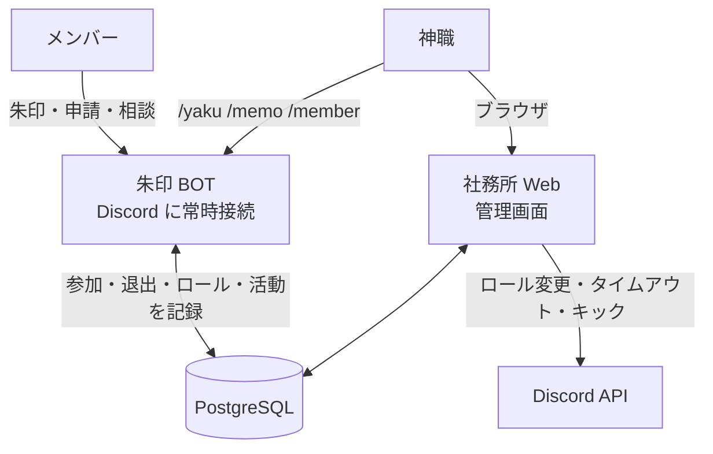

# 咲楽ノ宮 管理システム 設計書（社務所 Web）

> ステータス: 第4版（2026-09-25）・段階 A〜E すべて実装済み（ログイン・メンバー・厄・免罪符・銭・メモ・キック・申請・お参り期間・相談・設定）
> 朱印 BOT の設計は [design.md](design.md)、呼び名は [concept.md](concept.md)。

---

## 0. 概要

| 項目 | 内容 |
|---|---|
| 名前 | **社務所 Web**（しゃむしょウェブ） |
| 使う人 | **神職・宮司だけ**（Discord アカウントでログイン） |
| できること | メンバーの状況の確認・検索、警告（厄）、申し送りメモ、申請の承認、相談の対応、操作の記録 |
| Discord との関係 | よく使う操作（厄・メモ・メンバー情報）は Discord のコマンドでもできる。どちらで操作しても同じデータ |

---

## 1. 全体の構成


```mermaid
flowchart TB
    M[メンバー] -->|朱印・申請・相談| B
    S[神職] -->|/yaku /memo /member| B
    S -->|ブラウザ| W
    B[朱印 BOT<br/>Discord に常時接続] <-->|参加・退出・ロール・活動を記録| DB[(PostgreSQL)]
    W[社務所 Web<br/>管理画面] <--> DB
    W -->|ロール変更・タイムアウト・キック| D[Discord API]
```

- **BOT** はこれまでどおり Discord に常時接続し、メンバーの参加・退出・ロール・活動を DB に記録する。
- **社務所 Web** は DB を読んで画面を出す。厄やキックなど Discord に反映が必要な操作は、BOT のトークンを使って Discord の API を直接呼ぶ（BOT 本体を経由しない）。
- BOT と Web は**同じリポジトリ・同じ DB・同じ処理（services）**を使う。どちらから操作しても結果は同じ。

---

## 2. 権限

| できること | 🎐 神職 | ⛩ 宮司 |
|---|---|---|
| 管理画面を開く・メンバーを見る | ✅ | ✅ |
| 厄を付ける・祓う、メモを書く | ✅ | ✅ |
| 申請の承認・却下 | ✅ | ✅ |
| 相談の対応 | ✅（送った人は見えない） | ✅（緊急時のみ送った人を確認できる・確認したことは記録に残る） |
| タイムアウト・キック | ✅ | ✅ |
| **BAN・ご縁の手動調整・年齢区分の変更** | — | ✅ |
| **設定（格・昇格ライン・期間）** | — | ✅ |
| **掲示（#鳥居・#しきたり の文面）** | — | ✅ |
| **チャンネル（説明・書き込める／読むだけ）** | — | ✅ |
| **銭を送る・減らす（1 人・全員）** | — | ✅ |
| 推移（グラフ）を見る | ✅ | ✅ |
| 操作の記録を見る | ✅ | ✅ |

- ログインのたびに **Discord 上で今も神職・宮司ロールを持っているか**を確認する（外された人はすぐ入れなくなる）。
- すべての操作は「誰が・いつ・誰に・何を・理由」を**操作の記録**に残す。記録は消せない。

---

## 3. 画面

### 3.1 ログイン
「Discord でログイン」ボタン → Discord の認可画面 → 戻ってきたら神職・宮司ロールを確認して入室。

### 3.2 ホーム（今日の社務所）

```
┌ 今日の社務所 ───────────────────────────────┐
│ メンバー 1,284 人（今日 +12 / -3）  今日の朱印 186   │
│ 昇格 4 人                                          │
├──────────────────────────────────────┤
│ ⚠ 対応待ち                                          │
│   入鯖申請 7 件 ・ 宵参り申請 2 件 ・ 相談 1 件（未対応） │
│   お参り期間が終わった人 5 人                         │
├──────────────────────────────────────┤
│ 👹 厄年 3 人 ・ 厄あり 11 人                           │
│ 最近の操作: 〇〇（神職）が △△ に厄 +1 「DM での勧誘」…  │
└──────────────────────────────────────┘
```

### 3.3 メンバー一覧

| 機能 | 内容 |
|---|---|
| 検索 | 表示名・ユーザー名・ID |
| 絞り込み | 役職 / 年齢区分 / 宵参り / 厄あり・厄年 / お参り期間中 / **しばらく来ていない（N 日以上活動なし）** / 参加日の範囲 / 退出済み |
| 並べ替え | ご縁 / 参加日 / 最後の活動 / 厄 |
| 一覧の列 | アイコン・名前 / 役職 / ご縁 / 参加日 / 最後の活動 / 厄 / 印（🔞・メモあり） |
| 出力 | 絞り込んだ結果を CSV でダウンロード（宮司のみ） |

1 ページ 50 人。1000 人以上でもすぐ出るように、一覧は DB だけで作る（Discord に問い合わせない）。

### 3.4 メンバー詳細

```
┌ 🎋 世話役  さくら（@sakura_xx）  ID 1234… ─────────┐
│ 参加 2026/06/01（117 日） ・ 最後の活動 今日 23:41     │
│ 年齢区分 18 歳以上 ・ 🔞 宵参り ・ 厄 1（10/20 に祓われる）│
│ ご縁 142（総代まで 158） ・ 頂いた朱印 51 人 ・ 押した 63 人 │
├ タブ ──────────────────────────────────┤
│ [概要] [朱印] [活動] [厄] [メモ] [申請] [入退室] [記録]    │
├────────────────────────────────────────┤
│ 操作: [厄を付ける] [メモを書く] [タイムアウト] [キック]    │
│       [宵参りを外す] [BAN※] [ご縁調整※] [年齢区分※]  ※宮司 │
└────────────────────────────────────────┘
```

| タブ | 中身 |
|---|---|
| 概要 | 役職の履歴（いつ昇格したか）、ご縁の推移グラフ |
| 朱印 | 頂いた朱印・押した朱印の一覧（日時・格）、取り消し履歴 |
| 活動 | 日ごとの浮上（発言した日）・通話時間（発言の本文は保存しない） |
| 厄 | 付いた厄の一覧（理由・付けた神職・期限・祓われた日） |
| メモ | 神職どうしの申し送り（本人には見えない） |
| 申請 | 入鯖申請・宵参り申請の内容と結果 |
| 入退室 | 参加・退出・再参加の履歴 |
| 記録 | この人に対して行われた操作の記録 |

- 危ない操作（キック・BAN・宵参りを外す）は**理由の入力と確認画面**を必須にする。

### 3.5 厄（警告）

**ルール（オーナー決定・2026-09-25）**

| 状態 | 内容 |
|---|---|
| 厄 1 つ目 | **注意**。本人に DM で理由を知らせる（神職の名前は出さない）。👹厄年ロールが付く |
| 厄 2 つ目 | **BAN** |
| 解除 | **免罪符を購入すると厄が 1 つ祓われる**（自然には消えない） |
| 一発 BAN | 重大な違反は、厄を経ずに即 BAN |

一発 BAN にする違反（案）:
- 18 歳未満への恋愛・性的な目的での接触
- 個人情報の晒し（住所・電話番号・本名・顔写真など）
- 荒らし・レイド・スパムの大量投稿
- なりすまし・詐欺
- 違法な内容の投稿

| 画面 | 内容 |
|---|---|
| 厄の一覧 | 厄を持っている人（👹厄年）の一覧 |
| 厄を付ける | 相手・理由（定型文から選ぶ＋自由記入）。**2 つ目になる場合は「BAN になります」と確認画面を出してから実行** |
| 一発 BAN | 理由を上の一覧から選ぶ（＋自由記入）。確認画面を出してから実行 |
| お祓い | 免罪符による解除（自動）と、神職による取り消し（間違えて付けたときなど。理由必須） |

定型の理由（例）: 誹謗中傷 / 迷惑行為（通話） / 大人の話題を全年齢の場所で / スパム・宣伝 / その他

**免罪符（決定）**: 鯖内通貨「🪙銭」で購入。**1 人 1 回まで**。値段は考え中のため仮に 300（`config/guild.json` の `economy.menzaifuPrice` で変更）。本人が Discord で `/menzaifu` を使う。

### 3.5.1 銭（鯖内通貨）
- 通貨の名前は **銭**（🪙）。はじめは「花びら（🌸）」だった。更新のときの移行（`0030_currency_zeni`）で、設定の通貨の名前が花びらのままなら銭に、絵文字が 🌸 のままなら 🪙 にした（ほかの名前にしていれば変えない）。ショップの品の名前・説明の「花びら」も銭に、掲示の本文に直接書いた「花びら」は `{通貨}` にした。
- その後の最初の BOT の起動で、花びらで投稿済みの掲示を銭で出し直す（1 回だけ）。名前は「設定 → 通貨の名前」でいつでも変えられる（変えると投稿済みの掲示も書き換わる）。
- 掲示の差し込み `{おみくじの銭}`（前の名前 `{おみくじの花びら}` も使える）。

| 貯まり方 | 量（初期値・設定で変更可） |
|---|---|
| 通話（2 人以上いる通話。AFK・スピーカーミュート中は数えない） | 10 分ごとに 5、1 日 150 まで |
| 朱印を押す | 3（同じ相手とは最初の 1 回だけ） |
| 朱印を頂く | 5（同じ相手からは最初の 1 回だけ） |

| 使い道 | |
|---|---|
| 免罪符 | 厄を 1 つ祓う（1 人 1 回まで） |

- 残高は御朱印帳・`/menzaifu`・管理画面で見られる。出入りはすべて記録に残る。

### 3.6 申請（第 2 段階の BOT 機能と共通）
- 入鯖申請・宵参り申請の待ち行列。内容を見て **承認 / 却下 / 保留**。
- Discord の `#申請受付` のボタンと同じ処理。どちらで押しても片方に反映される。

### 3.7 相談
- `/soudan` で届いた匿名相談の一覧。状態（未対応 / 対応中 / 完了）と担当の神職を付けられる。
- 神職には送った人が表示されない。宮司が「送った人を確認」を押すと表示され、そのことが記録に残る。
- 返信は BOT から相談者へ匿名のまま DM で届ける。

### 3.8 操作の記録
- すべての操作（Web・Discord のコマンドどちらも）を時系列で。操作した人・相手・種類・期間で絞り込み。
- 記録は画面から消せない。

### 3.9 設定（宮司のみ）
- 役職ごとの格・昇格ライン、お参り期間の日数、厄の期限・しきい値。
- 変えた内容も記録に残る。

### 3.10 掲示（宮司のみ）
- `#鳥居`・`#しきたり` などに **BOT が投稿する文面** を管理画面で書く・直す。「反映」で Discord のメッセージを書き換える（未投稿なら投稿）。
- 本文の `{免罪符の値段}` `{氏子のご縁}` `{役職一覧}` などは今の設定の値に、`{#しきたり}` はチャンネルへのリンクに置き換わる。**設定を変えると、投稿済みの掲示の数字も自動で書き換わる**（本文を編集中で未反映のものはそのまま）。
- 「標準の文面を入れる」で、ようこそ・ルール・厄と BAN・朱印とご縁・銭と相談・用語集が入る（`src/services/noticeDefaults.ts`）。
- 並べ替えたり途中に足したりしたときは「投稿し直す」（そのチャンネルの掲示を全部消して順番どおりに投稿）。Discord 側で消されていたら、反映のときに新しく投稿する。
- 見せ方は「カード」（埋め込み・朱色の線で 1 つずつ区切られる。4096 文字まで）か「普通のメッセージ」（2000 文字まで）。標準はカード。追加・編集・反映・削除は記録に残る。
- 「📌 ピン留めする」を選んだ掲示は、投稿するとピン留めする（話が流れても 📌 から読める）。BOT のロールに「メッセージの管理」（または「メッセージをピン留め」）権限が要る。できなかったときは投稿だけして知らせ、「未反映」のまま残る。
- 「⬇ いちばん下に表示し続ける」を選んだ掲示は、そのチャンネルに誰かが書き込むと、3 秒ほどで BOT が消して下に出し直す（続けて書き込まれている間は待つ。投稿済みの本文で。ピン留めはしない）。#絵馬-男性・#絵馬-女性 のひな形は標準でこれ。
- 「チャンネルの案内を入れる」で、#絵馬・#境内・#手水舎・#写真館・#おみくじ・#縁日・#屋台・#宿帳・#宵宮・#御神酒処 に **使い方**（ピン留め）、#しきたり の最後に全チャンネルの一覧 **チャンネル案内** が入る。同じチャンネルに同じタイトルがあれば入れないので、何度押しても増えない。
- チャンネルは名前で探す。「🪧｜絵馬」のように見た目を変えた名前でも、飾りを除いて同じなら見つける（`{#絵馬}` も同じ）。

### 3.12 推移（グラフ）
- 「推移」ページ: サーバーにいる人数（折れ線）、入った人・抜けた人（上下の棒）、朱印・通話時間・発言の数。30 日（1 日ごと）・3 か月（1 週ごと）・1 年（1 か月ごと）を切り替えられる。日付は日本時間。
- 人数はメンバーの「入った日・抜けた日」から数え直す（BOT を除く。入り直した人は最後に入った日で数える）。棒にマウスを乗せると値が出る。「表で見る」で数字の一覧。
- グラフはサーバーで SVG を作る（JavaScript なし）。色は `style.css` の `--series-1`・`--series-2`（ライト・ダークとも色覚の多様性を確かめ済み）。

### 3.13 銭を送る・減らす（宮司のみ）
- メンバーのページの「銭を送る・減らす」: 枚数（1〜100,000）と理由（必須）。送るときは本人に DM で知らせられる（理由も載る）。減らすのは残高まで。
- 設定ページの「今いる人みんなに送る」: 役職のある今いる人（BOT・退出した人を除く）全員に同じ枚数。DM は送らない。
- 画面を開くたびに番号を作り、同じ番号では 1 回しか送らない（二度押し・再送信で 2 回送られない）。全員に送るときは 1 つのトランザクションで、途中で失敗したら誰にも送らない。
- 銭の出入りに「運営から」「運営が減らした」と理由が残り、操作の記録にも残る（`coins.grant` / `coins.take` / `coins.grant_all`）。

### 3.17 コアタイム
- 標準は金曜・土曜の 21:00〜23:00（日本時間）。この間の通話は、10 分ごとの銭が `coreTimePercent`%（標準 150% ＝ 5 枚 → 8 枚。端数は四捨五入）。増えた分は 1 日の上限に数えず、上限に届いていてももらえる。
- `#境内` に、前日の 21 時（`noticeDayBefore`）と、始まる 60 分前（`noticeMinutesBefore`）に予告。BOT が止まっていても 30 分までなら遅れて出す。同じ予告は 1 回だけ。
- 曜日（1 曜日に 1 つ）・時間・倍率・予告は「設定」で変える。掲示で `{コアタイム}` `{コアタイム倍率}` が使える。

### 3.18 宵宮と Discord の年齢制限
- 宵宮は、宵参り申請を運営が承認した人だけが見られる（ロール）。Discord の年齢制限（Discord の年齢確認）は付けない（2026-09 に変えた。セットアップも付けない）。
- 前に付けたものは「チャンネル」ページの「🔞 Discord の年齢制限」で外す（テキスト・通話。「➕ 宵宮の部屋をひらく」を外すと、そこから作られる部屋も付かない）。
- 年齢制限を付けない部屋では、性的な画像・動画・露骨な話は出さない（Discord のルール）。出す部屋を作るなら、その部屋だけ年齢制限を付ける。

### 3.19 宿坊・宵宮の部屋の種類と値段
- 「➕ 宿坊をひらく」「➕ 宵宮の部屋をひらく」でできた部屋のチャットに、案内（値段）と「⚙ 部屋の設定」ボタンを出す（縁側・屋台などには出さない）。ボタンを押すと、**作った本人にだけ**設定のパネルが出る（ほかの人が押すと断る）。
  - パネル: 📝 チャンネル名（Discord の決まりで 10 分に 2 回まで）／💬 ステータス（通話の下に出る一言）／👥 人数制限（0〜99）／➕ 入室許可者を追加／🔒 部屋の種類を選ぶ／✖️ 閉じる。変えるとパネルに「✅ 〜にしました」。
  - **部屋の種類（公開・招待限定・シークレット・ツーショット）は 1 回だけ選べる**。選んだあとは切り替えられない（選ばなければ公開のまま）。
  - **👑 権限を譲渡**: 今その部屋にいる人（BOT・自分をのぞく）から選ぶ。前の部屋主は入室許可者に入る。値段のある部屋は「これからは相手が払う」（その時間以降の部屋主の分は新しい部屋主）か「部屋代は自分が持つ」（前の部屋主が、抜けたあとも部屋主の分を払う。銭の出入りの詳細に `for`）を選ぶ。部屋主以外の人は、今までどおり自分の分を払う。
- 「➕ 宿坊をひらく」（once: ひらくたびに 1 回）「➕ 宵宮の部屋をひらく」（hourly: 1 時間ごと）は銭がかかる。
- 種類: 🔓 公開 ／ 🔒 招待限定（ロールは見えるが入れない）／ 🤫 シークレット（ロールには見えない）／ 💞 ツーショット（2 人まで・招待は 1 人）。招待限定などには運営のロールも入れない（ただし Discord の「管理者」権限を持つロールは、Discord の決まりでどの部屋にも入れる）。
- 人数の上限（2〜20・上限なし）と、招待（最大 10 人ずつ。招待された人に部屋のチャットで通知）。
- 値段は「設定」の表（0 で無料。はじめは全部 0）。once（宿坊）: 作った人が、ひらくときに公開の値段、種類を変えたら差額。hourly（宵宮）: 入っている人それぞれが、入ったときに最初の 1 時間、以後 1 時間ごと（払ってある間は出入りしても払わない。足りなければ入れない。途中で払えなくなると注意して 5 分後に通話から抜けてもらう）。種類を変えると、作った人が今の 1 時間の差額、ほかの人は次の 1 時間から新しい値段。銭の出入りは「通話部屋」。
- 入口の払い方は設定ファイルの `tempVoice.hubs[].plan`（なければ名前から: 宿坊 → once、🍶・宵宮 → hourly、ほか → なし）。
- BOT に「チャンネルの管理」「ロールの管理」の権限が要る。

### 3.20 性別と、自己紹介を書いてから入る流れ
- 入鯖申請: 年齢区分 → 性別（男性・女性）→ フォーム。申請カード・管理画面に性別が出る。
- 承認すると、性別のロール（♂ 男性・♀ 女性）と 📝 絵馬待ち を付け、DM で自分の絵馬（女性は `#絵馬-女性`、男性は `#絵馬-男性`）のリンクを送る。絵馬待ちは自己紹介のチャンネルだけ見えて書ける。
- 自分の絵馬に 10 文字以上書くと、絵馬待ちを外して 🔰参拝者 にし、お参り期間を始め、初期配布を渡し、ようこその DM を送る（🌸 のリアクション）。ちがう絵馬に書いたら消して DM で案内、短すぎたらその場で案内（20 秒で消える）。
- 絵馬待ちのロールがない（セットアップ前）ときは、これまでどおり承認ですぐ参拝者（DM に自己紹介のリンクを添える）。
- 前からいる人: `/パネル 性別` のボタンで選ぶ（1 回だけ。変えるのは神職が Discord でロールを付け替える）。
- 設定ファイル: `roles.male`・`roles.female`・`roles.emaPending`（セットアップが書く）。

### 3.21 ロール（宮司のみ）
- 一覧: Discord のロール（上から順）・このサーバーでの役目（役職・お守り・色守り・性別 など。設定ファイルから）・持っている人数（今いる人・BOT を除く）・気をつける権限（管理者・BAN・キック・ロールの管理 など）。
- ロールを開くと: 権限をグループごとのチェックで確認・変更（管理画面にない権限はそのまま残す）、名前・色・メンバー一覧で分けて表示・誰でも @ で呼べる、持っている人の一覧。@everyone は権限だけ。
- 「管理者」を新しく付けるときは確認のチェックが要る。BOT のロール以上のロールと、BOT などの自動のロールは変えられない（🔒。Discord のサーバー設定から）。
- 変えたことは記録に残る（`role.update`。足した・外した権限の名前）。BOT に「ロールの管理」権限が要る。
- 一覧の上の「@ で呼べるようにする」で、すべてのロールの「誰でも @ で呼べる」をまとめて ON／OFF（🔒 と @everyone はのぞく。確認のチェックが要る。記録は `role.mentionable_all`）。セットアップが新しく作るロールは標準で ON。
- **ニックネームを自分で変えられないように**: 「ロール」の「🏷 ニックネームは自分で変えられないように」で、@everyone とロールから「ニックネームの変更」を外す（🔒 のロール・持ち主・管理者・ニックネームの管理を持つ人はのぞく。記録は `role.nickname_lock`）。変えるときは、メンバーのページの「ニックネームを変える」（空で元の名前。自分より上の運営は変えられない。記録は `member.nickname`）。BOT に「ニックネームの管理」が要る。
- **作る**: 一覧の下の「➕ ロールを作る」（名前・色・分けて表示・@ で呼べる）。権限はなしで作り、開いたページで付ける。いちばん下（@everyone のすぐ上）にできる。記録は `role.create`。
- **消す**: ロールのページの「🗑 ロールを消す」で名前を入力。役職・厄年・宵参り・性別・絵馬待ち・開業・DM とフレンド・お守り・色守り・称号・授与所の品物のロールと 🔒 のロールは消せない。記録は `role.delete`。
- チャンネルごとの権限（見える範囲・読むだけ）は「チャンネル」ページとセットアップで決める。

### 3.22 市場（開業権利）
- 本物のお金は扱わない。銭だけ。PayPay などの外での支払い・性的なものは、しきたりで禁止（出品のときにも表示）。
- 授与品「🏪 開業権利」（標準 3000 枚・ずっと。値段はショップで変える）を受けると 🏪 開業 ロールが付き、`#市場` の「出品する」から出品できる。
- 種類: 🎨 イラスト ／ 🎤 歌・音声 ／ 🛠 作成物 ／ 📞 通話（雑談・寝落ち。**18 歳以上どうしだけ**）／ 📦 その他。題名 60 文字・説明 1000 文字・値段 1〜1,000,000 枚。
- 買うと、買った人の銭を宮が預かり、`#市場` に買った人と売った人だけのスレッドを作る（売った人には DM）。
  - 買った人が「受け取った」→ 売った人に値段から手数料（「設定」の `feePercent`。標準 10%。切り捨て）を引いた分を渡す。手数料の分は誰にも渡さない。
  - 何も押さなければ `autoReleaseDays`（標準 7 日）で売った人に渡す。
  - 「問題あり」→ 期限で渡さなくなり、ログのチャンネルに通知。社務所Web の「市場」で運営が **返金**（買った人に全額）か **完了**（売った人へ）を決める。
- 出品した人と運営は、出品カードの「受付終了」で受付を終えられる（社務所Web の「取り下げ」も同じ。カードも受付終了にする）。
- 記録: `market.buy` / `market.release` / `market.refund` / `market.dispute` / `market.close`。銭の出入りは「市場で買った」「市場で売れた」「市場の返金」。
- `/パネル 市場` で「出品する」ボタンを置き直せる。設定ファイル: `channels.market`・`roles.merchant`・`shop.license`（セットアップが書く）。

### 3.23 セットアップとチャンネルの並び
- **2026-09〜 標準はチャンネルの形を固定**: セットアップは、今あるカテゴリ・チャンネルを（飾りを除いた名前・設定ファイルの ID で）探して ID を書くだけ。**作らない・移さない・名前を変えない・消さない**。ほかのカテゴリへ動かしたものも、同じ名前が 1 つだけなら使う。ロールは足りなければ作る。
- 配置にあってサーバーにないものは「作らなかったもの」として表示する。使いたいときは Discord で同じ名前のチャンネルを自分で作ってから、もう一度セットアップ（例: `お出迎え`）。
- 名前を変えて見つからなくなった通話部屋の入口・募集ボタンも、設定ファイルからは消さない。
- 配置どおりに作る・移す・片付ける・並べ直すときだけ `--change-channels` を付ける（`--tidy`・`--reorder` もこれと一緒のときだけ効く）。以下はそのときの動き:
- セットアップは、今のサーバーのチャンネル・カテゴリを読み取り、同じ名前（飾りを除いた名前）のものは作り直さない（重複しない）。
- **今の並び順は変えない**。新しく作るもの・移すものだけ、設計で 1 つ前にあるものの **すぐ後ろ** に入れる（例: `#市場` は `#おみくじ` の後ろ）。
- 設計どおりに全部並べ直したいときだけ `--reorder` を付ける（`docker compose run --rm setup --guild <ID> --change-channels --tidy --reorder`）。

### 3.24 DM・フレンド追加の OK／要相談／NG
- ロール 6 つ: 📩 DM OK ／ 💬 DM 要相談 ／ 🚫 DM NG ／ 🤝 フレンド OK ／ 💬 フレンド 要相談 ／ 🚫 フレンド NG（セットアップが作る。色なし）。名前を押すとプロフィールに出る。
- 入鯖申請: 年齢区分 → 性別 → DM → フレンド追加 → フォーム。申請カード・社務所Web に「DM: OK ・ フレンド追加: NG」のように出て、承認でロールを付ける。
- あとから: `#授与所` の「DM・フレンド追加」パネル（`/パネル dmとフレンド`）で押し直すと、同じ種類のほかのロールを外して付け替える。
- ロールがない（セットアップ前）ときは、申請でも聞かない。しきたりに「NG の人にはしない・要相談は一声かけてから」を足した。
- 設定ファイル: `roles.contact.dm.{ok,ask,ng}`・`roles.contact.friend.{ok,ask,ng}`（セットアップが書く）。

### 3.25 はじめて入った人向け
- **入ったときの案内 DM**: サーバーに入ると、BOT が「① しきたり ② 社務所で申請 ③ 承認を待つ ④ 絵馬に自己紹介」をリンク付きで DM（BOT・もう参拝者以上の人には送らない）。
- **申請中の「今どこ」**: 申請のボタンに「入鯖申請 ― ステップ 1/5：年齢」のように出す（DM・フレンドのロールがなければ 3 ステップ）。受け付けたあとに「次は」を案内。
- **#お出迎え**（🌳 境内。セットアップが作る。`channels.welcome`）: 🔰参拝者 になったら「🌸 ○○ さんが参拝しました！」と自己紹介のリンクを出す（通知は飛ばさない）。
- **はじめての参拝**（`/はじめて`）: おみくじを引く・だれかに朱印を押す・通話に合わせて 10 分・お守りを受ける（お守りのロールがあるとき）。本人にだけ進み具合を見せる。
  - 全部できたら、お祝いの銭（「設定」の `onboardingReward`。標準 300 枚・1 人 1 回。銭の出入りは「はじめての参拝のお祝い」）。
  - `/はじめて` を打ったとき、または BOT が 10 分ごとに（入って 60 日以内の参拝者以上）確かめて渡し、DM で知らせる。
  - ようこその DM に `/はじめて` の案内を足した。

### 3.26 招待のお礼
- 入鯖申請の途中（フォームの前）で「招待してくれた人」をメンバーから 1 人選ぶ（いなければ「招待してくれた人はいない」）。自分・BOT は選べない。申請カード・社務所Web の申請とメンバー詳細に出る（メンバー詳細には「招待した人数」も）。
- 承認したときに記録し（招待された人 1 人につき 1 件。入り直しても変えない）、招待された人が 🔰参拝者 になったときに、招待した人へお礼（「設定」の `inviteReward`。標準 500 枚）と DM。1 人につき 1 回だけ。招待した人が抜けていたら渡さない。
- **浮上ボーナス**: 招待された人が参拝者になってから `inviteActiveDays`（標準 30 日）の間、その人が浮上した日（発言 1 回以上か、通話 10 分以上）ごとに、招待した人へ `inviteActiveReward`（標準 20 枚）。1 日 1 回・10 分ごとに確かめる。DM は送らない（銭の出入りに「招待した人の浮上ボーナス」）。
- 0 にするとなし。サブ垢での稼ぎを防ぐため、申請は神職が確認してから承認してください。
- **招待リンクは BOT だけ**: `/招待リンク`（参拝者以上）で、その人専用のリンク（期限なし・#鳥居 に入る。`channels.entrance`、なければ名前で探す）を渡す。何度打っても同じリンク。
  - だれかが入ったら、#鳥居 の招待リンクの使われた回数を比べて、増えたのが 1 つだけならその持ち主の招待として記録する（同時に入ったなど分からないときは記録しない）。BOT が止まっていた間に入った人は分からない。
  - リンクで入った人には、申請の「招待してくれた人」を聞かない。申請カードに「（招待リンク）」、#お出迎え に「🤝 招待: ○○ さん」。
  - 社務所Web の「ロール」→「招待リンクを BOT だけにする」で、@everyone とロールから「招待を作成」を外す（🔒 のロール・持ち主・管理者はのぞく）。前に人が作ったリンクは、Discord のサーバー設定 →「招待」から消す。
  - BOT のロールに「招待を作成」と、#鳥居 での「チャンネルの管理」（リンクの使われた回数を見るため）が要る。

### 3.27 自動で増える通話（大きな縁側・小さな縁側など）
- 「設定 → 🔊 自動で増える通話」で、名前（番号の前。例: `大きな縁側`）・最低の数（標準 3）・最大の数（標準 20）を決める（10 個まで）。名前を空にすると止める。
- 「大きな縁側 1」「大きな縁側 2」…のように、名前の後ろに番号を付けた通話をまとめて見る（飾り・空白・全角数字も同じとみなす）。
- 全部に人がいたら、いちばん大きい番号のすぐ下に次の番号を作る（いちばん大きい番号の通話と同じ設定をコピー。全角の番号なら全角）。最低の数に足りないときも作る。
- 空きが 2 つ以上になったら、最低の数より大きい番号の空いている通話を、大きい番号から消す（空きは 1 つ残す）。BOT の数は数えない。
- 出入りのあと 1.5 秒待ってから確かめる（念のため 1 分ごとにも）。BOT に「チャンネルの管理」が要る。

### 3.28 プロフィール（御朱印帳）
- 右クリック（スマホは長押し）→「アプリ」→「プロフィール」だけ（前の「朱印を押す」「御朱印帳を見る」は登録しない）。`/御朱印帳` でも同じ。
- 出すもの: アイコン（右上）・Discord のバナー（あれば大きく）、役職・ご縁、性別・DM・フレンド（ロールから）、称号（授与品）、参拝した日（サーバーに入った日）、自己紹介（#絵馬-男性・#絵馬-女性 のいちばん新しい書き込み。本文のはじめとリンク）、頂いた・押した朱印。自分のを自分だけに見えるように開いたときだけ銭の残高。
- 「🌸 朱印を押す」ボタンで朱印を押す（自分のプロフィールには出さない）。
- 自己紹介は、BOT が書き込みを見たときに覚える（起動したときに、絵馬のチャンネルの最近 100 件も読む）。BOT が本文を読めない設定（Message Content がオフ）のときは、リンクだけ。

### 3.29 人がいなくなった通話のチャットを消す
- 通話チャンネルの中のチャットは、最後の人（BOT をのぞく）が抜けてから「設定 → 💬 通話のチャット」の分（標準 1 分）たっても、まだだれもいなければ消す。その間にだれか入れば消さない。ピン留めは残す。
- 14 日以内の書き込みはまとめて消す。それより古いものは 1 件ずつ（1 回に 50 件まで。残りは次に空になったときに）。
- BOT が起動したときも、だれもいない通話に書き込みがあれば片付ける。
- 「人がいなくなった通話のチャットを消す」のチェックを外すと止まる。BOT に「メッセージの管理」「メッセージ履歴を読む」の権限が要る。

### 3.30 通話の記録（浮上時間）
- BOT が 1 分ごとに、AFK 以外の通話にいる人（BOT をのぞく。1 人でも）を記録する: だれがどの通話に何分（日ごと）、だれとだれが同じ通話に何分（日ごと。1 つの通話で 25 人まで）、通話チャンネルの名前・カテゴリ（自分の通話部屋は作った人・入口・種類も。消えたあとも残す）。
- 社務所Web の「通話の記録」（運営）: 期間（7・30・90 日）ごとに
  - 日ごとの通話時間のグラフ（カテゴリを選ぶとその場所だけ）。
  - カテゴリ（エリア）ごとの、のべ時間と割合。横棒グラフでも。カテゴリを押すと「その場所が多い順」（その人の中の割合も。例: 宵宮に長くいる人）。
  - 人ごとの浮上時間（合計・多い場所）。
  - よくいっしょにいる 2 人。
  - 自分の通話部屋（宿坊・宵宮・縁側など）: ひらいた時刻・部屋・入口・作った人・種類・ひらいていた時間・人数・のべ時間・払われた部屋代。
- メンバーのページに「通話の記録（30 日）」: 合計、場所ごと、よくいた通話、よくいっしょにいる人。
- 通話の銭（10 分ごと）とコアタイム、宵宮の 1 時間ごとの部屋代は、今までどおり別に数えている（この記録は見るためのもの）。

### 3.31 呼び鈴（運営などを呼ぶ）
- 「設定 → 🔔 呼び鈴」で決める: 知らせ先のチャンネル（なければ #記録）・続けて鳴らせない分（標準 5 分）・呼んだロールに通知を飛ばすか・**呼べるロール**（なにも選ばなければ運営の役職）・**ボタンをいつもいちばん下に置くチャンネル**（例: 🌳 境内 のチャンネル）。
- 選んだチャンネルには、いちばん下に小さな「🔔 呼び鈴」ボタンを置く（話が 1 分落ち着いたら置き直し、前のものは消す。10 分ごとにも確かめる）。`/パネル 呼び鈴` で説明つきのパネルも置ける。`/呼び鈴` でも同じ。
- 押すと、呼ぶロールを選ぶ（1 つだけならすぐ）→ どうしたかを書く（任意）→ 知らせ先に、だれが・どこで（そのとき入っていた通話も）・だれを・内容のカード。選んだロールに @ で通知。
- 呼ばれたロールの人か神職・宮司が「🏃 対応する」を押すと、呼んだ人に DM。「✅ 対応済み」で閉じる（記録は `bell.take` / `bell.done`）。待っている呼び鈴があるときと、鳴らしてから決めた分は続けて鳴らせない。

### 3.32 物御籤（銭で引くくじ）
- **銭だけ**で引く（本物のお金は扱わない）。標準は 1 回 500 枚・10 連 5,000 枚。`/物御籤` か、`/パネル 物御籤` で置いたボタン（#おみくじ・#授与所 向け）から。押すと本人にだけ、値段・出る割合・中身・天井まであと何回・持っている券が出て、そこから「1 回引く」「10 連」。
- 運勢（🌸大吉・🏮中吉・🎐小吉・🍡吉）を出やすさで決めて、その運勢の **中身** から重みで 1 つ出す。中身は運勢ごとにいくつでも足せる: **限定ロール**（物御籤だけの色守り・称号など）・**券**・**銭**・**ショップの品**（ロールの品: 色守り・称号・開業権利など。ショップで止めている品も出せる）。
- 標準（最初に 1 回だけ作る中身）: 大吉 3%（限定ロール。全部持っていたら 🎫部屋代無料券 ×3）／ 中吉 12%（🎫部屋代無料券 ×1）／ 小吉 25%（🏪市場の手数料なし券 ×1）／ 吉 60%（📌絵馬のピン留め券 ×1）。
- 持っているロール（限定ロール・ずっと持つショップの品）は出ない。期限つきのショップの品（色守り 30 日など）は、持っていれば期限が延びる。同じ組の色は前の色を外す。
- 中身のない運勢と、出やすさ 0 の運勢は出ない。出せる中身が 1 つもなければ引けない（銭は減らない）。10 連の途中で出せる中身がなくなったら、残りの回数分は払い戻す（`gacha_refund`）。
- **天井**: 大吉が出ないまま 30 回目は必ず大吉（1 人ごとに数え、大吉が出たら数え直し）。
- 結果は本人にだけ。**大吉は #おみくじ でお祝い**（名前と授かったもの）。
- **券**は使う場面で自動で使う（プロフィールを自分で開くと「🎟 券」に枚数が出る）:
  - 🎫部屋代無料券: 宿坊はその部屋の部屋代（ひらくとき・種類を選ぶとき。1 枚でその部屋は全部無料）、宵宮は 1 時間分。どの種類の部屋でも使える。
  - **部屋の種類ごとの券**（🔓公開・🔒招待限定・🤫シークレット・💞ツーショット それぞれ）: 🎫無料券（1 回無料）・🎟半額券（1 回半額）・📅一日券（最初に払うときに使い始めて、24 時間その種類の部屋代が無料）。払うときは、使い始めた一日券 → その種類の無料券 → どの種類でも使える無料券 → その種類の一日券 → その種類の半額券 → 銭 の順に使う。半額でも銭が足りなければ券は使わない。
  - 🏷ショップ 10%・30%・50% 割引券: 授与所で品を選ぶと、持っている割引券ごとに「🏷 30%引きで ○ 枚」のボタンが出る（色守り・称号・開業権利・おみくじもう 1 回・絵馬の奉納。免罪符・贈り物・花吹雪には使えない）。払い戻すときは券も戻る。
  - 📌絵馬のピン留め券: 授与所の「絵馬の奉納」が無料（ピン留めに失敗したら券を戻す）。
  - 🏪市場の手数料なし券: 市場で売れて受け取るとき、手数料を引かない。
- **社務所Web の「🎁 物御籤」ページで変える（宮司）**:
  - 基本: **物御籤を止める／始める（ON/OFF）**・1 回の値段・天井（0 でなし）・運勢ごとの出やすさ（合計が 100 でなくてもよい）。
  - 中身: 運勢ごとの一覧に、全体で出る確率が出る。**枚数・重み**（同じ運勢の中での出やすさ）・**ほかが出せないときだけ**（ロールを全部持っている人向けの代わり）を変えて「保存」、**「OFF にする／ON にする」**、「削除」。
  - 中身を足す: 運勢・種類（限定ロール／券／銭／ショップの品）・ロールや券や品・枚数・重み。
  - 変えたことは「記録」に残る（`gacha.settings`・`gacha.prize_add` など）。「設定」ページの物御籤の欄は、このページへの案内だけ。
- 限定ロールは Discord のロールを先に作っておき（「ロール」ページで作れる。BOT のロールより下に置く）、中身に足す。持っている限定ロールはプロフィールの「称号」に出る。
- 同じページ（神職も見られる）: 引かれた回数・引いた人・使われた銭・運勢ごとの決めた割合と実際に出た割合・限定ロール・最近の大吉・よく引いている人（大吉の回数・天井まであと何回）・券を持っている人・最近の結果（100 件）。
- メンバーのページの「🎁 物御籤」: 引いた回数・天井まで・持っている券・最近の結果。**宮司は券を渡す・減らす**ことができる（1〜100 枚・理由が必須。減らすのは持っている分まで。渡したときは DM で知らせる。記録は `tickets.grant` / `tickets.take`）。
- 記録: `gacha_prizes`（中身）、`gacha_draws`（引いた 1 回ずつ）、`gacha_state`（天井の回数）、`tickets`（券の枚数）。銭は `gacha`（払った）・`gacha_prize`（中身の銭）・`gacha_refund`（払い戻し）。

### 3.33 🧭 案内待ち（参加時の質問を終えた人）
- Discord の **参加時の質問（サーバー設定 →「オンボーディング」）** を終えた人に、BOT が 🧭 案内待ち を付ける（ルールの同意〔メンバー審査〕だけのサーバーでは、同意したとき）。
- 入鯖申請が承認されて次の段階（📝 絵馬待ち・役職）に進んだら、BOT が自動で外す。もう役職がある人・BOT には付けない。
- BOT が止まっていた間の分も、起動したときに合わせる。
- ロールは セットアップで作る「🧭 案内待ち」（`roles.guidePending`）。設定ファイルになければ、名前に「案内待ち」を含むロールを使う（社務所Web の「ロール」で作ってもよい）。どちらもなければ何もしない。BOT のロールより下に置くこと。
- 目印だけのロールで、見える範囲は変えない（見える範囲を変えたいときは「チャンネル」で）。

### 3.16 通話からプロフィール（通話のチャット）
- 通話のチャットのいちばん下に、いつも「📕 この通話の人のプロフィールを見る」を出す。通話に入った人がいたらすぐ、チャットに書き込みがあったら（BOT の書き込みも）15 秒に 1 回まで出し直す（すでにいちばん下なら出さない。前のものは消す。このカード自身の書き込みでは出し直さない）。AFK・「➕ ○○をひらく」・数えない通話には出さない。
- ボタンを押すと、今同じ通話にいる人（BOT と自分を除く・20 人まで）がボタンで並ぶ（本人にだけ見える）。押すとその人のプロフィールが出て、「🌸 朱印を押す」で朱印を押せる。朱印を押した人は ✅。

### 3.15 メンバー紹介（🪧 絵馬殿）
- カテゴリ「🪧 絵馬殿」: `#絵馬-男性`・`#絵馬-女性`（自己紹介。いちばん下にひな形）、`#運営紹介`（宮司・神職だけ書ける）、`#アイコン紹介`。自己紹介に御朱印帳ボタンは付けない（2026-09 にやめた）。
- 前の版の `#絵馬`（📜 掲示）は、セットアップで書き込みはそのまま絵馬殿へ移し、名前を `絵馬-男性` にする（「🪧｜絵馬」のような飾りは残す）。移したあとに自分で動かしたものは戻さない。
- 設定ファイルの `channels.ema`（男性）・`channels.emaFemale`・`channels.staffIntro`。授与品「絵馬の奉納」は、この 3 つのうちいちばん新しい自分の投稿をピン留めする。
- 片付け（--tidy）は、人の書き込みがあるチャンネルは消さない。

### 3.14 ブースト（奉納）のお礼と特典
- お金（銭）は渡さない（2026-09 にやめた）。
- ブースト 1 回ごとに: `#慶事` にお知らせ（通知は飛ばない）、本人に DM（特典の案内）。
  - 1 人が何回ブーストしているかは BOT に分からないので、Discord がシステムメッセージチャンネルに出す「ブーストしました」のメッセージ 1 件ごとに数える（同じメッセージでは 2 回出さない。BOT が止まっていた間の分は起動時に 1 日分読み直す）。
  - サーバー設定で「サーバーがブーストされた時にメッセージを送信する」が OFF だと、1 人が始めたときに 1 回。
- `#番付` に「🏮 奉納板」（今奉納してくれている人・いつから・ブーストの回数）を貼り、10 分ごとに書き換える。
- 特典（奉納している間。お金・銭は渡さない）:
  - 🏮 奉納限定の授与品: ショップの品物に「奉納限定」を付けられる（管理画面のショップ）。最初からあるのは色守り「金色」・称号「奉納者」（0 枚・奉納している間）。奉納をやめると、奉納限定のロールは BOT が外す（買って 15 分は外さない）。ほかの人には「奉納している方だけ」と見えて受けられない。
  - 授与品の割引（標準 20%。何回ブーストしても同じ。免罪符・贈り物はのぞく）。
  - 「絵馬の奉納」（自己紹介のピン留め）が無料。
  - 宿坊・宵宮の部屋代が割引（設定の「奉納している人の部屋代の割引」。標準 100% ＝ 無料）。
- お知らせと DM の文面・割引は「設定」で変える。
- Discord が自動で付ける「Server Booster」ロールは、サーバー設定 → ロールで名前（例: 🏮 奉納者）と色を変えられる。

### 3.11 チャンネル（宮司のみ）
- チャンネル・カテゴリ・通話の **名前**（BOT は ID で覚えているので動きは変わらない。掲示の `{#…}` は飾りを除いて同じ名前なら見つかる）。
- テキストチャンネルごとに、**説明（チャンネルの上に出るトピック）** と **書き込める／読むだけ** を変えられる。
- 読むだけ = みんな（@everyone）と一般の役職はメッセージ・スレッドを送れない。**リアクションは付けられる**。神職・宮司と BOT は書ける。見える範囲は変わらない。
- 変えたことは記録に残る（`channel.update`）。BOT のロールに「チャンネルの管理」「ロールの管理」権限が要る。
- **作る**（ページのいちばん下）: テキスト・通話・カテゴリ、名前、入れるカテゴリ、説明、読むだけ。**見える範囲**: カテゴリと同じ／みんな（申請前の人も）／参拝者以上／**プライベート（選んだロールだけ）**／運営だけ／🔞 宵参りの人だけ。どれでも神職・宮司と BOT は見られる。記録は `channel.create`。
- **並べ替え**: ▲▼ で同じ仲間（カテゴリどうし・同じカテゴリのテキスト・同じカテゴリの通話）の中で 1 つずつ入れ替える。チャンネル・通話は「移す」でほかのカテゴリ（またはカテゴリなし）のいちばん下へ。「移した先の権限に合わせる」にチェックすると、見える範囲も移した先のカテゴリと同じになる（しなければ今の権限のまま）。記録は `channel.move`。
- **通話の人数の上限**: 通話ごとに 0〜99（0 でなし）。作るときにも決められる。
- **消す**: 各チャンネル・カテゴリの「🗑 消す」で、確認のため名前をそのまま入力。中の書き込みも消えて戻せない。BOT が使っているもの（設定ファイルの ID・通話部屋の入口・募集ボタン）と、中にチャンネルがあるカテゴリは消せない。記録は `channel.delete`。

---

## 4. Discord のコマンド（管理用）

神職だけが使える。結果は本人だけに表示（エフェメラル）。

| コマンド | 内容 |
|---|---|
| `/member @相手` | 役職・ご縁・参加日・最後の活動・厄・最新のメモを表示。［管理画面で開く］ボタン付き |
| `/yaku add @相手 数 理由` | 厄を付ける |
| `/yaku harai @相手 理由` | お祓い（厄を解除） |
| `/yaku list [@相手]` | 厄の一覧 |
| `/memo @相手 内容` | 申し送りメモを書く |
| 右クリック →「アプリ」→「社務所で開く」 | その人の管理画面ページへのリンクを表示 |

---

## 5. 記録するデータ

朱印 BOT の `shuin` テーブルに加えて、以下を追加する。

| テーブル | 中身 | 書く人 |
|---|---|---|
| `members` | ID・表示名・アイコン・ロール・参加日・退出日・年齢区分・宵参り | BOT（参加・退出・ロール変更を同期、起動時に全員分を同期） |
| `member_events` | 参加・退出・再参加・昇格の履歴 | BOT |
| `activity_daily` | 日ごとの発言数・通話時間（本文は保存しない） | BOT |
| `yaku` | 厄（数・理由・付けた人・期限・祓った日・祓った人） | Web / BOT |
| `memos` | 申し送りメモ | Web / BOT |
| `goen_adjust` | ご縁の手動調整 | Web（宮司） |
| `applications` | 入鯖・宵参り申請 | BOT / Web |
| `soudan` | 相談（送った人は別テーブルに分けて保存し、宮司の確認時だけ読む） | BOT / Web |
| `audit_logs` | 操作の記録（追記のみ） | Web / BOT |
| `settings` | 格・昇格ライン・期間など（今は `config/guild.json`。設定画面を作るときに DB へ移す） | Web（宮司） |
| `admin_sessions` | 管理画面のログイン状態 | Web |


```mermaid
erDiagram
    members ||--o{ member_events : ""
    members ||--o{ activity_daily : ""
    members ||--o{ yaku : ""
    members ||--o{ memos : ""
    members ||--o{ applications : ""
    members ||--o{ goen_adjust : ""
    members ||--o{ shuin : "受け取る"
    audit_logs }o--|| members : "操作した神職"
    members {
      text id PK
      text display_name
      text username
      text avatar
      text_array role_ids
      timestamptz joined_at
      timestamptz left_at
      text age_group "minor | adult | unknown"
      timestamptz last_active_at
    }
    yaku {
      int id PK
      text member_id FK
      int points
      text reason
      text issued_by
      timestamptz expires_at
      timestamptz cleared_at
      text cleared_by
    }
    memos {
      int id PK
      text member_id FK
      text body
      text author_id
      timestamptz created_at
    }
    audit_logs {
      bigint id PK
      text actor_id
      text target_id
      text action "yaku.add / member.kick / ..."
      jsonb detail
      text via "web | discord"
      timestamptz at
    }
```

---

## 6. 技術構成

| 項目 | 選定 | 理由 |
|---|---|---|
| Web サーバー | **Hono**（TypeScript） | 軽い。BOT と同じ言語・同じコードを使い回せる |
| 画面 | サーバー側で HTML を作る（Hono の JSX）＋ **htmx** で検索・絞り込みを即時反映 | SPA より作りが単純で速い。JavaScript の依存が少ない |
| 見た目 | 自作の CSS（朱色・桜色のテーマ）、スマホでも見られる | |
| ログイン | Discord OAuth2（`identify` のみ） | メールなど余計な情報は取らない |
| Discord 操作 | `@discordjs/rest` で BOT のトークンを使って REST 呼び出し | Web から直接ロール変更・タイムアウト・キック |
| DB | 既存の PostgreSQL / Drizzle | BOT と共有 |
| 公開 | **Caddy**（HTTPS を自動で設定）を前に置く | 管理画面は必ず HTTPS |
| 起動 | docker compose に `web` と `caddy` を追加（BOT と同じイメージ・起動コマンドだけ違う） | |

### リポジトリの構成（追加分）

```
src/
├─ index.ts        # 朱印 BOT の起動（メンバーの同期もここ）
├─ discord/        # BOT のコマンド・ボタン・表示
├─ web/            # 社務所 Web
│  ├─ index.ts     # 起動
│  ├─ app.tsx      # 画面の振り分け・ログイン・権限チェック
│  ├─ sessions.ts  # ログイン状態
│  ├─ discordApi.ts
│  ├─ views/       # 画面（JSX）
│  └─ public/      # CSS
├─ services/       # 朱印・メンバー・操作の記録（BOT と Web で共通）
├─ domain/
└─ db/
```

### セキュリティ
- ログインは Discord OAuth2。`state` で偽のログインを防ぐ。
- セッションは `HttpOnly`・`Secure`・`SameSite=Lax` の Cookie。12 時間で切れる。
- 画面からの操作（POST）はすべて CSRF トークンを確認。
- **毎リクエストで権限を確認**（Discord のロールは 5 分キャッシュ。外されたら最長 5 分で入れなくなる）。
- BOT のトークン・セッションの鍵は `.env` だけに置く。
- 年齢は区分だけ、発言の本文は保存しない（BOT と同じ方針）。
- 管理画面の URL は外部に貼らない（ログインが必要なので見られはしないが、念のため）。

---

## 7. 必要なもの

| もの | 内容 | 費用の目安 |
|---|---|---|
| ドメイン | 例: `sakuranomiya.example`（管理画面は `shamusho.〜`） | 年 1,000〜2,000 円 |
| サーバー | BOT と同じ VPS（メモリ 2GB）でそのまま動く | 追加なし |
| Discord の設定 | Developer Portal の OAuth2 に「Redirect URL」（`https://shamusho.〜/auth/callback`）を追加 | 無料 |

---

## 8. 作る順番

| 段階 | 内容 | 目安 |
|---|---|---|
| **A. 土台（実装済み）** | `members` の同期（BOT）/ Discord ログイン / 権限確認 / 操作の記録 / メンバー一覧・詳細（見るだけ） | — |
| **B. 厄とメモ（実装済み）** | 厄の付与・2 つ目で BAN・一発 BAN・厄年ロール / 銭 / 免罪符での解除 / メモ / キック / Discord の `/yaku` `/ban` `/kick` `/memo` `/member` `/menzaifu` | — |
| **C. 活動の記録（実装済み）** | 日ごとの発言数・通話時間の記録と表示・「しばらく来ていない人」の絞り込み | — |
| **D. 申請と相談（実装済み）** | 入鯖・宵参り申請（半自動承認つき）/ お参り期間の自動延長と判定 / 匿名相談（返信・完了・宮司による送り主の確認）/ 年齢区分の変更・宵参りを外す（タイムアウトは未実装） | — |
| **E. 設定（実装済み）** | 設定画面（銭・免罪符・格・昇格ライン・お参り期間・半自動承認）。保存すると BOT にも 1 分以内に反映（CSV 出力は未実装） | — |
| **F. 掲示（実装済み）** | `#鳥居`・`#しきたり` などの文面を管理画面で編集し、BOT が投稿・書き換え。設定の数字・チャンネルリンクを差し込み、設定を変えると自動で書き換え | — |

---

## 9. 決まったこと

- ドメインは用意できる
- キックは **宮司と神職のみ**
- 厄を本人に知らせるとき、**神職の名前は伏せる**
- 厄は **1 つ目で注意（厄年）、2 つ目で BAN**。重大な違反は**一発 BAN**
- 免罪符は**鯖内通貨（通話や朱印で貯まる）**で購入、**1 人 1 回まで**。値段は考え中（仮に 300）
- 以下は提案のまま進めた（変える場合は言ってください）
  - 厄年の間は朱印を押せない
  - 2 つ目の厄による BAN・一発 BAN は神職も実行できる（それ以外の BAN は作っていない）
  - 呼び名は「免罪符」のまま
  - 通貨の名前は仮に「🪙銭」（`economy.currencyName` で変更可）
