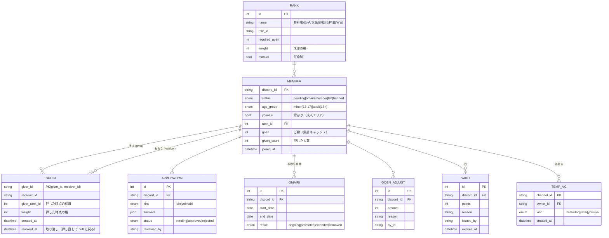

# 咲楽ノ宮 設計書（Discord サーバー構成 + BOT）

> ステータス: 第5版・確定（2026-09-25）
> 世界観・用語・文面は [concept.md](concept.md)。管理システム（社務所 Web）は [admin.md](admin.md)。この文書は仕組みと構成を決める。

## 決まっていること

| 項目 | 内容 |
|---|---|
| サーバー名 | 咲楽ノ宮（さくらのみや） |
| コンセプト | 御朱印（神社） |
| 評価 | **全員が評価し、全員が評価される**。いいと思った人に「朱印」を押す（プラスのみ） |
| 押せる回数 | **何人にでも押せるが、同じ人には 1 回だけ** |
| 朱印の重み（格） | **押した人の役職**で決まる |
| 規模 | **1000 人以上**を目指す |
| メインの活動 | **ゲーム・雑談・寝落ち** |
| 年齢 | 13 歳以上なら参加可。18 歳以上だけの成人エリア「宵宮」を別に設ける |

---

## 1. 評価の仕組み（コア）

```
  Aさん（🎋世話役）が Bさんに 朱印を押す
        ↓
  BOT: Aさん→Bさん は初めて？ → Yes
        ↓
  Aさんの役職「世話役」の格 = 3 → Bさんの ご縁 +3
        ↓
  Bさんのご縁が基準を超えたら 役職が自動で上がる → #慶事 で発表
        ↓
  Bさんが押す朱印の格も上がる
```

- ご縁 ＝「**何人に認められたか** × **その人たちの役職の格**」。連投や押し合いで稼ぐことはできない。
- 役職が上の人ほど「評価の目」が重い。

### 役職・格・昇格ライン（1000 人規模向け）

| 役職 | 昇格条件（ご縁） | 朱印の格 | 目安 |
|---|---|---|---|
| ⛩ 宮司（鯖主） | — | 10 | |
| 🎐 神職（運営） | 任命制 | 5 | |
| 🏮 総代 | 300 | 4 | 100 人以上に認められた、鯖の顔 |
| 🎋 世話役 | 100 | 3 | 40〜50 人に認められた常連 |
| 🍃 氏子 | 20 | 2 | 10〜20 人と仲良くなった正式メンバー |
| 🔰 参拝者（新人） | 入鯖時 | 1 | |
| 👹 厄年（警告中） | — | 0 | 朱印を押せない |

- 1000 人いても毎日来るのは一部（2〜3 割）なので、**実際に活動している人数**を基準にした値。
- すべて `/config` で変更できる。人数が増えたら見直す。

### 称号（押す側も楽しめるように）

| 称号 | 条件 |
|---|---|
| 🚶 巡礼者 | 50 人以上に朱印を押した |
| 🙏 満願 | 100 人以上から朱印を頂いた |

---

## 2. 朱印の押し方（1000 人規模に合わせて変更）

### 変更点
第 4 版では「`#御朱印帳` チャンネルに全員分のカードを並べて、カードにリアクションを押す」形だった。
**1000 人になるとカードが 1000 枚並び、押したい人を探せない**ため、次の形に変える。

### 新しい押し方（どこからでも押せる）

| 方法 | 操作 | 向いている場面 |
|---|---|---|
| **① 右クリック** | 相手の名前を右クリック（スマホは長押し）→「アプリ」→ **「朱印を押す」** | **通話中**（VC のメンバー一覧から）、チャット中 |
| ② 御朱印帳を開く | 右クリック →「御朱印帳を見る」、または `/goshuin @相手` → **［朱印を押す］ボタン** | 相手のご縁や役職を見てから押したいとき |
| ③ 自己紹介から | `#絵馬` の自己紹介に BOT が御朱印帳ボタンを付ける | 新人を知って押すとき |

- 押すと、本人だけに見えるメッセージで「〇〇さまに朱印を押しました（格 3・ご縁 +3）」と表示。［取り消す］ボタン付き。
- **2 回目は「すでに朱印を押しています」と表示**され、押せない（DB で 1 人→1 人 1 回を保証）。
- 自分には押せない。👹厄年の人は押せない。
- 押された人には通知しない（1000 人規模だと通知が多すぎるため）。代わりに `#慶事` で昇格を発表し、御朱印帳で「最近朱印をくれた人」を見られる。

### 御朱印帳の表示

```
📕 〇〇 さまの御朱印帳
🎋 世話役 ・ ご縁 142（総代まで あと 158）
頂いた朱印 51 人
  🎐 神職 3 ・ 🏮 総代 8 ・ 🎋 世話役 17 ・ 🍃 氏子 19 ・ 🔰 参拝者 4
最近の朱印: △△ さま、□□ さま、…
押した朱印 63 人 ・ 🚶 巡礼者
[朱印を押す] [朱印をくれた人一覧]
```

### 押した人の昇格・退出
- 押した人が後で昇格しても、過去の朱印の格は**押した時点のまま**（取り消して押し直すと今の格になる）。
- 押した人が退出しても、その朱印のご縁は**残す**。

---

## 3. サーバー構成

### 3.1 カテゴリ・チャンネル

**⛩ 鳥居（入口）**
| チャンネル | 見える人 | 用途 |
|---|---|---|
| `#鳥居` | 全員 | ようこそ・鯖の紹介 |
| `#しきたり` | 全員 | ルール・用語集・朱印の仕組み |
| `#社務所` | 未承認の人 | 入鯖申請ボタン |

**📜 掲示**
| チャンネル | 用途 |
|---|---|
| `#御触書` | お知らせ |
| `#絵馬` | 自己紹介（BOT が御朱印帳ボタンを付ける） |
| `#慶事` | 昇格・称号の発表 |
| `#番付` | ランキング（今月・累計の上位） |

**🌳 境内（雑談）**
| チャンネル | 用途 |
|---|---|
| `#境内` | メインの雑談 |
| `#手水舎` | 浮上（来たら一言） |
| `#写真館` | 画像・スクショ |
| `#おみくじ` | BOT コマンド |
| `🔊 拝殿` | 大人数の雑談 VC |
| `🔊 縁側 一` `🔊 縁側 二` | 少人数の雑談 VC |
| `🔊 茶屋 一` `🔊 茶屋 二` | 作業・まったり VC |
| `➕ 部屋を建てる` | 入ると自分専用の雑談 VC が作られる（§3.3） |

**🎮 縁日（ゲーム）** — お祭りの屋台遊びになぞらえる
| チャンネル | 用途 |
|---|---|
| `#縁日` | ゲームの募集（`/boshu` コマンド） |
| `#屋台` | フォーラム。ゲームごとに 1 スレッド（攻略・雑談） |
| `🔊 射的 一〜三` | FPS・TPS（Apex、VALORANT など） |
| `🔊 輪投げ 一・二` | 対戦・パーティゲーム |
| `🔊 金魚すくい 一・二` | まったり・クラフト系（マイクラなど） |
| `🔊 神楽殿` | 歌・カラオケ・配信 |
| `➕ 屋台を出す` | 入るとゲーム用の VC が作られる（§3.3） |

**🌙 宿坊（寝落ち）**
| チャンネル | 用途 |
|---|---|
| `#宿帳` | 寝落ち通話の募集・おやすみの挨拶 |
| `🔊 宿坊 一の間〜五の間` | 寝落ち VC（全年齢・**鍵をかけられない**） |

**🔞 宵宮（成人エリア）** — すべて Discord の「年齢制限チャンネル」に設定
| チャンネル | 用途 |
|---|---|
| `#宵宮` | 18 歳以上の雑談 |
| `#御神酒処` | お酒の話・飲み通話の募集 |
| `🔊 宵宮` `🔊 御神酒処` | 18 歳以上の通話 |
| `🔊 宵宮の宿坊 一・二` | 18 歳以上の寝落ち VC |
| `➕ 宵宮に部屋を建てる` | 18 歳以上用の部屋（人数制限・鍵をかけられる） |

**🔒 社務所裏（運営）**
| チャンネル | 用途 |
|---|---|
| `#寄合` `🔊 寄合` | 運営会議 |
| `#申請受付` | 入鯖申請・宵参り申請の承認 |
| `#お参り判定` | お参り期間が終わった人の判定 |
| `#相談窓口` | `/soudan` の匿名相談が届く |
| `#記録` `#出入り帳` `#厄帳` | BOT ログ・入退出ログ・警告ログ |

**その他**: `🔊 奥の院`（AFK）

### 3.2 ロール

| 種類 | ロール | 付与 |
|---|---|---|
| 運営 | ⛩ 宮司 / 🎐 神職 | 手動 |
| BOT | 🤖 | — |
| 役職 | 🏮 総代 / 🎋 世話役 / 🍃 氏子 / 🔰 参拝者 | ご縁で自動 |
| 状態 | 👹 厄年 | 厄が溜まると自動 |
| 年齢 | 🔞 宵参り | 18 歳以上と申告 → 運営承認 |
| 称号 | 🚶 巡礼者 / 🙏 満願 | 条件達成で自動 |
| **お守り**（興味） | 🎯 FPS / ⚔ 対戦 / ⛏ クラフト / 🎤 歌 / 🌙 寝落ち / ゲームタイトル別 など | 参加時のオンボーディングで自分で選ぶ。`/boshu` のメンション先になる |

- 18 歳未満を示すロールは作らない（§4）。
- BOT のロールは自動で付け外しするロールより上に置く。

### 3.3 一時 VC（部屋を建てる）

1000 人規模だと固定の VC だけでは足りず、逆に作りすぎると空き部屋だらけになる。**入ると自動で部屋ができ、全員抜けたら消える**仕組みにする。

| 入口 | できる部屋 | 部屋主ができること |
|---|---|---|
| `➕ 部屋を建てる` | 雑談 VC | 名前変更・人数制限 |
| `➕ 屋台を出す` | ゲーム VC（名前にゲーム名） | 名前変更・人数制限 |
| `➕ 宵宮に部屋を建てる` | 18 歳以上の VC | 名前変更・人数制限・**鍵（招待制）** |

- **全年齢エリアの部屋は非公開にできない**（誰がいるか全員から見える）。鍵をかけた個室は宵宮だけ。
- 操作は部屋の中に BOT が出すボタンで行う（コマンドを覚えなくていい）。

### 3.4 サーバー設定
- **コミュニティ機能** ON（オンボーディング・ルール画面・フォーラムを使う）
- **オンボーディング**: 最初に「何をしに来たか」（ゲーム・雑談・寝落ち）と好きなゲームを選ぶ → お守りロール付与
- 認証レベル「高」、モデレーションの 2 要素認証必須
- AutoMod: 電話番号・住所・LINE ID 等の個人情報、招待リンク、メンションスパム、NG ワード

---

## 4. 年齢と安全（18 歳未満がいる鯖として）

### 年齢の確認
- 入鯖申請で **年齢区分** を必須: `13〜17 歳` / `18 歳以上`（生年月日は聞かない・保存しない）
- 宵宮に入るには **2 重のカギ**:
  1. 🔞 宵参りロール: 18 歳以上と申告した人だけが申請でき、神職が承認
  2. Discord の「年齢制限チャンネル」設定: 宵宮のチャンネル全部に設定
- 13〜17 歳と申告した人は宵参りを申請できない。18 歳になったら神職に言えば更新できる。
- 宵宮に 18 歳未満がいると分かったら、即座に宵参りを外す。

### ルール（`#しきたり` に明記）
- 宵宮以外は**全年齢の場所**。大人向けの話題は宵宮の中だけ。
- 宵宮はお酒・夜更かしトークなど**大人の雑談の場所**。性的な内容の通話・投稿を目的とした場所にはしない。
- **大人から 18 歳未満への、恋愛・性的な目的での DM や誘いは禁止**。発覚したら即 BAN し、必要に応じて Discord に通報。
- 鯖の外（他の SNS・オフ会など）で 18 歳未満と会う約束は禁止。
- 18 歳未満を示すロールは作らない（目印になって狙われるのを防ぐ）。

### 寝落ちの安全
寝落ちは夜遅くに少人数になりやすく、トラブルが起きやすい場所なので、仕組みで守る。
- 全年齢の `🔊 宿坊` は**鍵をかけられず、誰がいるか全員から見える**。
- 鍵をかけた 1 対 1 の寝落ちは、**宵宮（18 歳以上）の中だけ**。
- 困ったら `/soudan` で神職に匿名で相談できる（`#相談窓口` に届く。送った人の名前は神職には表示されず、緊急時のために宮司だけが確認できる）。

---

## 5. BOT

### 5.1 機能一覧

| 機能 | 内容 | 段階 |
|---|---|---|
| **朱印** | 右クリック / ボタンで朱印を押す・取り消す。格の計算、1 人→1 人 1 回 | 1 |
| **御朱印帳** | ご縁・役職・朱印をくれた人の表示 | 1 |
| **自動昇格** | ご縁で役職を付け替え、`#慶事` で発表 | 1 |
| 入鯖申請 | 年齢区分つきフォーム → 神職が承認 | 2 |
| 宵参り申請 | 18 歳以上と申告した人だけ申請可 → 神職が承認 | 2 |
| 番付 | 今月・累計のランキングを自動更新 | 2 |
| 称号 | 巡礼者・満願の自動付与 | 2 |
| **一時 VC** | 部屋を建てる / 屋台を出す / 宵宮に部屋を建てる | 3 |
| ゲーム募集 | `/boshu`（ゲーム・人数・時間 → お守りロールにメンション、参加ボタン） | 3 |
| お参り期間 | 期限内に氏子に届かない人を `#お参り判定` へ | 3 |
| 厄（警告） | 厄の付与・自然消滅・厄年ロール（管理画面と共通。[admin.md](admin.md) §3.5） | 4 |
| 相談 | `/soudan` 匿名相談 | 4 |
| おみくじ | `/omikuji`（ご縁には影響なし） | 4 |

### 5.2 コマンド

| コマンド | 対象 | 内容 |
|---|---|---|
| 右クリック →「朱印を押す」 | 全員 | 朱印を押す |
| 右クリック →「御朱印帳を見る」 / `/goshuin [@相手]` | 全員 | 御朱印帳を表示 |
| `/banzuke [今月/累計]` | 全員 | 番付 |
| `/boshu` | 全員 | ゲーム・寝落ち・通話の募集 |
| `/soudan` | 全員 | 神職への匿名相談 |
| `/omikuji` | 全員 | おみくじ（1 日 1 回） |
| `/shuin revoke @押した人 @もらった人` | 神職 | 不正な朱印の取り消し |
| `/goen give / take` | 神職 | ご縁の手動調整（理由必須・ログ） |
| `/yaku` `/yaku list` | 神職 | 厄（警告） |
| `/age set @相手 <区分>` | 神職 | 年齢区分の修正（宵参りも連動して外す） |
| `/omairi extend @相手` | 神職 | お参り期間の延長 |
| `/config` | 宮司 | 格・昇格ライン・期間・各種設定 |
| `/setup` | 宮司 | チャンネル・ロールの一括作成 |

### 5.3 お参り期間（新人）
- 期間は 14 日。その間に 🍃氏子（ご縁 20）に届けば自動で昇格。
- 届かなかった人は 1 回だけ自動で 7 日延長。それでも届かなければ `#お参り判定` にまとめて通知 → 神職が **延長 / 氏子にする / 退出** を選ぶ（自動キックはしない）。

### 5.4 入鯖申請
- `#社務所` のボタン → フォーム: 呼び名 / 年齢区分 / 主にやりたいこと（ゲーム・雑談・寝落ち）/ ひとこと
- 審査モードを `/config` で選べる:
  - **手動**: 全員を神職が承認（最初はこちら）
  - **半自動**: Discord アカウント作成から 30 日以上 & フォーム記入済みなら自動承認、それ以外は神職が確認（人が増えて承認が追いつかなくなったら切り替え）

### 5.5 技術構成

| 項目 | 選定 |
|---|---|
| 言語 | TypeScript + discord.js v14 |
| DB | **PostgreSQL**（1000 人規模・集計が多いので SQLite ではなく最初から Postgres） |
| ORM | Drizzle ORM（テストはメモリ上の PostgreSQL「PGlite」で動かせる） |
| 実行 | Docker。VPS（メモリ 2GB 程度）で常時稼働 |
| 監視 | ヘルスチェック + 外部の死活監視。落ちたら神職に通知 |
| バックアップ | DB を毎日自動バックアップ（7 日分） |

- **Intents**: `Guilds` `GuildMembers` `GuildMessages` `GuildVoiceStates`
  - 朱印はボタンと右クリックメニューで行うので、リアクション関連は不要。
  - `MessageContent` は不要（発言の本文は読まない・保存しない）。
- **BOT の権限**: チャンネル閲覧 / メッセージ送信 / 埋め込みリンク / ロールの管理 / チャンネルの管理（一時 VC）/ メンバーを移動（一時 VC）/ メンバーをキック / メンバーをタイムアウト（管理者権限は付けない）
- 1 つのサーバーだけで動かすので、1000 人を超えてもシャーディングなどは不要。

### 5.6 データモデル



- `SHUIN` の主キー (giver_id, receiver_id) で「同じ人には 1 回だけ」を DB で保証。
- `goen` は `SHUIN`（取り消し除く）+ `GOEN_ADJUST` の合計。ズレたら元データから再計算できる。

### 5.7 ディレクトリ構成

```
evaluation/
├─ src/
│  ├─ index.ts          # 起動
│  ├─ config.ts         # 環境変数と config/guild.json の読み込み・検証
│  ├─ domain/           # 役職・格・昇格の判定（Discord に依存しない）
│  ├─ services/         # 朱印の保存・集計、押す手順
│  ├─ discord/          # コマンド定義・ボタン・表示・ロール変更・発表
│  ├─ db/               # テーブル定義・接続
│  └─ lib/              # ロガー・排他処理
├─ drizzle/             # マイグレーション（起動時に自動で適用）
├─ config/guild.example.json
├─ test/
├─ Dockerfile / docker-compose.yml
└─ docs/
```

---

## 6. 不正・トラブル対策

| 問題 | 対策 |
|---|---|
| 連投・押し合いで稼ぐ | 1 人→1 人 1 回なので不可能 |
| サブ垢で自分に押す | 入鯖申請制 / 参拝者の格は 1 / 御朱印帳で「参拝者からの朱印」は区別して見える |
| 自分に押す | BOT が断る |
| 神職による恣意的な操作 | `/goen` `/shuin revoke` は理由必須・ログに残る |
| 評価されない人の孤立 | 番付は上位のみ表示。0 の人を晒さない |
| 18 歳未満が宵宮に入る | 申告 + 神職承認 + Discord の年齢制限チャンネル |
| 大人による 18 歳未満への接触 | DM・鯖外での約束の禁止と即 BAN / 全年齢の部屋は非公開にできない / 匿名相談 |
| 一時 VC の荒らし（変な部屋名） | 部屋名に AutoMod と同じ NG ワードチェック / 神職が部屋を削除できる |
| 記録への不安 | 「朱印・入退出・部屋の作成を記録する（発言の本文は保存しない）」ことを `#しきたり` に明記 |

---

## 7. 運営体制（1000 人規模）
- **神職は 10〜15 人**を目安（活動している人 20〜30 人に 1 人）。夜の時間帯（寝落ちの多い 0〜3 時）にも誰かいるようにシフトを組む。
- 神職の役割分担: 申請承認係 / 見回り係（VC・チャット）/ 相談係 / イベント係。
- 月 1 回の **月次祭**（イベント通話・ゲーム大会）で新人と古参が混ざる機会を作る → 朱印が回る。

### 人を集める
- DISBOARD・ディス速などの掲示板に掲載（「ゲーム」「雑談」「寝落ち」「通話」タグ）。
- 最初の 100 人までは知り合い中心で雰囲気を作り、それから掲示板で広げる。
- 役職の格・昇格ラインは 100 人・300 人・1000 人の節目で見直す。

---

## 8. 開発ロードマップ

| 段階 | 内容 | 目安 |
|---|---|---|
| 0. 手動構築 | §3 のチャンネル・ロール・オンボーディング・しきたり作成 | 2〜3 日 |
| 1. MVP | **朱印（右クリック・ボタン）/ 御朱印帳 / 自動昇格 / `#慶事` / ログ** | 1〜2 週 |
| 2. 入口と番付 | 入鯖申請（年齢区分）/ 宵参り申請 / 番付 / 称号 | 1 週 |
| 3. 通話まわり | 一時 VC（3 種）/ `/boshu` / お参り期間 | 1〜2 週 |
| 4. 運営機能 | 厄 / 相談 / おみくじ / `/config` `/setup` / バックアップ自動化 | 1〜2 週 |

---

## 9. 変更履歴
- 第 1 版: 取引の評価型 → 通話界隈の評価鯖とは別物のため破棄
- 第 2 版: 新人を 👍/👎 投票で審査する型
- 第 3 版: 全員が評価・スタンプ・役職で重みが変わる
- 第 4 版: 同じ人には 1 回だけ → 1 人 1 枚のカードにリアクション
- **第 5 版（本版）**: 1000 人規模・ゲーム/雑談/寝落ち中心・年齢方針を反映。
  - 朱印を**右クリック / ボタン**で押す方式に変更（カード 1000 枚は探せないため）
  - 昇格ラインを 20 / 100 / 300 に変更、称号の条件を人数ベースに変更
  - ゲーム（縁日）・寝落ち（宿坊）のカテゴリと一時 VC を追加
  - 寝落ちの安全対策（全年齢の部屋は非公開不可、鍵付きは宵宮のみ）を追加
  - 呼び名をコンセプト（御朱印）の用語に統一
