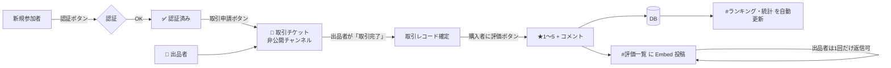
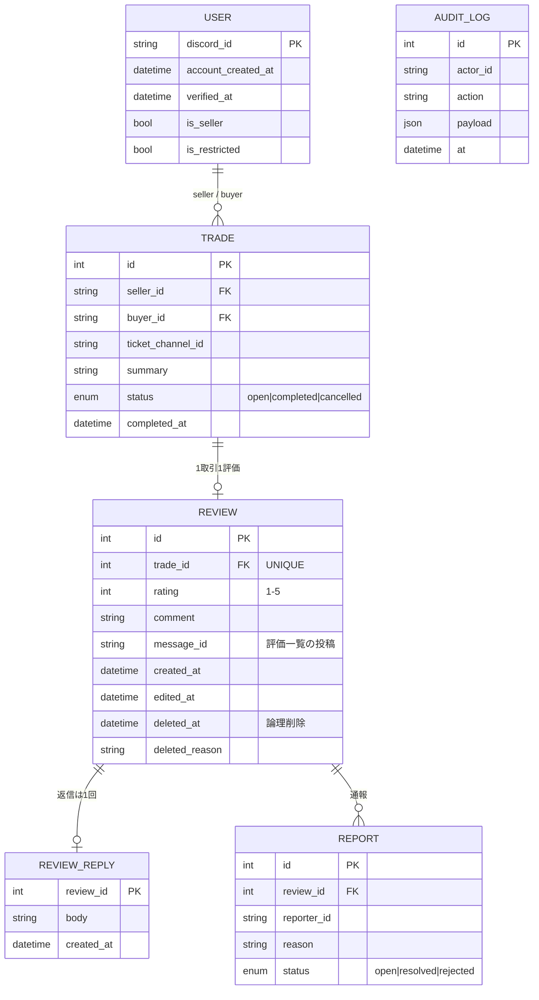

# 評価サーバー 設計書（Discord サーバー構成 + BOT）

> ステータス: 初版ドラフト（2026-09-25）
> 目的: 取引・依頼の「評価（実績）」を、**改ざん・自演されにくい形で**集めて公開する Discord サーバーを作る。

---

## 0. 前提と方針

| 項目 | 本設計での仮定 | 変更する場合の影響 |
|---|---|---|
| 形態 | **複数の出品者／受注者**が評価を受ける「相互評価サーバー」 | 1人専用の実績サーバーでも同じ設計で動く（出品者が1人なだけ） |
| 評価できる人 | **取引チケットを完了した購入者のみ** | 誰でも書ける形にすると自演・荒らし対策が別途必要 |
| 評価の公開 | 投稿即公開。運営は**ルール違反（個人情報・誹謗中傷）のみ**削除 | 承認制にすると信頼性は上がるが「低評価を隠している」と疑われやすい |
| BOT | **自作 BOT 1 本**に機能を集約（認証・チケット・評価・集計・ログ） | 既存 BOT の組み合わせでも最低限は回る（§3.1） |

設計の中心にある考え方は 1 つだけです:
**「評価は取引に紐づく。取引のない評価は存在しない」**。
これで自演・なりすまし・荒らしの大半を仕組みで潰します。

---

## 1. 全体像



評価が出来上がるまでの流れ:

1. 参加 → `#認証` のボタンで認証（アカウント作成日などを BOT がチェック）
2. `#取引申請` パネルから出品者を選んでチケットを開く（非公開チャンネル）
3. チケット内でやり取り → 出品者が **「取引完了」ボタン**
4. 購入者に **★1〜5 のボタン → コメント入力モーダル** を表示
5. BOT が `#評価一覧` に Embed で投稿し、DB と統計を更新
6. 出品者は評価に **1 回だけ返信（反論・お礼）** できる

---

## 2. サーバー構成

### 2.1 カテゴリ・チャンネル

| カテゴリ | チャンネル | 閲覧 | 書き込み | 用途 |
|---|---|---|---|---|
| 📌 INFORMATION | `#ようこそ` | 全員 | 運営 | サーバー説明 |
| | `#ルール` | 全員 | 運営 | 規約（評価ガイドライン含む） |
| | `#認証` | 未認証のみ | ボタンのみ | 認証パネル |
| | `#お知らせ` | 認証済み | 運営 | アナウンス（アナウンスチャンネル化） |
| | `#使い方` | 認証済み | 運営 | 取引〜評価の手順 |
| ⭐ 評価 | `#評価一覧` | 認証済み | **BOT のみ** | 評価 Embed の掲載。スレッドで出品者返信 |
| | `#ランキング・統計` | 認証済み | **BOT のみ** | BOT が 1 メッセージを定期編集 |
| | `#出品者一覧` | 認証済み | BOT のみ | 出品者プロフィールカード |
| 🎫 取引 | `#取引申請` | 認証済み | ボタンのみ | チケット作成パネル |
| 🎫 チケット | `ticket-0001` … | 当事者 + 運営 | 当事者 + 運営 | BOT が自動作成・完了後アーカイブ |
| 💬 交流 | `#雑談` `#質問` | 認証済み | 認証済み | 通常の会話 |
| 🛡 運営 | `#運営連絡` | 運営 | 運営 | |
| | `#通報対応` | 運営 | BOT | `/report` や評価の通報がここに流れる |
| | `#bot-log` | 運営 | BOT | 評価の作成・編集・削除、チケット操作のログ |
| | `#監査ログ` | 運営 | BOT | 参加・退出・ロール変更 |

ポイント:
- **`#評価一覧` は人間が書き込めない**。BOT 経由でしか評価が載らないので、偽の評価メッセージが紛れ込まない。
- チケットは完了後に transcript（HTML/テキスト）を `#bot-log` に保存してからチャンネル削除。揉めたときの証拠になる。

### 2.2 ロール

上にあるほど強い（Discord のロール順序＝権限の上下関係）。

| ロール | 付与 | 主な権限 |
|---|---|---|
| 👑 オーナー | 手動 | 全権 |
| 🛡 モデレーター | 手動 | メッセージ管理、タイムアウト、評価の削除（BOT コマンド経由） |
| 🤖 評価BOT | 自動（BOT 招待時） | 下記 §3.3 の最小権限。**管理者権限は付けない** |
| 🏪 出品者 | 審査のうえ手動 or `/seller approve` | 取引チケットで「完了」ボタンを押せる、評価に返信できる |
| ✅ 認証済み | 認証で自動 | 通常チャンネルの閲覧・発言、取引申請 |
| 🏅 取引実績あり | 初回評価で自動 | 見た目上のバッジ（信用の目安） |
| 🔇 制限中 | 運営が手動 | 評価・取引申請不可（荒らし対策） |
| @everyone | — | `#ようこそ` `#ルール` `#認証` のみ閲覧 |

### 2.3 サーバー設定（Discord 標準機能）

- **認証レベル**: 「高」（アカウント登録から 10 分経過 & メール認証済み）
- **モデレーションの 2 要素認証必須**: ON
- **不適切なメディアコンテンツのフィルター**: 全メンバー
- **コミュニティ機能**: ON（ルール画面・オンボーディング・アナウンスチャンネルを使うため）
- **AutoMod**:
  - 電話番号・メールアドレス・LINE ID 等の正規表現ブロック（個人情報の晒し防止）
  - 外部サーバー招待リンクのブロック
  - メンションスパム（5 件以上）でタイムアウト
  - NG ワード（誹謗中傷系）

---

## 3. BOT 構成

### 3.1 自作 vs 既存 BOT

| 案 | 構成 | 長所 | 短所 |
|---|---|---|---|
| A. 既存の組み合わせ | Ticket Tool + Carl-bot + 手動で評価投稿 | すぐ始められる | **評価と取引を紐づけられない**＝自演を防げない。集計も手作業 |
| **B. 自作 1 本（推奨）** | 下記 | 取引連動の評価・集計・ログが一貫 | 開発とホスティングが必要 |
| C. 自作 + 既存併用 | 評価・チケットは自作、AutoMod/ログは既存 | 開発量を減らせる | BOT が増えて権限管理が煩雑 |

→ **B を推奨**。立ち上げを急ぐなら A で開始し、MVP 完成後に B へ移行。

### 3.2 技術スタック

| 層 | 選定 | 理由 |
|---|---|---|
| 言語 / ライブラリ | **TypeScript + discord.js v14** | 型でボタン/モーダルの ID 管理が安全、情報量が多い |
| DB | **PostgreSQL**（小規模なら SQLite から開始可） | 集計クエリ・一意制約で「1取引1評価」を DB レベルで保証 |
| ORM | Prisma | マイグレーション管理 |
| 実行環境 | Docker コンテナ（VPS / Fly.io / Railway 等） | BOT は Gateway に常時接続するため**常駐プロセス**が必要（サーバーレス不可） |
| ログ | pino → 標準出力 + `#bot-log` | |
| 監視 | ヘルスチェック用 HTTP エンドポイント + 外部死活監視 | 落ちたら気づけるように |

### 3.3 Discord 側の設定

- **Gateway Intents**: `Guilds`, `GuildMembers`（特権 Intent。参加時チェック・ロール付与に使用）
  - `MessageContent` は**不要**（スラッシュコマンドとボタン/モーダルだけで完結させる）
- **BOT ロールの権限（最小限）**:
  `チャンネルの閲覧` `メッセージの送信` `スレッドでメッセージを送信` `埋め込みリンク` `ファイルの添付` `メッセージ履歴を読む` `チャンネルの管理`（チケット作成/削除用） `ロールの管理`（認証済み・取引実績ロール付与用） `メンバーをタイムアウト`（任意）
- BOT ロールは付与対象ロール（✅認証済み・🏅取引実績あり）**より上**に配置する。

### 3.4 機能とコマンド

**パネル（ボタン）系** — 一般ユーザーはほぼボタンだけで操作できるようにする

| パネル | 置き場所 | 動作 |
|---|---|---|
| 認証パネル | `#認証` | アカウント作成日 ≥ N 日（例: 30 日）を満たせば ✅認証済み付与。満たさなければ運営へ通知 |
| 取引申請パネル | `#取引申請` | 出品者セレクト → 取引内容モーダル → チケット作成 |
| チケット内ボタン | 各チケット | `取引完了`（出品者のみ）/ `キャンセル` / `運営を呼ぶ` |
| 評価ボタン | チケット内 + 購入者への DM | ★1〜★5 ボタン → コメント入力モーダル（10〜500 文字） |

**スラッシュコマンド**

| コマンド | 権限 | 説明 |
|---|---|---|
| `/profile [user]` | 全員 | 平均★・件数・分布・最近の評価 3 件 |
| `/ranking` | 全員 | 出品者ランキング（ベイズ平均順） |
| `/review edit` | 評価者 | 投稿後 24 時間以内のみ自分の評価を編集 |
| `/review reply` | 出品者 | 自分への評価に 1 回だけ返信（スレッドに投稿） |
| `/report review` | 全員 | 評価を通報 → `#通報対応` |
| `/seller approve / revoke` | モデ | 出品者ロールの付与・剥奪 |
| `/review remove <id> <理由>` | モデ | ルール違反評価の削除（理由必須・ログ記録・論理削除） |
| `/user restrict <user>` | モデ | 🔇制限中 付与 |
| `/setup` | オーナー | チャンネル・ロール・パネルの一括生成（§5 の構成を自動作成） |
| `/config` | オーナー | 認証の日数条件、評価文字数などの設定 |
| `/export` | オーナー | 評価データを CSV で出力（バックアップ・移行用） |

### 3.5 評価の Embed 例

```
┌─────────────────────────────────────┐
│ ⭐⭐⭐⭐⭐  (5.0)                          │
│ 出品者: @seller_name                     │
│ 評価者: @buyer_name   取引 #0123          │
│─────────────────────────────────────│
│ 対応が早く、説明も丁寧でした。また依頼したいです。 │
│─────────────────────────────────────│
│ 取引内容: イラスト依頼（アイコン）             │
│ 評価ID: R-000456 ・ 2026/09/25 14:30     │
└─────────────────────────────────────┘
  └ 🧵 出品者からの返信（スレッド）
```

- 評価 ID と取引番号を必ず載せる → 「この評価は本物か？」を `/profile` や運営が照合できる。
- ★の数で Embed の色を変える（5=金, 4=緑, 3=灰, 2=橙, 1=赤）。

### 3.6 データモデル



制約で担保すること:
- `REVIEW.trade_id` に **UNIQUE** → 1 取引 1 評価
- `TRADE.seller_id <> buyer_id` の CHECK → 自分自身との取引を禁止
- 評価作成は `TRADE.status = completed` かつ 評価者 = `buyer_id` のときのみ（アプリ側 + トランザクション内で検証）
- 削除は**論理削除**（`deleted_at`）。件数・履歴を後から検証できるようにする

### 3.7 集計

- 表示用: 単純平均・件数・★分布
- ランキング用: **ベイズ平均**
  `score = (C × m + Σrating) / (C + n)`（m = 全体平均, C = 5 程度, n = その出品者の件数）
  → 「評価 1 件で★5.0」の出品者が上位を独占しないようにする
- `#ランキング・統計` のメッセージは評価が増えるたび（または 10 分おき）に BOT が編集更新

### 3.8 ディレクトリ構成（実装時）

```
evaluation/
├─ src/
│  ├─ index.ts              # 起動・クライアント生成
│  ├─ config.ts             # 環境変数の読み込み・検証
│  ├─ commands/             # スラッシュコマンド（1 ファイル 1 コマンド）
│  ├─ components/           # ボタン・モーダル・セレクトのハンドラ
│  ├─ services/             # 取引・評価・集計・認証のビジネスロジック
│  ├─ embeds/               # Embed 生成
│  ├─ jobs/                 # 定期処理（ランキング更新、放置チケットのクローズ）
│  └─ lib/                  # DB クライアント、ロガー、権限チェック
├─ prisma/schema.prisma
├─ Dockerfile
├─ docker-compose.yml       # bot + postgres
├─ .env.example             # DISCORD_TOKEN, CLIENT_ID, GUILD_ID, DATABASE_URL
└─ docs/design.md           # この文書
```

---

## 4. 不正・荒らし対策

| 脅威 | 対策 |
|---|---|
| 自演（サブ垢で高評価） | 評価は完了済み取引の購入者のみ / 認証にアカウント作成日の条件 / 同一出品者への評価は 1 購入者あたり 1 日 1 件まで / 運営が「作成直後アカウントからの評価」を `#通報対応` で確認できるフラグ |
| 嫌がらせの低評価 | 取引必須なので無関係な人は書けない / 出品者の返信機能 / 通報 → 運営判断で論理削除（理由をログに残す） |
| 偽の評価スクショ | `#評価一覧` は BOT のみ投稿可 / 評価 ID で照合可能 |
| 出品者による評価の揉み消し | 出品者は削除不可。削除できるのはモデのみ、理由付きでログ公開（運営の透明性） |
| 個人情報の晒し | AutoMod の正規表現 + コメント投稿時に BOT 側でも同じチェック |
| BOT トークン流出 | `.env` / シークレットで管理、リポジトリにコミットしない、BOT に管理者権限を付けない（流出時の被害を限定） |

---

## 5. 運用

- **バックアップ**: DB を日次で `pg_dump`、7 日分保持。`/export` で CSV も取れる。
- **放置チケット**: 7 日無反応で警告、14 日でクローズ（transcript 保存）。
- **評価ガイドライン**（`#ルール` に掲載）: 事実ベースで書く / 個人情報禁止 / 取引外のトラブルは書かない / 削除基準を明文化。
- **プライバシー**: 退会者から削除依頼があれば評価者名を匿名化（評価自体は残す）方針を事前に明記。
- **取扱商材**: ゲームアカウント・アイテムの売買（RMT）など、各サービスの利用規約で禁止されている取引は扱わない旨をルールに明記する。Discord の規約・開発者ポリシーにも従う。

---

## 6. 開発ロードマップ

| フェーズ | 内容 | 目安 |
|---|---|---|
| 0. サーバー手動構築 | §2 のチャンネル・ロール・AutoMod を手で作る。ルール文作成 | 1 日 |
| 1. MVP | 認証パネル / 取引チケット / 取引完了 → 評価 → `#評価一覧` 投稿 / ログ | 1〜2 週 |
| 2. 見える化 | `/profile` `/ranking` / 統計メッセージ自動更新 / 出品者返信 / 通報 | 1 週 |
| 3. 運用強化 | `/setup` 自動構築 / `/export` / 放置チケット処理 / バックアップ自動化 | 1 週 |
| 4. 発展（任意） | Web 公開ページ（サーバー外から実績を見られる）/ 複数サーバー対応 | — |

---

## 7. 決めてほしいこと

設計に影響が大きい順:

1. **何の取引を評価するか**（イラスト依頼・代行・物品売買など）→ チケットの入力項目と規約が変わる
2. **出品者は 1 人か複数か** → 複数なら出品者審査の基準が必要
3. **評価を承認制にするか**（本設計は「即公開 + 違反のみ削除」）
4. **評価者名を公開するか匿名にするか**（本設計は公開。信頼性重視）
5. **ホスティング予算**（月 0〜1,000 円程度なら SQLite + 小型 VPS、それ以上なら Postgres マネージド）
