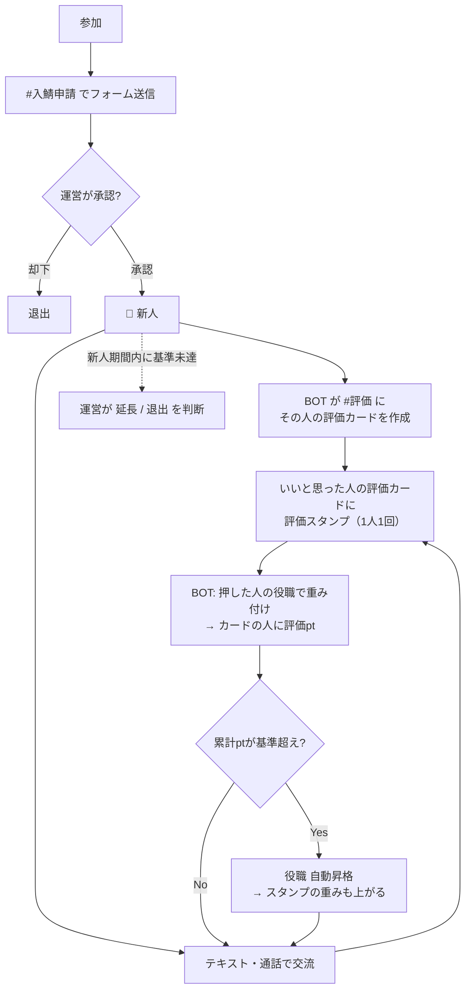
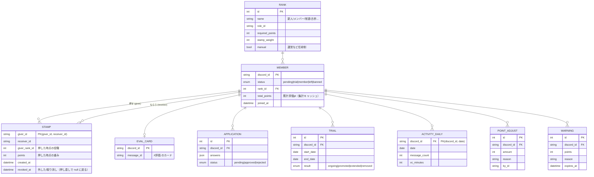

# 評価サーバー 設計書（通話界隈型・Discord サーバー構成 + BOT）

> ステータス: 第4版ドラフト（2026-09-25）
> 参考: ALDIA などの「評価鯖」（通話界隈）。ALDIA は非公開サーバーのため、仕様はオーナーからの聞き取りで反映している。
>
> **確定した仕様（聞き取り済み）**
> - **評価は全員で行う**（新人も含め、メンバー全員が評価する側・される側）
> - **評価方法は「スタンプ」**: いいと思ったら相手のメッセージに評価スタンプを押す
> - **スタンプのポイントは、押した人の役職によって違う**（上の役職ほど 1 個の重みが大きい）
> - **何人にでも押せるが、同じ人には 1 回だけ**
> - **コンセプトは「御朱印」**（役職名・チャンネル名・BOT の文面は [concept.md](concept.md)）
>
> この文書では仕組みを分かりやすくするため、一般的な呼び方（評価スタンプ・評価pt・新人など）で書いている。

---

## 0. 評価の仕組み（コア）

```
  Aさん（🥈常連）が Bさんの「評価カード」に 評価スタンプ を押す
        ↓
  BOT が検知 → Aさん→Bさん は初めて？ → Yes
        ↓
  Aさんの役職「常連」の重み = 3pt → Bさんの 評価pt +3
        ↓
  Bさんの累計 評価pt が基準を超えたら 役職が自動で上がる
        ↓
  Bさんが押すスタンプの重みも上がる
```

- **押すのは全員**、**もらうのも全員**。新人だけが審査されるのではなく、全員が常に評価されている。
- 評価はプラスのみ（「いいと思ったら押す」）。マイナス評価はない。
- **1 人が同じ相手に押せるのは 1 回だけ**（何人に押すかは自由）。
  → 評価pt は「**何人に認められたか × その人たちの役職の重み**」になる。連投・押し合いで稼ぐことはできない。
- 役職は評価pt で自動的に上がる。上の役職の人ほど「評価の目」が重い。

### 役職とスタンプの重み（初期値・`/config` で変更可）

| 役職 | 昇格条件（累計 評価pt） | スタンプ 1 個の重み |
|---|---|---|
| 👑 鯖主 | — | 10pt |
| 🛡 運営 | 任命制 | 5pt |
| 🥇 古参 | 150pt | 4pt |
| 🥈 常連 | 60pt | 3pt |
| 🥉 メンバー | 20pt | 2pt |
| 🔰 新人 | 入鯖時 | 1pt |

- **1 人 1 回なので、もらえる pt の上限は「サーバーの人数 × 重み」で決まる**。
  例: メンバー 50 人・平均 2pt なら、全員から押されても約 100pt。昇格基準は人数に合わせて設定する（上の表は 50〜100 人規模の目安）。
- 役職名・段階数・ポイントは ALDIA の実際の構成に合わせて差し替える（§9）。

### まねするときの線引き
- **仕組み（スタンプ評価・役職制度など）をまねるのは問題ない**。
- **サーバー名・アイコン・ロゴ・ルール文をそのまま使うのは NG**。本家と誤認させる運用や、文章の丸写しは避け、独自の名前と文面にする。

---

## 1. 全体像



---

## 2. サーバー構成

### 2.1 カテゴリ・チャンネル

| カテゴリ | チャンネル | 見える人 | 用途 |
|---|---|---|---|
| 📌 入口 | `#ようこそ` `#ルール` | 全員 | サーバー紹介・ルール・評価の仕組み |
| | `#入鯖申請` | 未承認の人 | 申請ボタン（BOT パネル） |
| 📢 案内 | `#お知らせ` | 新人以上 | 運営からの告知 |
| | `#自己紹介` | 新人以上 | 新人は投稿必須 |
| 💬 テキスト | `#雑談` `#浮上` `#画像` `#募集` | 新人以上 | 普段の会話 |
| 🔊 通話 | `雑談VC 1〜3` `作業VC` `ゲームVC` | 新人以上 | 通話 |
| | `寝落ちVC` `AFK` | 新人以上 | 活動集計の対象外 |
| ⭐ 評価 | **`#評価`** | 新人以上 | **全員分の評価カード**。ここでスタンプを押す（書き込みは BOT のみ） |
| | `#評価ランキング` | 新人以上 | BOT が累計・今月の獲得ランキングを自動更新 |
| | `#昇格` | 新人以上 | BOT が昇格を発表 |
| | `#bot` | 新人以上 | `/profile` などのコマンド用 |
| 🛡 運営 | `#運営会議` `#判定` | 運営 | 新人期間終了者・不正疑いの通知が届く |
| | `#bot-log` `#入退出ログ` `#警告ログ` | 運営 | 各種ログ |

### 2.2 評価カードと評価スタンプ

「同じ人には 1 回だけ」を自然に実現するため、**メンバー 1 人につき 1 枚の「評価カード」**を `#評価` に BOT が作り、そこにスタンプを押す形にする。

```
┌───────────────────────────┐
│ 🥈 常連  @Bさん                  │
│ 評価pt 72（次の 🥇古参 まで 78）     │
│ スタンプ 26 人                     │
│ 自己紹介: #自己紹介 へのリンク        │
└───────────────────────────┘
  [:hyoka: 27]   ← BOT 自身の 1 個を含む
```

- サーバー独自の**カスタム絵文字を 1 つ**（例: `:hyoka:`）を評価スタンプにする。
- **Discord のリアクションは「1 つのメッセージに 1 人 1 回」しか押せない**ので、カードに押す形なら「同じ人には 1 回だけ」が Discord の仕様だけで守られる。
- `#評価` では一般メンバーの「リアクションの追加」権限をオフにし、BOT がカード作成時に評価スタンプを 1 個付けておく。
  → メンバーは**既にあるスタンプを押すことしかできない**ので、他の絵文字が付かない。
- カードの pt・役職表示はスタンプが押されるたびに BOT が更新する（短時間に連続した場合はまとめて更新）。
- 誰が押したかはリアクション一覧で全員に見える（プラス評価のみなので公開で問題ない）。
- 通話で良かった人にも、あとでカードに押せば評価できる（テキストでも通話でも同じ方法で評価できる）。
- 新人承認時にカード作成、退出時にカードを削除（記録は DB に残す）。

### 2.3 ロール（権限面）

| ロール | 付与 | 備考 |
|---|---|---|
| 👑 鯖主 / 🛡 運営 | 手動 | 申請承認・判定・警告 |
| 🤖 BOT | — | 最小権限（§3.3）。役職ロールより上に配置 |
| 🥇 古参 / 🥈 常連 / 🥉 メンバー | 評価pt で自動 | §0 の表 |
| 🔰 新人 | 申請承認で自動 | |
| ⚠ 警告中 | 運営 | スタンプの重み 0（評価できない） |
| @everyone（未承認） | — | 入口カテゴリのみ閲覧 |

### 2.4 サーバー設定
- 認証レベル「高」、モデレーションの 2 要素認証必須
- AutoMod: 電話番号・住所・LINE ID 等の個人情報、招待リンク、メンションスパムをブロック
- **年齢条件を設ける場合**（通話界隈では 18 歳以上限定が多い）: 申請フォームで年齢確認を必須にし、Discord の規約（13 歳未満禁止、成人向け内容は年齢制限チャンネルのみ）を守る。性的な内容を扱うサーバーにはしない前提。

---

## 3. BOT 構成

### 3.1 機能一覧

| 機能 | 内容 | 優先度 |
|---|---|---|
| **評価カード** | メンバーごとのカードを `#評価` に作成・表示更新・退出時に削除 | 最優先 |
| **スタンプ評価** | カードへの評価スタンプを検知し、押した人の役職で重み付けしてカードの人に加点（1 人→1 人 1 回） | 最優先 |
| **役職の自動昇格** | 累計 評価pt で昇格、`#昇格` で発表 | 最優先 |
| 入鯖申請 | フォーム → 運営へ承認/却下ボタン | 高 |
| ランキング・プロフィール | `/profile`、`#評価ランキング` 自動更新 | 高 |
| 不正対策 | 自演・相互押し合いの制限と検知（§4） | 高 |
| 新人期間管理 | 期間内に基準未達なら運営へ通知 | 中 |
| 活動記録 | 浮上日数・通話時間（判断材料） | 中 |
| 警告 | 警告ポイント、累積で制限 | 中 |
| 通貨 | 必要なら（§3.8・ALDIA の仕様次第） | 未定 |

既存 BOT（Carl-bot のリアクションロール、MEE6 のレベル等）では「**押した人の役職で重みを変える**」ができないため、自作 BOT にする。

### 3.2 技術スタック
- TypeScript + discord.js v14 / PostgreSQL（小規模なら SQLite）/ Prisma / Docker
- VPS などで常時稼働（BOT は常時接続が必要）

### 3.3 Discord 側の設定
- **Intents**: `Guilds` `GuildMembers` `GuildMessages` `GuildMessageReactions` `GuildVoiceStates`
- **Partials**: `Message` `Reaction` `User`（BOT 再起動前に作ったカードへのスタンプも拾うため）
- `MessageContent` は**不要**。スタンプ評価に必要なのは「どのカードに・誰が押したか」だけで、メンバーの発言本文は読まない・保存しない。
- **BOT ロールの権限**: チャンネル閲覧 / メッセージ送信 / 埋め込みリンク / メッセージ履歴を読む / リアクションの追加 / ロールの管理 / メンバーをキック / メンバーをタイムアウト（管理者権限は付けない）
  - `#評価` チャンネルだけ「メッセージの管理」を BOT に許可（自分のカードへのスタンプや、⚠警告中の人のスタンプを外すため）

### 3.4 スタンプ評価の処理

**スタンプが押されたとき（`messageReactionAdd`）**

1. 評価カード以外のメッセージ / 評価スタンプ以外の絵文字 / 押したのが BOT → 無視
2. 押した人 = カードの本人（自分に押した）→ BOT がスタンプを外す（0pt）
3. 押した人が ⚠警告中 → BOT がスタンプを外す（0pt）
4. 押した人の**現在の役職から重みを決定**し、(押した人, カードの人) の組で記録
   - Discord の仕様で 1 枚のカードに 1 人 1 回しか押せないので、**同じ人に 2 回目は物理的に押せない**
   - DB 側も (押した人, カードの人) を一意にして二重加算を防ぐ（カード作り直し時なども安全）
5. カードの人の 評価pt に加算 → 昇格チェック → カード表示を更新

**スタンプが外されたとき（`messageReactionRemove`）**
- その pt を取り消す。もう一度押せば、**押し直した時点の役職の重み**で再加算される（1 回分のまま）。

**押した人が昇格したとき**
- 過去に押したスタンプの重みは**変えない**（押した時点の値のまま）。
  → 変えたい場合は「現在の役職で再計算する」方式にもできる（§9 で確認）。

**押した人が退出したとき**
- その人が押したスタンプの pt は**残す**（評価された事実は消えない）。
  → 退出者の分を差し引く運用にもできる（§9 で確認）。

**昇格チェック**
- 累計 評価pt が次の役職の基準を超えたら、ロールを付け替えて `#昇格` で発表。
- 降格は自動ではしない（警告・運営判断のみ）。

**BOT が止まっていた間のスタンプ**
- 起動時に全カードのリアクション一覧を取得し、DB と突き合わせて差分を反映する（押された分は加算、外された分は取り消し）。

### 3.5 通話での評価
評価はメッセージではなく**人（評価カード）に押す**ので、通話で良かった人にもそのままカードで評価できる。通話専用の仕組みは不要。

### 3.6 新人期間

- 新人期間（例: 14 日）内に 🥉メンバー の基準（例: 20pt）に届けば自動で昇格。
- 届かなかった場合は `#判定` に通知 → 運営が **延長 / 退出** を選ぶ（自動キックはしない）。

```
判定: @新人 （期間 09/25〜10/09）
評価pt 14 / 20
スタンプをくれた人 8 人（うち 🥈常連以上 2 人）
浮上 12/14 日 ・ 通話 9h40m
[⏳ 1週間延長] [🥉 メンバーに昇格] [❌ 退出]
```

### 3.7 プロフィール・ランキング

`/profile [user]`（評価カードと同じ内容 + 内訳）:
```
@Bさん  🥈 常連
評価pt 72（次の 🥇古参 まで 78）
スタンプをくれた人: 26 人 / サーバー 58 人中
  役職別: 🛡運営 2 ・ 🥇古参 4 ・ 🥈常連 8 ・ 🥉メンバー 9 ・ 🔰新人 3
自分が押した人: 31 人
```

`#評価ランキング`: 累計 pt と今月の獲得 pt の上位 10 名を BOT が 1 メッセージで定期更新（10 分おき）。

### 3.8 通貨（未定）
ALDIA に評価pt とは別の通貨があるかで決める。
- 別にある場合: 浮上・通話で獲得 → ショップで色ロール・称号と交換（第 2 版の案）
- ない場合: 評価pt だけで運用（シンプル）

### 3.9 警告
- `/warn @user 理由 ポイント` → 累積 3 で ⚠警告中（スタンプを押せない）、5 でキック（設定可能）
- ポイントは 30 日で自然に減る。本人に DM、`#警告ログ` に記録

### 3.10 コマンド一覧

| コマンド | 対象 | 内容 |
|---|---|---|
| `/profile [user]` | 全員 | 役職・評価pt・もらったスタンプの内訳 |
| `/ranking [累計/今月]` | 全員 | ランキング |
| `/stamp revoke @押した人 @もらった人` | 運営 | 不正なスタンプの取り消し（BOT がリアクションも外す） |
| `/points give / take` | 運営 | 評価pt の手動調整（理由必須・ログ） |
| `/card rebuild [@user]` | 運営 | 評価カードの作り直し（DB の記録から復元） |
| `/trial extend` | 運営 | 新人期間の延長 |
| `/warn` `/warn list` | 運営 | 警告 |
| `/config` | 鯖主 | 評価スタンプ・役職ごとの重み・昇格基準・新人期間 |
| `/setup` | 鯖主 | チャンネル・ロール・評価カードの一括作成 |

### 3.11 データモデル



- `STAMP` の主キーを **(giver_id, receiver_id)** にして「同じ人には 1 回だけ」を DB でも保証。
- `total_points` は `STAMP`（取り消し除く）+ `POINT_ADJUST` の合計。ズレたら再計算できるよう、元データを全部残す。
- 今月のランキングは `STAMP.created_at` で集計。

### 3.12 ディレクトリ構成（実装時）

```
evaluation/
├─ src/
│  ├─ index.ts
│  ├─ config.ts
│  ├─ commands/        # スラッシュコマンド
│  ├─ components/      # ボタン・モーダル（申請・判定）
│  ├─ events/          # messageReactionAdd/Remove（評価）, messageCreate（浮上）,
│  │                   # voiceStateUpdate（通話）, guildMemberAdd/Remove
│  ├─ services/        # card, stamp, rank, trial, activity, warning
│  ├─ jobs/            # 起動時の同期、ランキング更新、新人期間チェック、警告減衰
│  └─ lib/             # DB・ロガー・権限チェック
├─ prisma/schema.prisma
├─ Dockerfile / docker-compose.yml
├─ .env.example        # DISCORD_TOKEN, CLIENT_ID, GUILD_ID, DATABASE_URL
└─ docs/design.md
```

---

## 4. 不正・トラブル対策

「同じ人には 1 回だけ」のおかげで、**連投や押し合いでいくらでも稼ぐことはできない**。残る問題は主に「サブ垢」。

| 問題 | 対策 |
|---|---|
| 自分のカードに押す | BOT が外す（0pt） |
| 連投・押し合いで稼ぐ | 1 人→1 人 1 回だけなので不可能。お互いに押し合うのは「互いに評価した」として普通に認める |
| サブ垢で自分に押す | 入鯖は運営承認制 / 新人の重みは 1pt と小さい / 新人期間中の人がくれたスタンプは `/profile` で区別して見える |
| 押して外してを繰り返す | 外したら取り消し、押し直しても 1 回分 |
| 他の絵文字でカードが荒れる | `#評価` はリアクション追加権限なし（既存のスタンプだけ押せる） |
| 評価されない人の孤立 | ランキングは上位のみ表示、下位や 0pt の人は晒さない |
| 運営の恣意的な操作 | `/points give/take` `/stamp revoke` は理由必須・ログに残る |
| 記録への不安 | 「スタンプ・発言の有無・通話時間を記録する（本文は保存しない）」ことを `#ルール` に明記 |

---

## 5. 運用
- DB を日次バックアップ（7 日分）
- 退出したメンバーの活動データは 90 日後に削除（スタンプの記録は匿名化して保持）
- 重み・昇格基準を変えたら `#お知らせ` で告知（過去のスタンプの値は変えない）
- 昇格基準はメンバー数の増減に合わせて見直す（1 人 1 回なので、人数が少ないと上位役職に届かない）

---

## 6. 開発ロードマップ

| フェーズ | 内容 | 目安 |
|---|---|---|
| 0. 手動構築 | §2 のチャンネル・ロール・評価スタンプ絵文字・ルール作成 | 1〜2 日 |
| 1. MVP | **評価カード / スタンプ評価（重み付け・1 人 1 回・取り消し）/ 役職自動昇格 / 起動時同期 / `/profile` / ログ** | 1〜2 週 |
| 2. 見える化 | ランキング自動更新 / `#昇格` 発表 / 入鯖申請 | 1 週 |
| 3. 運用 | 新人期間管理 / 警告 / `/config` `/setup` | 1〜2 週 |
| 4. 追加 | 通貨（§3.8）/ 活動記録 | 必要に応じて |

---

## 7. 変更履歴
- 第 1 版: 取引の評価（実績）を集める型 → 通話界隈の評価鯖とは別物だったため破棄
- 第 2 版: 新人を正規メンバーが 👍/👎 投票で審査する型
- 第 3 版: 「全員が評価」「いいと思ったらスタンプ」「役職でスタンプの pt が違う」を反映
- **第 4 版（本版）**: 「何人にでも押せるが同じ人には 1 回だけ」を反映。発言へのスタンプから、**1 人 1 枚の評価カードへのスタンプ**に変更。1 日上限・7 日ルール・相互押し検知は不要になったので削除。昇格基準を人数に見合う値に変更

---

## 8. 決めたこと
- 評価は全員が行い、全員が評価される
- 評価はスタンプ（プラスのみ）
- スタンプの pt は押した人の役職で変わる
- 何人にでも押せるが、同じ人には 1 回だけ
- コンセプトは「御朱印」（[concept.md](concept.md)）

## 9. まだ教えてほしいこと

1. **役職の名前と段階**、それぞれの**スタンプ 1 個のポイント**、**昇格に必要なポイント**（あと、今のだいたいのメンバー数）
2. **スタンプを押す場所**: 本設計は「1 人 1 枚の評価カード」。ALDIA は自己紹介の投稿に押す形？ それともカードのような専用の場所がある？
3. **押した人が昇格したら**、前に押したスタンプの pt も上がる？（本設計は「押した時点のまま」）
4. **押した人が退出したら**、その人のスタンプの pt は消える？（本設計は「残す」）
5. **新人の扱い**: 一定期間で pt が足りないと退出？ 期間は何日？
6. **ポイントが減ること**はある？（ルール違反、放置 など）
7. **通貨**は評価pt とは別にある？
