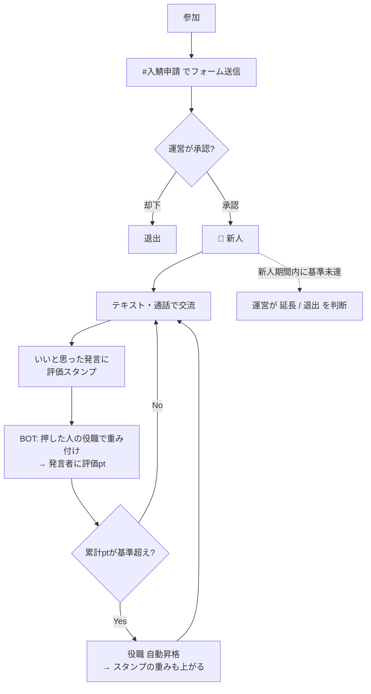
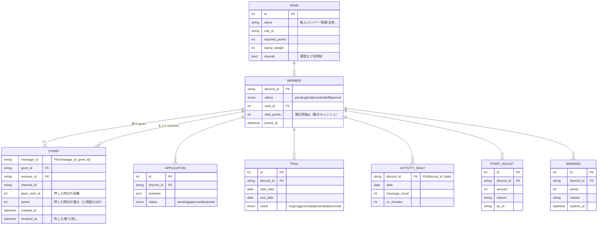

# 評価サーバー 設計書（通話界隈型・Discord サーバー構成 + BOT）

> ステータス: 第3版ドラフト（2026-09-25）
> 参考: ALDIA などの「評価鯖」（通話界隈）。ALDIA は非公開サーバーのため、仕様はオーナーからの聞き取りで反映している。
>
> **確定した仕様（聞き取り済み）**
> - **評価は全員で行う**（新人も含め、メンバー全員が評価する側・される側）
> - **評価方法は「スタンプ」**: いいと思ったら相手のメッセージに評価スタンプを押す
> - **スタンプのポイントは、押した人の役職によって違う**（上の役職ほど 1 個の重みが大きい）

---

## 0. 評価の仕組み（コア）

```
  Aさん（🥈常連）が Bさんの発言に 評価スタンプ を押す
        ↓
  BOT が検知 → Aさんの役職「常連」の重み = 3pt
        ↓
  Bさんの 評価pt +3
        ↓
  Bさんの累計 評価pt が基準を超えたら 役職が自動で上がる
        ↓
  Bさんが押すスタンプの重みも上がる
```

- **押すのは全員**、**もらうのも全員**。新人だけが審査されるのではなく、全員が常に評価されている。
- 評価はプラスのみ（「いいと思ったら押す」）。マイナス評価はない。
- 役職は評価pt で自動的に上がる。上の役職の人ほど「評価の目」が重い。

### 役職とスタンプの重み（初期値・`/config` で変更可）

| 役職 | 昇格条件（累計 評価pt） | スタンプ 1 個の重み |
|---|---|---|
| 👑 鯖主 | — | 10pt |
| 🛡 運営 | 任命制 | 5pt |
| 🥇 古参 | 1,500pt | 4pt |
| 🥈 常連 | 500pt | 3pt |
| 🥉 メンバー | 100pt | 2pt |
| 🔰 新人 | 入鯖時 | 1pt |

※ 役職名・段階数・ポイントは ALDIA の実際の構成に合わせて差し替える（§9）。

### まねするときの線引き
- **仕組み（スタンプ評価・役職制度など）をまねるのは問題ない**。
- **サーバー名・アイコン・ロゴ・ルール文をそのまま使うのは NG**。本家と誤認させる運用や、文章の丸写しは避け、独自の名前と文面にする。

---

## 1. 全体像



---

## 2. サーバー構成

### 2.1 カテゴリ・チャンネル

| カテゴリ | チャンネル | 見える人 | スタンプ評価 | 用途 |
|---|---|---|---|---|
| 📌 入口 | `#ようこそ` `#ルール` | 全員 | — | サーバー紹介・ルール・評価の仕組み |
| | `#入鯖申請` | 未承認の人 | — | 申請ボタン（BOT パネル） |
| 📢 案内 | `#お知らせ` | 新人以上 | — | 運営からの告知 |
| | `#自己紹介` | 新人以上 | ✅ 対象 | 新人は投稿必須 |
| 💬 テキスト | `#雑談` `#浮上` `#画像` `#募集` | 新人以上 | ✅ 対象 | 普段の会話 |
| 🔊 通話 | `雑談VC 1〜3` `作業VC` `ゲームVC` | 新人以上 | （§3.5 参照） | 通話 |
| | `寝落ちVC` `AFK` | 新人以上 | — | 活動集計の対象外 |
| ⭐ 評価 | `#評価ランキング` | 新人以上 | — | BOT が週間・月間・累計ランキングを自動更新 |
| | `#昇格` | 新人以上 | — | BOT が昇格を発表 |
| | `#bot` | 新人以上 | — | `/profile` などのコマンド用 |
| 🛡 運営 | `#運営会議` `#判定` | 運営 | — | 新人期間終了者・不正疑いの通知が届く |
| | `#bot-log` `#入退出ログ` `#警告ログ` | 運営 | — | 各種ログ |

- **スタンプ評価の対象チャンネル**は `/config` で指定する（お知らせ・BOT 用チャンネルなどは対象外）。

### 2.2 評価スタンプ
- サーバー独自の**カスタム絵文字を 1 つ**（例: `:hyoka:`）用意し、**それだけを評価として数える**。
  - 普通の 👍 や ❤ は評価にならない → 「軽いリアクション」と「評価」を区別できる。
- スタンプ自体は通常のリアクションなので、**誰が押したかは全員に見える**（プラス評価のみなので公開で問題ない）。

### 2.3 ロール（権限面）

| ロール | 付与 | 備考 |
|---|---|---|
| 👑 鯖主 / 🛡 運営 | 手動 | 申請承認・判定・警告 |
| 🤖 BOT | — | 最小権限（§3.3）。役職ロールより上に配置 |
| 🥇 古参 / 🥈 常連 / 🥉 メンバー | 評価pt で自動 | §0 の表 |
| 🔰 新人 | 申請承認で自動 | |
| ⚠ 警告中 | 運営 | スタンプの重み 0（評価できない） |
| @everyone（未承認） | — | 入口カテゴリのみ閲覧 |

### 2.4 サーバー設定
- 認証レベル「高」、モデレーションの 2 要素認証必須
- AutoMod: 電話番号・住所・LINE ID 等の個人情報、招待リンク、メンションスパムをブロック
- **年齢条件を設ける場合**（通話界隈では 18 歳以上限定が多い）: 申請フォームで年齢確認を必須にし、Discord の規約（13 歳未満禁止、成人向け内容は年齢制限チャンネルのみ）を守る。性的な内容を扱うサーバーにはしない前提。

---

## 3. BOT 構成

### 3.1 機能一覧

| 機能 | 内容 | 優先度 |
|---|---|---|
| **スタンプ評価** | 評価スタンプを検知し、押した人の役職で重み付けして発言者に加点 | 最優先 |
| **役職の自動昇格** | 累計 評価pt で昇格、`#昇格` で発表 | 最優先 |
| 入鯖申請 | フォーム → 運営へ承認/却下ボタン | 高 |
| ランキング・プロフィール | `/profile`、`#評価ランキング` 自動更新 | 高 |
| 不正対策 | 自演・相互押し合いの制限と検知（§4） | 高 |
| 新人期間管理 | 期間内に基準未達なら運営へ通知 | 中 |
| 活動記録 | 浮上日数・通話時間（判断材料） | 中 |
| 警告 | 警告ポイント、累積で制限 | 中 |
| 通貨 | 必要なら（§3.8・ALDIA の仕様次第） | 未定 |

既存 BOT（Carl-bot のリアクションロール、MEE6 のレベル等）では「**押した人の役職で重みを変える**」ができないため、自作 BOT にする。

### 3.2 技術スタック
- TypeScript + discord.js v14 / PostgreSQL（小規模なら SQLite）/ Prisma / Docker
- VPS などで常時稼働（BOT は常時接続が必要）

### 3.3 Discord 側の設定
- **Intents**: `Guilds` `GuildMembers` `GuildMessages` `GuildMessageReactions` `GuildVoiceStates`
- **Partials**: `Message` `Reaction` `User`（BOT 起動前の古いメッセージへのスタンプも拾うため）
- `MessageContent` は**不要**。スタンプ評価に必要なのは「どのメッセージに・誰が押したか・発言者は誰か」だけで、本文は読まない・保存しない。
- **BOT ロールの権限**: チャンネル閲覧 / メッセージ送信 / 埋め込みリンク / メッセージ履歴を読む / ロールの管理 / メンバーをキック / メンバーをタイムアウト（管理者権限は付けない）

### 3.4 スタンプ評価の処理

**スタンプが押されたとき（`messageReactionAdd`）**

1. 評価スタンプ（設定した絵文字 ID）以外 → 無視
2. 対象チャンネル以外 → 無視
3. 押した人 = 発言者（自分の発言）→ 0pt
4. 発言者が BOT → 無視
5. メッセージが投稿から **7 日以上前** → 無視（過去発言へのまとめ押し防止）
6. 押した人の**現在の役職から重みを決定**し、そのときの値を記録（後で押した人が昇格しても、過去のスタンプの値は変わらない）
7. 同じ相手への 1 日の加点上限（例: 1 人から 1 人へ 1 日 5 スタンプまで）を超えていたら 0pt として記録
8. 発言者の 評価pt に加算 → 昇格チェック

**スタンプが外されたとき（`messageReactionRemove`）**
- そのスタンプで入った pt を取り消す（押して外してを繰り返しても増えない）

**メッセージが削除されたとき**
- 付いていた pt は**残す**（昔の発言を消しても評価は消えない）。不正があれば運営が `/stamp revoke` で取り消す。

**昇格チェック**
- 累計 評価pt が次の役職の基準を超えたら、ロールを付け替えて `#昇格` で発表。
- 降格は自動ではしない（警告・運営判断のみ）。

### 3.5 通話での評価（要確認）

スタンプはメッセージに押すものなので、**通話中の良さを直接評価できない**。案:

| 案 | 内容 |
|---|---|
| A. テキストのみ | 通話の感想は `#雑談` 等に書いてもらい、そこにスタンプ |
| B. 評価コマンド | `/hyoka @相手` で、**直近 24 時間に同じ VC にいた相手**にだけスタンプ 1 個分の評価を送れる |

→ ALDIA でどうしているか次第（§9）。当面は A、必要なら B を追加。

### 3.6 新人期間

- 新人期間（例: 14 日）内に 🥉メンバー の基準（例: 100pt）に届けば自動で昇格。
- 届かなかった場合は `#判定` に通知 → 運営が **延長 / 退出** を選ぶ（自動キックはしない）。

```
判定: @新人 （期間 09/25〜10/09）
評価pt 72 / 100
スタンプをくれた人 11 人（うち 🥈常連以上 4 人）
浮上 12/14 日 ・ 通話 9h40m
[⏳ 1週間延長] [🥉 メンバーに昇格] [❌ 退出]
```

### 3.7 プロフィール・ランキング

`/profile [user]`:
```
@Bさん  🥈 常連
評価pt 812（次の 🥇古参 まで 688）
今週 +64 / 今月 +230
スタンプをくれた人: 38 人
  役職別: 🛡運営 3 ・ 🥇古参 6 ・ 🥈常連 12 ・ 🥉メンバー 14 ・ 🔰新人 3
```

`#評価ランキング`: 週間 / 月間 / 累計の上位 10 名を BOT が 1 メッセージで定期更新（10 分おき）。

### 3.8 通貨（未定）
ALDIA に評価pt とは別の通貨があるかで決める。
- 別にある場合: 浮上・通話で獲得 → ショップで色ロール・称号と交換（第 2 版の案）
- ない場合: 評価pt だけで運用（シンプル）

### 3.9 警告
- `/warn @user 理由 ポイント` → 累積 3 で ⚠警告中（スタンプの重み 0）、5 でキック（設定可能）
- ポイントは 30 日で自然に減る。本人に DM、`#警告ログ` に記録

### 3.10 コマンド一覧

| コマンド | 対象 | 内容 |
|---|---|---|
| `/profile [user]` | 全員 | 役職・評価pt・もらったスタンプ内訳 |
| `/ranking [週間/月間/累計]` | 全員 | ランキング |
| `/hyoka @user` | 全員 | 通話相手への評価（§3.5 案 B を採用した場合） |
| `/stamp revoke <メッセージ>` | 運営 | 不正なスタンプの pt 取り消し |
| `/points give / take` | 運営 | 評価pt の手動調整（理由必須・ログ） |
| `/trial extend` | 運営 | 新人期間の延長 |
| `/warn` `/warn list` | 運営 | 警告 |
| `/config` | 鯖主 | 評価スタンプ・対象チャンネル・役職ごとの重み・昇格基準・上限値 |
| `/setup` | 鯖主 | チャンネル・ロール・パネルの一括作成 |

### 3.11 データモデル



- `STAMP` の主キー (message_id, giver_id) で「1 つの発言に 1 人 1 スタンプ」を保証。
- `total_points` は `STAMP`（取り消し除く）+ `POINT_ADJUST` の合計。ズレたら再計算できるよう、元データを全部残す。
- 週間・月間ランキングは `STAMP.created_at` で集計。

### 3.12 ディレクトリ構成（実装時）

```
evaluation/
├─ src/
│  ├─ index.ts
│  ├─ config.ts
│  ├─ commands/        # スラッシュコマンド
│  ├─ components/      # ボタン・モーダル（申請・判定）
│  ├─ events/          # messageReactionAdd/Remove（評価）, messageCreate（浮上）,
│  │                   # voiceStateUpdate（通話）, guildMemberAdd/Remove
│  ├─ services/        # stamp, rank, trial, activity, warning
│  ├─ jobs/            # ランキング更新、新人期間チェック、不正検知、警告減衰
│  └─ lib/             # DB・ロガー・権限チェック
├─ prisma/schema.prisma
├─ Dockerfile / docker-compose.yml
├─ .env.example        # DISCORD_TOKEN, CLIENT_ID, GUILD_ID, DATABASE_URL
└─ docs/design.md
```

---

## 4. 不正・トラブル対策

スタンプ評価で起きやすいのは「**押し合い（身内で評価を回す）**」と「**サブ垢での自演**」。

| 問題 | 対策 |
|---|---|
| 自分の発言に押す | 0pt |
| サブ垢で自分に押す | 新人の重みは 1pt と小さい / 入鯖は運営承認制 / 1 人→1 人 の 1 日上限 |
| 仲良し同士の押し合い | 1 人→1 人 の 1 日上限 / **相互押し検知**: 2 人の間の pt が、それぞれの受け取り pt の 30% 超なら `#判定` に通知（自動ペナルティはせず運営が判断） |
| 短文連投して押してもらう | 1 人→1 人 の 1 日上限で頭打ち |
| 過去の発言にまとめ押し | 投稿から 7 日以上前の発言は対象外 |
| 押して外してを繰り返す | 外したら取り消し、押し直しても 1 回分 |
| 上位役職による強すぎる影響 | 上位役職の重みにも 1 日上限は同じく適用 |
| 評価されない人の孤立 | ランキングは上位のみ表示、下位や 0pt の人は晒さない |
| 運営の恣意的な操作 | `/points give/take` は理由必須・ログに残る |
| 記録への不安 | 「スタンプ・発言の有無・通話時間を記録する（本文は保存しない）」ことを `#ルール` に明記 |

---

## 5. 運用
- DB を日次バックアップ（7 日分）
- 退出したメンバーの活動データは 90 日後に削除（スタンプの記録は匿名化して保持）
- 重み・昇格基準を変えたら `#お知らせ` で告知（過去のスタンプの値は変えない）

---

## 6. 開発ロードマップ

| フェーズ | 内容 | 目安 |
|---|---|---|
| 0. 手動構築 | §2 のチャンネル・ロール・評価スタンプ絵文字・ルール作成 | 1〜2 日 |
| 1. MVP | **スタンプ評価（重み付け・上限・取り消し）/ 役職自動昇格 / `/profile` / ログ** | 1〜2 週 |
| 2. 見える化 | ランキング自動更新 / `#昇格` 発表 / 入鯖申請 | 1 週 |
| 3. 運用 | 新人期間管理 / 不正検知 / 警告 / `/config` `/setup` | 1〜2 週 |
| 4. 追加 | 通話評価（§3.5 案 B）/ 通貨（§3.8）/ 活動記録 | 必要に応じて |

---

## 7. 変更履歴
- 第 1 版: 取引の評価（実績）を集める型 → 通話界隈の評価鯖とは別物だったため破棄
- 第 2 版: 新人を正規メンバーが 👍/👎 投票で審査する型
- **第 3 版（本版）**: 「全員が評価」「いいと思ったらスタンプ」「役職でスタンプの pt が違う」を反映。投票型を廃止し、スタンプの累計 pt で役職が上がる仕組みに変更

---

## 8. 決めたこと
- 評価は全員が行い、全員が評価される
- 評価はスタンプ（プラスのみ）
- スタンプの pt は押した人の役職で変わる

## 9. まだ教えてほしいこと

1. **役職の名前と段階**、それぞれの**スタンプ 1 個のポイント**、**昇格に必要なポイント**
2. **スタンプを押す対象**: メッセージ（発言）に押す？ それとも自己紹介や専用のプロフィール投稿に押す？
3. **スタンプの種類**: 1 種類だけ？ 複数（例: ⭐ と 💎 で pt が違う）？
4. **通話の評価**はどうしている？（§3.5）
5. **押せる数の制限**はある？（1 日○個まで、同じ人には○個まで など）
6. **新人の扱い**: 一定期間で pt が足りないと退出？ 期間は何日？
7. **ポイントが減ること**はある？（ルール違反、放置 など）
8. **通貨**は評価pt とは別にある？
