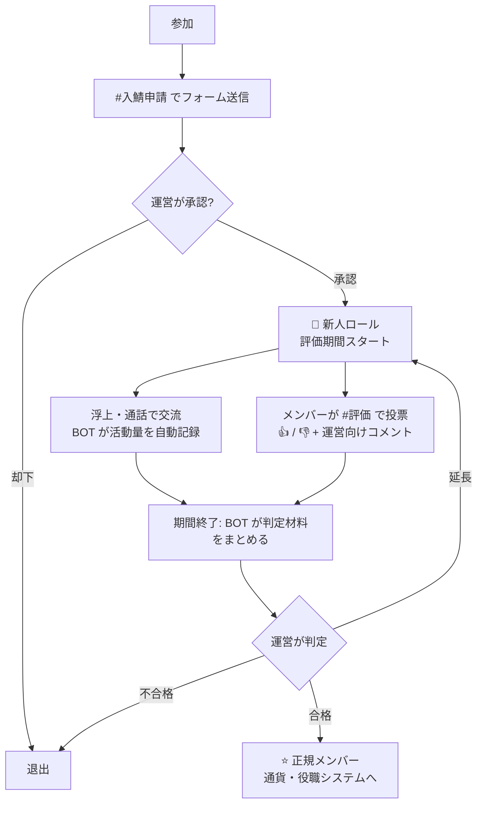
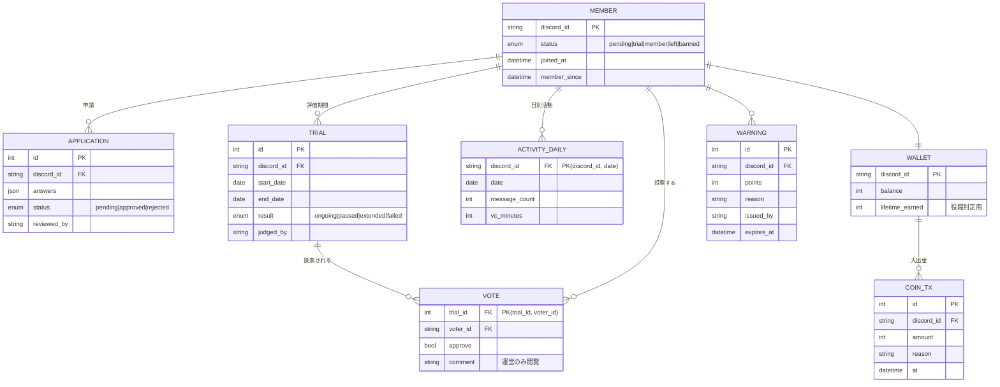

# 評価サーバー 設計書（通話界隈型・Discord サーバー構成 + BOT）

> ステータス: 第2版ドラフト（2026-09-25）
> 参考: ALDIA などの「評価鯖」（通話界隈）。**ALDIA の中身は非公開サーバーのため直接確認できていない**。
> 一般的な評価鯖の仕組みをベースにしており、ALDIA 固有の仕様は §8 の質問への回答で埋める。

---

## 0. 評価鯖とは

通話界隈でいう評価鯖は、**参加した人がすぐ正式メンバーになるのではなく、一定期間テキスト・通話で既存メンバーと交流し、その評価で正式メンバーになれるかが決まる**サーバー。

よくある特徴:

| 特徴 | 内容 |
|---|---|
| 入鯖審査 | 鯖主・運営が招待や参加申請を承認する |
| 仮入鯖期間 | 新人として一定期間（例: 1〜2 週間）活動する |
| 浮上・声出し | 毎日のテキスト浮上や、通話での声出しが求められる |
| メンバー評価 | 既存メンバーが新人を評価し、合格なら本入鯖、不合格なら退出 |
| サーバー内通貨 | 活動で貯まり、ロールや称号と交換できる |
| 役職制度 | 活動量や貢献に応じて階級が上がる |
| 厳格なルール | ルール違反は警告 → キック。鯖主の判断が最終決定 |

この設計書は、この仕組みを **BOT でできるだけ自動化・可視化**し、運営の手間と判定の不公平さを減らすことを目標にする。

### まねするときの線引き
- **仕組み（評価の流れ・通貨・役職制度など）をまねるのは問題ない**。
- **サーバー名・アイコン・ロゴ・ルール文をそのまま使うのは NG**。本家と誤認させる運用や、文章の丸写しは避け、独自の名前と文面にする。

---

## 1. 全体像



---

## 2. サーバー構成

### 2.1 カテゴリ・チャンネル

| カテゴリ | チャンネル | 見える人 | 用途 |
|---|---|---|---|
| 📌 入口 | `#ようこそ` | 全員 | サーバー紹介 |
| | `#ルール` | 全員 | ルール・評価の基準・年齢条件 |
| | `#入鯖申請` | 未承認の人 | 申請ボタン（BOT パネル） |
| 📢 案内 | `#お知らせ` | 新人以上 | 運営からの告知 |
| | `#自己紹介` | 新人以上 | テンプレに沿って投稿（新人は必須） |
| | `#新人紹介` | 新人以上 | BOT が新人の評価期間開始を告知 |
| 💬 テキスト | `#雑談` `#浮上` `#画像` `#募集` | 新人以上 | 普段の会話。`#浮上` は一言挨拶用 |
| 🔊 通話 | `雑談VC 1〜3` | 新人以上 | メインの通話 |
| | `作業VC` `ゲームVC` | 新人以上 | 用途別 |
| | `寝落ちVC` | 新人以上 | 活動時間の集計対象外 |
| | `AFK` | — | 放置用（集計対象外） |
| ⭐ 評価 | `#評価` | **正規メンバー以上** | 新人ごとの投票パネル（新人本人には見えない） |
| | `#評価結果` | 新人以上 | 合格者の発表のみ（不合格は公表しない） |
| 💰 通貨 | `#ショップ` `#ランキング` `#bot` | 新人以上 | 通貨・役職の BOT 操作 |
| 🛡 運営 | `#運営会議` `#判定` | 運営 | 期間終了者の判定材料が BOT から届く |
| | `#bot-log` `#入退出ログ` `#警告ログ` | 運営 | 各種ログ |

### 2.2 ロール

| ロール | 付与 | 権限・役割 |
|---|---|---|
| 👑 鯖主 | 手動 | 最終決定権 |
| 🛡 運営 | 鯖主が任命 | 申請承認・合否判定・警告 |
| 🤖 BOT | — | 最小権限（§3.3） |
| 役職（例: 🥇 古参 / 🥈 常連 / 🥉 メンバー） | 通貨・活動量で自動昇格 | 見た目・特典 |
| ⭐ 正規メンバー | 合格で自動 | `#評価` の閲覧と投票 |
| 🔰 新人 | 申請承認で自動 | 評価期間中。投票はできない |
| ⚠ 警告中 | 運営 | 一部チャンネル制限 |
| @everyone（未承認） | — | 入口カテゴリのみ閲覧 |

### 2.3 サーバー設定
- 認証レベル「高」、モデレーションの 2 要素認証必須
- AutoMod: 電話番号・住所・LINE ID 等の個人情報、招待リンク、メンションスパムをブロック
- **年齢条件を設ける場合**（通話界隈では 18 歳以上限定が多い）: 申請フォームで年齢確認を必須にし、Discord の規約（13 歳未満禁止、成人向け内容は年齢制限チャンネルのみ）を守る。性的な内容を扱うサーバーにはしない前提で設計する。

---

## 3. BOT 構成

### 3.1 自作 BOT 1 本で以下をまとめる

| 機能 | 内容 |
|---|---|
| 入鯖申請 | フォーム → 運営へ承認/却下ボタン |
| 評価期間管理 | 新人ごとの開始日・終了日・延長、リマインド |
| 活動記録 | 浮上（1 日 1 回以上の発言）日数、通話時間を自動集計 |
| 評価投票 | 新人ごとの投票パネル、集計、運営への判定材料の送信 |
| 通貨 | 活動で獲得、ショップで消費、ランキング |
| 役職 | 通貨・活動量で自動昇格 |
| 警告 | 警告ポイント、累積で自動制限 |
| ログ | 入退出・評価・警告・通貨の操作履歴 |

既存 BOT（MEE6 のレベル機能、Ticket Tool など）の組み合わせでも一部は回るが、**「活動量＋投票で合否判定」は既存 BOT では難しい**ため自作を推奨。

### 3.2 技術スタック
- TypeScript + discord.js v14 / PostgreSQL（小規模なら SQLite）/ Prisma / Docker
- VPS などで常時稼働（BOT は常時接続が必要）

### 3.3 Discord 側の設定
- **Intents**: `Guilds` `GuildMembers` `GuildMessages` `GuildVoiceStates`
  - `MessageContent` は**不要**（発言の「有無」を数えるだけで、本文は読まない・保存しない）
- **BOT ロールの権限**: チャンネル閲覧 / メッセージ送信 / 埋め込みリンク / メッセージ履歴を読む / ロールの管理 / メンバーをキック（不合格時） / メンバーをタイムアウト
  - 管理者権限は付けない。BOT ロールは自動付与するロールより上に置く。

### 3.4 入鯖申請

`#入鯖申請` の「申請する」ボタン → モーダル:

| 項目 | 例 |
|---|---|
| 呼び名 | |
| 年齢確認 | 「18 歳以上です」等（条件を設ける場合） |
| 主な活動時間帯 | 夜 21〜25 時 |
| 自己紹介（一言） | |
| 知ったきっかけ・紹介者 | |

→ `#判定` に申請カードが届き、運営が **承認 / 却下 / 保留**。承認で 🔰新人 付与、`#新人紹介` に告知、評価期間スタート。

### 3.5 評価期間中の活動記録（自動）

| 指標 | 数え方 |
|---|---|
| 浮上日数 | その日にテキストで 1 回以上発言した日（本文は保存しない） |
| 通話時間 | **他に 1 人以上いる VC** に参加していた分数。AFK・寝落ちVC は除外。サーバーミュート・スピーカーミュート中は除外 |
| 通話した相手の数 | 同じ VC に一緒にいたメンバーの人数（交流の広さの目安） |
| 自己紹介 | 投稿済みか |

`/status` で新人本人が自分の進捗を確認できる（例: 浮上 5/7 日、通話 3 時間 20 分）。
※「声出し」そのものは BOT では判定できないので、最終判断は通話したメンバーの評価に任せる。

### 3.6 評価投票

新人ごとに `#評価` へパネルを BOT が投稿（新人本人には見えない）:

```
🔰 @新人の名前 さんの評価（〜10/09 まで）
浮上 5 日 / 通話 3h20m / 一緒に通話した人 8 人
[👍 合格] [👎 不合格] [💬 運営へコメント]
現在 👍 6 / 👎 1（投票 7 人）
```

- 投票できるのは **⭐正規メンバー以上**。1 人 1 票、期間中は変更可。
- **誰が何を投票したかは運営だけが見られる**（メンバー間の人間関係トラブルを避ける）。
- コメントは運営だけに届く。**新人本人に中身をそのまま伝えない**（誹謗中傷・晒しの防止）。
- 自分を紹介した新人・通話したことがない新人への投票は、運営の判定画面で目印を付ける（身内票・未交流票の見分け用）。

### 3.7 判定

期間終了時、`#判定` に判定カードが届く:

```
判定: @新人 （期間 09/25〜10/09）
浮上 12/14 日 ・ 通話 9h40m ・ 交流 11 人 ・ 自己紹介 ✅
投票 👍 9 / 👎 2（賛成率 82%） ※未交流票 1
基準: 浮上 10 日以上 / 通話 5 時間以上 / 賛成率 70% 以上 → すべて満たす
[✅ 合格] [⏳ 1週間延長] [❌ 不合格]
```

- 基準は `/config` で設定。**BOT は「目安を満たすか」を出すだけで、合否は運営が押す**。
- 合格: 🔰新人 → ⭐正規メンバー、`#評価結果` で発表、初期通貨を付与。
- 不合格: 本人に定型文（丁寧・理由は個別に書かない）を DM → キック。**再申請は 30 日後から可**（設定可能）。
- 判定は誰がいつ押したかをログに残す。

### 3.8 通貨・役職

| 獲得方法 | 例 |
|---|---|
| 毎日の浮上 | 1 日 1 回 +10 |
| 通話 | 10 分ごと +5（1 日上限あり） |
| `/daily` | 1 日 1 回 +20、連続ボーナス |
| イベント | 運営が `/coin give` で付与 |

| 使い道 | 例 |
|---|---|
| `#ショップ` | 名前の色ロール、称号ロール、専用 VC の一時作成権 など |
| 送金 | `/coin pay @user 100`（1 日上限あり） |

- 役職は **累計獲得量**（使っても減らない値）で自動昇格 → 買い物しても役職が下がらない。
- `/rank` `/leaderboard` でランキング表示。
- 通貨の付与・送金・購入はすべて取引ログに残す（不正の追跡用）。

### 3.9 警告

- `/warn @user 理由 ポイント` → 累積 3 で ⚠警告中、5 でキック（設定可能）
- ポイントは 30 日で自然に減る
- 本人には DM で通知、`#警告ログ` に記録

### 3.10 コマンド一覧

| コマンド | 対象 | 内容 |
|---|---|---|
| `/status` | 新人 | 自分の評価期間の進捗 |
| `/profile [user]` | 全員 | 役職・通貨・通話時間 |
| `/daily` `/coin balance` `/coin pay` | 全員 | 通貨 |
| `/shop` `/buy` | 全員 | ショップ |
| `/rank` `/leaderboard` | 全員 | ランキング |
| `/trial extend` `/trial judge` | 運営 | 評価期間の延長・手動判定 |
| `/warn` `/warn list` | 運営 | 警告 |
| `/coin give` `/coin take` | 運営 | 通貨の付与・没収 |
| `/config` | 鯖主 | 期間・基準・通貨レート・警告しきい値 |
| `/setup` | 鯖主 | チャンネル・ロール・パネルの一括作成 |

### 3.11 データモデル



- 通話の同席相手は `VC_SESSION`（誰が・どの VC に・いつからいつまで）から集計する。
- `VOTE` は (trial_id, voter_id) を主キーにして 1 人 1 票を DB で保証。

### 3.12 ディレクトリ構成（実装時）

```
evaluation/
├─ src/
│  ├─ index.ts
│  ├─ config.ts
│  ├─ commands/        # スラッシュコマンド
│  ├─ components/      # ボタン・モーダル（申請・投票・判定・ショップ）
│  ├─ events/          # messageCreate（浮上）, voiceStateUpdate（通話）, guildMemberAdd/Remove
│  ├─ services/        # trial, vote, activity, economy, rank, warning
│  ├─ jobs/            # 期間終了チェック、リマインド、警告ポイント減衰、ランキング更新
│  └─ lib/             # DB・ロガー・権限チェック
├─ prisma/schema.prisma
├─ Dockerfile / docker-compose.yml
├─ .env.example        # DISCORD_TOKEN, CLIENT_ID, GUILD_ID, DATABASE_URL
└─ docs/design.md
```

---

## 4. トラブル防止

「人を評価する」仕組みはいじめ・晒し・身内びいきが起きやすい。仕組みで抑える:

| 起きやすい問題 | 対策 |
|---|---|
| 投票が原因の人間関係トラブル | 投票者は運営にしか見えない / 新人には結果だけ伝える |
| 陰口・誹謗中傷 | コメントは運営だけが見られる / ルールに禁止を明記 / 違反は警告 |
| 身内票・未交流での👎 | 判定カードで「未交流票」「紹介者票」に目印 / 最終判断は運営 |
| 運営の恣意的な判定 | 判定の目安を `#ルール` に公開 / 誰が判定したかログに残す |
| 通話時間の水増し（放置） | 1 人だけの VC・AFK・寝落ちVC・ミュート中は数えない |
| 通貨の不正（サブ垢で送金） | 送金は正規メンバー同士のみ・1 日上限・全履歴ログ |
| 活動記録への不安 | 「発言の有無と通話時間を記録する（本文は保存しない）」ことを `#ルール` に明記 |
| 未成年の参加 | 年齢条件を申請時に確認 / 違反が分かったら退出 |

---

## 5. 運用
- DB を日次バックアップ（7 日分）
- 退出したメンバーの活動データは 90 日後に削除（通貨・評価ログは匿名化して保持）
- ルール・評価の目安を変えたら `#お知らせ` で告知

---

## 6. 開発ロードマップ

| フェーズ | 内容 | 目安 |
|---|---|---|
| 0. 手動構築 | §2 のチャンネル・ロール・ルール作成。最初は投票を手動（リアクション）で運用 | 1〜2 日 |
| 1. MVP | 入鯖申請 / 新人ロール付与 / 浮上・通話の自動記録 / `/status` / ログ | 1〜2 週 |
| 2. 評価 | 投票パネル / 期間終了の判定カード / 合否ボタン / 延長 | 1 週 |
| 3. 通貨・役職 | 通貨獲得 / ショップ / 自動昇格 / ランキング | 1〜2 週 |
| 4. 運用強化 | 警告 / `/setup` / `/config` / バックアップ | 1 週 |

---

## 7. 旧設計（取引評価型）について
第1版は「取引の評価（実績）を集める」型で書いていたが、ALDIA を参考にするとのことで、**通話界隈の「メンバー評価」型に全面的に書き直した**。取引評価型の案は git 履歴（初回コミット）に残っている。

---

## 8. ALDIA に合わせるために教えてほしいこと

ALDIA は非公開サーバーなので中身を確認できていない。以下が分かると、本家に近い仕組みにできる（スクショや箇条書きで OK）:

1. **チャンネル一覧とロール一覧**（名前はそのままでなくても、構成が分かれば良い）
2. **評価の方法**: 誰が評価する？ 投票？ 点数？ 期間は何日？ 合格ライン（浮上○日・通話○時間など）は？
3. **通貨**: 何で貯まる？ 何に使える？
4. **役職・階級**: どんな段階があって、何で上がる？
5. **使っている BOT**（MEE6、Carl-bot、独自 BOT など）とその用途
6. **年齢条件**やその他の参加条件
7. 規模感（メンバー数・同時通話人数）→ サーバー選びと DB 選びに影響
